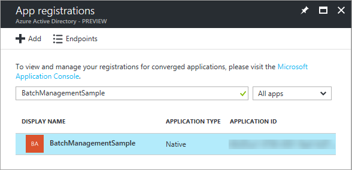
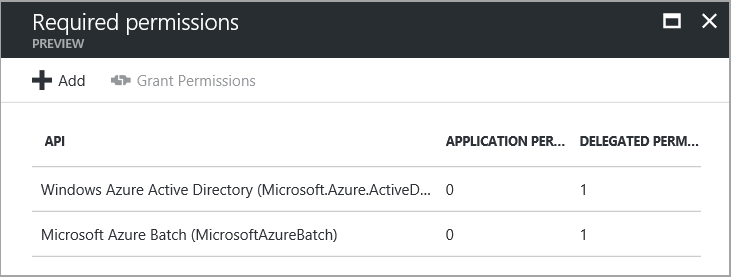

# <a name="authenticate-from-batch-solutions-with-active-directory"></a>使用 Active Directory 在批处理解决方案中进行身份验证

Azure 批处理支持使用 [Azure Active Directory][aad_about] (Azure AD) 在批处理服务和批处理管理服务中进行身份验证。 Azure AD 是 Microsoft 提供的基于多租户云的目录和标识管理服务。 Azure 本身使用 Azure AD 来对其客户、服务管理员和组织用户进行身份验证。

本文探讨如何使用 Azure AD，在使用批处理管理 .NET 库或批处理 .NET 库的应用程序中进行身份验证。 我们将在批处理 .NET API 的上下文中，演示如何使用 Azure AD 和集成身份验证对订阅管理员或协同管理员进行身份验证。 然后，经过身份验证的用户可以向 Azure 批处理发出请求。

也可以使用 Azure AD 对运行中无人值守的应用程序的访问进行身份验证。 本文重点介绍如何使用 Azure AD 集成身份验证，但提供了其他资源的链接，方便你了解如何对无人值守的应用程序进行身份验证。

## <a name="use-azure-ad-with-batch-management-solutions"></a>将 Azure AD 与批处理管理解决方案配合使用

批处理管理 .NET 库公开用于使用批处理帐户、帐户密钥、应用程序和应用程序包的类型。 批处理管理 .NET 库是一个 Azure 资源提供程序客户端，与 [Azure Resource Manager][resman_overview] 结合使用可以编程方式管理这些资源。 

需要使用 Azure AD 对 Azure 资源提供程序客户端（包括批处理管理 .NET 库）以及 [Azure Resource Manager][resman_overview] 发出的请求进行身份验证。

本部分使用 GitHub 上提供的 [AccountManagment][acct_mgmt_sample] 示例项目来逐步讲解如何将 Azure AD 与批处理管理 .NET 库配合使用。 AccountManagement 示例是一个控制台应用程序，它以编程方式访问订阅、创建资源组和新的批处理帐户，并针对帐户执行某些操作。 

若要详细了解批处理管理 .NET 库的用法和 AccountManagement 示例，请参阅 [Manage Batch accounts and quotas with the Batch Management client library for .NET](batch-management-dotnet.md)（使用适用于 .NET 的批处理管理客户端库来管理批处理帐户和配额）。

### <a name="register-your-application-with-azure-ad"></a>将应用程序注册到 Azure AD

Azure [Active Directory 身份验证库][aad_adal] (ADAL) 提供一个可在应用程序中使用的 Azure AD 编程接口。 若要从应用程序调用 ADAL，必须在 Azure AD 租户中注册该应用程序。 注册应用程序时，请向 Azure AD 提供有关该应用程序的信息，包括该应用程序在 Azure AD 租户中的名称。 然后，Azure AD 将提供一个应用程序 ID，在运行时，可以使用该 ID 将应用程序与 Azure AD 相关联。 若要详细信息应用程序 ID，请参阅 [Azure Active Directory 中的应用程序对象和服务主体对象](../active-directory/develop/active-directory-application-objects.md)。

若要注册 AccountManagement 示例应用程序，请遵循[将应用程序与 Azure Active Directory 集成][aad_integrate]的[添加应用程序](../active-directory/develop/active-directory-integrating-applications.md#adding-an-application)部分中的步骤。 指定“本机客户端应用程序”作为应用程序类型。 对于“重定向 URI”，可以指定任何有效的 URI（例如 `http://myaccountmanagementsample`），它不需要是实际的终结点：


完成注册过程后，将列出应用程序的应用程序 ID 和对象（服务主体）ID。  


### <a name="update-your-code-to-reference-your-application-id"></a>更新代码以引用应用程序 ID 

在运行时，客户端应用程序使用应用程序 ID（也称为客户端 ID）来访问 Azure AD。 在 Azure 门户中注册应用程序后，请更新代码，以使用 Azure AD 为已注册的应用程序提供的应用程序 ID。 在 AccountManagement 示例应用程序中，将 Azure 门户上的应用程序 ID 复制到相应的常量中：

```csharp
// Specify the unique identifier (the "Client ID") for your application. This is required so that your
// native client application (i.e. this sample) can access the Azure AD Graph API. For information
// about registering an application in Azure Active Directory, please see "Adding an Application" here:
// /documentation/articles/active-directory-integrating-applications/
private const string ClientId = "<application-id>";
```
此外，请复制在注册过程中指定的重定向 URI。

```csharp
// The URI to which Azure AD will redirect in response to an OAuth 2.0 request. This value is
// specified by you when you register an application with AAD (see ClientId comment). It does not
// need to be a real endpoint, but must be a valid URI (e.g. https://accountmgmtsampleapp).
private const string RedirectUri = "http://myaccountmanagementsample";
```

### <a name="grant-the-azure-resource-manager-api-access-to-your-application"></a>向 Azure Resource Manager API 授予应用程序访问权限

接下来，需要将应用程序的访问权限委派给 Azure Resource Manager API。 Resource Manager API 的 Azure AD 标识符为 **Azure Service Management API**。

在 Azure 门户中执行以下步骤：

1. 在 Azure 门户的左侧导航窗格中，选择“更多服务”，单击“应用注册”，然后单击“添加”。
2. 在应用注册列表中搜索你的应用程序名称：

    

3. 此时会显示“设置”边栏选项卡。 在“API 访问”部分中，选择“所需的权限”。
4. 单击“添加”添加新的所需权限。 
5. 在步骤 1 中输入 **Azure Service Management API**，从结果列表中选择该 API，然后单击“选择”按钮。
6. 在步骤 2 中，选中“以组织用户的身份访问 Azure 经典部署模型”旁边的复选框，然后单击“选择”按钮。
7. 单击“完成”按钮。

现在，“所需的权限”边栏选项卡将显示向 ADAL 和 Resource Manager API 授予的应用程序权限。 首先在 Azure AD 中注册应用程序时，默认向 ADAL 授予权限。


### <a name="acquire-an-azure-ad-authentication-token"></a>获取 Azure AD 身份验证令牌

AccountManagement 示例应用程序定义了为 Azure AD 和 Azure Resource Manager 提供终结点的常量。 示例应用程序使用这些常量在 Azure AD 中查询订阅信息。 请将以下常量保持不变：

```csharp
// Azure Active Directory "common" endpoint.
private const string AuthorityUri = "https://login.partner.microsoftonline.cn/common";
// Azure service management resource 
private const string ResourceUri = "https://management.core.chinacloudapi.cn/";
```

在 Azure AD 租户中注册 AccountManagement 示例并在示例源代码中提供所需的值后，便可以使用 Azure AD 对该示例进行身份验证。 运行该示例时，ADAL 会尝试获取身份验证令牌。 执行此步骤时，系统会提示输入你的 Microsoft 凭据： 

```csharp
// Obtain an access token using the "common" AAD resource. This allows the application
// to query AAD for information that lies outside the application's tenant (such as for
// querying subscription information in your Azure account).
AuthenticationContext authContext = new AuthenticationContext(AuthorityUri);
AuthenticationResult authResult = authContext.AcquireToken(ResourceUri,
                                                        ClientId,
                                                        new Uri(RedirectUri),
                                                        PromptBehavior.Auto);
```

提供凭据后，示例应用程序可以继续向批处理管理服务发出身份验证的请求。 

## <a name="use-azure-ad-with-batch-service-solutions"></a>将 Azure AD 与批处理服务解决方案配合使用

批处理 .NET 库提供用于配合批处理服务构建并行处理工作流的类型。 批处理服务支持[共享密钥](https://docs.microsoft.com/rest/api/batchservice/authenticate-requests-to-the-azure-batch-service)身份验证以及通过 Azure AD 的身份验证。 本部分介绍通过 Azure AD 的身份验证。

>[!NOTE]
>创建批处理帐户时，可以指定是要在批处理管理的订阅中还是用户订阅中分配池。 如果帐户在用户订阅中分配池，则必须使用 Azure AD 来验证针对该帐户中的资源发出的请求。
>
>

通过 Azure AD 对批处理 .NET 应用程序进行身份验证的过程类似于对批处理管理 .NET 应用程序进行身份验证。 本部分将讨论两者的一些差异。

### <a name="batch-service-endpoints"></a>批处理服务终结点

批处理服务终结点不同于在批处理管理 .NET 中使用的终结点。

批处理服务的 Azure AD 终结点为：

`https://login.partner.microsoftonline.cn/common`

批处理服务的资源终结点为：

`https://batch.core.chinacloudapi.cn/`

### <a name="grant-the-batch-service-api-access-to-your-application"></a>向应用程序授予批处理服务 API 访问权限

在批处理应用程序中通过 Azure AD 进行身份验证之前，需要将应用程序注册到 Azure AD，并授予对批处理服务 API 的访问权限。 批处理服务 API 的 Azure AD 标识符为“Azure 批处理(MicrosoftAzureBatch)”。

1. 若要注册批处理应用程序，请遵循[将应用程序与 Azure Active Directory 集成][aad_integrate]的[添加应用程序](../active-directory/develop/active-directory-integrating-applications.md#adding-an-application)部分中的步骤。 对于“重定向 URI”，可以指定任何有效的 URI。 它不需要是实际的终结点。

    注册应用程序后，将会看到应用程序 ID 和对象 ID：

    

2. 随后会显示“设置”边栏选项卡。 在“API 访问”部分中，选择“所需的权限”。
3. 在“所需的权限”边栏选项卡中，单击“添加”按钮。
4. 在步骤 1 中搜索 **MicrosoftAzureBatch**，选择“Azure 批处理(MicrosoftAzureBatch)”，然后单击“选择”按钮。
5. 在步骤 2 中，选中“访问 Azure 批处理服务”旁边的复选框，然后单击“选择”按钮。
6. 单击“完成”按钮。

现在，“所需的权限”边栏选项卡将 Azure AD 应用程序已向 Azure AD 和 Azure 批处理 API 授予访问权限。 



### <a name="authentication-for-batch-accounts-in-a-user-subscription"></a>对用户订阅中批处理帐户的身份验证

创建新的批处理帐户时，可以选择要在其中分配池的订阅。 所做的选择会影响到对该帐户中资源的请求进行身份验证的方式

批处理池默认在批处理服务订阅中分配。 如果选择此选项，可以使用共享密钥或与 Azure AD 来验证针对该帐户中的资源发出的请求。

也可以指定在特定的用户订阅中分配批处理池。 如果选择此选项，必须使用 Azure AD 进行身份验证。

### <a name="best-practices-for-using-azure-ad-with-batch"></a>有关将 Azure AD 与批处理配合使用的最佳做法

Azure AD 身份验证令牌在一小时后过期。 使用生存期较长的 **BatchClient** 对象时，我们建议每次发出请求都从 ADAL 中检索令牌，确保始终获得有效的令牌。 

若要在 .NET 中实现此目的，可编写一个方法从 Azure AD 中检索令牌，然后将该方法作为委派传递给 **BatchTokenCredentials** 对象。 这样，每次批处理服务发出请求都会调用该委派方法，确保提供有效的令牌。 默认情况下，ADAL 会缓存令牌，以便只在必要时，才从 Azure AD 中检索新令牌。 有关示例，请参阅下一部分中的[代码示例：将 Azure AD 与批处理 .NET 配合使用](#code-example-using-azure-ad-with-batch-net)。 有关 Azure AD 中的令牌的详细信息，请参阅 [Azure AD 的身份验证方案][aad_auth_scenarios]。

### <a name="code-example-using-azure-ad-with-batch-net"></a>代码示例：将 Azure AD 与批处理 .NET 配合使用

若要编写使用 Azure AD 进行身份验证的批处理 .NET 代码，请参考 [Azure 批处理 .NET](https://www.nuget.org/packages/Azure.Batch/) 包和 [ADAL](https://www.nuget.org/packages/Microsoft.IdentityModel.Clients.ActiveDirectory/) 包。

在代码中包含以下 `using` 语句：

```csharp
using Microsoft.Azure.Batch;
using Microsoft.Azure.Batch.Auth;
using Microsoft.IdentityModel.Clients.ActiveDirectory;
```

在代码中引用批处理服务的 Azure AD 通用终结点和 Azure AD 终结点：  

```csharp
private const string AuthorityUri = "https://login.partner.microsoftonline.cn/common";
private const string BatchResourceUri = "https://batch.core.chinacloudapi.cn/";
```

引用批处理帐户终结点：

```csharp
private const string BatchAccountEndpoint = "https://myaccount.westcentralus.batch.azure.com";
```

指定应用程序的应用程序 ID（客户端 ID）。 可从 Azure 门户上的应用注册中获取应用程序 ID；请参阅标题为[向应用程序授予批处理服务 API 访问权限](#grant-the-batch-service-api-access-to-your-application)的部分来检索该信息。 

```csharp
private const string ClientId = "<application-id>";
```

此外，请指定重定向 URI，这可以是任何有效的 URI。

```csharp
private const string RedirectUri = "http://mybatchdatasample";
```

编写一个回调方法从 Azure AD 获取身份验证令牌。 **AcquireTokenAsync** 方法提示用户输入其凭据，并使用这些凭据获取新令牌。

```csharp
public static async Task<string> GetAuthenticationTokenAsync()
{
    var authContext = new AuthenticationContext(AuthorityUri);

    // Acquire the authentication token from Azure AD.
    var authResult = await authContext.AcquireTokenAsync(BatchResourceUri, 
                                                        ClientId, 
                                                        new Uri(RedirectUri), 
                                                        new PlatformParameters(PromptBehavior.Auto));

    return authResult.AccessToken;
}
```

构造使用委派作为参数的 **BatchTokenCredentials** 对象。 使用这些凭据打开 **BatchClient** 对象。 然后，可以使用该 **BatchClient** 针对批处理服务执行后续操作。

```csharp
public static async Task PerformBatchOperations()
{
    Func<Task<string>> tokenProvider = () => GetAuthenticationTokenAsync();

    using (var client = await BatchClient.OpenAsync(new BatchTokenCredentials(BatchAccountEndpoint, tokenProvider)))
    {
        await client.JobOperations.ListJobs().ToListAsync();
    }
}
```

上面所示的 **GetAuthenticationTokenAsync** 回调方法使用 Azure AD 对与应用程序交互的用户进行集成身份验证。 **AcquireTokenAsync** 方法调用提示用户输入其凭据，用户提供凭据后，应用程序可继续工作。 还可以使用 Azure AD 并配合 Azure AD 服务主体来对无人值守的应用程序进行身份验证。 有关详细信息，请参阅[Azure Active Directory 中的应用程序对象和服务主体对象](../active-directory/develop/active-directory-application-objects.md)和[使用门户创建可访问资源的 Active Directory 应用程序和服务主体](../resource-group-create-service-principal-portal.md)。  
 

## <a name="next-steps"></a>后续步骤

有关运行 [AccountManagement 示例应用程序][acct_mgmt_sample]的详细信息，请参阅 [Manage Batch accounts and quotas with the Batch Management client library for .NET](batch-management-dotnet.md)（使用适用于 .NET 的批处理管理客户端库来管理批处理帐户和配额）。

有关 Azure AD 的详细信息，请阅读 [Azure Active Directory 文档](https://docs.microsoft.com/azure/active-directory/)。 演示如何使用 [Azure 代码示例](https://azure.microsoft.com/resources/samples/?service=active-directory)库中提供的 ADAL 的深度讲解示例。


[aad_about]: ../active-directory/active-directory-whatis.md "什么是 Azure Active Directory？"
[aad_adal]: ../active-directory/active-directory-authentication-libraries.md
[aad_auth_scenarios]: ../active-directory/active-directory-authentication-scenarios.md "Azure AD 的身份验证方案"
[aad_integrate]: ../active-directory/active-directory-integrating-applications.md "将应用程序与 Azure Active Directory 集成"
[acct_mgmt_sample]: https://github.com/Azure/azure-batch-samples/tree/master/CSharp/AccountManagement
[azure_portal]: http://portal.azure.cn
[resman_overview]: ../azure-resource-manager/resource-group-overview.md


