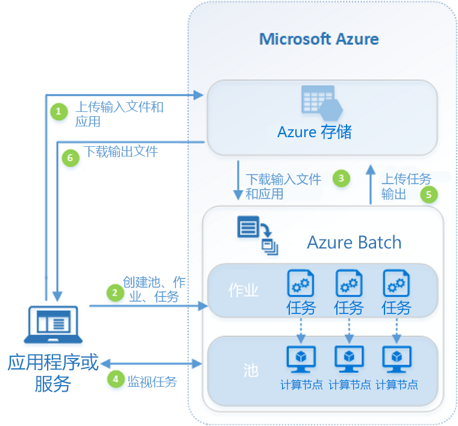

# 什么是 Azure Batch？

使用 Azure Batch 在 Azure 中高效运行大规模并行和高性能计算 (HPC) 批处理作业。 Azure Batch 可创建和管理计算节点（虚拟机）池、安装要运行的应用程序，以及计划要在节点上运行的作业。 没有要安装、管理或缩放的群集或作业计划程序软件。 只需使用 [Batch API 和工具](batch-apis-tools.md)、命令行脚本或 Azure 门户来配置、管理和监视作业即可。 

开发人员可以使用 Batch 作为平台服务，在需要大规模执行的情况下生成 SaaS 应用程序或客户端应用。 例如，可以使用 Batch 生成一项服务，以便为某家财务服务公司运行 Monte Carlo 风险模拟，或者生成一项用于处理多个图像的服务。

使用 Batch 不会产生额外的费用。 仅针对所使用的基础资源（例如虚拟机、存储和网络）计费。

## 运行并行工作负荷
Batch 很适合处理本质并行（也称为“易并行”）的工作负荷。 本质并行工作负荷是指应用程序可以在其中独立运行，每个实例都会完成一部分工作的工作负荷。 应用程序在执行时，可能会访问一些公共的数据，但不会与该应用程序的其他实例通信。 因此，本质并行工作负荷可以大规模运行，具体取决于可以用来同时运行应用程序的计算资源的量。

可以带到 Batch 来处理的本质并行工作负荷的示例包括：

- 使用 Monte Carlo 模拟进行财务风险建模
- VFX 和 3D 图像渲染
- 图像分析和处理
- 媒体转码
- 基因序列分析
- 光学字符识别 (OCR)
- 数据引入、处理和 ETL 操作
- 软件测试性执行

也可使用 Batch 来[运行紧密耦合工作负荷](batch-mpi.md)，此类工作负荷是指在其中运行的应用程序需要相互通信（而不是独立运行）的工作负荷。 紧密耦合应用程序通常使用消息传递接口 (MPI) API。 可以使用 [Microsoft MPI](https://msdn.microsoft.com/library/bb524831(v=vs.85).aspx) 或 Intel MPI，通过 Batch 来运行紧密耦合工作负荷。 

紧密耦合工作负荷的一些示例：
- 有限元素分析
- 流体动力学
- 多节点 AI 训练

许多紧密耦合作业可以使用 Batch 来并行运行。 例如，通过更改管道宽度对液体在管道中的流动进行多次模拟。

## 工作原理
Batch 的常用方案涉及在计算节点池中横向扩展本质并行工作（例如渲染 3D 场景的图像）。 此计算节点池可以是“渲染场”，为渲染作业提供数十、数百甚至数千个核心。

下图显示一个常见 Batch 工作流中的步骤，其中有一个客户端应用程序或托管服务使用 Batch 运行并行工作负荷。

|步骤  |说明  |
|---------|---------|
|1.将**输入文件**和处理这些文件的**应用程序**上传到 Azure 存储帐户。     |输入文件可以是应用程序处理的任何数据，例如财务建模数据或要转码的视频文件。 应用程序文件可以包含处理数据的脚本或应用程序，例如媒体转码器。|
|2.创建一个包含 Batch 帐户中的计算节点的 Batch **池**、一个用于在池中运行工作负荷的**作业**，以及作业中的**任务**。     | 池节点是执行任务的 VM。 指定属性，例如节点的数目和大小、Windows 或 Linux VM 映像，以及在节点加入池时要安装的应用程序。 管理池的成本和大小，方法是：使用[低优先级 VM](batch-low-pri-vms.md)，或者在工作负荷变化时[自动缩放](batch-automatic-scaling.md)节点数。   当你将任务添加到作业时，Batch 服务自动计划任务在池中的计算节点上执行。 每项任务使用上传的应用程序来处理输入文件。 |
|3.将**输入文件**和**应用程序**下载到 Batch     |每个任务都可以在执行之前将要处理的输入数据下载到所分配的计算节点。 如果应用程序尚未安装在池节点上，可以改从此处下载它。 完成从 Azure 存储进行的下载以后，任务就会在分配的节点上执行。|
|4.监视**任务执行情况**     |可以在运行任务时查询 Batch，以便监视作业及其任务的进度。 客户端应用程序或服务通过 HTTPS 与 Batch 服务通信。 由于监视的任务可能成千上万，而这些任务又运行在成千上万的计算节点上，因此请确保[高效查询批处理服务](batch-efficient-list-queries.md)。|
|5.上传**任务输出**     |当任务完成时，它们可以将其输出数据上传到 Azure 存储。 也可直接从计算节点上的文件系统检索文件。|
|6.下载**输出文件**     |当监视检测到作业中的任务已完成时，客户端应用程序或服务可以下载需进一步处理的输出数据。|

请记住，这只是使用 Batch 的一种方式，此方案只介绍它的部分功能。 例如，可以在每个计算节点上执行[多个并行任务](batch-parallel-node-tasks.md)。 也可以使用[作业准备和完成任务](batch-job-prep-release.md)为作业准备节点，然后进行事后清理。 

请参阅[适用于开发人员的 Batch 功能概述](batch-api-basics.md)，详细了解池、节点、作业、任务，以及生成 Batch 应用程序时可以使用的许多 API 功能。 

<!-- Update_Description: wording update -->