# <a name="get-started-with-azure-cloud-services-and-aspnet"></a>Azure 云服务和 ASP.NET 入门

## <a name="overview"></a>概述

本教程演示如何使用 ASP.NET MVC 前端创建多层.NET 应用程序，并将其部署到 [Azure 云服务](./cloud-services-choose-me.md)。 应用程序使用 [Azure SQL 数据库](http://msdn.microsoft.com/zh-cn/library/azure/ee336279)、[Azure Blob 服务](http://www.asp.net/aspnet/overview/developing-apps-with-windows-azure/building-real-world-cloud-apps-with-windows-azure/unstructured-blob-storage)和 [Azure 队列服务](http://www.asp.net/aspnet/overview/developing-apps-with-windows-azure/building-real-world-cloud-apps-with-windows-azure/queue-centric-work-pattern)。 你可以从 MSDN 代码库 [下载 Visual Studio 项目](http://code.msdn.microsoft.com/Simple-Azure-Cloud-Service-e01df2e4) 。

本教程介绍如何生成并本地运行应用程序、如何将其部署到 Azure 并在云中运行，以及最终如何从头构建。 您可以从头构建然后进行测试，之后根据您的喜好部署步骤。

## <a name="contoso-ads-application"></a>Contoso 广告应用程序

该应用程序是广告公告板。 用户通过输入文本和上载图像创建一个广告。 它们可以通过缩略图查看一个广告列表，当用户选择广告以查看详细信息时，它们可以查看完整尺寸的图像。


应用程序使用 [以队列为中心的工作模式](http://www.asp.net/aspnet/overview/developing-apps-with-windows-azure/building-real-world-cloud-apps-with-windows-azure/queue-centric-work-pattern) 来减轻创建缩略图到后端进程的 CPU 密集型工作。

## <a name="alternative-architecture-websites-and-webjobs"></a>替代体系结构：网站和 Web 作业

本教程演示如何在 Azure 云服务中运行前端和后端。 一种替代方法是在 [Azure 网站](../app-service-web/index.md)中运行前端，并为后端使用 [WebJobs](../app-service-web/websites-webjobs-resources.md) 功能（目前以预览版提供）。 有关如何使用 WebJobs 的教程，请参阅 [Azure WebJobs SDK 入门](../app-service-web/websites-dotnet-webjobs-sdk-get-started.md)。 有关如何选择最适合你的方案的服务信息，请参阅 [Azure 网站、云服务和虚拟机比较](../app-service-web/choose-web-site-cloud-service-vm.md)。

## <a name="what-youll-learn"></a>学习内容

* 如何通过安装 Azure SDK 来让你的计算机可以进行 Azure 开发。
* 如何通过 ASP.NET MVC web 角色和辅助角色创建一个 Visual Studio 云服务项目。
* 如何使用 Azure 存储仿真程序测试本地云服务项目。
* 如何将云项目发布到 Azure 云服务并使用 Azure 存储帐户测试。
* 如何上传文件并将其存储在 Azure Blob 服务中。
* 如何将 Azure 队列服务用于各层之间的通信。

## <a name="prerequisites"></a>先决条件

本教程假定用户了解[有关 Azure 云服务的基本概念](./cloud-services-choose-me.md)，例如 *Web 角色*和*辅助角色*这样的术语。  此外，还假定用户知道如何处理 Visual Studio 中的 [ASP.NET MVC](http://www.asp.net/mvc/tutorials/mvc-5/introduction/getting-started) 或 [Web 窗体](http://www.asp.net/web-forms/tutorials/aspnet-45/getting-started-with-aspnet-45-web-forms/introduction-and-overview)项目。 示例应用程序使用 MVC，但在本教程的大部分也适用于 Web 窗体。

可本地运行应用而无需 Azure 订阅，但需要订阅才能将应用程序部署到云。 如果你没有帐户，可以[注册试用版](https://www.azure.cn/pricing/1rmb-trial)。

教程说明使用以下产品之一：

* Visual Studio 2013
* Visual Studio 2015
* Visual Studio 2017

上述产品中，只要缺少其中任意一个，安装 Azure SDK 时就会自动安装 Visual Studio。

## <a name="application-architecture"></a>应用程序体系结构
该应用程序将广告存储在 SQL 数据库中，通过使用实体框架 Code First 创建表和访问数据。 对于每个广告，数据库存储两个 URL，一个用于完全尺寸的图像，一个用于缩略图。

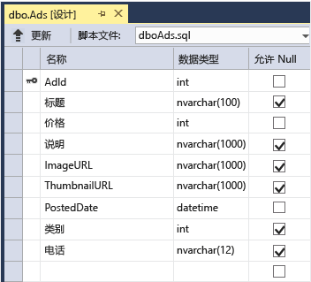

当用户上载一个图像时，Web 角色中运行的前端在 [Azure Blob](http://www.asp.net/aspnet/overview/developing-apps-with-windows-azure/building-real-world-cloud-apps-with-windows-azure/unstructured-blob-storage)中存储图像，并将广告信息存储在带有指向 Blob 的 URL 的数据库中。 同时，它将一条消息写入 Azure 队列。 在辅助角色中定期运行的后端进程轮询队列是否有新消息。 显示新消息时，辅助角色将创建该图像的缩略图，并为该广告更新缩略图 URL 数据库字段。 下图演示了应用程序各部分之间如何交互：


[!INCLUDE [install-sdk](../../includes/install-sdk-2015-2013.md)]

## <a name="download-and-run-the-completed-solution"></a>下载并运行已完成的解决方案

1. 下载并解压缩 [已完成的解决方案](http://code.msdn.microsoft.com/Simple-Azure-Cloud-Service-e01df2e4)。

2. 启动 Visual Studio。

3. 从“文件”菜单中，选择“打开项目”，导航到下载解决方案的位置，然后打开解决方案文件。

3. 按 CTRL+SHIFT+B 生成解决方案。

    默认情况下，Visual Studio 会自动还原 NuGet 包的内容，它未包括在 *.zip* 文件中。 如果包未还原，请通过转到“管理解决方案的 NuGet 包”对话框并单击右上角的“还原”按钮手动安装。

3. 在“解决方案资源管理器”中，确保 **ContosoAdsCloudService** 被选为启动项目。

6. 如果使用 Visual Studio 2015 或更高版本，请在 ContosoAdsWeb 项目的应用程序 *Web.config* 文件以及 ContosoAdsCloudService 项目的 *ServiceConfiguration.Local.cscfg* 文件中，更改 SQL Server 连接字符串。 对于每种情况，请将“(localdb)\v11.0”更改为“(localdb)\MSSQLLocalDB”。

1. 按 Ctrl+F5 运行应用程序。

    在本地运行云服务项目时，Visual Studio 会自动调用 Azure *计算模拟器*和 Azure *存储模拟器*。 计算仿真程序使用您的计算机资源，以模拟 web 角色和辅助角色环境。 存储模拟器使用 [SQL Server Express LocalDB](http://msdn.microsoft.com/zh-cn/library/hh510202.aspx) 数据库模拟 Azure 云存储。

    首次运行云服务项目时，模拟器将会花费大约一分钟来启动。 模拟器完成启动后，默认浏览器中会打开应用程序的主页。

    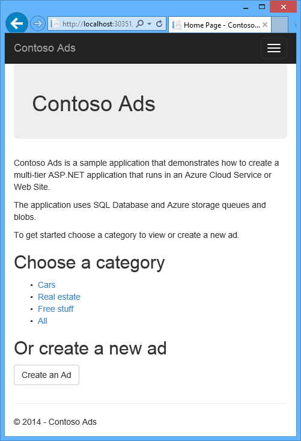

2. 单击“创建广告”。

2. 输入一些测试数据并选择一个要上载的 *.jpg* 图像，然后单击“创建”。

    

    该应用程序转到索引页，但它不显示新广告的缩略图，因为该处理尚未发生。

3. 稍等片刻，然后刷新该索引页查看缩略图。

    

4. 单击广告的“详细信息”查看实际尺寸的图像  。

    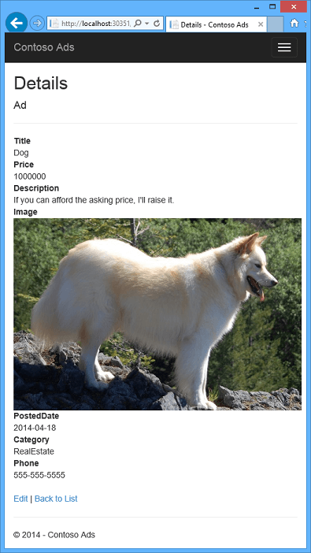

你已在本地计算机上完全运行应用程序，但未连接到云。 存储模拟器将队列和 Blob 数据存储在 SQL Server Express LocalDB 数据库中，应用程序将广告数据存储在另一个 LocalDB 数据库中。 在 Web 应用首次尝试访问它时，实体框架 Code First 自动创建广告数据库。

下一部分中，你要将解决方案配置为在云中运行时对队列、Blob 和应用程序数据库使用 Azure 云资源。 如果想要继续在本地运行但使用云存储和数据库资源，你可以这样做；这只需要设置连接字符串即可。

## <a name="deploy-the-application-to-azure"></a>将应用程序部署到 Azure

你将执行以下步骤，以便在云中运行应用程序：

* 创建 Azure 云服务。
* 创建 Azure SQL 数据库。
* 创建 Azure 存储帐户。
* 配置解决方案，以便在 Azure 中运行时使用你的 Azure SQL 数据库。
* 配置解决方案以便在 Azure 中运行时使用你的 Azure 存储帐户。
* 将项目部署到 Azure 云服务。

### <a name="create-an-azure-cloud-service"></a>创建 Azure 云服务

Azure 云服务是该应用程序将运行的环境。

1. 在你的浏览器中，打开 [Azure 管理门户](http://manage.windowsazure.cn)。

2. 单击“新建”>“计算”>“云服务”>“快速创建”。

4. 在 URL 输入框中，输入 URL 前缀。

    此 URL 必须是唯一的。  如果您选择的前缀已被其他人使用，将获得一条错误消息。

5. 选择您要在其中部署该应用程序的区域。

    此字段指定你的云服务将托管在哪个数据中心。 对于生产应用程序，你可以选择离客户最近的区域。 对于本教程，选择离您最近的区域。

6. 单击“创建云服务”。

    在下图中，使用 URL contosoads.chinacloudapp.cn 创建一个云服务。

    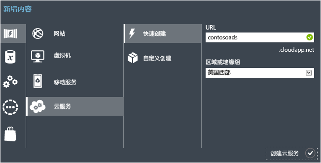

### <a name="create-an-azure-sql-database"></a>创建 Azure SQL 数据库

在云中运行应用程序时，它将使用基于云的数据库。

1. 在 [Azure 管理门户](http://manage.windowsazure.cn)中，单击“新建”>“数据服务”>“SQL 数据库”>“快速创建”。

1. 在“数据库名称”框中，输入 *contosoads*。

1. 从“服务器”下拉列表中选择“新建 SQL 数据库服务器”。

    或者，如果你的订阅已有一台服务器，可从下拉列表中选择该服务器。

1. 选择的 **区域** 与你为云服务所选择的相同。

    当云服务和数据库位于不同的数据中心（不同区域）时，延迟将增加，并且您将支付带宽数据中心之外的费用。 数据中心内的带宽是免费的。

1. 输入管理员“登录名”和“密码”。

    如果选择了“新建 SQL 数据库服务器”，则在此处不要输入现有名称和密码。应输入新的名称和密码，现在定义的名称和密码将在以后访问数据库时使用。 如果你选择之前创建的服务器，系统将提示你已创建的管理用户帐户的密码。

1. 单击“创建 SQL 数据库”。

    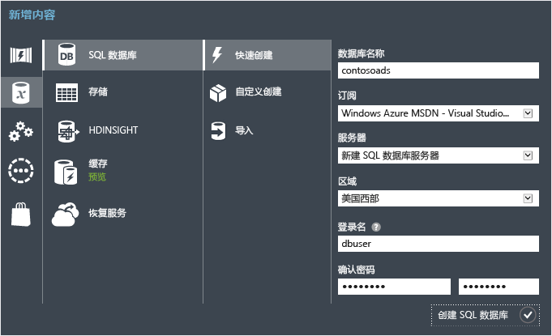

1. Azure 完成创建数据库后，在门户的左窗格中单击“SQL 数据库”选项卡，然后单击新数据库的名称  。

2. 单击“仪表板”选项卡  。

3. 单击“管理允许的 IP 地址”。

4. 在“允许的服务”下，将“Azure 服务”更改为“是”。

5. 单击“保存”。

### <a name="create-an-azure-storage-account"></a>创建 Azure 存储帐户

Azure 存储帐户提供在云中存储队列和 Blob 数据的资源。

在实际应用程序中，您通常会为记录数据的应用程序数据创建单独的帐户，并且为生产数据的测试数据创建单独帐户。 对于本教程，你将只使用一个帐户。

1. 在 [Azure 管理门户](http://manage.windowsazure.cn)中，单击“新建”>“数据服务”>“存储”>“快速创建”。

4. 在“URL”框中，输入 URL 前缀  。

    此前缀加上在框下看到的文本将是你的存储帐户的唯一 URL。 如果其他人已使用您输入的前缀，您必须选择不同的前缀。

5. 将“区域”下拉列表设置到为云服务选择的相同区域  。

    当云服务和存储帐户位于不同的数据中心（不同区域）时，延迟将增加，并且你需要为数据中心外的带宽付费。 数据中心内的带宽是免费的。

    Azure 地缘组实际上是一种机制，目的是最小化数据中心内不同资源之间的距离，这样可以降低延迟。 本教程不使用地缘组。 有关详细信息，请参阅 [如何在 Azure 中创建地缘组](http://msdn.microsoft.com/zh-cn/library/jj156209.aspx)。

6. 将“复制”下拉列表设置为“本地冗余”。

    为存储帐户启用地域复制时，会将存储内容复制到辅助数据中心，这样就能够在主要位置发生重大灾难时将故障转移到该位置。 地域复制可能会产生额外的成本。 对于测试和开发帐户，你通常不希望因为地域复制而付款。 有关详细信息，请参阅[创建、管理或删除存储帐户](../storage/storage-create-storage-account.md#replication-options)。

5. 单击“创建存储帐户”。

    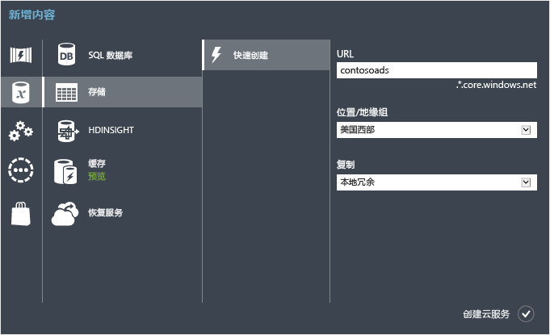

    在图中，使用 URL“ `contosoads.core.chinacloudapi.cn`”创建一个存储帐户。

### <a name="configure-the-solution-to-use-your-azure-sql-database-when-it-runs-in-azure"></a>配置解决方案，以便在 Azure 中运行时使用您的 Azure SQL 数据库

Web 项目和辅助角色项目自身具有数据库连接字符串，并且当应用程序在 Azure 运行时指向 Azure SQL 数据库。

你将为 Web 角色使用 [Web.config 转换](http://www.asp.net/mvc/tutorials/deployment/visual-studio-web-deployment/web-config-transformations)，为辅助角色使用云服务环境设置。

>[!NOTE]
> 在本部分和下一部分中，你将在项目文件中存储凭据。 [不要将敏感数据存储在公共源代码存储库中](http://www.asp.net/aspnet/overview/developing-apps-with-windows-azure/building-real-world-cloud-apps-with-windows-azure/source-control#secrets)。

1. 在 ContosoAdsWeb 项目中，为应用程序 *Web.config* 文件打开 *Web.Release.config* 转换文件，删除包含 `<connectionStrings>` 元素的注释块，并在其原位置粘贴下面的代码。

    ```xml
    <connectionStrings>
        <add name="ContosoAdsContext" connectionString="{connectionstring}"
        providerName="System.Data.SqlClient" xdt:Transform="SetAttributes" xdt:Locator="Match(name)"/>
    </connectionStrings>
    ```

    保持文件打开进行编辑。

2. 在 [Azure 管理门户](http://manage.windowsazure.cn)中，依次单击左窗格中的“SQL 数据库”、你在本教程中创建的数据库、“仪表板”选项卡、“显示连接字符串”。

    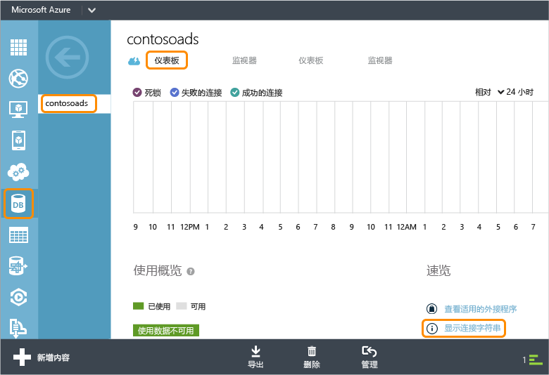

    门户将显示连接字符串，其占位符用于输入密码。

    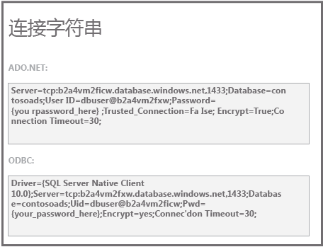

4. 在 *Web.Release.config* 转换文件中，删除 `{connectionstring}` 并在其位置粘贴 Azure 管理门户中的 ADO.NET 连接字符串。

5. 在粘贴到 *Web.Release.config* 转换文件的连接字符串中，请用为新的 SQL 数据库创建的密码替换 `{your_password_here}`。

7. 保存文件。  

6. 选择并复制连接字符串，供在以下步骤中配置辅助角色项目的使用（不带周围的引号）。

5. 在云服务项目的“角色”下的“解决方案资源管理器”中，右键单击“ContosoAdsWorker”并单击“属性”。

    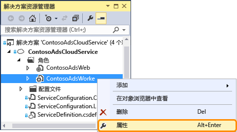

6. 单击“设置”选项卡。

7. 将“服务配置”更改为“云”。

7. 选择 `ContosoAdsDbConnectionString` 设置的“值”字段，然后粘贴从本教程上一部分复制的连接字符串。

    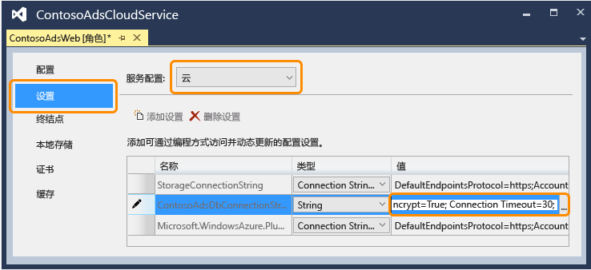

7. 保存所做更改。  

### <a name="configure-the-solution-to-use-your-azure-storage-account-when-it-runs-in-azure"></a>配置解决方案以便在 Azure 中运行时使用您的 Azure 存储帐户

Web 角色项目和辅助角色项目的 azure 存储帐户连接字符串存储在云服务项目中的环境设置。 对于每个项目，应用程序将在本地运行以及在云中运行时，没有使用一组单独的设置。 您将更新用于 web 和辅助角色项目的云环境设置。

1. 在“解决方案资源管理器”中，右键单击“ContosoAdsCloudService”项目中“角色”下的“ContosoAdsWeb”，然后单击“属性”。

    

2. 单击“设置”选项卡。 在“服务配置”下拉列表框中，选择“云”。

    

3. 选择“StorageConnectionString”条目，此时会看到一个省略号 (**...**) 按钮，位于行的右端。 单击省略号按钮打开“创建存储帐户连接字符串”对话框  。

    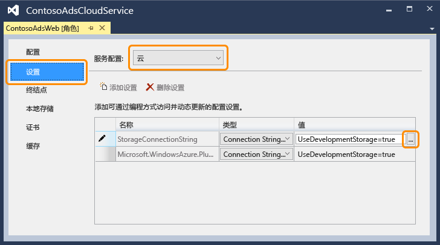

4. 在“创建存储连接字符串”对话框中，单击“你的订阅”，选择以前创建的存储帐户，然后单击“确定”。 如尚未登录，将提示您输入 Azure 帐户凭据。

    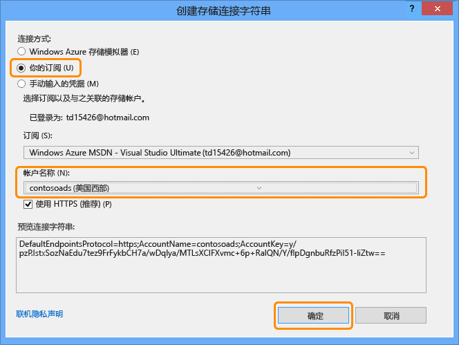

5. 保存所做更改。

6. 按照你所使用的针对 `StorageConnectionString` 连接字符串的相同过程，设置 `Microsoft.WindowsAzure.Plugins.Diagnostics.ConnectionString` 连接字符串。

    此连接字符串用于日志记录。

7. 请按照用于 **ContosoAdsWeb** 角色的相同过程为 **ContosoAdsWorker** 角色设置两个连接字符串。 不要忘记将“服务配置”设置为“云”。

已使用 Visual Studio 用户界面进行配置的角色环境设置存储在 ContosoAdsCloudService 项目的以下文件中：

* *ServiceDefinition.csdef* - 定义设置名称。
* *ServiceConfiguration.Cloud.cscfg* - 为云中运行的应用提供值。
* *ServiceConfiguration.Local.cscfg* - 为本地运行的应用提供值。

例如，ServiceDefinition.csdef 包括以下定义：

```xml
<ConfigurationSettings>
    <Setting name="StorageConnectionString" />
    <Setting name="ContosoAdsDbConnectionString" />
</ConfigurationSettings>
```

*ServiceConfiguration.Cloud.cscfg* 文件包括你为 Visual Studio 中的设置输入的值。

```xml
<Role name="ContosoAdsWorker">
    <Instances count="1" />
    <ConfigurationSettings>
        <Setting name="StorageConnectionString" value="{yourconnectionstring}" />
        <Setting name="ContosoAdsDbConnectionString" value="{yourconnectionstring}" />
        <!-- other settings not shown -->

    </ConfigurationSettings>
    <!-- other settings not shown -->

</Role>
```

`<Instances>` 设置指定 Azure 将在其上运行辅助角色代码的虚拟机的数量。 [后续步骤](#next-steps) 部分包括有关向外缩放云服务的详细信息的链接。

###  <a name="deploy-the-project-to-azure"></a>将项目部署到 Azure

1. 在“解决方案资源管理器”中，右键单击“ContosoAdsCloudService”云项目并选择“发布”。

    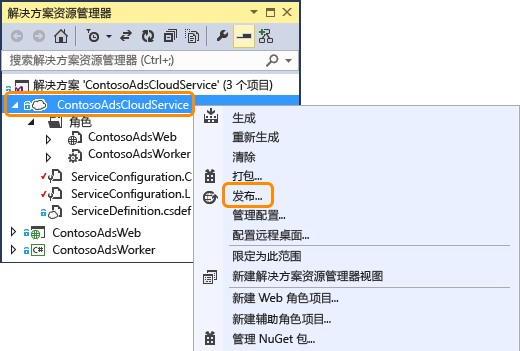

2. 在“发布 Azure 应用程序”向导的“登录”步骤中，单击“下一步”。

    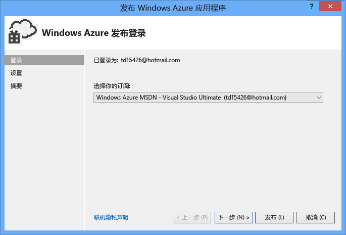

3. 在向导的“设置”步骤中，单击“下一步”。

    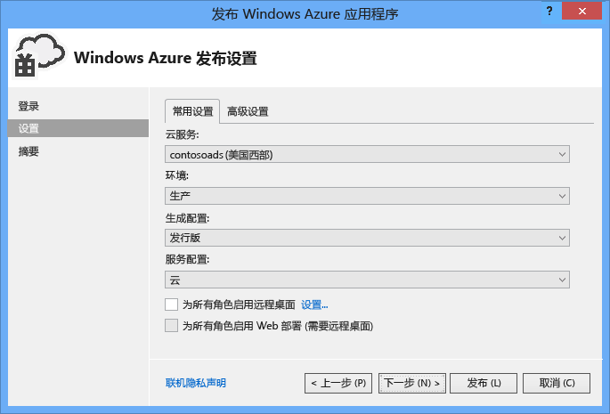

    本教程可以使用“高级”选项卡中的默认设置  。 有关高级选项卡的信息，请参阅 [发布 Azure 应用程序向导](http://msdn.microsoft.com/zh-cn/library/hh535756.aspx)。

4. 在“摘要”步骤中，单击“发布”。

    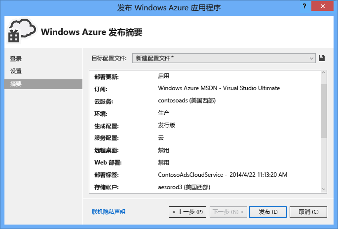

   “Azure 活动日志”窗口将在 Visual Studio 中打开  。

5. 单击右箭头图标以展开部署详细信息。

    部署可能需要 5 分钟或更长时间。

    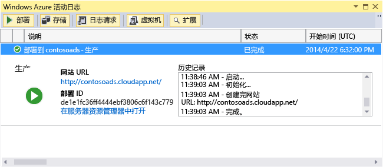

6. 当部署状态为完成时，单击“Web 应用 URL”启动应用程序。

7. 就像在本地运行应用程序一样，现在可以通过创建、查看和编辑一些广告测试应用程序。

>[!NOTE]
> 完成测试后，删除或停止云服务。 即使你不使用云服务，也会产生费用，因为要为它保留虚拟机资源。 如果保持运行云服务，找到你 URL 的任何人都可以创建和查看广告。 在 [Azure 管理门户](http://manage.windowsazure.cn)中，转到云服务的“仪表板”选项卡，然后单击页面底部的“删除”按钮。  。 在这种情况下，会继续产生费用。 当你不再需要 SQL 数据库和存储帐户时，可以遵循类似的过程将其删除。

## <a name="create-the-application-from-scratch"></a>从头开始创建应用程序

如果你尚未下载 [已完成的应用程序](http://code.msdn.microsoft.com/Simple-Azure-Cloud-Service-e01df2e4)，现在请下载。 你要将文件从下载的项目复制到新的项目。

创建 Contoso 广告应用程序涉及以下步骤：

* 创建云服务 Visual Studio 解决方案。
* 更新和添加 NuGet 包。
* 设置项目引用。
* 配置连接字符串。
* 添加代码文件。

创建该解决方案后，你将审核对于云服务项目和 Azure blob 和队列唯一的代码。

### <a name="create-a-cloud-service-visual-studio-solution"></a>创建云服务 Visual Studio 解决方案

1. 在 Visual Studio 中，从“文件”菜单中选择“新建项目”。

2. 在“新建项目”对话框的左窗格中，展开“Visual C#”，选择“云”模板，然后选择“Microsoft Azure 云服务”模板。

3. 将项目和解决方案命名为 ContosoAdsCloudService，然后单击“确定”。

    

4. 在“新建 Azure 云服务”对话框中，添加一个 Web 角色和辅助角色。 将 web 角色命名为 ContosoAdsWeb，并将辅助角色命名为 ContosoAdsWorker。 （使用右侧窗格中的铅笔图标更改这些角色的默认名称。）

    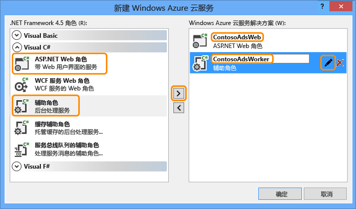

5. 看到 Web 角色的“新建 ASP.NET 项目”对话框时，选择 MVC 模板中，然后单击“更改身份验证”。

    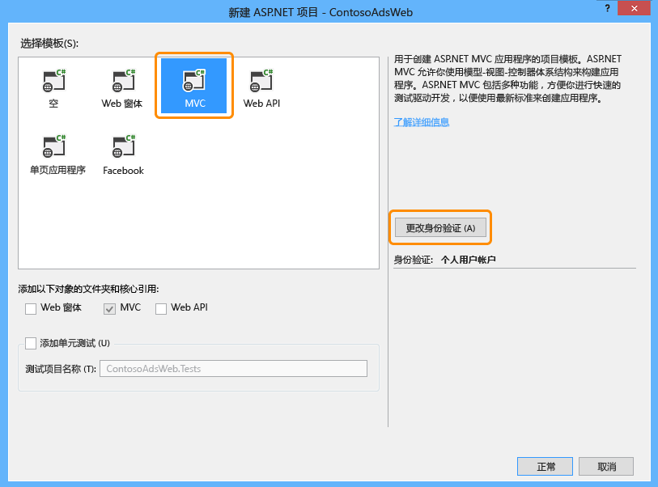

7. 在“更改身份验证”对话框中，选择“无身份验证”，然后单击“确定”。

    

8. 在“新建 ASP.NET 项目”对话框中，单击“确定”。

9. 在“解决方案资源管理器”中，右键单击该解决方案（而不是其中某个项目），然后选择“添加 - 新建项目”。

11. 在“添加新项目”对话框中，选择左窗格中“Visual C#”下面的“Windows”，然后单击“类库”模板。  

10. 将项目命名为 *ContosoAdsCommon*，然后单击“确定”。

    您需要从 web 和辅助角色项目引用实体框架上下文和数据模型。 作为一种替代方法，您可以在 web 角色项目中定义与 EF 相关的类，并从辅助角色项目中引用该项目。 但是，之后你的辅助角色项目将引用它不需要的 Web 程序集。

### <a name="update-and-add-nuget-packages"></a>更新和添加 NuGet 包

1. 打开解决方案的“管理 NuGet 包”对话框  。

2. 在窗口顶部，选择“更新”。

3. 查找 *WindowsAzure.Storage* 包，如果它在列表中，请选择它并选择要在其中更新它的 Web 项目和辅助角色项目，然后单击“更新”。

    存储客户端库更新频率高于 Visual Studio 项目模板，因此您通常会发现该版本中新创建的计划需求需要更新。

4. 在窗口顶部，选择“浏览”。

5. 找到 *EntityFramework* NuGet 包，并将其安装在所有三个项目中。

6. 查找 *Microsoft.WindowsAzure.ConfigurationManager* NuGet 包，然后将它安装在辅助角色项目中。

### <a name="set-project-references"></a>设置项目引用

1. 在 ContosoAdsWeb 项目中，设置对 ContosoAdsCommon 项目的引用。 右键单击 ContosoAdsWeb 项目，然后单击“引用” - “添加引用”。 在“引用管理器”对话框中，选择左窗格中的“解决方案 - 项目”，选择 **ContosoAdsCommon**，然后单击“确定”。

2. 在 ContosoAdsWorker 项目中，设置对 ContosoAdsCommon 项目的引用。

    ContosoAdsCommon 将包含实体框架数据模型和上下文类，将在前端和后端使用。

3. 在 ContosoAdsWorker 项目中，设置对 `System.Drawing`的引用。

    后端使用此程序集将图像转换为缩略图。

### <a name="configure-connection-strings"></a>配置连接字符串

在本部分中，您将为本地测试配置 Azure 存储和 SQL 连接字符串。 本教程前面的部署说明解释如何当应用程序在云中运行时设置连接字符串。

1. 在 ContosoAdsWeb 项目中，打开应用程序 Web.config 文件，并在 `configSections` 元素后面插入以下 `connectionStrings` 元素。

    ```xml
    <connectionStrings>
        <add name="ContosoAdsContext" connectionString="Data Source=(localdb)\v11.0; Initial Catalog=ContosoAds; Integrated Security=True; MultipleActiveResultSets=True;" providerName="System.Data.SqlClient" />
    </connectionStrings>
    ```

    如果你使用的是 Visual Studio 2015 或更高版本，请将“v11.0”替换为“MSSQLLocalDB”。
2. 保存所做更改。

3. 在 ContosoAdsCloudService 项目中，右键单击“角色”下的 ContosoAdsWeb，然后单击“属性”。

    

4. 在“ContosAdsWeb 角色”属性窗口中，单击“设置”选项卡，然后单击“添加设置”。

    将“服务配置”保留设置为“所有配置”。

5. 添加名为 *StorageConnectionString*的新设置。 将“类型”设置为 *ConnectionString*，并将“值”设置为 *UseDevelopmentStorage=true*。

    

6. 保存所做更改。

7. 按照相同的过程在 ContosoAdsWorker 角色属性中添加存储连接字符串。

8. 还是在“ContosoAdsWorker [角色]”属性窗口中，添加另一个连接字符串  ：

   * 名称：ContosoAdsDbConnectionString
   * 类型：字符串
   * 值：粘贴用于 Web 角色项目的相同连接字符串。 （以下示例适用于 Visual Studio 2013；如果你使用 Visual Studio 2015 或更高版本并想要复制此示例，请记得更改数据源。）

        ```
        Data Source=(localdb)\v11.0; Initial Catalog=ContosoAds; Integrated Security=True; MultipleActiveResultSets=True;
        ```

### <a name="add-code-files"></a>添加代码文件

本部分中，您将代码将文件从已下载的解决方案复制到新的解决方案。 以下各节将显示并解释此代码的关键部分。

要将文件添加到某个项目或文件夹，请右键单击该项目或文件夹，然后单击“添加” - “现有项”。 选择所需的文件，然后单击“添加”。 如果询问你是否想要替换现有文件，请单击“是”。

3. 在 ContosoAdsCommon 项目中，删除 *Class1.cs* 文件，并在其原位置添加来自下载项目的 *Ad.cs* 和 *ContosoAdscontext.cs* 文件。

3. 在 ContosoAdsWeb 项目中，从下载的项目添加以下文件。
    - *Global.asax.cs*。  
    - 在 *Views\Shared* 文件夹中：*\_Layout.cshtml*。
    - 在 *Views\Home* 文件夹中：*Index.cshtml*。
    - 在 *Controllers* 文件夹中：*AdController.cs*。
    - 在 *Views\Ad* 文件夹（首先创建该文件夹）中：五个 *.cshtml* 文件。

3. 在 ContosoAdsWorker 项目中，从下载的项目添加 *WorkerRole.cs* 。

现在，可以按照前面教程中的说明生成并运行该应用程序，并且该应用程序将使用本地数据库和存储仿真程序资源。

以下部分介绍与使用 Azure 环境、Blob 和队列相关的代码。 本教程未说明如何使用基架创建 MVC 控制器和视图，如何编写适用于 SQL Server 数据库的实体框架代码，或者在 ASP.NET 4.5 中的异步编程基础知识。 有关这些主题的信息，请参阅以下资源：

* [MVC 5 入门](http://www.asp.net/mvc/tutorials/mvc-5/introduction/getting-started)
* [EF 6 和 MVC 5 入门](http://www.asp.net/mvc/tutorials/getting-started-with-ef-using-mvc)
* [.NET 4.5 中的异步编程简介](http://www.asp.net/aspnet/overview/developing-apps-with-windows-azure/building-real-world-cloud-apps-with-windows-azure/web-development-best-practices#async)。

### <a name="contosoadscommon---adcs"></a>ContosoAdsCommon - Ad.cs

Ad.cs 文件为 ad 类别定义一个枚举，为 ad 信息定义一个 POCO 实体类。

```csharp
public enum Category
{
    Cars,
    [Display(Name="Real Estate")]
    RealEstate,
    [Display(Name = "Free Stuff")]
    FreeStuff
}

public class Ad
{
    public int AdId { get; set; }

    [StringLength(100)]
    public string Title { get; set; }

    public int Price { get; set; }

    [StringLength(1000)]
    [DataType(DataType.MultilineText)]
    public string Description { get; set; }

    [StringLength(1000)]
    [DisplayName("Full-size Image")]
    public string ImageURL { get; set; }

    [StringLength(1000)]
    [DisplayName("Thumbnail")]
    public string ThumbnailURL { get; set; }

    [DataType(DataType.Date)]
    [DisplayFormat(DataFormatString = "{0:yyyy-MM-dd}", ApplyFormatInEditMode = true)]
    public DateTime PostedDate { get; set; }

    public Category? Category { get; set; }
    [StringLength(12)]
    public string Phone { get; set; }
}
```

### <a name="contosoadscommon---contosoadscontextcs"></a>ContosoAdsCommon - ContosoAdsContext.cs

ContosoAdsContext 类指定 DbSet 集合中使用的 Ad 类，实体框架将存储在 SQL 数据库中。

```csharp
public class ContosoAdsContext : DbContext
{
    public ContosoAdsContext() : base("name=ContosoAdsContext")
    {
    }
    public ContosoAdsContext(string connString)
        : base(connString)
    {
    }
    public System.Data.Entity.DbSet<Ad> Ads { get; set; }
}
```

类具有两个构造函数。 其中第一个由 web 项目使用，并指定存储在 Web.config 文件中的连接字符串的名称。 第二个构造函数允许你在实际的连接字符串中传递。 程序需要辅助角色项目，因为它没有 Web.config 文件。 你以前看到存储此连接字符串的位置，并且稍后你将看到连接字符串在实例化 DbContext 类时代码如何检索它。

### <a name="contosoadsweb---globalasaxcs"></a>ContosoAdsWeb - Global.asax.cs

从 `Application_Start` 方法调用的代码创建*图像* Blob 容器和*图像*队列（如果它们尚不存在）。 这确保只要开始使用新的存储帐户，或在新的计算机上开始使用存储模拟器，就自动创建所需的 Blob 容器和队列。

此代码通过使用来自 *.cscfg* 文件的存储连接字符串获取存储帐户的访问权限。

```csharp
var storageAccount = CloudStorageAccount.Parse
    (RoleEnvironment.GetConfigurationSettingValue("StorageConnectionString"));
```

然后，它获取对 *图像* Blob 容器的引用，创建尚不存在的容器，并在新容器上设置访问权限。 默认情况下，新容器只允许带存储帐户凭据的客户端访问 Blob。 网站需要 Blob 是公共的，以便它可以使用指向图像 Blob 的 Url 显示图像。

```csharp
var blobClient = storageAccount.CreateCloudBlobClient();
var imagesBlobContainer = blobClient.GetContainerReference("images");
if (imagesBlobContainer.CreateIfNotExists())
{
    imagesBlobContainer.SetPermissions(
        new BlobContainerPermissions
        {
            PublicAccess =BlobContainerPublicAccessType.Blob
        });
}
```

类似代码获取对 *图像* 队列的引用并创建一个新队列。 这种情况不需要权限更改。

```csharp
CloudQueueClient queueClient = storageAccount.CreateCloudQueueClient();
var imagesQueue = queueClient.GetQueueReference("images");
imagesQueue.CreateIfNotExists();
```

### <a name="contosoadsweb---layoutcshtml"></a>ContosoAdsWeb - \_Layout.cshtml

*_Layout.cshtml* 文件设置页眉和页脚中的应用程序，并创建“广告”菜单项。

### <a name="contosoadsweb---viewshomeindexcshtml"></a>ContosoAdsWeb - Views\Home\Index.cshtml

*Views\Home\Index.cshtml* 文件在主页上显示类别链接。 链接将查询字符串变量中的 `Category` 枚举的整数值传递到“广告索引”页面。

```razor
<li>@Html.ActionLink("Cars", "Index", "Ad", new { category = (int)Category.Cars }, null)</li>
<li>@Html.ActionLink("Real estate", "Index", "Ad", new { category = (int)Category.RealEstate }, null)</li>
<li>@Html.ActionLink("Free stuff", "Index", "Ad", new { category = (int)Category.FreeStuff }, null)</li>
<li>@Html.ActionLink("All", "Index", "Ad", null, null)</li>
```

### <a name="contosoadsweb---adcontrollercs"></a>ContosoAdsWeb - AdController.cs

在 *AdController.cs* 文件中，构造函数调用 `InitializeStorage` 方法来创建 Azure 存储客户端库对象，它提供一个用于处理 Blob 和队列的 API。

然后，代码获取对*图像* Blob 容器的引用，正如用户之前在 *Global.asax.cs* 中看到的那样。 在执行该操作时，它设置适用于 Web 应用程序的默认 [重试策略](http://www.asp.net/aspnet/overview/developing-apps-with-windows-azure/building-real-world-cloud-apps-with-windows-azure/transient-fault-handling) 。 对于超过暂时性故障反复重试超过一分钟的 Web 应用程序，默认指数回退重试策略将其可能挂起。 此处指定的重试策略将在每次尝试后等待 3 秒，最多可尝试 3 次。

```csharp
var blobClient = storageAccount.CreateCloudBlobClient();
blobClient.DefaultRequestOptions.RetryPolicy = new LinearRetry(TimeSpan.FromSeconds(3), 3);
imagesBlobContainer = blobClient.GetContainerReference("images");
```

类似代码获取对 *图像* 队列的引用。

```csharp
CloudQueueClient queueClient = storageAccount.CreateCloudQueueClient();
queueClient.DefaultRequestOptions.RetryPolicy = new LinearRetry(TimeSpan.FromSeconds(3), 3);
imagesQueue = queueClient.GetQueueReference("images");
```

大部分控制器代码通常用于使用 DbContext 类的实体框架数据模型。 例外情况是 HttpPost `Create` 方法，它上载文件并将其保存在 Blob 存储中。 模型联编程序为该方法提供一个 [HttpPostedFileBase](http://msdn.microsoft.com/zh-cn/library/system.web.httppostedfilebase.aspx) 对象。

```csharp
[HttpPost]
[ValidateAntiForgeryToken]
public async Task<ActionResult> Create(
    [Bind(Include = "Title,Price,Description,Category,Phone")] Ad ad,
    HttpPostedFileBase imageFile)
```

如果用户选择要上载的文件，则代码上载该文件，将其保存在 Blob 中，并使用指向 Blob 的 URL 更新广告数据库记录。

```csharp
if (imageFile != null && imageFile.ContentLength != 0)
{
    blob = await UploadAndSaveBlobAsync(imageFile);
    ad.ImageURL = blob.Uri.ToString();
}
```

执行上载的代码位于 `UploadAndSaveBlobAsync` 方法中。 它将创建 Blob 的 GUID 名称，上载和保存该文件，并将引用返回已保存的 Blob。

```csharp
private async Task<CloudBlockBlob> UploadAndSaveBlobAsync(HttpPostedFileBase imageFile)
{
    string blobName = Guid.NewGuid().ToString() + Path.GetExtension(imageFile.FileName);
    CloudBlockBlob imageBlob = imagesBlobContainer.GetBlockBlobReference(blobName);
    using (var fileStream = imageFile.InputStream)
    {
        await imageBlob.UploadFromStreamAsync(fileStream);
    }
    return imageBlob;
}
```

之后 HttpPost `Create` 方法上载 Blob 并更新数据库，它会创建队列消息，以通知后端进程图像已准备好转换为一个缩略图。

```csharp
string queueMessageString = ad.AdId.ToString();
var queueMessage = new CloudQueueMessage(queueMessageString);
await queue.AddMessageAsync(queueMessage);
```

HttpPost `Edit` 方法的代码和它类似，不同之处在于如果用户选择新图像文件，则必须删除已存在的任何 blob。

```csharp
if (imageFile != null && imageFile.ContentLength != 0)
{
    await DeleteAdBlobsAsync(ad);
    imageBlob = await UploadAndSaveBlobAsync(imageFile);
    ad.ImageURL = imageBlob.Uri.ToString();
}
```

以下示例演示了当你删除广告时删除 Blob 的代码：

```csharp
private async Task DeleteAdBlobsAsync(Ad ad)
{
    if (!string.IsNullOrWhiteSpace(ad.ImageURL))
    {
        Uri blobUri = new Uri(ad.ImageURL);
        await DeleteAdBlobAsync(blobUri);
    }
    if (!string.IsNullOrWhiteSpace(ad.ThumbnailURL))
    {
        Uri blobUri = new Uri(ad.ThumbnailURL);
        await DeleteAdBlobAsync(blobUri);
    }
}
private static async Task DeleteAdBlobAsync(Uri blobUri)
{
    string blobName = blobUri.Segments[blobUri.Segments.Length - 1];
    CloudBlockBlob blobToDelete = imagesBlobContainer.GetBlockBlobReference(blobName);
    await blobToDelete.DeleteAsync();
}
```

### <a name="contosoadsweb---viewsadindexcshtml-and-detailscshtml"></a>ContosoAdsWeb - Views\Ad\Index.cshtml 和 Details.cshtml

*Index.cshtml* 文件显示带有其他广告数据的缩略图。

```razor

```

*Details.cshtml* 文件显示完全尺寸的图像。

```razor

```

### <a name="contosoadsweb---viewsadcreatecshtml-and-editcshtml"></a>ContosoAdsWeb - Views\Ad\Create.cshtml 和 Edit.cshtml

*Create.cshtml* 和 *Edit.cshtml* 文件指定窗体编码，允许控制器获取 `HttpPostedFileBase` 对象。

```razor
@using (Html.BeginForm("Create", "Ad", FormMethod.Post, new { enctype = "multipart/form-data" }))
```

`<input>` 元素通知浏览器提供文件选择对话框。

```razor
<input type="file" name="imageFile" accept="image/*" class="form-control fileupload" />
```

### <a name="contosoadsworker---workerrolecs---onstart-method"></a>ContosoAdsWorker - WorkerRole.cs - OnStart 方法

Azure 辅助角色环境在辅助角色启动时调用 `WorkerRole` 类中的 `OnStart` 方法，并且它在 `OnStart` 方法结束时调用 `Run` 方法。

`OnStart` 方法从 *.cscfg* 文件获取数据库连接字符串，并将其传递给实体框架 DbContext 类。 在默认情况下使用 SQLClient 提供程序，因此不需要指定提供程序。

```csharp
var dbConnString = CloudConfigurationManager.GetSetting("ContosoAdsDbConnectionString");
db = new ContosoAdsContext(dbConnString);
```

之后，该方法获取对存储帐户的引用，并创建 blob 容器和队列（如果它们不存在）。 此代码类似于你已在 web 角色 `Application_Start` 方法中看到的内容。

### <a name="contosoadsworker---workerrolecs---run-method"></a>ContosoAdsWorker - WorkerRole.cs - Run method

`Run` 方法完成其初始化工作时调用 `OnStart` 方法。 该方法执行监视新队列消息的一个无限循环，并在它们到达时进行处理。

```csharp
public override void Run()
{
    CloudQueueMessage msg = null;

    while (true)
    {
        try
        {
            msg = this.imagesQueue.GetMessage();
            if (msg != null)
            {
                ProcessQueueMessage(msg);
            }
            else
            {
                System.Threading.Thread.Sleep(1000);
            }
        }
        catch (StorageException e)
        {
            if (msg != null && msg.DequeueCount > 5)
            {
                this.imagesQueue.DeleteMessage(msg);
            }
            System.Threading.Thread.Sleep(5000);
        }
    }
}
```

循环每次迭代后，如果不找到任何队列消息，该程序休眠一秒钟。 此举防止辅助角色导致过多的 CPU 时间和存储事务成本。 Microsoft 客户顾问团队讲过一个故事，一位开发人员忘记此操作，部署到生产环境，并去度假了。 当他回来时，他的监督费用超过了度假费用。

有时队列消息的内容将在处理过程中导致错误。 这称为 *有害消息*，并且如果你只记录了一个错误并重启循环，则可能无休止地尝试处理该消息。  因此，捕获块包括 if 语句检查应用程序尝试处理当前消息的次数，如果已超过 5 次，将从队列中删除该消息。

`ProcessQueueMessage` 。

```csharp
private void ProcessQueueMessage(CloudQueueMessage msg)
{
    var adId = int.Parse(msg.AsString);
    Ad ad = db.Ads.Find(adId);
    if (ad == null)
    {
        throw new Exception(String.Format("AdId {0} not found, can't create thumbnail", adId.ToString()));
    }

    CloudBlockBlob inputBlob = this.imagesBlobContainer.GetBlockBlobReference(ad.ImageURL);

    string thumbnailName = Path.GetFileNameWithoutExtension(inputBlob.Name) + "thumb.jpg";
    CloudBlockBlob outputBlob = this.imagesBlobContainer.GetBlockBlobReference(thumbnailName);

    using (Stream input = inputBlob.OpenRead())
    using (Stream output = outputBlob.OpenWrite())
    {
        ConvertImageToThumbnailJPG(input, output);
        outputBlob.Properties.ContentType = "image/jpeg";
    }

    ad.ThumbnailURL = outputBlob.Uri.ToString();
    db.SaveChanges();

    this.imagesQueue.DeleteMessage(msg);
}
```

此代码读取数据库以获取图像 URL、将图像转换为一个缩略图、在 blob 中保存缩略图、用缩略图 blob URL 更新数据库并删除队列消息。

>[!NOTE]
> 为简单起见，`ConvertImageToThumbnailJPG` 方法中的代码使用 System.Drawing 命名空间中的类。 但是，此命名空间中的类已设计用于 Windows 窗体。 不支持在 Windows 或 ASP.NET 服务中使用。 有关图像处理选项的详细信息，请参阅[动态图像生成](http://www.hanselman.com/blog/BackToBasicsDynamicImageGenerationASPNETControllersRoutingIHttpHandlersAndRunAllManagedModulesForAllRequests.aspx)和[深入学习图像大小调整](http://www.hanselminutes.com/313/deep-inside-image-resizing-and-scaling-with-aspnet-and-iis-with-imageresizingnet-author-na)。

## <a name="troubleshooting"></a>故障排除

当您按本教程中的说明操作时，如果出现异常现象，请参考如下常见错误信息和解决方法。

### <a name="serviceruntimeroleenvironmentexception"></a>ServiceRuntime.RoleEnvironmentException

在 Azure 中运行应用程序或使用 Azure 计算模拟器本地运行时， `RoleEnvironment` 对象由 Azure 提供。  如果您在本地运行时收到此错误，请确保您已将 ContosoAdsCloudService 项目设为启动项目。 这将项目设置为使用 Azure 计算仿真程序运行。

应用程序使用 Azure RoleEnvironment 的内容之一是获取 *.cscfg* 文件中存储的连接字符串值，所以此异常的另一个原因是丢失连接字符串。 确保在 ContosoAdsWeb 项目中为云和本地配置创建 StorageConnectionString 设置，并且您将在 ContosoAdsWorker 项目中为两个配置创建两个连接字符串。 如果为整个解决方案中的 StorageConnectionString 进行 **查找全部** 搜索，你应在 6 个文件中看到它 9 次。

### <a name="cannot-override-to-port-xxx-new-port-below-minimum-allowed-value-8080-for-protocol-http"></a>无法重写到端口 xxx。 低于最小允许值 8080 的新端口用于 http 协议

请尝试更改 web 项目使用的端口号。 右键单击 ContosoAdsWeb 项目，然后单击“属性”。 单击“Web”选项卡，然后更改“项目 Url”设置中的端口号。

有关可能解决该问题的另一种方法，请参阅下一节。

### <a name="other-errors-when-running-locally"></a>在本地运行时出现其他错误

默认情况下新的云服务项目使用 Azure 计算模拟器 express 版来模拟 Azure 环境。 这是完整计算仿真程序的轻型版本，在某些情况下完整仿真程序将在没有 express 版时工作。  

若要更改项目以使用完整模拟器，请右键单击 ContosoAdsCloudService 项目中，然后单击“属性”。 在“属性”窗口中，单击“Web”选项卡，然后单击“使用完整模拟器”单选按钮。

要使用完整仿真程序运行该应用程序，您必须使用管理员权限打开 Visual Studio。

## <a name="next-steps"></a>后续步骤

Contoso 广告应用程序有意保持入门教程的简单性。 例如，它没有实施[依赖关系注入](http://www.asp.net/mvc/tutorials/hands-on-labs/aspnet-mvc-4-dependency-injection)或[存储库和单元的工作模式](http://www.asp.net/mvc/tutorials/getting-started-with-ef-using-mvc/advanced-entity-framework-scenarios-for-an-mvc-web-application#repo)，它不[使用日志记录接口](http://www.asp.net/aspnet/overview/developing-apps-with-windows-azure/building-real-world-cloud-apps-with-windows-azure/monitoring-and-telemetry#log)，它不使用 [EF Code First 迁移](http://www.asp.net/mvc/tutorials/getting-started-with-ef-using-mvc/migrations-and-deployment-with-the-entity-framework-in-an-asp-net-mvc-application)来管理数据模型更改，或使用 [EF 连接复原](http://www.asp.net/mvc/tutorials/getting-started-with-ef-using-mvc/connection-resiliency-and-command-interception-with-the-entity-framework-in-an-asp-net-mvc-application)管理暂时性的网络错误等。

下面是演示更实际编码方法的一些云服务示例应用程序，从不太复杂到更复杂排列：

* [PhluffyFotos](http://code.msdn.microsoft.com/PhluffyFotos-Sample-7ecffd31)。 在概念上与 Contoso 广告类似，但实施更多的功能和详细的实际编码做法。
* [带有表、队列和 Blob 的 Azure 云服务多层应用程序](http://code.msdn.microsoft.com/windowsazure/Windows-Azure-Multi-Tier-eadceb36)。 引入了 Azure 存储表以及 Blob 和队列。 基于旧版 Azure SDK for .NET，需做一些修改才能配合当前版本。
* [Azure 中的云服务基础知识](http://code.msdn.microsoft.com/Cloud-Service-Fundamentals-4ca72649)。 一个综合示例，演示各种最佳实践，由 Microsoft 模式和实践组生产。

有关云开发的常规信息，请参阅 [使用 Azure 构建实际的云应用](http://www.asp.net/aspnet/overview/developing-apps-with-windows-azure/building-real-world-cloud-apps-with-windows-azure/introduction)。

有关 Azure 存储最佳实践和模式的视频介绍，请参阅 [Microsoft Azure 存储 – 新增功能、最佳实践和模式](http://channel9.msdn.com/Events/Build/2014/3-628)。

有关详细信息，请参阅以下资源：

* [Azure 云服务的第 1 部分：简介](http://justazure.com/microsoft-azure-cloud-services-part-1-introduction)
* [如何管理云服务](./cloud-services-how-to-manage.md)
* [Azure 存储空间](../storage/index.md)
* [如何选择云服务提供商](https://azure.microsoft.com/overview/choosing-a-cloud-service-provider/)
