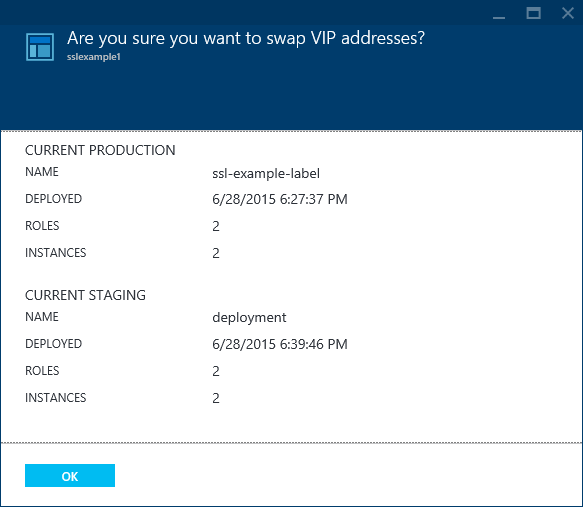

# 如何管理云服务

> [!div class="op_single_selector"]
>- [Azure 门户](./cloud-services-how-to-manage-portal.md)
>- [Azure 经典管理门户](./cloud-services-how-to-manage.md)

可以在 Azure 门户的“云服务(经典)”区域中管理云服务。本文介绍在管理云服务时可以执行的一些常见操作。其中包括更新、删除、扩展过渡部署并将其升级为生产部署。

有关如何扩展云服务的详细信息，请参阅[本文](./cloud-services-how-to-scale-portal.md)。

## 如何：更新云服务角色或部署
如果需要更新云服务的应用程序代码，请使用云服务边栏选项卡上的“更新”。可以更新一个角色或所有角色。若要进行更新，可以上载新服务包或服务配置文件。

1. 在 [Azure 门户][]中，选择要更新的云服务。此步骤将打开云服务实例边栏选项卡。

2. 在边栏选项卡中，单击“更新”按钮。

    

3. 使用新服务包文件 (.cspkg) 和服务配置文件 (.cscfg) 更新部署。

    

4. **可选** 更新部署标签和存储帐户。

5. 如果任何角色只有一个角色实例，请选择“即使一个或多个角色包含单个实例也进行部署”，以使升级能够继续。

    如果每个角色至少拥有两个角色实例（虚拟机），则 Azure 在云服务更新期间只能保证 99.95% 的服务可用性。因为有两个角色实例，因此其中一个虚拟机可以在另一个虚拟机更新时处理客户端请求。

6. 如果要在包上载完成后应用更新，请选中“开始部署”。

7. 单击“确定”开始更新服务。

## 如何：交换部署以将过渡部署升级为生产环境

如果决定部署云服务的新版本，可以在云服务过渡环境中暂存和测试新版本。使用“交换”将两个部署的 URL 地址互换，并将新版本提升为生产部署。

可以通过“云服务”页面或仪表板交换部署。

1. 在 [Azure 门户][]中，选择要更新的云服务。此步骤将打开云服务实例边栏选项卡。
2. 在边栏选项卡中，单击“交换”按钮。

    

3. 将打开以下确认提示。

    

4. 验证部署信息后，单击“确定”交换部署。

    交换部署的速度很快，因为唯一发生更改的是部署使用的虚拟 IP 地址 (VIP)。

    若要节省计算成本，可以在验证生产部署是否能够按预期运行后删除过渡部署。

### 有关交换部署的常见问题

**交换部署的先决条件是什么？**

成功的部署交换有两个先决条件：

- 如果想要将静态 IP 地址用于生产槽，也必须为过渡槽保留一个静态 IP 地址。否则，交换将失败。

- 在执行交换之前，你的角色的所有实例必须都在运行。可以在 Azure 门户的概述边栏选项卡中或使用 [Windows PowerShell 中的 Get-AzureRole 命令](https://docs.microsoft.com/zh-cn/powershell/servicemanagement/azure.service/v3.1.0/get-azurerole)检查实例的状态。

请注意，来宾 OS 更新和服务修复操作也会导致部署交换失败。有关详细信息，请参阅[排查云服务部署问题](./cloud-services-troubleshoot-deployment-problems.md)。

**应用程序的交换是否会导致停机？ 应如何处理它？**

如在上一部分中所述，部署交换通常非常快，因为它只更改 Azure Load Balancer 中的配置。但是，在某些情况下，它会需要 10 秒或更长时间并导致暂时性连接故障。

## 如何：将资源链接到云服务

Azure 门户不会像当前 Azure 经典管理门户一样将资源链接在一起。而是将其他资源部署到云服务正在使用的同一资源组。

## 如何：删除部署和云服务

必须先删除每个现有部署，然后才能删除云服务。

若要节省计算成本，可以在验证生产部署是否能够按预期运行后删除过渡部署。停止的已部署角色实例仍会产生计算成本。

可使用以下过程删除部署或云服务。

1. 在 [Azure 门户][]中，选择要删除的云服务。此步骤将打开云服务实例边栏选项卡。
2. 在边栏选项卡中，单击“删除”按钮。

    

3. 可以通过选中“云服务及其部署”，或通过选择“生产部署”或“过渡部署”删除整个云服务。

    

4. 单击底部的“删除”按钮。

5. 若要删除云服务，单击“删除云服务”。然后，在出现确认提示时单击“是”。

> [!NOTE]
删除云服务时，如果已配置详细监视，则必须从存储帐户中手动删除数据。有关在何处查找度量值表的信息，请参阅[此文章](./cloud-services-how-to-monitor.md)。

[Azure 门户]: https://portal.azure.cn

## 后续步骤

* [云服务的常规配置](./cloud-services-how-to-configure-portal.md)。
* 了解如何[部署云服务](./cloud-services-how-to-create-deploy-portal.md)。
* 配置[自定义域名](./cloud-services-custom-domain-name-portal.md)。
* 配置 [SSL 证书](./cloud-services-configure-ssl-certificate-portal.md)。

<!---HONumber=Mooncake_0120_2017-->