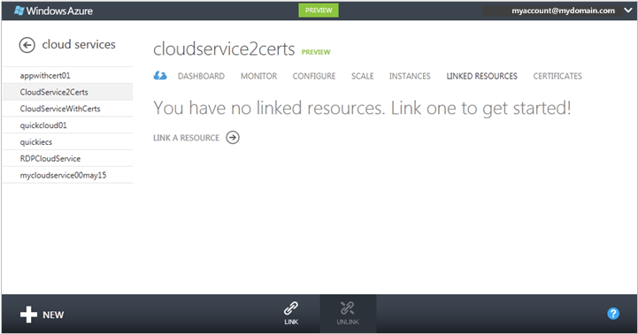

# 如何管理云服务

> [!div class="op_single_selector"]
>- [Azure 门户预览](./cloud-services-how-to-manage-portal.md)
>- [Azure 经典管理门户](./cloud-services-how-to-manage.md)

在 Azure 经典管理门户的“云服务”区域中，可以更新服务角色或部署、将预留部署升级到生产环境、将资源链接到云服务，以便查看资源依赖关系并对资源进行整体缩放，以及删除云服务或部署。

## 如何：更新云服务角色或部署

如果需要更新云服务的应用程序代码，请使用仪表板、“云服务”页或“实例”页上的“更新”。可以更新一个角色或所有角色。需要上传新的服务包和服务配置文件。

1. 在 [Azure 经典管理门户](https://manage.windowsazure.cn)中的仪表板的“云服务”页或“实例”页上，单击“更新”。

    

2. 在“部署标签”中，输入用于标识部署的名称（例如，mycloudservice4）。可在仪表板上“快速启动”之下找到部署标签。

3. 在“包”中，使用“浏览”上传服务包文件 (.cspkg)。

4. 在“配置”中，使用“浏览”上传服务配置文件 (.cscfg)。

5. 如果要升级云服务中的所有角色，请在“角色”中选择“全部”。若要执行单一角色更新，请选择要更新的角色。即使选择更新特定角色，服务配置文件中的更新也将应用于所有角色。

6. 如果更新更改了角色数量或任何角色的大小，则选中“如果角色大小或数量发生改变，则允许更新”复选框以继续进行更新。

    请注意，如果更改角色大小（即托管角色实例的虚拟机大小）或角色数量，必须重建每个角色实例（虚拟机）的映像，并将丢失所有本地数据。

7. 如果任何服务角色只有一个角色实例，则选中“即使一个或多个角色包含单个实例也进行更新”复选框以继续进行升级。

    如果每个角色至少具有两个角色实例（虚拟机），那么 Azure 在云服务更新期间只能保证 99.95% 的服务可用性。这使得一台虚拟机可以在另一台虚拟机正更新时处理客户端请求。

8. 单击“确定”（复选标记）以开始更新服务。

## 如何：交换部署以将暂留部署升级到生产环境

使用“交换”可将云服务的预留部署升级到生产环境。决定部署云服务的新版本时，可在云服务过渡环境中暂存和测试新版本，同时让客户在生产环境中继续使用当前版本。准备好将新版本提升到生产环境时，可使用“交换”来切换这两个部署 URL。

可以通过“云服务”页或仪表板来交换部署。

1. 在 [Azure 经典管理门户](https://manage.windowsazure.cn)中，单击“云服务”。

2. 在云服务列表中，单击相应云服务以将其选中。

3. 单击“交换”。

    将打开以下确认提示。

    

4. 在验证部署信息后，单击“是”交换部署。

    交换部署的速度很快，因为唯一发生更改的是部署所用的虚拟 IP 地址 (VIP)。

    为节省计算成本，确定新生产部署按预期执行时，可删除过渡环境中的部署。

### 有关交换部署的常见问题

**交换部署的先决条件是什么？**

成功的部署交换有两个先决条件：

- 如果想要将静态 IP 地址用于生产槽，也必须为过渡槽保留一个静态 IP 地址。否则，交换将失败。

- 在执行交换之前，你的角色的所有实例必须都在运行。可以在 Azure 经典管理门户中或使用 [Windows PowerShell 中的 Get-AzureRole 命令](https://docs.microsoft.com/zh-cn/powershell/servicemanagement/azure.service/v3.1.0/get-azurerole)检查实例的状态。

请注意，来宾 OS 更新和服务修复操作也会导致部署交换失败。有关详细信息，请参阅[排查云服务部署问题](./cloud-services-troubleshoot-deployment-problems.md)。

**应用程序的交换是否会导致停机？ 应如何处理它？**

如在上一部分中所述，部署交换通常非常快，因为它只更改 Azure Load Balancer 中的配置。但是，在某些情况下，它会需要 10 秒或更长时间并导致暂时性连接故障。
##  如何：将资源链接到云服务
要显示云服务对其他资源的依赖性，可将 Azure SQL 数据库实例或存储帐户链接到云服务。可以在“链接的资源”页上链接和取消链接资源，然后在云服务仪表板上监视其使用情况。如果链接的存储帐户启用了监视，可在云服务仪表板上监视“请求总数”。

使用“链接”可将新的或现有的 SQL 数据库实例或存储帐户链接到云服务。然后即可在“缩放”页上缩放数据库以及正使用它的云服务角色。（存储帐户可在使用率增加时自动缩放。） 有关详细信息，请参阅[如何缩放云服务和链接的资源](./cloud-services-how-to-scale.md)。

还可在 Azure 经典管理门户的“数据库”节点中监视、管理和缩放数据库。

从这个意义上说，“链接”某资源并不将应用连接到该资源。如果使用“链接”创建新数据库，需将连接字符串添加到应用程序代码，然后升级云服务。如果应用程序使用链接的存储帐户中的资源，则还需添加连接字符串。

以下过程描述了如何将部署在新 SQL 数据库服务器上的新 SQL 数据库实例链接到云服务。

### 将 SQL 数据库实例链接到云服务

1. 在 [Azure 经典管理门户](http://manage.windowsazure.cn)中，单击“云服务”。然后单击云服务的名称以打开仪表板。

2. 单击“链接的资源”。

    “链接的资源”页随即打开。

    

3. 单击“链接资源”或“链接”。

    “链接资源”向导随即启动。

    

4. 单击“创建新资源”或“链接现有资源”。

5. 选择要链接的资源类型。在 [Azure 经典管理门户](http://manage.windowsazure.cn)中，单击“SQL 数据库”。

6. 若要完成数据库配置，请按照 Azure 经典管理门户的“SQL 数据库”区域的帮助中的说明操作。

    可以在消息区域中跟踪链接操作的进度。

    链接完成时，可在云服务仪表板上监视链接的资源的状态。有关缩放链接的 SQL 数据库的信息，请参阅[如何缩放云服务和链接的资源](./cloud-services-how-to-scale.md)。

### 取消链接链接的资源

1. 在 [Azure 经典管理门户](http://manage.windowsazure.cn)中，单击“云服务”。然后单击云服务的名称以打开仪表板。

2. 单击“链接的资源”，然后选择相应资源。

3. 单击“取消链接”。然后在出现确认提示时，单击“是”。

    取消链接 SQL 数据库对该数据库或应用程序与该数据库的连接没有任何影响。仍可在 Azure 经典管理门户的“SQL 数据库”区域中管理该数据库。

## 如何：删除部署和云服务

必须先删除每个现有部署，然后才能删除云服务。

为节省计算成本，可在验证生产部署能够按预期运行后删除过渡部署。即使云服务未运行，也会向你收取角色实例的计算费用。

可使用以下过程删除部署或云服务。

1. 在 [Azure 经典管理门户](http://manage.windowsazure.cn)中，单击“云服务”。

2. 选择云服务，然后单击“删除”。（若要选择云服务而不打开仪表板，请单击云服务条目中名称以外的任何位置。）

    如果部署位于过渡或生产环境中，窗口底部将显示如下选择菜单。必须先删除所有现有部署，然后才能删除云服务。

    

3. 若要删除部署，请单击“删除生产部署”或“删除过渡部署”。然后在出现确认提示时单击“是”。

4. 如果要删除云服务，请在需要时重复步骤 3 以删除其他部署。

5. 要删除云服务，则单击“删除云服务”。然后在出现确认提示时单击“是”。

> [!NOTE]
如果为云服务配置了详细监视，那么在删除云服务时，Azure 不会从存储帐户中删除监视数据。需要手动删除这些数据。有关在何处查找度量值表的信息，请参阅[如何监视云服务](./cloud-services-how-to-monitor.md)中的“如何：在 Azure 经典管理门户外部访问详细监视数据”。

## 后续步骤

 * [云服务的常规配置](./cloud-services-how-to-configure.md)。
* 了解如何[部署云服务](./cloud-services-how-to-create-deploy.md)。
* 配置[自定义域名](./cloud-services-custom-domain-name.md)。
* 配置 [SSL 证书](./cloud-services-configure-ssl-certificate.md)。

<!---HONumber=Mooncake_0120_2017-->
<!--Update_Description:update wording and add the section of Common questions about swapping deployments-->