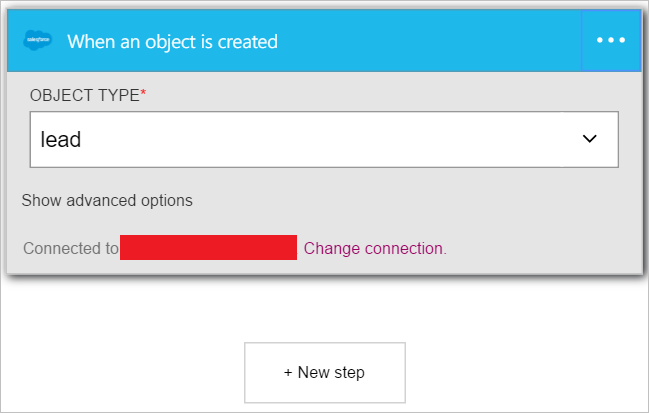

# SMTP 连接器入门
连接到 SMTP 以发送电子邮件。

若要使用[任何连接器](apis-list.md)，首先需要创建逻辑应用。 可通过 [立即创建逻辑应用](../logic-apps/quickstart-create-first-logic-app-workflow.md) 开始操作。

## 连接到 SMTP
在逻辑应用访问任何服务之前，必须先创建到该服务的*连接*。 [连接](connectors-overview.md)提供逻辑应用和其他服务之间的连接性。 例如，若要连接到 SMTP，首先需要 SMTP 连接。 若要创建连接，请输入通常用于访问要连接到的服务的凭据。 因此在 SMTP 示例中，输入连接名称、SMTP 服务器地址和用户登录信息的凭据，以便创建到 SMTP 的连接。  

### 创建到 SMTP 的连接
> [!INCLUDE [Steps to create a connection to SMTP](../../includes/connectors-create-api-smtp.md)]
> 
> 

## 使用 SMTP 触发器
触发器是用于启动在逻辑应用中定义的工作流的事件。 [了解有关触发器的详细信息](../logic-apps/logic-apps-overview.md#logic-app-concepts)。

在此示例中，SMTP 没有自己的触发器。 因此，使用“Salesforce - 创建对象时”触发器。 此触发器在 Salesforce 中新建对象时激活。 对于此示例，我们将设置为每次在 Salesforce 中新建潜在客户时，都使用 SMTP 连接器进行“发送电子邮件”操作，并附带所创建的新潜在客户的通知。

1. 在逻辑应用设计器上的搜索框中输入“salesforce”，并选择“Salesforce - 创建对象时”触发器。  

     
   
2. 显示“创建对象时”控件。

     
   
3. 选择“对象类型”，并从对象列表中选择“潜在客户”。 在此步骤中，将创建一个触发器，每当在 Salesforce 中新建潜在客户时，该触发器都将通知逻辑应用。  

     
   
4. 已创建触发器。  

     

## 使用 SMTP 操作
操作是指在逻辑应用中定义的工作流所执行的操作。 [了解有关操作的详细信息](../logic-apps/logic-apps-overview.md#logic-app-concepts)。

现在已添加触发器，请按照以下步骤添加 SMTP 操作，该操作会在 Salesforce 中新建潜在客户时发生。

1. 选择“+ 新步骤”，添加要在新建潜在客户时采取的操作。  

     
   
2. 选择“添加操作”。 这会打开可搜索要采取的任何操作的搜索框。
  
     
   
3. 输入“smtp”搜索与 SMTP 相关的操作。  
4. 选择“SMTP - 发送电子邮件”作为新建潜在客户时要采取的操作。 操作控制块打开。 如果之前未在设计器块中建立 SMTP 连接，必须执行此操作。  

      
    
5. 在 **SMTP - 发送电子邮件**块中输入所需的电子邮件信息。 
 
     
   
6. 保存工作，以便激活工作流。  

## 特定于连接器的详细信息

在[连接器详细信息](/connectors/smtpconnector/)中查看在 Swagger 中定义的触发器和操作，并查看限制。

## 更多连接器
返回到 [API 列表](apis-list.md)。