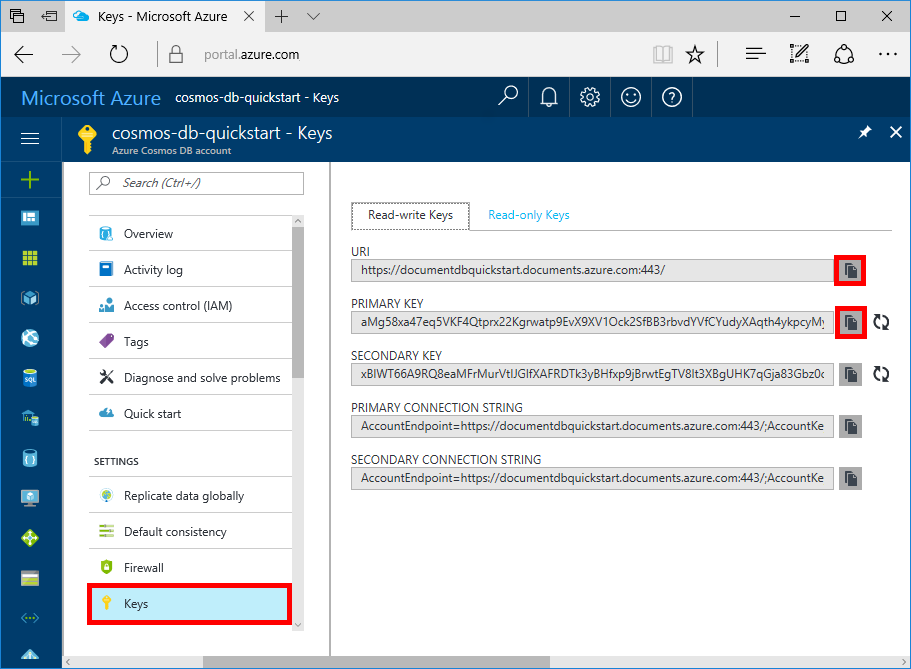

# <a name="azure-cosmos-db-build-a-web-app-with-net-xamarin-and-facebook-authentication"></a>Azure Cosmos DB：构建使用 .NET、Xamarin 和 Facebook 身份验证的 Web 应用

Azure Cosmos DB 由 Microsoft 提供，是全球分布的多模型数据库服务。 可快速创建和查询文档、键/值数据库，所有这些都受益于 Azure Cosmos DB 核心的全球分布和水平缩放功能。 

本快速入门教程演示如何使用 Azure 门户创建 Azure Cosmos DB 帐户、文档数据库和集合。 然后，生成并部署基于 [DocumentDB .NET API](documentdb-sdk-dotnet.md)、[Xamarin](https://www.xamarin.com/) 和 Azure Cosmos DB 授权引擎构建的待办事项列表 Web 应用。 该待办事项列表 Web 应用实现基于用户的数据模式，使用户能够使用 Facebook 身份验证登录并管理其自己的待办事项。

## <a name="prerequisites"></a>先决条件

如果尚未安装 Visual Studio 2017，可以下载并使用**免费的** [Visual Studio 2017 Community Edition](https://www.visualstudio.com/downloads/)。 在安装 Visual Studio 的过程中，请确保启用“Azure 开发”。

[!INCLUDE [quickstarts-free-trial-note](../../includes/quickstarts-free-trial-note.md)]

## <a name="create-a-database-account"></a>创建数据库帐户

[!INCLUDE [cosmos-db-create-dbaccount](../../includes/cosmos-db-create-dbaccount.md)]

## <a name="add-a-collection"></a>添加集合

[!INCLUDE [cosmos-db-create-collection](../../includes/cosmos-db-create-collection.md)]

## <a name="clone-the-sample-application"></a>克隆示例应用程序

现在，我们从 github 克隆 DocumentDB API 应用、设置连接字符串，并运行该应用。 你会看到以编程方式处理数据是多么容易。 

1. 打开 git 终端窗口（例如 git bash）并使用 `cd` 切换到工作目录。  

2. 运行下列命令，克隆示例存储库。 

    ```bash
    git clone https://github.com/Azure/azure-documentdb-dotnet.git
    ```

3. 然后，在 Visual Studio 中打开 samples/xamarin/UserItems/xamarin.forms 文件夹中的 DocumentDBTodo.sln 文件。 

## <a name="review-the-code"></a>查看代码

Xamarin 文件夹中的代码包含：

* Xamarin 应用。 应用在名为 UserItems 的分区集合中存储用户的待办事项。
* 资源令牌中转站 API。 一个简单的 ASP.NET Web API，可将 Azure Cosmos DB 资源令牌中转到应用的已登录用户。 资源令牌是生存期较短的访问令牌，可让应用访问已登录用户的数据。

下图演示了身份验证和数据流。

* UserItems 集合是使用分区键“/userid”创建的。 为集合指定分区键可随着用户数和项数的增长无限扩展 Azure Cosmos DB。
* Xamarin 应用允许用户使用 Facebook 凭据登录。
* Xamarin 应用使用 Facebook 访问令牌通过 ResourceTokenBroker API 进行身份验证
* 资源令牌中转站 API 使用“应用服务身份验证”功能对请求进行身份验证，并请求对共享已验证用户的分区键的所有文档拥有读/写访问权限的 Azure Cosmos DB 资源令牌。
* 资源令牌中转站将资源令牌返回到客户端应用。
* 应用使用资源令牌访问用户的待办事项。


## <a name="update-your-connection-string"></a>更新连接字符串

现在返回到 Azure 门户，获取连接字符串信息，并将其复制到应用。

1. 在 [Azure 门户](http://portal.azure.cn/)的 Azure Cosmos DB 帐户的左侧导航栏中，单击“密钥”，然后单击“读写密钥”。 使用屏幕右侧的复制按钮将 URI 和主密钥复制到下一步的 Web.config 文件中。

    

2. 在 Visual Studio 2017 中，打开 azure-documentdb-dotnet/samples/xamarin/UserItems/ResourceTokenBroker/ResourceTokenBroker 文件夹中的 Web.config 文件。 

3. 从门户中复制 URI 值（使用复制按钮），并在 Web.config 中将其设为 accountUrl 的值。 

    `<add key="accountUrl" value="{Azure Cosmos DB account URL}"/>`

4. 然后从门户复制“主密钥”值，并在 Web.config 中将其设为 accountKey 的值。 

    `<add key="accountKey" value="{Azure Cosmos DB secret}"/>`

现已使用与 Azure Cosmos DB 进行通信所需的所有信息更新应用。 

## <a name="build-and-deploy-the-web-app"></a>生成并部署 Web 应用

1. 在 Azure 门户中，创建一个应用服务网站用于托管资源令牌中转站 API。
2. 在 Azure 门户中，打开资源令牌中转站 API 网站的“应用设置”边栏选项卡。 填写以下应用设置：

    * accountUrl - Azure Cosmos DB 帐户的“密钥”选项卡中显示的 Azure Cosmos DB 帐户 URL。
    * accountKey - Azure Cosmos DB 帐户的“密钥”选项卡中显示的 Azure Cosmos DB 帐户主密钥。
    * 所创建的数据库和集合的 databaseId 和 collectionId

3. 将 ResourceTokenBroker 解决方案发布到创建的网站。

4. 打开 Xamarin 项目并导航到 TodoItemManager.cs。 填写 accountURL、collectionId、databaseId 和 resourceTokenBrokerURL 的值，作为资源令牌中转站网站的基本 HTTPS URL。
<!-- No Available [How to configure your App Service application to use Facebook login](../app-service-mobile/app-service-mobile-how-to-configure-facebook-authentication.md) -->
    Run the Xamarin app.

## <a name="review-slas-in-the-azure-portal"></a>在 Azure 门户中查看 SLA

[!INCLUDE [cosmosdb-tutorial-review-slas](../../includes/cosmos-db-tutorial-review-slas.md)]

## <a name="clean-up-resources"></a>清理资源

如果不打算继续使用此应用，请删除本快速入门教程在 Azure 门户中创建的所有资源，步骤如下： 

1. 在 Azure 门户的左侧菜单中单击“资源组”，然后单击刚刚创建的资源的名称。 
2. 在资源组页上单击“删除”，在文本框中键入要删除的资源的名称，然后单击“删除”。

## <a name="next-steps"></a>后续步骤

本快速入门教程已介绍如何创建 Azure Cosmos DB 帐户、使用数据资源管理器创建集合，以及构建和部署 Xamarin 应用。 现在可以将其他数据导入 Cosmos DB 帐户。 

> [!div class="nextstepaction"]
> [将数据导入 Azure Cosmos DB](import-data.md)