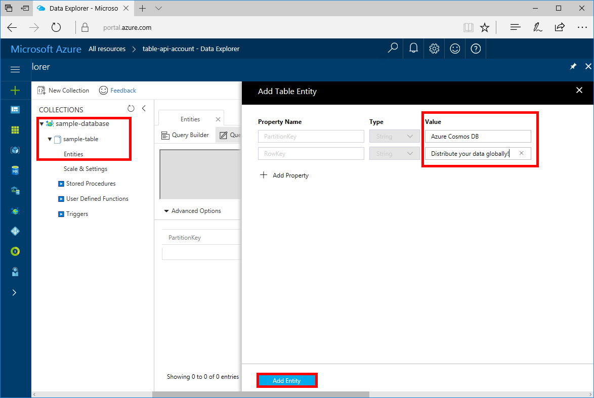

# <a name="azure-cosmos-db-build-a-net-application-using-the-table-api"></a>Azure Cosmos DB：使用表 API 生成 .NET 应用程序

Azure Cosmos DB 由 Microsoft 提供，是全球分布的多模型数据库服务。 可快速创建和查询文档、键/值和图形数据库，所有这些都受益于 Azure Cosmos DB 核心的全球分布和水平缩放功能。 

本快速入门教程演示如何使用 Azure 门户预览创建 Azure Cosmos DB 帐户，以及如何在该帐户内创建表。 然后，将通过编写代码来插入、更新和删除条目，以及运行某些查询。 可从 NuGet 下载 [Azure 存储预览版 SDK](https://aka.ms/premiumtablenuget)，它具有与公共 [Azure 存储 SDK](https://www.nuget.org/packages/WindowsAzure.Storage) 相同的类和方法签名，但也可以使用[表 API](table-introduction.md)（预览版）连接到 Azure Cosmos DB 帐户。 

## <a name="prerequisites"></a>先决条件

如果尚未安装 Visual Studio 2017，可以下载并使用**免费的** [Visual Studio 2017 Community Edition](https://www.visualstudio.com/downloads/)。 在安装 Visual Studio 的过程中，请确保启用“Azure 开发”。

[!INCLUDE [quickstarts-free-trial-note](../../includes/quickstarts-free-trial-note.md)]

## <a name="create-a-database-account"></a>创建数据库帐户

[!INCLUDE [cosmosdb-create-dbaccount-table](../../includes/cosmosdb-create-dbaccount-table.md)]

## <a name="add-a-table"></a>添加表

[!INCLUDE [cosmosdb-create-table](../../includes/cosmosdb-create-table.md)]

## <a name="add-sample-data"></a>添加示例数据

现在可以使用数据资源管理器将数据添加到新表。

1. 在数据资源管理器中，展开 **sample-database**、**sample-table**，单击“实体”，然后单击“添加实体”。
2. 现在请将数据添加到 PartitionKey 值框和 RowKey 值框，然后单击“添加实体”。

   

    现在可以在数据资源管理器中将更多实体添加到表、编辑实体或查询数据。 使用数据资源管理器还可以缩放吞吐量，并将存储过程、用户定义的函数和触发器添加到表中。

## <a name="clone-the-sample-application"></a>克隆示例应用程序

现在，我们从 github 克隆 DocumentDB API 应用、设置连接字符串，然后运行该应用。 你将看到以编程方式处理数据是多么容易。 

1. 打开 git 终端窗口（例如 git bash）并使用 `cd` 切换到工作目录。  

2. 运行下列命令，克隆示例存储库。 

    ```bash
    git clone https://github.com/Azure-Samples/azure-cosmos-db-table-dotnet-getting-started.git
    ```

3. 然后在 Visual Studio 中打开解决方案文件。 

## <a name="review-the-code"></a>查看代码

快速查看应用中发生的情况。 打开 Program.cs 文件，会发现以下代码行创建 Azure Cosmos DB 资源。 

* 将对 DocumentClient 进行初始化。

    ```csharp
    CloudStorageAccount storageAccount = CloudStorageAccount.Parse(connectionString); 
    CloudTableClient tableClient = storageAccount.CreateCloudTableClient();
    ```

* 如果表不存在，则创建新表。

    ```csharp
    CloudTable table = tableClient.GetTableReference("people");
    table.CreateIfNotExists();
    ```

* 将创建一个新的表容器。 你会注意到，该代码非常类似于常规的 Azure 表存储 SDK 

    ```csharp
    CustomerEntity item = new CustomerEntity()
                {
                    PartitionKey = Guid.NewGuid().ToString(),
                    RowKey = Guid.NewGuid().ToString(),
                    Email = $"{GetRandomString(6)}@contoso.com",
                    PhoneNumber = "425-555-0102",
                    Bio = GetRandomString(1000)
                };
    ```

## <a name="update-your-connection-string"></a>更新连接字符串

现在返回到 Azure 门户预览，获取连接字符串信息，并将其复制到应用。

1. 在 [Azure 门户预览](http://portal.azure.cn/)的 Azure Cosmos DB 帐户的左侧导航栏中，单击“密钥”，然后单击“读写密钥”。 使用屏幕右侧的复制按钮将 URI 和主密钥复制到下一步的 app.config 文件中。

    

2. 在 Visual Studio 中，打开 app.config 文件。 

3. 从门户中复制 Azure Cosmos DB 帐户名称，并在 app.config 中将其设为 PremiumStorageConnection 字符串值中 AccountName 的值。 在上面的屏幕截图中，帐户名称为 cosmos-db-quickstart。 帐户名称将显示在门户顶部。

    `<add key="PremiumStorageConnectionString" 
        value="DefaultEndpointsProtocol=https;AccountName=MYSTORAGEACCOUNT;AccountKey=AUTHKEY;TableEndpoint=https://COSMOSDB.documents.azure.cn" />`

4. 然后从门户复制“主密钥”的值，并在 PremiumStorageConnectionString 中将其设为 AccountKey 的值。 

    `AccountKey=AUTHKEY`

5. 最后，从门户的“密钥”页复制 URI 值（使用复制按钮），并将其设为 PremiumStorageConnectionString 的 TableEndpoint 的值。

    `TableEndpoint=https://COSMOSDB.documents.azure.cn`

    可以让 StandardStorageConnectionString 保留原样。

现已使用与 Azure Cosmos DB 进行通信所需的所有信息更新应用。 

## <a name="run-the-web-app"></a>运行 Web 应用

1. 在 Visual Studio 中，右键单击**解决方案资源管理器**中的项目，然后单击“管理 NuGet 包”。 

2. 在 NuGet“浏览”框中，键入 *WindowsAzure.Storage*，并选中“包括预发行版”框。 

3. 从结果中安装 **WindowsAzure.Storage** 库。 这将安装预览版 Azure Cosmos DB 表 API 包以及所有依赖项。

4. 单击 Ctrl+F5 运行应用程序。

    控制台窗口将显示添加到表中的数据。 完成脚本后，关闭控制台窗口。 

现可返回到数据资源管理器，查看查询、修改和处理此新数据。 

## <a name="review-slas-in-the-azure-portal-preview"></a>在 Azure 门户预览中查看 SLA

[!INCLUDE [cosmosdb-tutorial-review-slas](../../includes/cosmosdb-tutorial-review-slas.md)]

## <a name="clean-up-resources"></a>清理资源

如果不打算继续使用此应用，请删除本快速入门教程在 Azure 门户预览中创建的所有资源，步骤如下： 

1. 在 Azure 门户预览的左侧菜单中，单击“资源组”，然后单击已创建资源的名称。 
2. 在资源组页上单击“删除”，在文本框中键入要删除的资源的名称，然后单击“删除”。

## <a name="next-steps"></a>后续步骤

在本快速入门教程中，已了解如何创建 Azure Cosmos DB 帐户、使用数据资源管理器创建表和运行应用。  现在可以使用表 API 进行数据查询了。  

> [!div class="nextstepaction"]
> [使用表 API 的查询](tutorial-query-table.md)
