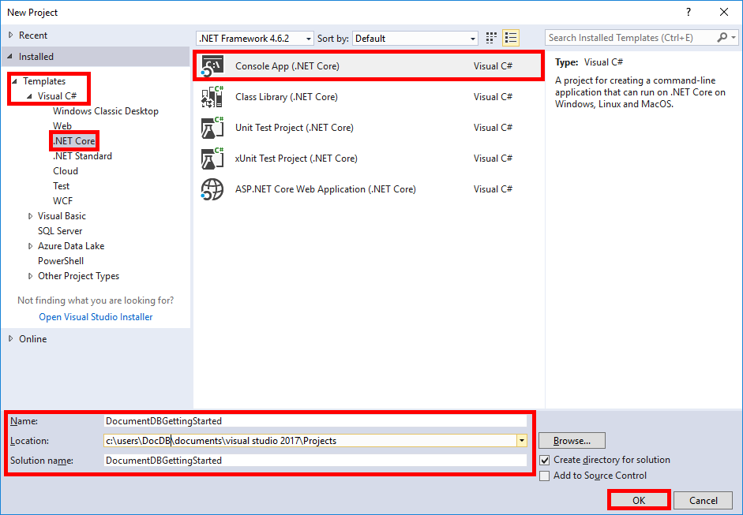
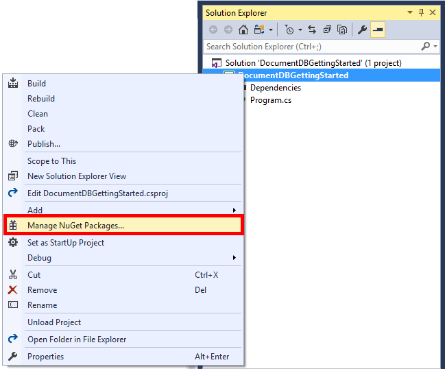

# <a name="azure-cosmos-db-getting-started-with-the-documentdb-api-and-net-core"></a>Azure Cosmos DB：DocumentDB API 和 .NET Core 入门
> [!div class="op_single_selector"]
> * [.NET](documentdb-get-started.md)
> * [.NET Core](documentdb-dotnetcore-get-started.md)
> * [用于 MongoDB 的 Node.js](mongodb-samples.md)
> * [Node.js](documentdb-nodejs-get-started.md)
> * [Java](documentdb-java-get-started.md)
> * [C++](documentdb-cpp-get-started.md)
>  
> 

欢迎使用 Azure Cosmos DB 的 DocumentDB API 入门 .NET Core 教程！ 学习本教程后，将拥有一个可创建并查询 Azure Cosmos DB 资源的控制台应用程序。

我们介绍：

* 创建并连接到 Azure Cosmos DB 帐户
* 配置 Visual Studio 解决方案
* 创建联机数据库
* 创建集合
* 创建 JSON 文档
* 查询集合
* 替换文档
* 删除文档
* 删除数据库

没有时间？ 不必担心！ 可在 [GitHub](https://github.com/Azure-Samples/documentdb-dotnet-core-getting-started)上获取完整的解决方案。 有关快速说明，请转到 [获取完整解决方案部分](#GetSolution) 。

想要使用 DocumentDB API 和 .NET Core SDK 生成 Xamarin iOS、Android 或 Forms 应用程序？ 请参阅[使用 Xamarin 和 Azure Cosmos DB 构建移动应用程序](mobile-apps-with-xamarin.md)。

> [!NOTE]
> 本教程中使用的 Azure Cosmos DB .NET Core SDK 目前与通用 Windows 平台 (UWP) 应用不兼容。 如需支持 UWP 应用的 .NET Core SDK 预览版，请向 [askcosmosdb@microsoft.com](mailto:askcosmosdb@microsoft.com) 发送电子邮件。

现在，让我们开始吧！

## <a name="prerequisites"></a>先决条件
请确保具有以下内容：

* 有效的 Azure 帐户。 如果没有，可以注册[免费帐户](https://www.azure.cn/pricing/1rmb-trial/)。 

  [!INCLUDE [cosmos-db-emulator-docdb-api](../../includes/cosmos-db-emulator-docdb-api.md)]

* [!INCLUDE [cosmos-db-emulator-vs](../../includes/cosmos-db-emulator-vs.md)] 
    * 如果在 MacOS 或 Linux 上操作，可以通过安装适用于所选平台的 [.NET Core SDK](https://www.microsoft.com/net/core#macos)，从命令行开发 .NET Core 应用。 
    * 如果在 Windows 上操作，可以通过安装 [.NET Core SDK](https://www.microsoft.com/net/core#windows)，从命令行开发 .NET Core 应用。 
    * 可以使用自己的编辑器或者下载免费的 [Visual Studio Code](https://code.visualstudio.com/)，并在 Windows、Linux 和 MacOS 上操作。 

## <a name="step-1-create-an-azure-cosmos-db-account"></a>步骤 1：创建 Azure Cosmos DB 帐户
创建 Azure Cosmos DB 帐户。 如果已经有一个想要使用的帐户，可以跳到 [设置 Visual Studio 解决方案](#SetupVS)。 如果使用 Azure Cosmos DB 模拟器，请遵循 [Azure Cosmos DB 模拟器](local-emulator.md)中的步骤设置该模拟器，并直接跳到[设置 Visual Studio 解决方案](#SetupVS)。

[!INCLUDE [cosmos-db-create-dbaccount](../../includes/cosmos-db-create-dbaccount.md)]

## <a id="SetupVS"></a>第 2 步：设置 Visual Studio 解决方案
1. 在计算机上打开 **Visual Studio 2017**。
2. 在“文件”菜单中，选择“新建”，然后选择“项目”。
3. 在“新建项目”对话框中，选择“模板” / “Visual C#” / “.NET Core”/“控制台应用程序(.NET Core)”，将项目命名为 **DocumentDBGettingStarted**，然后单击“确定”。

   
4. 在“解决方案资源管理器”中，右键单击“DocumentDBGettingStarted”。
5. 接下来，无需离开菜单，单击“管理 NuGet 包...”。

   
6. 在“NuGet”选项卡上，单击窗口顶部的“浏览”，然后在搜索框中键入 **azure documentdb**。
7. 在结果中找到 **Microsoft.Azure.DocumentDB.Core**，然后单击“安装”。
   适用于 .NET Core 的 DocumentDB 客户端库的程序包 ID 是 [Microsoft.Azure.DocumentDB.Core](https://www.nuget.org/packages/Microsoft.Azure.DocumentDB.Core)。 如果用户的目标是不受此 .NET Core NuGet 包支持的 .NET Framework 版本（例如 net461），则请使用 [Microsoft.Azure.DocumentDB](https://www.nuget.org/packages/Microsoft.Azure.DocumentDB)，后者支持自 .NET Framework 4.5 以来的所有 .NET Framework 版本。
8. 出现提示时，接受 NuGet 包安装和许可协议。

很好！ 现在，我们已完成安装，让我们开始编写一些代码。 可以在 [GitHub](https://github.com/Azure-Samples/documentdb-dotnet-core-getting-started)上找到本教程的完整代码项目。

## <a id="Connect"></a>步骤 3：连接到 Azure Cosmos DB 帐户
首先，在 Program.cs 文件中 C# 应用程序的开始位置添加这些引用：

```csharp
using System;

// ADD THIS PART TO YOUR CODE
using System.Linq;
using System.Threading.Tasks;
using System.Net;
using Microsoft.Azure.Documents;
using Microsoft.Azure.Documents.Client;
using Newtonsoft.Json;
```

> [!IMPORTANT]
> 为了完成本教程，请确保添加以上依赖项。

现在，在公共类 *Program* 下面添加这两个常量和*客户端*变量。

```csharp
class Program
{
    // ADD THIS PART TO YOUR CODE
    private const string EndpointUri = "<your endpoint URI>";
    private const string PrimaryKey = "<your key>";
    private DocumentClient client;
```

接下来，转到 [Azure 门户](https://portal.azure.cn)，检索 URI 和主密钥。 Azure Cosmos DB URI 和主密钥是必需的，可让应用程序知道要连接的对象，使 Azure Cosmos DB 信任应用程序的连接。

在 Azure 门户中，导航到 Azure Cosmos DB 帐户，然后单击“密钥”。

从门户中复制该 URI 并将它粘贴到 program.cs 文件中的 `<your endpoint URI>`。 然后从门户中复制“主密钥”并将它粘贴到 `<your key>`。 如果使用 Azure Cosmos DB 模拟器，请将 `https://localhost:8081` 用作终结点，并使用[如何使用 Azure Cosmos DB 模拟器进行开发](local-emulator.md)中明确定义的授权密钥。 请务必删除 < 和 >，但保留终结点和密钥的双引号。

![NoSQL 教程用于创建 C# 控制台应用程序的 Azure 门户的屏幕截图。 显示了一个 Azure Cosmos DB 帐户，在“Azure Cosmos DB 帐户”边栏选项卡上突出显示了“ACTIVE”中心、“密钥”按钮，在“密钥”边栏选项卡上突出显示了 URI、主密钥、辅助密钥的值][keys]

开始使用入门应用程序时，请首先创建一个新的 **DocumentClient**实例。

在 **Main** 方法下面，添加这个名为 **GetStartedDemo** 的新异步任务，将新的 **DocumentClient** 实例化。

```csharp
static void Main(string[] args)
{
}

// ADD THIS PART TO YOUR CODE
private async Task GetStartedDemo()
{
    this.client = new DocumentClient(new Uri(EndpointUri), PrimaryKey);
}
```

添加以下代码，从 **Main** 方法中运行异步任务。 **Main** 方法将捕获异常并将它们写到控制台上。

```csharp
static void Main(string[] args)
{
        // ADD THIS PART TO YOUR CODE
        try
        {
                Program p = new Program();
                p.GetStartedDemo().Wait();
        }
        catch (DocumentClientException de)
        {
                Exception baseException = de.GetBaseException();
                Console.WriteLine("{0} error occurred: {1}, Message: {2}", de.StatusCode, de.Message, baseException.Message);
        }
        catch (Exception e)
        {
                Exception baseException = e.GetBaseException();
                Console.WriteLine("Error: {0}, Message: {1}", e.Message, baseException.Message);
        }
        finally
        {
                Console.WriteLine("End of demo, press any key to exit.");
                Console.ReadKey();
        }
```

按“DocumentDBGettingStarted”按钮生成和运行应用程序。

祝贺！ 成功连接到 Azure Cosmos DB 帐户后，接下来应了解如何使用 Azure Cosmos DB 资源。  

## <a name="step-4-create-a-database"></a>第 4 步：创建数据库
在添加创建数据库的代码之前，添加一个用于向控制台写入的帮助器方法。

将 **WriteToConsoleAndPromptToContinue** 方法复制并粘贴到 **GetStartedDemo** 方法下面。

```csharp
// ADD THIS PART TO YOUR CODE
private void WriteToConsoleAndPromptToContinue(string format, params object[] args)
{
        Console.WriteLine(format, args);
        Console.WriteLine("Press any key to continue ...");
        Console.ReadKey();
}
```

可以使用 DocumentClient 类的 [CreateDatabaseAsync](https://msdn.microsoft.com/library/microsoft.azure.documents.client.documentclient.createdatabaseasync.aspx) 方法创建 Azure Cosmos DB [数据库](documentdb-resources.md#databases)。 数据库是跨集合分区的 JSON 文档存储的逻辑容器。

将以下代码复制并粘贴到客户端创建下方的 **GetStartedDemo** 方法。 这会创建一个名为 *FamilyDB* 的数据库。

```csharp
private async Task GetStartedDemo()
{
    this.client = new DocumentClient(new Uri(EndpointUri), PrimaryKey);

    // ADD THIS PART TO YOUR CODE
    await this.client.CreateDatabaseIfNotExistsAsync(new Database { Id = "FamilyDB_oa" });
```

按“DocumentDBGettingStarted”按钮运行应用程序。

祝贺！ 已成功创建了 Azure Cosmos DB 数据库。  

## <a id="CreateColl"></a>步骤 5：创建集合
> [!WARNING]
> 
            **CreateDocumentCollectionAsync** 会创建一个具有保留吞吐量的新集合，它牵涉定价。 有关详细信息，请访问 [定价页](https://www.azure.cn/pricing/details/cosmos-db/)。

可以通过使用 **DocumentClient** 类的 [CreateDocumentCollectionAsync](https://msdn.microsoft.com/library/microsoft.azure.documents.client.documentclient.createdocumentcollectionasync.aspx) 方法来创建[集合](documentdb-resources.md#collections)。 集合是 JSON 文档和相关联的 JavaScript 应用程序逻辑的容器。

将以下代码复制并粘贴到数据库创建下方的 **GetStartedDemo** 方法。 这将创建一个名为 *FamilyCollection_oa* 的文档集合。

```csharp
    this.client = new DocumentClient(new Uri(EndpointUri), PrimaryKey);

    await this.client.CreateDatabaseIfNotExists("FamilyDB_oa");

    // ADD THIS PART TO YOUR CODE
    await this.client.CreateDocumentCollectionIfNotExistsAsync(UriFactory.CreateDatabaseUri("FamilyDB_oa"), new DocumentCollection { Id = "FamilyCollection_oa" });
```

按“DocumentDBGettingStarted”按钮运行应用程序。

祝贺！ 已成功创建了 Azure Cosmos DB 文档集合。  

## <a id="CreateDoc"></a>步骤 6：创建 JSON 文档
可以通过使用 **DocumentClient** 类的 [CreateDocumentAsync](https://msdn.microsoft.com/library/microsoft.azure.documents.client.documentclient.createdocumentasync.aspx) 方法创建[文档](documentdb-resources.md#documents)。 文档为用户定义的（任意）JSON 内容。 现在，我们可以插入一个或多个文档。 如果已有要在数据库中存储的数据，则可以使用 Azure Cosmos DB 的[数据迁移工具](import-data.md)。

在本例中，首先需要创建 **Family** 类来表示存储在 Azure Cosmos DB 中的对象。 此外还将创建 **Family** 中使用的 **Parent**、**Child**、**Pet** 和 **Address** 子类。 请注意，文档必须将 **ID** 属性序列化为 JSON 格式的 **ID**。 通过在 **GetStartedDemo** 方法后添加以下内部子类来创建这些类。

将 **Family**、**Parent**、**Child**、**Pet** 和 **Address** 类复制并粘贴到 **WriteToConsoleAndPromptToContinue** 方法下面。

```csharp
private void WriteToConsoleAndPromptToContinue(string format, params object[] args)
{
    Console.WriteLine(format, args);
    Console.WriteLine("Press any key to continue ...");
    Console.ReadKey();
}

// ADD THIS PART TO YOUR CODE
public class Family
{
    [JsonProperty(PropertyName = "id")]
    public string Id { get; set; }
    public string LastName { get; set; }
    public Parent[] Parents { get; set; }
    public Child[] Children { get; set; }
    public Address Address { get; set; }
    public bool IsRegistered { get; set; }
    public override string ToString()
    {
            return JsonConvert.SerializeObject(this);
    }
}

public class Parent
{
    public string FamilyName { get; set; }
    public string FirstName { get; set; }
}

public class Child
{
    public string FamilyName { get; set; }
    public string FirstName { get; set; }
    public string Gender { get; set; }
    public int Grade { get; set; }
    public Pet[] Pets { get; set; }
}

public class Pet
{
    public string GivenName { get; set; }
}

public class Address
{
    public string State { get; set; }
    public string County { get; set; }
    public string City { get; set; }
}
```

将 **CreateFamilyDocumentIfNotExists** 方法复制并粘贴到 **CreateDocumentCollectionIfNotExists** 方法下面。

```csharp
// ADD THIS PART TO YOUR CODE
private async Task CreateFamilyDocumentIfNotExists(string databaseName, string collectionName, Family family)
{
    try
    {
        await this.client.ReadDocumentAsync(UriFactory.CreateDocumentUri(databaseName, collectionName, family.Id));
        this.WriteToConsoleAndPromptToContinue("Found {0}", family.Id);
    }
    catch (DocumentClientException de)
    {
        if (de.StatusCode == HttpStatusCode.NotFound)
        {
            await this.client.CreateDocumentAsync(UriFactory.CreateDocumentCollectionUri(databaseName, collectionName), family);
            this.WriteToConsoleAndPromptToContinue("Created Family {0}", family.Id);
        }
        else
        {
            throw;
        }
    }
}
```

然后插入两个文档，Andersen Family 和 Wakefield Family 各一个。

将 `// ADD THIS PART TO YOUR CODE` 后面的代码复制并粘贴到文档集合创建下的 **GetStartedDemo** 方法。

```csharp
await this.CreateDatabaseIfNotExists("FamilyDB_oa");

await this.CreateDocumentCollectionIfNotExists("FamilyDB_oa", "FamilyCollection_oa");

// ADD THIS PART TO YOUR CODE
Family andersenFamily = new Family
{
        Id = "Andersen.1",
        LastName = "Andersen",
        Parents = new Parent[]
        {
                new Parent { FirstName = "Thomas" },
                new Parent { FirstName = "Mary Kay" }
        },
        Children = new Child[]
        {
                new Child
                {
                        FirstName = "Henriette Thaulow",
                        Gender = "female",
                        Grade = 5,
                        Pets = new Pet[]
                        {
                                new Pet { GivenName = "Fluffy" }
                        }
                }
        },
        Address = new Address { State = "WA", County = "King", City = "Seattle" },
        IsRegistered = true
};

await this.CreateFamilyDocumentIfNotExists("FamilyDB_oa", "FamilyCollection_oa", andersenFamily);

Family wakefieldFamily = new Family
{
        Id = "Wakefield.7",
        LastName = "Wakefield",
        Parents = new Parent[]
        {
                new Parent { FamilyName = "Wakefield", FirstName = "Robin" },
                new Parent { FamilyName = "Miller", FirstName = "Ben" }
        },
        Children = new Child[]
        {
                new Child
                {
                        FamilyName = "Merriam",
                        FirstName = "Jesse",
                        Gender = "female",
                        Grade = 8,
                        Pets = new Pet[]
                        {
                                new Pet { GivenName = "Goofy" },
                                new Pet { GivenName = "Shadow" }
                        }
                },
                new Child
                {
                        FamilyName = "Miller",
                        FirstName = "Lisa",
                        Gender = "female",
                        Grade = 1
                }
        },
        Address = new Address { State = "NY", County = "Manhattan", City = "NY" },
        IsRegistered = false
};

await this.CreateFamilyDocumentIfNotExists("FamilyDB_oa", "FamilyCollection_oa", wakefieldFamily);
```

按“DocumentDBGettingStarted”按钮运行应用程序。

祝贺！ 已成功创建了两个 Azure Cosmos DB 文档。  


## <a id="Query"></a>步骤 7：查询 Azure Cosmos DB 资源
Azure Cosmos DB 支持对存储在每个集合中的 JSON 文档进行各种[查询](documentdb-sql-query.md)。  下面的示例代码演示了各种查询（使用 Azure Cosmos DB SQL 语法以及 LINQ），可以针对上一步中插入的文档执行查询。

将 **ExecuteSimpleQuery** 方法复制并粘贴到 **CreateFamilyDocumentIfNotExists** 方法下面。

```csharp
// ADD THIS PART TO YOUR CODE
private void ExecuteSimpleQuery(string databaseName, string collectionName)
{
    // Set some common query options
    FeedOptions queryOptions = new FeedOptions { MaxItemCount = -1 };

        // Here we find the Andersen family via its LastName
        IQueryable<Family> familyQuery = this.client.CreateDocumentQuery<Family>(
                UriFactory.CreateDocumentCollectionUri(databaseName, collectionName), queryOptions)
                .Where(f => f.LastName == "Andersen");

        // The query is executed synchronously here, but can also be executed asynchronously via the IDocumentQuery<T> interface
        Console.WriteLine("Running LINQ query...");
        foreach (Family family in familyQuery)
        {
            Console.WriteLine("\tRead {0}", family);
        }

        // Now execute the same query via direct SQL
        IQueryable<Family> familyQueryInSql = this.client.CreateDocumentQuery<Family>(
                UriFactory.CreateDocumentCollectionUri(databaseName, collectionName),
                "SELECT * FROM Family WHERE Family.LastName = 'Andersen'",
                queryOptions);

        Console.WriteLine("Running direct SQL query...");
        foreach (Family family in familyQueryInSql)
        {
                Console.WriteLine("\tRead {0}", family);
        }

        Console.WriteLine("Press any key to continue ...");
        Console.ReadKey();
}
```

将以下代码复制并粘贴到第二次文档创建下的 **GetStartedDemo** 方法。

```csharp
await this.CreateFamilyDocumentIfNotExists("FamilyDB_oa", "FamilyCollection_oa", wakefieldFamily);

// ADD THIS PART TO YOUR CODE
this.ExecuteSimpleQuery("FamilyDB_oa", "FamilyCollection_oa");
```

按“DocumentDBGettingStarted”按钮运行应用程序。

祝贺！ 已成功完成了对 Azure Cosmos DB 集合的查询。

下图说明了如何对已创建的集合调用 Azure Cosmos DB SQL 查询语法，相同的逻辑也适用于 LINQ 查询。


查询中的关键字 [FROM](documentdb-sql-query.md#FromClause) 是可选项，因为 Azure Cosmos DB 查询已限制为单个集合。 因此，“FROM Families f”可与“FROM root r”或者任何其他所选变量名进行交换。 默认情况下，DocumentDB 会推断你选择的 Families、root 或变量名，并默认引用当前集合。

## <a id="ReplaceDocument"></a>步骤 8：替换 JSON 文档
Azure Cosmos DB 支持替换 JSON 文档。  

将 **ReplaceFamilyDocument** 方法复制并粘贴到 **ExecuteSimpleQuery** 方法下面。

```csharp
// ADD THIS PART TO YOUR CODE
private async Task ReplaceFamilyDocument(string databaseName, string collectionName, string familyName, Family updatedFamily)
{
    try
    {
        await this.client.ReplaceDocumentAsync(UriFactory.CreateDocumentUri(databaseName, collectionName, familyName), updatedFamily);
        this.WriteToConsoleAndPromptToContinue("Replaced Family {0}", familyName);
    }
    catch (DocumentClientException de)
    {
        throw;
    }
}
```

将以下代码复制并粘贴到查询执行下的 **GetStartedDemo** 方法。 替换文档之后，会再次运行相同查询以查看更改后的文档。

```csharp
await this.CreateFamilyDocumentIfNotExists("FamilyDB_oa", "FamilyCollection_oa", wakefieldFamily);

this.ExecuteSimpleQuery("FamilyDB_oa", "FamilyCollection_oa");

// ADD THIS PART TO YOUR CODE
// Update the Grade of the Andersen Family child
andersenFamily.Children[0].Grade = 6;

await this.ReplaceFamilyDocument("FamilyDB_oa", "FamilyCollection_oa", "Andersen.1", andersenFamily);

this.ExecuteSimpleQuery("FamilyDB_oa", "FamilyCollection_oa");
```

按“DocumentDBGettingStarted”按钮运行应用程序。

祝贺！ 已成功替换了 Azure Cosmos DB 文档。

## <a id="DeleteDocument"></a>步骤 9：删除 JSON 文档
Azure Cosmos DB 支持删除 JSON 文档。  

将 **DeleteFamilyDocument** 方法复制并粘贴到 **ReplaceFamilyDocument** 方法下面。

```csharp
// ADD THIS PART TO YOUR CODE
private async Task DeleteFamilyDocument(string databaseName, string collectionName, string documentName)
{
    try
    {
        await this.client.DeleteDocumentAsync(UriFactory.CreateDocumentUri(databaseName, collectionName, documentName));
        Console.WriteLine("Deleted Family {0}", documentName);
    }
    catch (DocumentClientException de)
    {
        throw;
    }
}
```

将以下代码复制并粘贴到第二次查询执行下的 **GetStartedDemo** 方法。

```csharp
await this.ReplaceFamilyDocument("FamilyDB_oa", "FamilyCollection_oa", "Andersen.1", andersenFamily);

this.ExecuteSimpleQuery("FamilyDB_oa", "FamilyCollection_oa");

// ADD THIS PART TO CODE
await this.DeleteFamilyDocument("FamilyDB_oa", "FamilyCollection_oa", "Andersen.1");
```

按“DocumentDBGettingStarted”按钮运行应用程序。

祝贺！ 已成功删除了 Azure Cosmos DB 文档。

## <a id="DeleteDatabase"></a>步骤 10：删除数据库
删除已创建的数据库会删除该数据库及其所有子资源（集合、文档等）。

将以下代码复制并粘贴到文档删除下的 **GetStartedDemo** 方法，删除整个数据库和所有子资源。

```csharp
this.ExecuteSimpleQuery("FamilyDB_oa", "FamilyCollection_oa");

await this.DeleteFamilyDocument("FamilyDB_oa", "FamilyCollection_oa", "Andersen.1");

// ADD THIS PART TO CODE
// Clean up/delete the database
await this.client.DeleteDatabaseAsync(UriFactory.CreateDatabaseUri("FamilyDB_oa"));
```

按“DocumentDBGettingStarted”按钮运行应用程序。

祝贺！ 已成功删除了 Azure Cosmos DB 数据库。

## <a id="Run"></a>步骤 11：一起运行 C# 控制台应用程序！
在 Visual Studio 中按“DocumentDBGettingStarted”按钮，以调试模式生成应用程序。

应该在控制台窗口中看到已启动应用的输出。 输出会显示我们所添加的查询的结果，并且应与下面的示例文本相匹配。

```
Created FamilyDB_oa
Press any key to continue ...
Created FamilyCollection_oa
Press any key to continue ...
Created Family Andersen.1
Press any key to continue ...
Created Family Wakefield.7
Press any key to continue ...
Running LINQ query...
    Read {"id":"Andersen.1","LastName":"Andersen","District":"WA5","Parents":[{"FamilyName":null,"FirstName":"Thomas"},{"FamilyName":null,"FirstName":"Mary Kay"}],"Children":[{"FamilyName":null,"FirstName":"Henriette Thaulow","Gender":"female","Grade":5,"Pets":[{"GivenName":"Fluffy"}]}],"Address":{"State":"WA","County":"King","City":"Seattle"},"IsRegistered":true}
Running direct SQL query...
    Read {"id":"Andersen.1","LastName":"Andersen","District":"WA5","Parents":[{"FamilyName":null,"FirstName":"Thomas"},{"FamilyName":null,"FirstName":"Mary Kay"}],"Children":[{"FamilyName":null,"FirstName":"Henriette Thaulow","Gender":"female","Grade":5,"Pets":[{"GivenName":"Fluffy"}]}],"Address":{"State":"WA","County":"King","City":"Seattle"},"IsRegistered":true}
Replaced Family Andersen.1
Press any key to continue ...
Running LINQ query...
    Read {"id":"Andersen.1","LastName":"Andersen","District":"WA5","Parents":[{"FamilyName":null,"FirstName":"Thomas"},{"FamilyName":null,"FirstName":"Mary Kay"}],"Children":[{"FamilyName":null,"FirstName":"Henriette Thaulow","Gender":"female","Grade":6,"Pets":[{"GivenName":"Fluffy"}]}],"Address":{"State":"WA","County":"King","City":"Seattle"},"IsRegistered":true}
Running direct SQL query...
    Read {"id":"Andersen.1","LastName":"Andersen","District":"WA5","Parents":[{"FamilyName":null,"FirstName":"Thomas"},{"FamilyName":null,"FirstName":"Mary Kay"}],"Children":[{"FamilyName":null,"FirstName":"Henriette Thaulow","Gender":"female","Grade":6,"Pets":[{"GivenName":"Fluffy"}]}],"Address":{"State":"WA","County":"King","City":"Seattle"},"IsRegistered":true}
Deleted Family Andersen.1
End of demo, press any key to exit.
```

祝贺！ 已经完成了本教程，并且获得了一个正常工作的 C# 控制台应用程序！

## <a id="GetSolution"></a> 获取完整的教程解决方案
要生成包含本文所有示例的 GetStarted 解决方案，需要以下内容：

* 有效的 Azure 帐户。 如果没有，可以注册[免费帐户](https://www.azure.cn/pricing/1rmb-trial/)。
* 一个 [Azure Cosmos DB 帐户][create-documentdb-dotnet.md#create-account]。
* GitHub 上提供的 [GetStarted](https://github.com/Azure-Samples/documentdb-dotnet-core-getting-started) 解决方案。

要在 Visual Studio 中还原 DocumentDB API for Azure Cosmos DB .NET Core SDK 引用，请在解决方案资源管理器中右键单击“GetStarted”解决方案，并单击“启用 NuGet 包还原”。 接下来，按照[连接到 Azure Cosmos DB 帐户](#Connect)中所述，在 Program.cs 文件中更新 EndpointUrl 和 AuthorizationKey 值。

## <a name="next-steps"></a>后续步骤
* 需要更复杂的 ASP.NET MVC 教程？ 请参阅 [ASP.NET MVC 教程：使用 Azure Cosmos DB 开发 Web 应用程序](documentdb-dotnet-application.md)。
* 想要使用 DocumentDB API for Azure Cosmos DB .NET Core SDK 开发 Xamarin iOS、Android 或 Forms 应用程序？ 请参阅[使用 Xamarin 和 Azure Cosmos DB 构建移动应用程序](mobile-apps-with-xamarin.md)。
* 希望使用 Azure Cosmos DB 执行规模和性能测试？ 请参阅[使用 Azure Cosmos DB 执行性能和扩展测试](performance-testing.md)
* 了解如何[监视 Azure Cosmos DB 请求、使用情况和存储](monitor-accounts.md)。
* 在 [Query Playground](https://www.documentdb.com/sql/demo)中对示例数据集运行查询。
* 若要了解有关编程模型的详细信息，请参阅 [Azure Cosmos DB](https://www.azure.cn/home/features/cosmos-db/)。

[create-documentdb-dotnet.md#create-account]: create-documentdb-dotnet.md#create-account
[keys]: media/documentdb-dotnetcore-get-started/nosql-tutorial-keys.png

<!--Update_Description: wording update-->