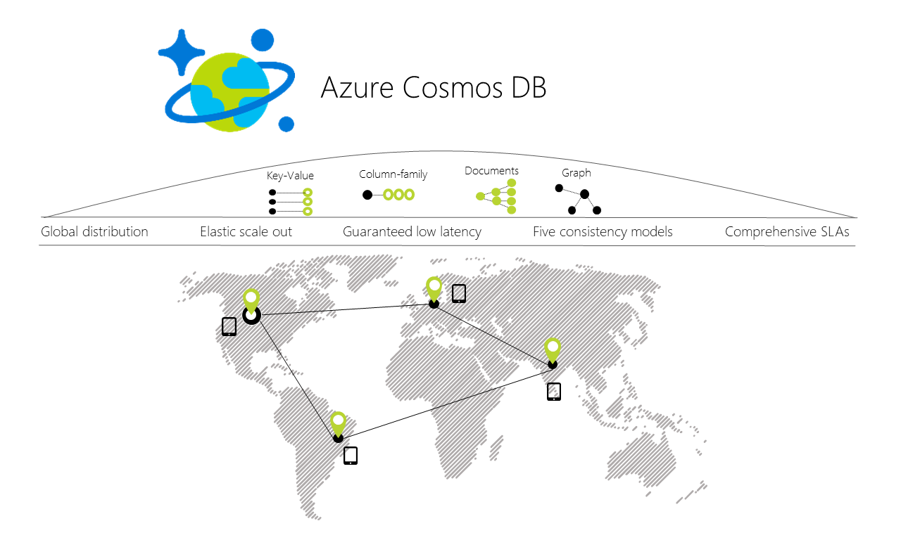

<!-- Notice in meta : 全球 to 多个区域 -->
# 欢迎使用 Azure Cosmos DB

如今的应用程序需要具备高响应能力并始终联机。 若要实现低延迟和高可用性，需要在靠近用户的数据中心部署这些应用程序的实例。 应用程序需要实时响应高峰期的重大用量变化，存储不断增长的数据，并在数毫秒内向用户提供此数据。

Azure Cosmos DB 是世纪互联提供的多区域分布式多模型数据库服务。 只需单击一个按钮，即可通过 Cosmos DB 跨任意数量的中国 Azure 区域弹性且独立地缩放吞吐量和存储。 可以弹性缩放吞吐量和存储，并使用你喜欢的 API 对 SQL、MongoDB、Cassandra、表或 Gremlin 中的数据实现低至个位数毫秒级的快速访问。 Cosmos DB 为吞吐量、延迟、可用性和一致性保证提供综合[服务级别协议](https://www.azure.cn/support/sla/documentdb/) (SLA)，这是其他数据库服务无法提供的。

<!-- Not Avaialble [Try Azure Cosmos DB for free](https://www.azure.cn/try/cosmosdb/)-->

## 主要优势

### 统包式多区域分布

利用 Cosmos DB，可在中国全境范围内生成具有高响应能力和可用性的应用程序。 无论用户身处何处，Cosmos DB 均可以透明方式复制数据，因此用户可以与离他们最近的数据副本进行交互。

Cosmos DB 允许随时在 Cosmos 帐户中添加或删除任何 Azure 区域，只需单击一个按钮即可。 Cosmos DB 将无缝地将数据复制到与 Cosmos 帐户相关联的所有区域，同时，得益于该服务的多导功能，应用程序将继续保持高可用性  。 有关详细信息，请参阅[多区域分布](distribute-data-globally.md)一文。

### Always On

凭借与 Azure 基础结构和[透明多主数据库复制](global-dist-under-the-hood.md)的深度集成，Cosmos DB 可为读写操作提供 99.999% 的[高可用性](high-availability.md)。 Cosmos DB 还可让你以编程方式（或通过门户）调用 Cosmos 帐户的区域性故障转移。 此功能有助于确保应用程序能够在发生区域性灾难时进行故障转移。

### 中国全境范围内的吞吐量和存储可弹性缩放

Cosmos DB 采用透明水平分区和多主数据库复制设计，为中国全境范围内的读写操作提供前所未有的弹性缩放能力。 在中国境内，只需发出一次 API 调用，即可将每秒数千个请求弹性扩展到数百万个请求，而你只需为实际使用的吞吐量（和存储）付费。 此功能可帮助你处理工作负荷的意外激增，而无需针对峰值过度预配资源。 有关详细信息，请参阅 [Cosmos DB 中的分区](partitioning-overview.md)、[容器和数据库上的预配吞吐量](set-throughput.md)以及[多区域缩放预配的吞吐量](scaling-throughput.md)。

### 在中国境内保证 99% 时间内的低延迟

使用 Cosmos DB 可以生成具有高响应能力的多区域规模应用程序。 凭借其新颖的多主数据库复制协议和免闩锁且[优化了写入的数据库引擎](index-policy.md)，Cosmos DB 可保证全中国任意位置 99% 的情况下读取（已编入索引）和写入延迟均低于 10 毫秒。 此功能使高响应度应用可以实现持续的数据引入和超快的查询。

### 精确定义的多个一致性选项

在 Cosmos DB 中构建多区域分布式应用程序时，不再需要[在一致性、可用性、延迟和吞吐量之间进行极端的权衡](consistency-levels-tradeoffs.md)。 Cosmos DB 的多主数据库复制协议经过精心设计，提供[五个妥善定义的一致性选项](consistency-levels.md) - 非常一致性、有限过期一致性、会话一致性、一致前缀一致性和最终一致性 - 可为多区域分布式应用程序提供直观的编程模型以及低延迟和高可用性。     

### 无需架构或索引管理

对于多区域分布式应用而言，使数据库架构和索引与应用程序的架构保持同步非常棘手。 借助 Cosmos DB，则无需处理架构或索引管理。 数据库引擎完全与架构无关。  由于不需要进行架构和索引管理，因此也就不需要担心迁移架构时应用程序会关闭。 Cosmos DB [自动为所有数据编制索引](index-policy.md)，并可快速提供查询服务。

### 久经考验的数据库服务

Cosmos DB 是 Azure 中的一项基本服务。 近十年以来，世纪互联的大量多区域规模任务关键应用程序产品使用了 Cosmos DB，其中包括 Skype、Xbox、Office 365、Azure，等等。 如今，Cosmos DB 是 Azure 上发展最快的服务之一，许多需要弹性缩放、统包多区域分发、多主数据库复制的外部客户和任务关键型应用程序都在使用这项服务，以实现读写操作的低延迟和高可用性。

### 遍及各个区域

Cosmos DB 在中国各地的所有 Azure 中国区域提供。 请参阅 [Cosmos DB 的区域覆盖范围](regional-presence.md)。

<!--Not Available on including 54+ regions in public cloud, Azure China 21Vianet-->

### 默认安全且企业就绪

Cosmos DB 通过了[广泛的合规标准](compliance.md)认证。 此外，Cosmos DB 中的所有数据经过静态和动态加密。 Cosmos DB 提供行级授权，并遵守严格的安全标准。

### 明显的总拥有成本节省

由于 Cosmos DB 是一项完全托管服务，因此不再需要管理和操作复杂的多数据中心部署和数据库软件的升级，也不再需要为支持、许可或操作付费，也不必为峰值工作负载预配数据库。 有关详细信息，请参阅[使用 Cosmos DB 优化成本](total-cost-ownership.md)。

### 业界领先的复合型 SLA

Cosmos DB 是第一款，也是唯一的一款提供[行业领先的全面 SLA](https://www.azure.cn/support/sla/cosmos-db/) 的服务，该 SLA 涵盖 99.999% 的高可用性、99% 的时间内为读写操作提供低延迟，保证吞吐量和一致性。

### 具有本机内置 Apache Spark 的多区域分布式运营分析和 AI

可以在 Cosmos DB 中存储的数据上直接运行 [Spark](spark-connector.md)。 凭借该功能，你可以在多区域范围内执行低延迟的运营分析，而不会影响直接针对 Cosmos DB 进行操作的事务工作负荷。 有关详细信息，请参阅[多区域分布式运营分析](lambda-architecture.md)。

### 使用常用的开放源代码软件 (OSS) API 在 Cosmos DB 上开发应用程序

Cosmos DB 提供多种 API 来处理存储在 Cosmos 数据库中的数据。 默认情况下，[可以使用 SQL](how-to-sql-query.md)（核心 API）来查询 Cosmos 数据库。 Cosmos DB 还实现用于 [Cassandra](cassandra-introduction.md)、[MongoDB](mongodb-introduction.md)、[Gremlin](graph-introduction.md) 和 [Azure 表存储](table-introduction.md)的 API。 可以将常用 NoSQL（例如，MongoDB、Cassandra、Gremlin）的客户端驱动程序（和工具）直接指向 Cosmos 数据库。 Cosmos DB 支持常用 NoSQL API 的网络协议，因此可用其实现以下目标：

* 轻松将应用程序迁移到 Cosmos DB，同时保留应用程序逻辑的重要部分。
* 使应用程序保持可移植性，并继续保持云供应商的不可知性。
* 为常用的 NoSQL API 获取行业领先的、有资金保障的 SLA 完全托管云服务。 
* 根据需求弹性缩放数据库的预配吞吐量和存储，并且只需为使用的吞吐量和存储付费。 这可以大幅节省成本。

## 受益于 Azure Cosmos DB 的解决方案

任何 [Web、移动、游戏和 IoT 应用程序](use-cases.md)，只要其需要处理大量数据和[多区域规模](distribute-data-globally.md)的读写操作，各种数据的响应时间接近实时，就可以充分利用 Cosmos DB 所[保证的](https://www.azure.cn/support/sla/cosmos-db/)高可用性、高吞吐量、低延迟以及可调的一致性。 了解如何将 Azure Cosmos DB 用于生成 [IoT 和 远程信息处理](use-cases.md#iot-and-telematics)、[零售和营销](use-cases.md#retail-and-marketing)、[游戏](use-cases.md#gaming)以及 [Web 和移动应用程序](use-cases.md#web-and-mobile-applications)。

## 后续步骤

了解有关 Cosmos DB 的核心概念[统包式多区域分布](distribute-data-globally.md)和[分区](partitioning-overview.md)以及[预配的吞吐量](request-units.md)的信息。

请通过阅读以下快速入门文章之一，来开始使用 Azure Cosmos DB：

* [Azure Cosmos DB SQL API 入门](create-sql-api-dotnet.md)
* [Azure Cosmos DB 的用于 MongoDB 的 API 入门](create-mongodb-nodejs.md)
* [Azure Cosmos DB Cassandra API 入门](create-cassandra-dotnet.md)
* [Azure Cosmos DB Gremlin API 入门](create-graph-dotnet.md)
* [Azure Cosmos DB 表 API 入门](create-table-dotnet.md)

<!--MOONCAKE: Not Available on [Try Azure Cosmos DB for free](https://www.azure.cn/try/cosmosdb/)-->
<!--Update_Description: update meta properties, wording update -->