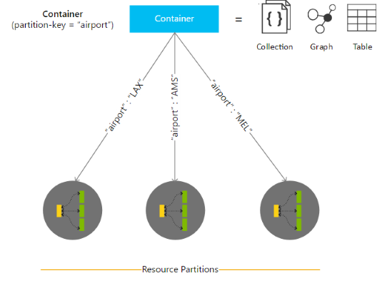

# <a name="how-to-partition-and-scale-in-azure-cosmos-db"></a>如何在 Azure Cosmos DB 中分区和缩放

[Azure Cosmos DB](https://www.azure.cn/home/features/cosmos-db/) 是一个全局分布式多模型数据库服务，旨在帮助实现快速、可预测的性能并且随着应用程序的增长无缝扩展。 本文概述了如何对 Azure Cosmos DB 中的所有数据模型分区，并介绍了如何配置 Azure Cosmos DB 容器，以便有效地缩放应用程序。

在本 Azure Friday 视频中，Scott Hanselman 和 Azure Cosmos DB 首席工程经理 Shireesh Thota 会介绍有关分区和分区键的内容。

> [!VIDEO https://channel9.msdn.com/Shows/Azure-Friday/Azure-DocumentDB-Elastic-Scale-Partitioning/player]
> 

## <a name="partitioning-in-azure-cosmos-db"></a>Azure Cosmos DB 中的分区
在 Azure Cosmos DB 中，可在任何规模以毫秒级响应时间对无架构数据进行存储和查询。 Cosmos DB 提供容器来存储称为“集合（适用于文档）、图形或表”的数据。 容器是逻辑资源，可跨一个或多个物理分区或服务器。 Cosmos DB 根据存储大小以及容器的预配吞吐量确定分区数。 Cosmos DB 中的每个分区都具有与之关联的 SSD 支持的存储且存储大小固定，可以复制分区以实现高可用性。 分区完全由 Azure Cosmos DB 进行管理，因此无需编写复杂的代码或亲自管理分区。 Cosmos DB 容器在存储和吞吐量方面没有限制。 

 

分区对应用程序是透明的。 Cosmos DB 通过对单一容器资源调用方法/API 来支持快速读取和写入、查询、事务逻辑、一致性级别和精细访问控制。 该服务处理跨分区发配数据并将查询请求路由到正确的分区。 

分区的工作原理 每个项必须有一个唯一标识自身的分区键和行键。 分区键充当数据的逻辑分区，为 Cosmos DB 提供用于跨分区分配数据的自然边界。 简单而言，Azure Cosmos DB 的分区的工作原理如下：

* 使用每秒请求数吞吐量 `T` 预配 Cosmos DB 容器
* Cosmos DB 在后台预配所需的分区来提供每秒请求数 `T`。 如果 `T` 高于每个分区的最大吞吐量 `t`，则 Cosmos DB 会预配 `N` = `T/t` 个分区
* Cosmos DB 在 `N` 个分区之间均衡分配分区键哈希的键空间。 因此，每个分区（物理分区）托管 1-N 个分区键值（逻辑分区）
* 物理分区 `p` 达到其存储限制时，Cosmos DB 会无缝地将 `p` 拆分为两个新分区 `p1` 和 `p2`，并分配大约相当于每个分区的键数一半的值。 此拆分操作对应用程序不可见。
* 同样，当预配高于 `t*N` 的吞吐量时，Cosmos DB 会拆分一个或多个分区，以支持更高的吞吐量

如下表中所示，为了与每个 API 的语义匹配，分区键的语义略有不同：

| API | 分区键 | 行键 |
| --- | --- | --- |
| DocumentDB | 自定义分区键路径 | 固定 `id` | 
| MongoDB | 自定义分片键  | 固定 `_id` | 
| Graph | 自定义分区键属性 | 固定 `id` | 
| 表 | 固定 `PartitionKey` | 固定 `RowKey` | 

Cosmos DB 使用基于哈希的分区。 写入某个项时，Cosmos DB 将对分区键值进行哈希处理，并使用经过哈希处理的结果来确定要在其中存储该项的分区。 Cosmos DB 将分区键相同的所有项存储在同一个物理分区中。 选择分区键是设计时需要做出的重要决定。 选择的属性名称必须具有范围较宽的值，并采用均匀的访问模式。

> [!NOTE]
> 采用具有大量不同值（最少几百到几千个）的分区键是最佳做法。
>

可采用“固定”或“无限制”模式创建 Azure Cosmos DB 容器。 固定大小的容器上限为 10 GB，10,000 RU/s 吞吐量。 某些 API 允许对固定大小的容器省略分区键。 若要以无限制模式创建容器，必须至少指定 2500 RU/s 的吞吐量。

## <a name="partitioning-and-provisioned-throughput"></a>分区和设置的吞吐量
Cosmos DB 旨在提供可预测的性能。 创建容器时，可以根据每秒[请求单位](../documentdb/documentdb-request-units.md) (RU) 数保留吞吐量，为每分钟 RU 数留出潜在的余量。 将为每个请求分配请求单位费用，该费用与系统资源（如操作使用的 CPU、内存和 IO）的数量成正比。 读取 1-KB 会话一致性文档将消耗一个请求单位。 无论存储的项数或同时运行的并发请求数如何，读数都为 1 RU。 较大的项要求更高的请求单位数，具体取决于大小。 如果知道实体大小及为应用程序提供支持需要的读取次数，则可以为应用程序的读取需求配置准确的吞吐量。 

> [!NOTE]
> 若要实现容器的全部吞吐量，必须选择分区键，可用于在某些不同的分区键值之间均匀分配请求。
> 
> 

## <a name="designing-for-partitioning"></a>使用 Azure Cosmos DB API
可随时使用 Azure 门户预览或 Azure CLI 创建容器并对其进行缩放。 本部分介绍了如何在每个支持的 API 中创建容器，并指定吞吐量和分区键定义。

### <a name="documentdb-api"></a>DocumentDB API
以下示例演示了如何使用 DocumentDB API 创建容器（集合）。 可以在[使用 DocumentDB API 分区](../documentdb/documentdb-partition-data.md)中找到更多详细信息。

```csharp
DocumentClient client = new DocumentClient(new Uri(endpoint), authKey);
await client.CreateDatabaseAsync(new Database { Id = "db" });

DocumentCollection myCollection = new DocumentCollection();
myCollection.Id = "coll";
myCollection.PartitionKey.Paths.Add("/deviceId");

await client.CreateDocumentCollectionAsync(
    UriFactory.CreateDatabaseUri("db"),
    myCollection,
    new RequestOptions { OfferThroughput = 20000 });
```

可以使用 REST API 中的 `GET` 方法或使用某个 SDK 中的 `ReadDocumentAsync` 读取项（文档）。

```csharp
// Read document. Needs the partition key and the ID to be specified
DeviceReading document = await client.ReadDocumentAsync<DeviceReading>(
  UriFactory.CreateDocumentUri("db", "coll", "XMS-001-FE24C"), 
  new RequestOptions { PartitionKey = new PartitionKey("XMS-0001") });
```

### <a name="mongodb-api"></a>MongoDB API
使用 MongoDB API 可以通过常用的工具、驱动程序或 SDK 创建分片集合。 此示例中将使用 Mongo Shell 创建集合。

在 Mongo Shell 中：

```
db.runCommand( { shardCollection: "admin.people", key: { region: "hashed" } } )
```

结果：

```JSON
{
    "_t" : "ShardCollectionResponse",
    "ok" : 1,
    "collectionsharded" : "admin.people"
}
```

### <a name="table-api"></a>表 API

使用表 API 可在应用程序的 appSettings 配置中为表指定吞吐量：

```xml
<configuration>
    <appSettings>
      <!--Table creation options -->
      <add key="TableThroughput" value="700"/>
    </appSettings>
</configuration>
```

然后，可以使用 Azure 表存储 SDK 创建表。 分区键隐式创建为 `PartitionKey` 值。 

```csharp
CloudTableClient tableClient = storageAccount.CreateCloudTableClient();

CloudTable table = tableClient.GetTableReference("people");
table.CreateIfNotExists();
```

可以使用以下代码片段检索单个实体：

```csharp
// Create a retrieve operation that takes a customer entity.
TableOperation retrieveOperation = TableOperation.Retrieve<CustomerEntity>("Smith", "Ben");

// Execute the retrieve operation.
TableResult retrievedResult = table.Execute(retrieveOperation);
```
有关更多详细信息，请参阅[使用表 API 进行开发](tutorial-develop-table-dotnet.md)。

### <a name="graph-api"></a>图形 API

使用图形 API 时，必须使用 Azure 门户预览或 CLI 创建容器。 由于 Azure Cosmos DB 是多模型服务，因此也可以使用其他模型之一来创建和缩放图形容器。

可以在 Gremlin 中使用分区键和 ID 读取任何顶点或边缘。 例如，对于使用区域（“USA”）作为分区键，使用“Seattle”作为行键的图形，可以使用以下语法查找顶点：

```
g.V(['USA', 'Seattle'])
```

读取边缘时也一样，可以使用分区键和行键引用边缘。

```
g.E(['USA', 'I5'])
```

有关更多详细信息，请参阅 [Cosmos DB 的 Gremlin 支持](gremlin-support.md)。

## <a name="designing-for-partitioning"></a> 设计分区
若要有效地使用 Azure Cosmos DB 进行缩放，在创建容器时需要选择适当的分区键。 在选择分区键方面有两个重要考虑因素：

* 查询和事务的边界：所选的分区键应该权衡启用事务的需求与将实体分布到多个分区键（以确保可缩放的解决方案）的需求。 在出现极端情况时，可为所有项设置相同的分区键，但这可能会限制解决方案的可扩展性。 出现另一种极端情况时，可为每个项指定唯一的分区键，这将实现高度可伸缩性，但会阻止通过存储过程和触发器跨文档事务进行使用。 理想的分区键可以使用高效查询，并具有足够多基数以确保解决方案是可缩放的。 
* 没有存储和性能瓶颈：必须选择允许将写入分布在各种相异值之间的属性。 对相同分区键的请求不能超过单个分区的吞吐量，否则会受到限制。 因此选择不会导致应用程序中“热点”的分区键很重要。 单区键的所有数据都必须存储在分区内，因此，还建议避免使用相同值具有大量数据的分区键。 

接下来看几个真实的情景，以及适合每种情景的分区键：
* 如果要实现用户配置文件后端，则用户 ID 是分区键的一个不错选择。
* 如果要存储 IoT 数据（如设备状态），则设备 ID 是分区键的一个不错选择。
* 如果正在使用 DocumentDB 记录时间序列数据，则主机名或进程 ID 是分区键的一个不错选择。
* 如果拥有多租户体系结构，则租户 ID 是分区键的一个不错选择。

在某些用例中（如 IoT 和用户配置文件），分区键可能与 ID（文档键）相同。 在其他用例（如时间序列数据）中，可能拥有与该 ID 不同的分区键。

### <a name="partitioning-and-loggingtime-series-data"></a>分区和记录/时间序列数据
Cosmos DB 最常见的用例之一是日志记录和遥测。 选取适当的分区键是很重要的，因为你可能需要读取/写入大量数据。 选择将取决于读取和写入的速率以及要运行的查询类型。 以下是有关如何选择适当分区键的一些提示。

* 如果用例涉及很长时间积累的小速率写入，并且需要按时间戳范围和其他筛选器进行查询，则使用时间戳（例如数据）汇总作为分区键是个好方法。 这使你能够查询某日单个分区中的所有数据。 
* 如果工作负荷是更常见的写入密集型，应使用不基于时间戳的分区键，使 Cosmos DB 能够跨不同分区均匀地分布写入。 此处，主机名、进程 ID、活动 ID 或其他具有较大基数的属性是不错的选择。 
* 第三种方法是混合型分区键，其中包含多个容器，每个日期/月份各有一个容器，分区键是类似主机名的粒度属性。 这样做的好处是可以基于时间窗口设置不同的吞吐量，例如，当月的容器设置为更高的吞吐量，因为它维护读取和写入操作，而之前的月份吞吐量设置为较低，因为它们只维护读取。

### <a name="partitioning-and-multi-tenancy"></a>分区和多租户
若要使用 Cosmos DB 实现多租户应用程序，可以采用两种常用模式 – 每个租户一个分区键，每个租户一个容器。 下面是每种模式的优缺点：

* 每个租户一个分区键：在此模型中，租户共置于单个容器中。 但是，可以针对单个分区执行单个租户内的项查询和插入。 可以在租户中的所有项之间实现事务逻辑。 由于多个租户共享一个容器，因此可以通过在单个容器内集中租户资源而不是为每个租户预配额外的多余空间来节约存储和吞吐量成本。 缺点是每个租户没有性能隔离。 性能/吞吐量的增加适用于整个容器，针对性增加适用于租户。
* 每个租户一个容器：每个租户都有自身的容器。 在此模型中，你可以依据租户保留性能。 Cosmos DB 采用新的预配定价模型，此模型对于拥有少量租户的多租户应用程序而言更加划算。

也可以使用组合/分层的方法来共置小型租户并将较大的租户迁移到它们自身的容器中。

## <a name="next-steps"></a>后续步骤
本文概述了有关使用任何 Azure Cosmos DB API 进行分区的概念和最佳做法。 

* 了解 [Azure Cosmos DB 中的预配吞吐量](../documentdb/documentdb-request-units.md)
* 了解 [Azure Cosmos DB 中的全局分布](../documentdb/documentdb-distribute-data-globally.md)
