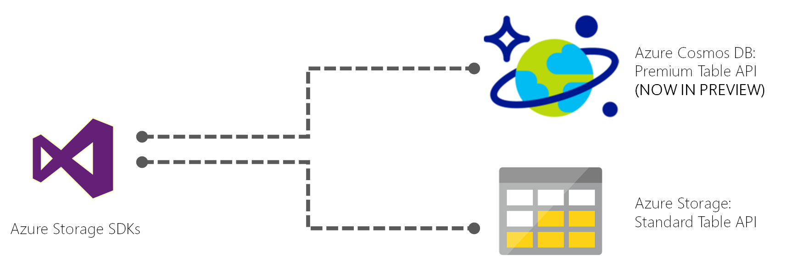

# Azure Cosmos DB：表 API 简介

[Azure Cosmos DB](introduction.md) 是 Microsoft 针对任务关键型应用程序提供的全局分布式多模型数据库服务。 Azure Cosmos DB 在全球范围内提供[统包全局分发](distribute-data-globally.md)、[吞吐量和存储的弹性扩展](partition-data.md)、99% 的情况下低至个位数的毫秒级延迟、[五个妥善定义的一致性级别](consistency-levels.md)以及得到保证的高可用性，所有这些均由[行业领先的 SLA](https://www.azure.cn/support/sla/cosmos-db/) 提供支持。 Azure Cosmos DB [自动为数据编制索引](http://www.vldb.org/pvldb/vol8/p1668-shukla.pdf)，无需客户管理架构和索引。 它采用多种模型，支持文档、键/值和列式数据模型。 

 

Azure Cosmos DB 可为需要具有灵活架构、可预测性能、全局分发和高吞吐量的键值存储的应用程序提供表 API（预览）。 表 API 提供与 Azure 表存储相同的功能，但利用 Azure Cosmos DB 引擎的优势。 

可以继续对具有高存储和低吞吐量要求的表使用 Azure 表存储。 Azure Cosmos DB 会在将来更新中引入对存储优化表的支持，并且现有和新的 Azure 表存储帐户将升级到 Azure Cosmos DB。

## 高级表 API 和标准表 API
如果当前使用 Azure 表存储，可以通过迁移到 Azure Cosmos DB 的“高级表”预览获得以下好处：

|  | Azure 表存储 | Azure Cosmos DB：表存储（预览版） |
| --- | --- | --- |
| 延迟 | 快速，但对延迟没有上限 | 读取操作和写入操作的低至个位数的毫秒级延迟（通过以下统计数据提供支持：在全球任何位置，对于任何规模，99% 的情况下读取操作的延迟 < 10 毫秒、写入操作的延迟 < 15 毫秒） |
| 吞吐量 | 高度可缩放，但没有专用吞吐量模型。 表的可伸缩性限制为 20,000 个操作/秒 | 使用 SLA 支持的[每个表专用保留吞吐量](request-units.md)实现高度可缩放。 帐户没有吞吐量上限，每个表支持 >1000 万个操作/秒 |
| 全局分发 | 具有一个可选可读辅助读取区域以实现 HA 的单一区域。 不能启动故障转移 | 从 1 个到 30 多个区域进行[统包全局分发](distribute-data-globally.md)，支持在全球各地随时[自动和手动故障转移](regional-failover.md) |
| 索引 | 仅对 PartitionKey 和 RowKey 建立主索引。 没有辅助索引 | 自动对所有属性完成编制索引，没有索引管理 |
| 查询 | 执行查询时使用主键的索引，否则进行扫描。 | 查询可以利用属性的自动索引缩短查询时间。 Azure Cosmos DB 数据库引擎能够支持聚合查询、地理空间查询和排序查询。 |
| 一致性 | 在主要区域中实现强一致性，在次要区域中实现最终一致性 | [五个定义完善的一致性级别](consistency-levels.md)可基于应用程序需要权衡可用性、延迟、吞吐量和一致性 |
| 定价 | 存储优化  | 吞吐量优化 |
| SLA | 99.9% 可用性 | 在单个区域中达到 99.99% 可用性，并能够添加更多区域以实现更高的可用性。 针对正式发布版的[行业领先综合 SLA](https://www.azure.cn/support/sla/cosmos-db/) |

## 如何入门

在 [Azure 门户](https://portal.azure.cn)中创建 Azure Cosmos DB 帐户，并通过我们的[使用 .NET 的表 API 快速入门](create-table-dotnet.md)开始使用。 

## 后续步骤

下面是一些可帮助入门的指南：
* 使用现有的 NET 表 SDK 开始使用 [Azure Cosmos DB 的表 API](create-table-dotnet.md)。
* 了解[使用 Azure Cosmos DB 进行全局分发](distribute-data-globally.md)。
* 了解 [Azure Cosmos DB 中的预配吞吐量](request-units.md)。

<!--Update_Description: wording update-->