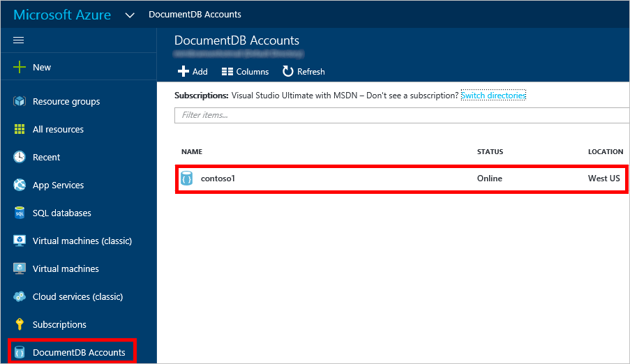
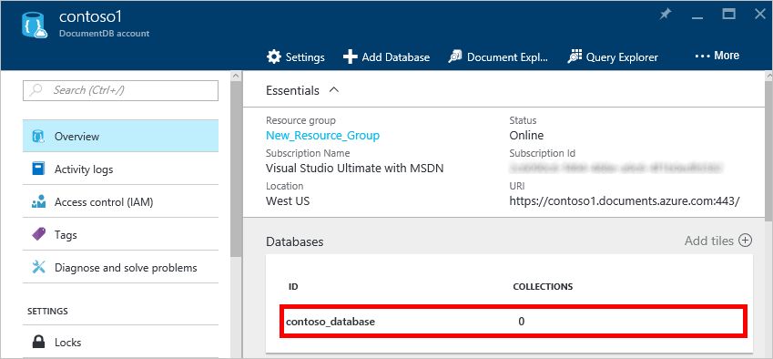
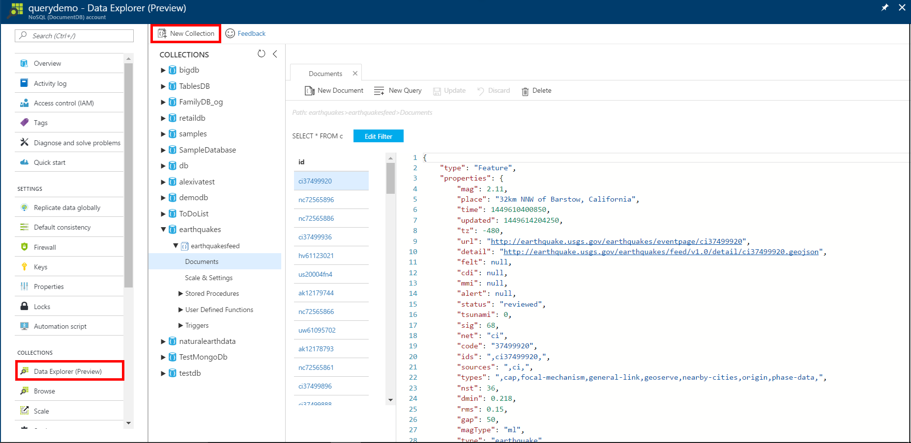

# 如何使用 Azure 门户创建 DocumentDB 集合和数据库
若要使用 DocumentDB，必须拥有 [DocumentDB 帐户](documentdb-create-account.md)、数据库、集合和文档。 本主题说明如何在 Azure 门户中创建 DocumentDB 集合。

不确定集合是什么？ 请参阅[什么是 DocumentDB 集合？](#what-is-an-azure-documentdb-collection)。

可采用两种方式在门户中创建集合：使用“添加集合”按钮，或使用[数据资源管理器（预览版）](#data-explorer)。

## 使用“添加集合”按钮创建集合

1. 在 [Azure 门户](https://portal.azure.cn/)的跳转栏中，单击“DocumentDB”，然后在“DocumentDB”边栏选项卡中，选择要添加集合的帐户。 如果没有任何列出的帐户，则需[创建一个 DocumentDB 帐户](documentdb-create-account.md)。

   

   如果跳转栏中未显示“DocumentDB”，请单击“更多服务”，再单击“DocumentDB”。 如果没有任何列出的帐户，则需[创建一个 DocumentDB 帐户](documentdb-create-account.md)。
2. 在所选帐户的“DocumentDB 帐户”边栏选项卡中，单击“添加集合”。

    
3. 在“添加集合”边栏选项卡的“集合 ID”框中，输入新集合的 ID。 `/ \ # ?` 或尾随空格。 对名称进行验证后，ID 框中会出现一个绿色的复选标记。

    
4. 为了处理已分区集合，“存储容量”默认设置为“无限”。

    如果需要[单分区集合](documentdb-partition-data.md#single-partition-and-partitioned-collections)，且吞吐量级别为 400-10,000 请求单位/秒（RU/秒），则将存储容量设置为“10 GB”。 一个 RU 相当于读取 1KB 文档的吞吐量。 有关请求单位的详细信息，请参阅[请求单位](documentdb-request-units.md)。

    如果需要可缩放的[已分区集合](documentdb-partition-data.md#single-partition-and-partitioned-collections)以处理多个分区不限容量的存储，且吞吐量级别最低可为 2,500 RU/秒，则将存储容量设置为“无限”。

    如需预配除 10 GB 或 250 GB 以外的容量，则将存储容量设置为“自定义”  。 DocumentDB 规模几近无限，因此请在支持请求中提供请求的存储大小和吞吐量值。

6. 在“分区键”框中  ，输入集合的分区键。 此项对已分区集合必需，对单区集合可选。 选择正确的分区键对于创建高性能集合而言很重要。 
7. 在“数据库”边栏选项卡中，创建新数据库或使用现有数据库。 `/ \ # ?` 或尾随空格。 若要验证名称，请单击文本框外部。 验证名称后，框中会出现一个绿色的复选标记。
8. 单击屏幕底部的“确定”，以创建新的集合。
9. 新集合现在会出现在“概览”边栏选项卡上的“集合”可重用功能区中。

    
10. **可选：**若要在门户中修改集合的吞吐量，请在“资源”菜单上单击“缩放”。

    

## 使用数据资源管理器（预览版）创建集合 

在门户中创建集合的另一方法是使用数据资源管理器。 若要打开数据资源管理器，请在门户的导航栏中单击“数据资源管理器(预览版)”，然后单击“新建集合”按钮，如以下截图所示。

 

## 什么是 DocumentDB 集合？
集合是 JSON 文档和相关联的 JavaScript 应用程序逻辑的容器。 集合是一个计费实体，其中[成本](documentdb-performance-levels.md)由集合的预配吞吐量决定。 集合可以跨一个或多个分区/服务器，并且能伸缩以处理几乎无限制增长的存储或吞吐量。

DocumentDB 通过分区方式自动将集合分配到一个或多个物理服务器中。 创建集合时，可以根据每秒的请求单位数指定预配吞吐量和分区键属性。 DocumentDB 会使用此属性的值将文档分配给分区和路由请求（例如查询）。 分区键值还可作为存储过程和触发器的事务边界。 每个集合都有该集合特定的保留吞吐量，且不会与相同帐户中的其他集合共享。 因此，你可以在存储和吞吐量方面扩大你的应用程序。

集合与关系数据库中的表不同。 集合不强制使用架构。事实上，DocumentDB 不强制使用任何架构，它是无架构的数据库。 因此，你可以在同一集合中存储具有不同架构的不同类型的文档。 你可以选择使用集合来存储单一类型的对象，就像对表所做的一样。 最佳模型仅取决于数据一起出现在查询和事务中的方式。

## 创建 DocumentDB 集合的其他方式
集合不一定要使用门户来创建，也可使用 [DocumentDB SDK](documentdb-sdk-dotnet.md) 和 REST API 来创建。

- 有关 C# 代码示例，请参阅 [C# 集合示例](documentdb-dotnet-samples.md#collection-examples)。
- 有关 Node.js 代码示例，请参阅 [Node.js 集合示例](documentdb-nodejs-samples.md#collection-examples)。
- 有关 Python 代码示例，请参阅 [Python 集合示例](documentdb-python-samples.md#collection-examples)。
- 有关 REST API 示例，请参阅 [Create a Collection](https://msdn.microsoft.com/library/azure/mt489078.aspx)（创建集合）。

## 故障排除
如果 Azure 门户中的“添加集合”被禁用，则表明你的帐户当前已被禁用，这种情况通常会在当月的所有权益信用额度都用完时发生。    

## 后续步骤
现在，你已有了集合，下一步是将文档添加或导入到集合中。 向集合添加文档时，你有以下几种选择：

- 可以使用门户中的文档资源管理器来[添加文档](documentdb-view-json-document-explorer.md)。
- 可以使用 DocumentDB 数据迁移工具来[导入文档和数据](documentdb-import-data.md)，以便导入 JSON 和 CSV 文件，以及来自 SQL Server、MongoDB、Azure 表存储和其他 DocumentDB 集合的数据。
- 也可以使用某个 [DocumentDB SDK](documentdb-sdk-dotnet.md) 来添加文档。 DocumentDB 有 .NET、Java、Python、Node.js 和 JavaScript API SDK。 有关说明如何使用 DocumentDB .NET SDK 来处理文档的 C# 代码示例，请参阅 [C# 文档示例](documentdb-dotnet-samples.md#document-examples)。 有关说明如何使用 DocumentDB Node.js SDK 来处理文档的 Node.js 代码示例，请参阅 [Node.js 文档示例](documentdb-nodejs-samples.md#document-examples)。

当集合中有文档后，可以使用门户中的[查询资源管理器](documentdb-query-collections-query-explorer.md)、[REST API](https://msdn.microsoft.com/library/azure/dn781481.aspx) 或某个 [SDK](documentdb-sdk-dotnet.md)针对文档使用 [DocumentDB SQL](documentdb-sql-query.md) [执行查询](documentdb-sql-query.md#ExecutingSqlQueries)。 

