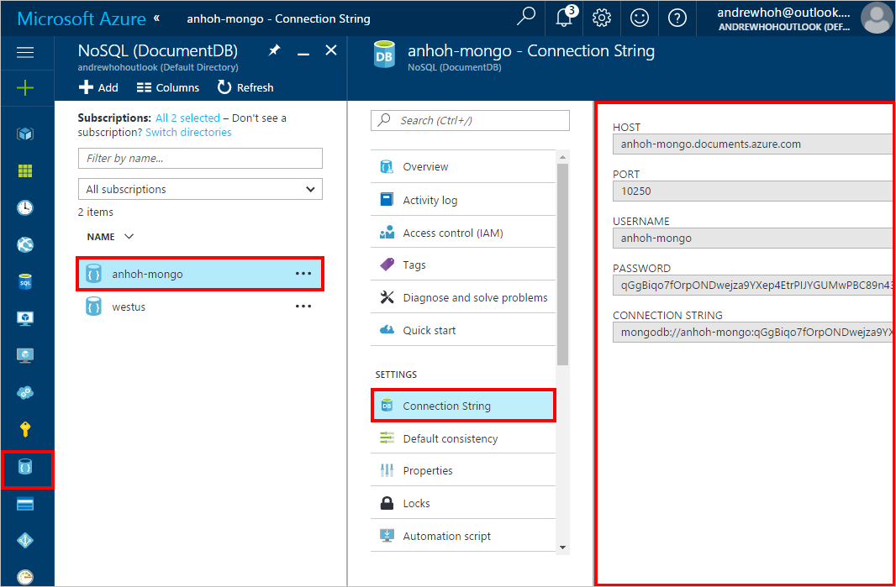

# <a name="migrate-data-to-documentdb-by-using-mongoimport-and-mongorestore"></a>使用 mongoimport 和 mongorestore 将数据迁移到 DocumentDB
> [!div class="op_single_selector"]
>- [导入到 DocumentDB](./documentdb-import-data.md)
>- [导入到 MongoDB 的 API](./documentdb-mongodb-migrate.md)

若要将数据迁移到 Azure DocumentDB：MongoDB 帐户的 API，必须：

- 从 [MongoDB 下载中心](https://www.mongodb.com/download-center)下载 *mongoimport.exe* 或 *mongorestore.exe*。
- 获取 [MongoDB 连接字符串的 DocumentDB 支持](./documentdb-connect-mongodb-account.md)。

## <a name="before-you-begin"></a>开始之前

- 增加吞吐量：数据迁移的持续时间取决于为集合设置的吞吐量。 请确保对于较大的数据迁移增加吞吐量。 完成迁移后，减少吞吐量以节约成本。 有关在 [Azure 门户](https://portal.azure.cn)中增加吞吐量的详细信息，请参阅 [DocumentDB 中的性能级别和定价层](./documentdb-performance-levels.md)。

- 启用 SSL：DocumentDB 具有严格的安全要求和标准。 请确保在与帐户进行交互时启用 SSL。 本文其余部分的步骤包括如何为 *mongoimport* 和 *mongorestore* 启用 SSL。

## <a name="find-your-connection-string-information-host-port-username-and-password"></a>查找连接字符串信息（主机、端口、用户名和密码）

1. 在 [Azure 门户](https://portal.azure.cn)的左侧窗格中，单击“NoSQL (DocumentDB)”条目。
2. 在“订阅”窗格中，选择帐户名称。
3. 在“连接字符串”边栏选项卡中，单击“连接字符串”。  
右侧窗格中包含成功连接到帐户所需的所有信息。

    

## <a name="import-data-to-api-for-mongodb-with-mongoimport"></a>使用 mongoimport 将数据导入到 MongoDB 的 API

若要将数据导入 DocumentDB 帐户，请使用以下模板执行导入。 使用特定于帐户的值填写“主机”、“用户名”和“密码”。  

模板：

```
mongoimport.exe --host <your_hostname>:10250 -u <your_username> -p <your_password> --db <your_database> --collection <your_collection> --ssl --sslAllowInvalidCertificates --type json --file C:\sample.json
```

示例：  

```
mongoimport.exe --host anhoh-host.documents.azure.com:10250 -u anhoh-host -p tkvaVkp4Nnaoirnouenrgisuner2435qwefBH0z256Na24frio34LNQasfaefarfernoimczciqisAXw== --ssl --sslAllowInvalidCertificates --db sampleDB --collection sampleColl --type json --file C:\Users\anhoh\Desktop\*.json
```

## <a name="import-data-to-api-for-mongodb-with-mongorestore"></a>使用 mongorestore 将数据导入到 MongoDB 的 API

若要将数据还原到 DocumentDB 帐户，请使用以下模板执行导入。 使用特定于帐户的值填写“主机”、“用户名”和“密码”。

模板：

```
mongorestore.exe --host <your_hostname>:10250 -u <your_username> -p <your_password> --db <your_database> --collection <your_collection> --ssl --sslAllowInvalidCertificates <path_to_backup>
```

示例：

```
mongorestore.exe --host anhoh-host.documents.azure.com:10250 -u anhoh-host -p tkvaVkp4Nnaoirnouenrgisuner2435qwefBH0z256Na24frio34LNQasfaefarfernoimczciqisAXw== --ssl --sslAllowInvalidCertificates ./dumps/dump-2016-12-07
```

## <a name="next-steps"></a>后续步骤
- 有关详细信息，请浏览 [DocumentDB：MongoDB 示例的 API](./documentdb-mongodb-samples.md)。

