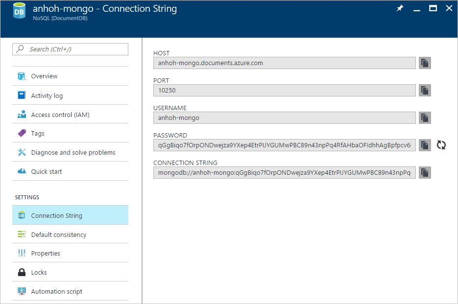
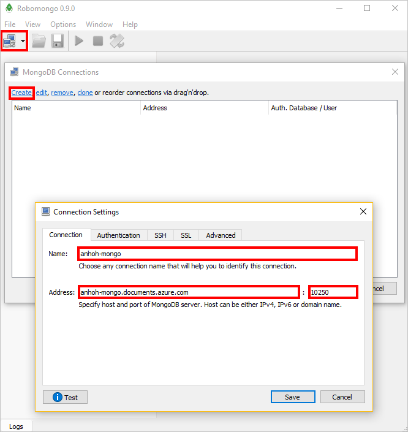
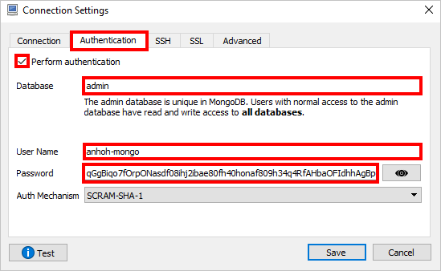

# 将 Robomongo 与 DocumentDB: API for MongoDB 帐户配合使用
若要使用 Robomongo 连接到 Azure DocumentDB: API for MongoDB 帐户，必须：

- 下载并安装 [Robomongo](https://robomongo.org/)
- 具有 DocumentDB：MongoDB 帐户的 API [连接字符串](./documentdb-connect-mongodb-account.md)信息

## 使用 Robomongo 进行连接
若要将 DocumentDB: API for MongoDB 帐户添加到 Robomongo MongoDB 连接，请执行以下步骤。

1. 使用[此处](./documentdb-connect-mongodb-account.md)的指令检索 DocumentDB: API for MongoDB 帐户连接信息。

    
2. 运行 *Robomongo.exe*

3. 单击“文件”下的“连接”按钮以管理连接。 然后，在“MongoDB 连接”窗口中单击“创建”，这会打开“连接设置”窗口。

4. 在“连接设置”窗口中，选择名称。 然后，从步骤 1 的连接信息中找到**主机**和**端口**，并将其分别输入到“地址”和“端口”中。

    
5. 在“身份验证”选项卡上，单击“执行身份验证”。 然后，输入数据库（默认值为 Admin）、**用户名**和**密码**。
**用户名**和**密码**可以在步骤 1 的连接信息中找到。

    
6. 在“SSL”选项卡上，选中“使用 SSL 协议”，然后将“身份验证方法”更改为“自签名证书”。

    
7. 最后，单击“测试”验证是否能够连接，然后单击“保存”。

## 后续步骤
- 浏览 MongoDB [示例](./documentdb-mongodb-samples.md)的 DocumentDB: API。

