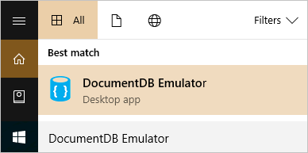
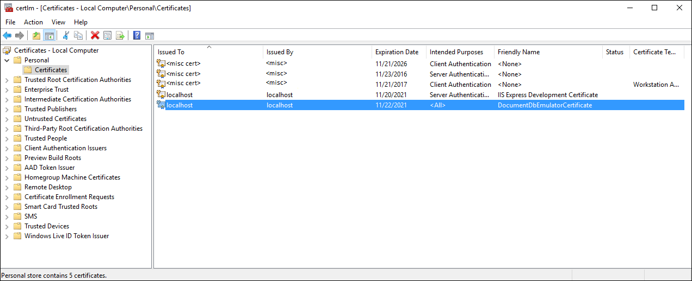

<a id="use-the-documentdb-emulator-for-local-development-and-testing" class="xliff"></a>

# 将 DocumentDB 模拟器用于本地开发和测试

<table>
<tr>
  <td><strong>二进制文件</strong></td>
  <td>[下载 MSI](https://aka.ms/documentdb-emulator)</td>
</tr>
<tr>
  <td><strong>Docker</strong></td>
  <td>[Docker 中心](https://hub.docker.com/r/microsoft/azure-documentdb-emulator/)</td>
</tr>
<tr>
  <td><strong>Docker 源</strong></td>
  <td>[Github](https://github.com/azure/azure-documentdb-emulator-docker)</td>
</tr>
</table>
  
为方便进行开发，DocumentDB 模拟器提供了一个模拟 DocumentDB 服务的本地环境。 使用 DocumentDB 模拟器，可以在本地开发并测试应用程序，而无需创建 Azure 订阅且不会产生任何费用。 如果对应用程序在 DocumentDB 模拟器中的工作情况感到满意，则可以切换到在云中使用 DocumentDB 帐户。

本文涵盖以下任务： 

> [!div class="checklist"]
> * 安装模拟器
> * 在适用于 Windows 的 Docker 上运行模拟器
> * 对请求进行身份验证
> * 在模拟器中使用数据资源管理器
> * 导出 SSL 证书
> * 从命令行调用模拟器
> * 收集跟踪文件

<a id="system-requirements" class="xliff"></a>

## 系统要求
DocumentDB 模拟器具有以下硬件和软件要求：

- 软件要求
  - Windows Server 2012 R2、Windows Server 2016 或 Windows 10
*   最低硬件要求
  * 2 GB RAM
  * 10 GB 可用硬盘空间

<a id="installation" class="xliff"></a>

## 安装
可以从 [Microsoft 下载中心](https://aka.ms/documentdb-emulator)下载并安装 DocumentDB 模拟器。 

> [!NOTE]
> 若要安装、配置和运行 DocumentDB 模拟器，必须在计算机上具有管理权限。

<a id="running-on-docker-for-windows" class="xliff"></a>

## 在用于 Windows 的 Docker 上运行

可以在用于 Windows 的 Docker 上运行 DocumentDB 模拟器。 该模拟器不适合于用于 Oracle Linux 的 Docker。

安装了[用于 Windows 的 Docker](https://www.docker.com/docker-windows) 之后，可以通过从喜爱的 shell（cmd.exe、PowerShell 等）运行以下命令，从 Docker 中心请求模拟器映像。

```      
docker pull microsoft/azure-documentdb-emulator 
```
若要启动映像，请运行以下命令。

``` 
md %LOCALAPPDATA%\DocumentDBEmulatorCert 2>nul
docker run -v %LOCALAPPDATA%\DocumentDBEmulatorCert:c:\DocumentDBEmulator\DocumentDBEmulatorCert -P -t -i mominag/documentdb_emulator
```

响应类似于以下内容：

```
Starting Emulator
Emulator Endpoint: https://172.20.229.193:8081/
Master Key: C2y6yDjf5/R+ob0N8A7Cgv30VRDJIWEHLM+4QDU5DE2nQ9nDuVTqobD4b8mGGyPMbIZnqyMsEcaGQy67XIw/Jw==
Exporting SSL Certificate
You can import the SSL certificate from an administrator command prompt on the host by running:
cd /d %LOCALAPPDATA%\DocumentDBEmulatorCert
powershell .\importcert.ps1
--------------------------------------------------------------------------------------------------
Starting interactive shell
``` 

在模拟器启动之后便关闭交互式 shell 会关闭模拟器的容器。

在客户端中使用来自响应的终结点和主密钥，并将 SSL 证书导入到主机中。 若要导入 SSL 证书，请从管理员命令提示符执行以下操作：

```
cd %LOCALAPPDATA%\DocumentDBEmulatorCert
powershell .\importcert.ps1
```

<a id="checking-for-updates" class="xliff"></a>

## 检查更新
DocumentDB 模拟器包括一个内置 DocumentDB 数据资源管理器，用于浏览存储在 DocumentDB 中的数据、创建新集合，并在新的更新可供下载时通知用户。 

> [!NOTE]
> 在 DocumentDB 模拟器的一个版本中创建的数据不保证在使用不同版本时可以访问。 如果需要长期保存数据，建议将该数据存储在 DocumentDB 帐户中，而不是存储在 DocumentDB 模拟器中。 

<a id="how-the-emulator-works" class="xliff"></a>

## 模拟器的工作原理
DocumentDB 模拟器提供对 DocumentDB 服务的高保真模拟。 它支持和 DocumentDB 相同的功能，包括支持创建和查询 JSON 文档、预配集合和调整集合的规模，以及执行存储过程和触发器。 可以使用 DocumentDB 模拟器开发和测试应用程序，并通过对 DocumentDB 的连接终结点进行单一配置更改将其部署到全局范围的 Azure。

虽然创建了实际 DocumentDB 服务的高保真本地模拟，但是 DocumentDB 模拟器的实现不同于该服务。 例如，DocumentDB 模拟器针对持久性使用标准 OS 组件（如本地文件系统），针对连接性使用 HTTPS 协议堆栈。 这意味着，不可通过 DocumentDB 模拟器使用某些依赖于 Azure 基础结构的功能，如全局复制、读/写的单位数毫秒延迟，以及可调整的一致性级别。


<a id="authenticating-requests" class="xliff"></a>

## 对请求进行身份验证
与云中的 Azure 文档一样，针对 DocumentDB 模拟器的每个请求都必须进行身份验证。 DocumentDB 模拟器使用一个固定的帐户和公开的身份验证密钥进行主密钥身份验证。 此帐户和密钥是允许用于 DocumentDB 模拟器的唯一凭据。 它们具有以下特点：

    Account name: localhost:<port>
    Account key: C2y6yDjf5/R+ob0N8A7Cgv30VRDJIWEHLM+4QDU5DE2nQ9nDuVTqobD4b8mGGyPMbIZnqyMsEcaGQy67XIw/Jw==

> [!NOTE]
> DocumentDB 模拟器支持的主密钥仅用于模拟器。 不能在 DocumentDB 模拟器中使用生产 DocumentDB 帐户和密钥。 

此外，与 DocumentDB 服务一样，DocumentDB 模拟器仅支持采用 SSL 的安全通信。

<a id="start-and-initialize-the-emulator" class="xliff"></a>

## 启动和初始化模拟器

若要启动 DocumentDB 模拟器，请选择“启动”按钮或按 Windows 键。 开始键入**DocumentDB 模拟器**，然后从应用程序列表中选择该模拟器。 



运行模拟器时，在 Windows 任务栏通知区域中会显示一个图标。 默认情况下 DocumentDB 模拟器在本地计算机（“localhost”）上运行，侦听端口 8081。


默认情况下，DocumentDB 模拟器安装到 `C:\Program Files\DocumentDB Emulator` 目录。 你还可以从命令行启动和停止模拟器。 有关详细信息，请参阅[命令行工具参考](#command-line)。

<a id="start-data-explorer" class="xliff"></a>

## 启动数据资源管理器

DocumentDB 模拟器启动时，会自动在浏览器中打开 DocumentDB 数据资源管理器。 地址将显示为 https://localhost:8081/_explorer/index.html。 如果关闭浏览器并想要稍后重新打开，可在浏览器中打开 URL 或从 Windows 任务栏图标中的 DocumentDB 模拟器中启动，如下所示。


<a id="developing-with-the-emulator" class="xliff"></a>

## 通过模拟器进行开发
在桌面上运行 DocumentDB 模拟器以后，可以使用任何支持的 [DocumentDB SDK](documentdb-sdk-dotnet.md) 或 [DocumentDB REST API](https://msdn.microsoft.com/library/azure/dn781481.aspx) 与模拟器进行交互。 DocumentDB 模拟器还包括内置数据资源管理器，可以利用它在不编写任何代码的情况下创建集合、查看和编辑文档。 

    // Connect to the DocumentDB Emulator running locally
    DocumentClient client = new DocumentClient(
        new Uri("https://localhost:8081"), 
        "C2y6yDjf5/R+ob0N8A7Cgv30VRDJIWEHLM+4QDU5DE2nQ9nDuVTqobD4b8mGGyPMbIZnqyMsEcaGQy67XIw/Jw==");

如果使用 [DocumentDB 的 MongoDB 协议支持](documentdb-protocol-mongodb.md)，请使用以下连接字符串：

    mongodb://localhost:C2y6yDjf5/R+ob0N8A7Cgv30VRDJIWEHLM+4QDU5DE2nQ9nDuVTqobD4b8mGGyPMbIZnqyMsEcaGQy67XIw/Jw==@localhost:10250/admin?ssl=true&3t.sslSelfSignedCerts=true

可以使用现有工具如 [DocumentDB Studio](https://github.com/mingaliu/DocumentDBStudio) 连接到 DocumentDB 模拟器。 用户还可以使用 [DocumentDB 数据迁移工具](https://github.com/azure/azure-documentdb-datamigrationtool)在 DocumentDB 模拟器和 DocumentDB 服务之间迁移数据。

默认情况下，使用 DocumentDB 模拟器，可创建多达 25 个单区集合或 1 个已分区集合。 有关如何更改此值的详细信息，请参阅[设置 PartitionCount 值](#set-partitioncount)。

<a id="export-the-ssl-certificate" class="xliff"></a>

## 导出 SSL 证书

.NET 语言和运行时使用 Windows 证书存储来安全地连接到 DocumentDB 本地模拟器。 其他语言有自己管理和使用证书方法。 Java 使用自己的[证书存储](https://docs.oracle.com/cd/E19830-01/819-4712/ablqw/index.html)，而 Python 使用[套接字包装器](https://docs.python.org/2/library/ssl.html)。

为了获得用于语言和运行时（未与 Windows 证书存储集成）的证书，需要通过 Windows 证书管理器将其导出。 可通过运行 certlm.msc 进行启动，也可按照[导出 DocumentDB 模拟器证书](./documentdb-nosql-local-emulator-export-ssl-certificates.md)中的分步说明进行操作。 证书管理器开始运行后，打开个人证书（如下所示），并将友好名称为“DocumentDBEmulatorCertificate”的证书导出为 BASE-64 编码的 X.509 (.cer) 文件。



可按照[将证书添加到 Java CA 证书存储](../java-add-certificate-ca-store.md)中的说明，将 X.509 证书导入 Java 证书存储。 证书导入 cacerts 存储后，Java 和 MongoDB 应用程序即能够连接到 DocumentDB 模拟器。

从 Python 和 Node.js SDK 连接到模拟器时，将禁用 SSL 验证。

## <a id="command-line"></a>命令行工具参考
从安装位置中，可以使用命令行启动和停止模拟器、配置选项和执行其他操作。

<a id="command-line-syntax" class="xliff"></a>

### 命令行语法

    DocumentDB.Emulator.exe [/Shutdown] [/DataPath] [/Port] [/MongoPort] [/DirectPorts] [/Key] [/EnableRateLimiting] [/DisableRateLimiting] [/NoUI] [/NoExplorer] [/?]

若要查看选项列表，请在命令提示符下键入 `DocumentDB.Emulator.exe /?`。

<table>
<tr>
  <td><strong>选项</strong></td>
  <td><strong>说明</strong></td>
  <td><strong>命令</strong></td>
  <td><strong>参数</strong></td>
</tr>
<tr>
  <td>[无参数]</td>
  <td>使用默认设置启动 DocumentDB 模拟器。</td>
  <td>DocumentDB.Emulator.exe</td>
  <td></td>
</tr>
<tr>
  <td>[帮助]</td>
  <td>显示支持的命令行参数的列表。</td>
  <td>DocumentDB.Emulator.exe /?</td>
  <td></td>
</tr>
<tr>
  <td>Shutdown</td>
  <td>关闭 DocumentDB 模拟器。</td>
  <td>DocumentDB.Emulator.exe /Shutdown</td>
  <td></td>
</tr>
<tr>
  <td>DataPath</td>
  <td>指定要在其中存储数据文件的路径。 默认路径为 %LocalAppdata%\DocumentDBEmulator。</td>
  <td>DocumentDB.Emulator.exe /DataPath=&lt;datapath&gt;</td>
  <td>&lt;datapath&gt;：可访问的路径</td>
</tr>
<tr>
  <td>端口</td>
  <td>指定用于模拟器的端口号。  默认值为 8081。</td>
  <td>DocumentDB.Emulator.exe /Port=&lt;port&gt;</td>
  <td>&lt;port&gt;：单个端口号</td>
</tr>
<tr>
  <td>MongoPort</td>
  <td>指定用于 MongoDB 兼容性 API 的端口号。 默认值为 10250。</td>
  <td>DocumentDB.Emulator.exe /MongoPort=&lt;mongoport&gt;</td>
  <td>&lt;mongoport&gt;：单个端口号</td>
</tr>
<tr>
  <td>DirectPorts</td>
  <td>指定用于直接连接的端口。 默认值为 10251、10252、10253、10254。</td>
  <td>DocumentDB.Emulator.exe /DirectPorts：&lt;directports&gt;</td>
  <td>&lt;directports&gt;：以逗号分隔的 4 个端口的列表</td>
</tr>
<tr>
  <td>键</td>
  <td>模拟器的授权密钥。 密钥必须是 64 字节向量的 base 64 编码。</td>
  <td>DocumentDB.Emulator.exe /Key：&lt;key&gt;</td>
  <td>&lt;key&gt;：密钥必须是 64 字节向量的 base 64 编码</td>
</tr>
<tr>
  <td>EnableRateLimiting</td>
  <td>指定启用请求速率限制行为。</td>
  <td>DocumentDB.Emulator.exe /EnableRateLimiting</td>
  <td></td>
</tr>
<tr>
  <td>DisableRateLimiting</td>
  <td>指定禁用请求速率限制行为。</td>
  <td>DocumentDB.Emulator.exe /DisableRateLimiting</td>
  <td></td>
</tr>
<tr>
  <td>NoUI</td>
  <td>不显示模拟器用户界面。</td>
  <td>DocumentDB.Emulator.exe /NoUI</td>
  <td></td>
</tr>
<tr>
  <td>NoExplorer</td>
  <td>不在启动时显示文档资源管理器。</td>
  <td>DocumentDB.Emulator.exe /NoExplorer</td>
  <td></td>
</tr>
<tr>
  <td>PartitionCount</td>
  <td>指定已分区的集合的最大数。 有关详细信息，请参阅[更改集合数](#set-partitioncount)。</td>
  <td>DocumentDB.Emulator.exe /PartitionCount=&lt;partitioncount&gt;</td>
  <td>&lt;partitioncount&gt;：允许的单分区集合的最大数量。 默认值为 25。 允许的最大值为 250。</td>
</tr>
</table>

<a id="differences-between-the-documentdb-emulator-and-documentdb" class="xliff"></a>

## DocumentDB 模拟器与 DocumentDB 之间的差异 
由于 DocumentDB 模拟器提供在本地开发人员工作站上运行的模拟环境，因此模拟器与云中的 DocumentDB 帐户之间的功能存在一些差异：

- DocumentDB 模拟器只支持一个固定的帐户和公开的主密钥。  在 DocumentDB 模拟器中无法重新生成密钥。
- DocumentDB 模拟器不是可扩展的服务，并且不支持大量集合。
- DocumentDB 模拟器不模拟不同的 [DocumentDB 一致性级别](documentdb-consistency-levels.md)。
- DocumentDB 模拟器不模拟[多区域复制](documentdb-distribute-data-globally.md)。
- DocumentDB 模拟器不支持服务配额替代，而 DocumentDB 服务支持（例如文档大小限制、增加的分区集合存储）。
- 由于 DocumentDB 模拟器副本不一定能反映 DocumentDB 服务的最新更改，因此请使用 [DocumentDB Capacity Planner](https://www.documentdb.com/capacityplanner) 准确估计应用程序的生产吞吐量 (RU) 需求。

## <a id="set-partitioncount"></a> 更改集合数

默认情况下，使用 DocumentDB 模拟器，可创建多达 25 个单分区集合或 1 个已分区集合。 通过修改 **PartitionCount** 值，可以创建最多 250 个单分区集合或 10 个已分区集合，或两者的任意组合（不得超过 250 个单分区，其中 1 个已分区集合 = 25 个单分区集合）。

如果在已超过当前分区计数后尝试创建集合，则模拟器将引发 ServiceUnavailable 异常，并收到以下消息。

    Sorry, we are currently experiencing high demand in this region, 
    and cannot fulfill your request at this time. We work continuously 
    to bring more and more capacity online, and encourage you to try again. 
    Please do not hesitate to email docdbswat@microsoft.com at any time or 
    for any reason. ActivityId: 29da65cc-fba1-45f9-b82c-bf01d78a1f91

若要更改 DocumentDB 模拟器可用的集合数，请执行以下操作：

1. 通过在系统任务栏上右键单击“DocumentDB 模拟器”图标，然后单击“重置数据...”，删除所有本地 DocumentDB 模拟器数据。
2. 删除文件夹 C:\Users\user_name\AppData\Local\DocumentDBEmulator 中的所有模拟器数据。
3. 通过在系统任务栏上右键单击“DocumentDB 模拟器”图标，然后单击“退出”，退出所有打开的实例。 退出所有实例可能需要一分钟。
4. 安装最新版本的 [DocumentDB 模拟器](https://aka.ms/documentdb-emulator)。
5. 通过设置一个 <= 250 的值启动具有 PartitionCount 标志的模拟器。 例如：`C:\Program Files\DocumentDB Emulator>DocumentDB.Emulator.exe /PartitionCount=100`。

<a id="troubleshooting" class="xliff"></a>

## 故障排除

使用以下提示来帮助解决使用 DocumentDB 模拟器时遇到的问题：

- 如果 DocumentDB 模拟器崩溃，请从 c:\Users\user_name\AppData\Local\CrashDumps 文件夹收集转储文件、进行压缩并将其附加到电子邮件，发送至 [askdocdb@microsoft.com](mailto:askdocdb@microsoft.com)。

- 如果在 DocumentDB.StartupEntryPoint.exe 中遇到崩溃，请从管理员命令提示符运行以下命令：`lodctr /R` 

- 如果遇到连接问题，请[收集跟踪文件](#trace-files)、进行压缩并将其附加到电子邮件，发送至 [askdocdb@microsoft.com](mailto:askdocdb@microsoft.com)。

### <a id="trace-files"></a>收集跟踪文件

若要收集调试跟踪，请在管理命令提示符下运行以下命令：

1. `cd /d "%ProgramFiles%\DocumentDB Emulator"`
2. `DocumentDB.Emulator.exe /shutdown`。 监视系统任务栏，确保该程序已关闭，这可能需要一分钟时间。 也可以直接在 DocumentDB 模拟器用户界面中单击“退出”  。
3. `DocumentDB.Emulator.exe /starttraces`
4. `DocumentDB.Emulator.exe`
5. 再现问题。 如果数据资源管理器无法运行，只需等待几秒钟，待浏览器打开以捕获错误。
5. `DocumentDB.Emulator.exe /stoptraces`
6. 导航到 `%ProgramFiles%\DocumentDB Emulator`，查找 docdbemulator_000001.etl 文件。
7. 将 .etl 文件和重现步骤一起发送至 [askdocdb@microsoft.com](mailto:askdocdb@microsoft.com) 进行调试。

<a id="next-steps" class="xliff"></a>

## 后续步骤

在本教程中已完成以下操作：

> [!div class="checklist"]
> * 安装本地模拟器
> * 在适用于 Windows 的 Docker 上运行模拟器
> * 经过身份验证的请求
> * 在模拟器中使用数据资源管理器
> * 导出 SSL 证书
> * 从命令行调用模拟器
> * 收集跟踪文件

在本教程中，你已了解如何使用本地模拟器进行免费的本地开发。 现在可以继续学习下一教程，了解如何导出模拟器 SSL 证书。 

> [!div class="nextstepaction"]
> [导出 DocumentDB 模拟器证书](documentdb-nosql-local-emulator-export-ssl-certificates.md)

