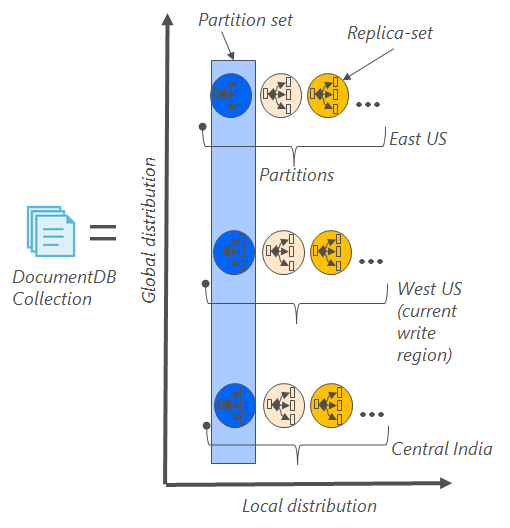

# 使用 Azure Cosmos DB 进行自动联机备份和还原
Azure Cosmos DB 可以定期自动备份所有数据。 自动备份不会影响数据库操作的性能或可用性。 所有备份单独存储在另一个存储服务中并在全球复制，针对区域性的灾难提供复原能力。 假设你不小心删除了 Cosmos DB 容器，事后需要用到数据恢复或灾难恢复解决方案，此时，自动备份便可派上用场。  

本文首先快速回顾一个 Cosmos DB 的数据冗余和可用性，然后介绍备份。 

## Cosmos DB 的高可用性 - 回顾
Cosmos DB 旨在实现数据[全局分布](documentdb-distribute-data-globally.md) - 它允许缩放多个 Azure 区域中的吞吐量，并提供策略驱动的故障转移和透明的多宿主 API。 由于数据库系统提供 99.99% 的可用性 SLA，Cosmos DB 中的所有写入内容在客户端中确认之前，将根据本地数据中心内的副本仲裁持续提交到本地磁盘。 请注意，Cosmos DB 的高可用性依赖于本地存储，而不依赖于任何外部存储技术。 此外，如果数据库帐户与多个 Azure 区域关联，则还会将写入内容复制到其他区域。 若要在低延迟状态下缩放吞吐量和访问数据，可以根据需要将任意数量的读取区域与数据库帐户相关联。 在每个读取区域中，（复制的）数据持久保存在副本集中。  

如下图所示，单个 Cosmos DB 容器是[水平分区](documentdb-partition-data.md)的。 下图中的一个圆圈表示一个“分区”，每个分区通过副本集实现高可用性。 这是单个 Azure 区域中的本地分布（以 X 轴表示）。 此外，每个分区（及其相应的副本集）在与数据库帐户关联的多个区域中进行全局分布。 “分区集”是全局分布的实体，由数据在每个区域中的多个副本组成（以 Y 轴表示）。 可以向数据库帐户关联的区域分配优先级，发生灾难时，Cosmos DB 将以透明方式故障转移到下一个区域。 还可以手动模拟故障转移，以测试应用程序的端到端可用性。  

下图演示了 Cosmos DB 的高度冗余。

## 完整的自动化联机备份
糟糕，我不小心删除了容器或数据库！ 使用 Cosmos DB，不仅仅是数据，还有数据备份都能获得高度冗余，可以弹性应对区域性的灾难。 目前，执行这些自动化备份的时间间隔约为 4 小时，并且始终会存储最新的 2 次备份。 如果数据意外删除或损坏，请在 8 小时内 [联系 Azure 支持人员](/support/contact/) 。 

这些备份不会影响数据库操作的性能或可用性。 Cosmos DB 在后台创建备份，不使用预配的 RU，不影响性能，也不影响数据库的可用性。 

不同于存储在 Cosmos DB 中的数据，自动备份存储在 Azure Blob 存储服务中。 为了保证低延迟/高效上载，备份快照将上载到某个 Azure Blob 存储实例，该实例位于 Cosmos DB 数据库帐户当前写入区域所在的同一个区域。 此外，为了弹性应对区域性灾难，还会通过异地冗余存储 (GRS) 将 Azure Blob 存储中的每个备份数据快照复制到另一个区域。 下图显示整个 Cosmos DB 容器（在本示例中为中国北部的所有三个主分区）已在中国北部的远程 Azure Blob 存储帐户中备份，然后通过 GRS 复制到中国东部。 

下图演示了 GRS Azure 存储中所有 Cosmos DB 实体的定期完整备份。

## 给定快照的保留期
如上所述，我们会根据法规要求定期创建数据快照并将最新快照保留长达 90 天，到期后将其清除。 如果容器或帐户被删除，Cosmos DB 会将最新备份存储 90 天。

## 从联机备份还原数据库
如果意外删除了数据，可以[提交支持票证](https://portal.azure.cn/?#blade/Microsoft_Azure_Support/HelpAndSupportBlade)或[联系 Azure 支持](/support/contact/)，从上一次自动备份中还原数据。 若要还原特定的备份快照，Cosmos DB 要求相应数据至少在该快照的备份周期持续时间之内。

## 后续步骤

若要在多个数据中心复制数据库，请参阅[使用 Cosmos DB 全局分配数据](documentdb-distribute-data-globally.md)。 

若要联系 Azure 支持，请 [从 Azure 门户开具票证](https://portal.azure.cn/?#blade/Microsoft_Azure_Support/HelpAndSupportBlade)。

