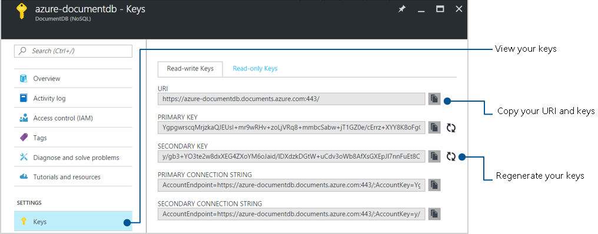

# 保护对 DocumentDB 数据的访问
<a id="securing-access-to-documentdb-data" class="xliff"></a>
本文概述了如何保护对存储在 [DocumentDB](https://www.azure.cn/home/features/documentdb/) 中的数据的访问。

DocumentDB 使用两种类型的密钥来验证用户身份并提供其数据和资源的访问权限。 

|密钥类型|资源|
|---|---|
|[主密钥](#master-keys) |用于管理资源：数据库帐户、数据库、用户和权限|
|[资源令牌](#resource-tokens)|用于应用程序资源：集合、文档、附件、存储过程、触发器和 UDF|

## 主密钥 <a id="master-keys"></a>

主密钥提供对数据库帐户中所有管理资源的访问权限。 主密钥：  
- 提供对帐户、数据库、用户和权限的访问权限。 
- 无法用于提供对集合和文档的精细访问权限。
- 在创建帐户过程中创建。
- 随时可重新生成。

每个帐户包括两个主密钥：主要密钥和辅助密钥。 使用两个密钥的目的是为了能够重新生成或轮换密钥，从而可以持续访问帐户和数据。 

DocumentDB 帐户除了有两个主密钥以外，还有两个只读密钥。 这些只读密钥只允许针对帐户执行读取操作。 只读密钥不提供对资源的读取权限。

可以使用 Azure 门户检索和重新生成主要、辅助、只读和读写主密钥。 有关说明，请参阅[查看、复制和重新生成访问密钥](documentdb-manage-account.md#a-idkeysaview-copy-and-regenerate-access-keys)。



轮换主密钥的过程相当简单。 导航到 Azure 门户并检索你的辅助密钥，在应用程序中将主要密钥替换为该辅助密钥，然后在 Azure 门户中轮换主要密钥即可。


### 有关使用主密钥的代码示例
<a id="code-sample-to-use-a-master-key" class="xliff"></a>

以下代码示例演示如何使用 DocumentDB 帐户终结点和主密钥来实例化 DocumentClient 并创建数据库。 

```csharp
//Read the DocumentDB endpointUrl and authorization keys from config.
//These values are available from the Azure portal on the DocumentDB account blade under "Keys".
//NB > Keep these values in a safe and secure location. Together they provide Administrative access to your DocDB account.

private static readonly string endpointUrl = ConfigurationManager.AppSettings["EndPointUrl"];
private static readonly SecureString authorizationKey = ToSecureString(ConfigurationManager.AppSettings["AuthorizationKey"]);

client = new DocumentClient(new Uri(endpointUrl), authorizationKey);

// Create Database
Database database = await client.CreateDatabaseAsync(
    new Database
    {
        Id = databaseName
    });
```

## 资源令牌 <a name="resource-tokens"></a>

资源令牌提供对数据库中应用程序资源的访问权限。 资源令牌：
- 提供对特定集合、分区键、文档、附件、存储过程、触发器和 UDF 的访问权限。
- 向[用户](#users)授予对特定资源的[权限](#permissions)时创建。
- 通过 POST、GET 或 PUT 调用操作权限资源时重新创建。
- 使用专门针对用户、资源和权限构造的哈希资源令牌。
- 生存期受到可自定义的有效期的约束。 默认的有效期限为一小时。 但是，可将令牌生存期显式指定为最长五个小时。
- 可以安全替代主密钥。 
- 使客户端能够根据它们的权限读取、写入和删除 DocumentDB 帐户中的资源。

如果想要为不能通过主密钥得到信任的客户端提供对 DocumentDB 帐户中资源的访问权限，你可以使用资源令牌（通过创建 DocumentDB 用户和权限）。  

DocumentDB 资源令牌提供一种安全的替代方案，使客户端能够根据授予的权限读取、写入和删除 DocumentDB 帐户中的资源，而无需主密钥或只读密钥。

以下是典型的设计模式，通过它可以请求、生成资源令牌并将其提供给客户端：

1. 设置中间层服务，以用于移动应用程序共享用户照片。 
2. 中间层服务拥有 DocumentDB 帐户的主密钥。
3. 照片应用安装在最终用户移动设备上。 
4. 登录时，照片应用使用中间层服务建立用户的标识。 这种标识建立机制完全由应用程序决定。
5. 一旦建立标识，中间层服务就会基于标识请求权限。
6. 中间层服务将资源令牌发送回手机应用。
7. 手机应用可以继续使用该资源令牌以该资源令牌定义的权限按照该资源令牌允许的间隔直接访问 DocumentDB 资源。 
8. 资源令牌到期后，后续请求将收到 401 未经授权的异常。  此时，手机应用会重新建立标识，并请求新的资源令牌。

    

资源令牌的生成和管理由本机 DocumentDB 客户端库处理；但是，如果使用 REST，必须构造请求/身份验证标头。 有关为 REST 创建身份验证标头的详细信息，请参阅 [DocumentDB 资源的访问控制](https://docs.microsoft.com/rest/api/documentdb/access-control-on-documentdb-resources)或 [SDK 源代码](https://github.com/Azure/azure-documentdb-node/blob/master/source/lib/auth.js)。

有关用于生成或代理资源令牌的中间层服务的示例，请参阅 [ResourceTokenBroker 应用](https://github.com/Azure/azure-documentdb-dotnet/tree/master/samples/xamarin/UserItems/ResourceTokenBroker/ResourceTokenBroker/Controllers)。

## 用户 <a name="users"></a>
DocumentDB 用户与 DocumentDB 数据库关联。  每个数据库可以包含零个或多个 DocumentDB 用户。  以下代码示例演示如何创建 DocumentDB 用户资源。

```csharp
//Create a user.
User docUser = new User
{
    Id = "mobileuser"
};

docUser = await client.CreateUserAsync(UriFactory.CreateDatabaseUri("db"), docUser);
```

> [!NOTE]
> 每个 DocumentDB 用户具有 PermissionsLink 属性，该属性可用于检索与该用户关联的[权限](#permissions)的列表。
> 
> 

## 权限 <a name="permissions"></a>
DocumentDB 权限资源与 DocumentDB 用户关联。  每个用户可能包含零个或多个 DocumentDB 权限。  权限资源提供对用户在尝试访问某个特定应用程序资源时需要的安全令牌的访问权限。
权限资源提供两种可用的访问级别：

- 所有：用户对资源拥有完全权限。
- 只读：用户只能读取资源的内容，但无法对资源执行写入、更新或删除操作。

> [!NOTE]
> 为了运行 DocumentDB 存储过程，用户必须具有对存储过程将在其中运行的集合的所有权限。
> 
> 

### 有关创建权限的代码示例
<a id="code-sample-to-create-permission" class="xliff"></a>

以下代码示例演示如何创建权限资源、读取权限资源的资源令牌以及将权限与上面创建的[用户](#users)关联。

```csharp
// Create a permission.
Permission docPermission = new Permission
{
    PermissionMode = PermissionMode.Read,
    ResourceLink = documentCollection.SelfLink,
    Id = "readperm"
};
  
docPermission = await client.CreatePermissionAsync(UriFactory.CreateUserUri("db", "user"), docPermission);
Console.WriteLine(docPermission.Id + " has token of: " + docPermission.Token);
```

如果为集合指定了分区键，则除 ResourceLink 以外，集合、文档和附件资源的权限，还必须包含 ResourcePartitionKey。

### 有关读取用户权限的代码示例
<a id="code-sample-to-read-permissions-for-user" class="xliff"></a>

为了方便地获取与特定用户关联的所有权限资源，DocumentDB 使权限源对每个用户对象均可用。  下面的代码片段演示如何检索与上面创建的用户关联的权限、构造权限列表以及代表用户实例化新 DocumentClient。

```csharp
//Read a permission feed.
FeedResponse<Permission> permFeed = await client.ReadPermissionFeedAsync(
  UriFactory.CreateUserUri("db", "myUser"));
 List<Permission> permList = new List<Permission>();

foreach (Permission perm in permFeed)
{
    permList.Add(perm);
}

DocumentClient userClient = new DocumentClient(new Uri(endpointUrl), permList);
```

## 后续步骤
<a id="next-steps" class="xliff"></a>
- 若要详细了解 DocumentDB 数据库安全性，请参阅 [DocumentDB：数据库安全性](documentdb-nosql-database-security.md)。
- 若要了解如何管理主密钥和只读密钥，请参阅[如何管理 DocumentDB 帐户](documentdb-manage-account.md#a-idkeysaview-copy-and-regenerate-access-keys)。
- 若要了解如何构造 DocumentDB 授权令牌，请参阅 [DocumentDB 资源的访问控制](https://docs.microsoft.com/rest/api/documentdb/access-control-on-documentdb-resources)。

