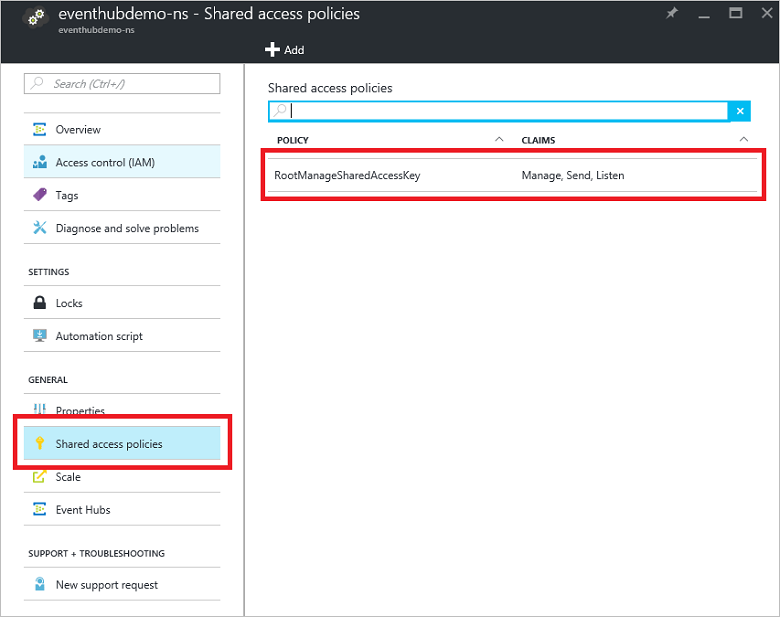

# 使用 Azure 门户创建事件中心命名空间和事件中心

## 创建事件中心命名空间

1. 登录到 [Azure 门户][Azure portal]，然后单击屏幕左上角的“新建”。
2. 单击“物联网”，然后单击“事件中心”。

    
3. 在“创建命名空间”  边栏选项卡中，输入命名空间名称。 系统会立即检查该名称是否可用。

    
4. 在确保命名空间名称可用后，选择定价层（基本版或标准版）。 另外，请选择一个 Azure 订阅、资源组以及要创建该资源的位置。 

5. 单击“创建”  以创建命名空间。

6. 在事件中心命名空间列表中，单击新建的命名空间。      

    
7. 在命名空间边栏选项卡中，单击“事件中心” 。

    

## 创建事件中心

1. 在边栏选项卡顶部，单击“添加事件中心”。

    
2. 为事件中心键入名称，然后单击“创建”。

    
3. 在事件中心列表中，单击新创建的事件中心名称。  

     
4. 返回命名空间边栏选项卡（不是特定的事件中心边栏选项卡），单击“共享的访问策略”，然后单击“RootManageSharedAccessKey”。

     
5. 单击复制按钮，将 **RootManageSharedAccessKey** 连接字符串复制到剪贴板。 保存该连接字符串，以便本教程以后使用。

     

现在已创建事件中心，你已有收发事件所需的连接字符串。

## 后续步骤

若要了解有关事件中心的详细信息，请访问以下链接：

* [事件中心概述](event-hubs-what-is-event-hubs.md)
* [事件中心 API 概述](event-hubs-api-overview.md)

[Azure portal]: https://portal.azure.cn/