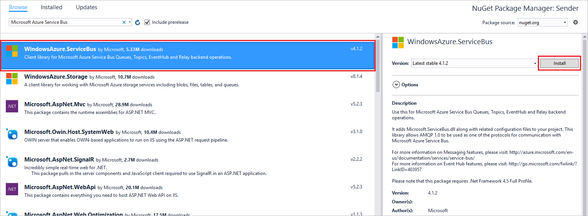

# <a name="send-events-to-azure-event-hubs-using-the-net-framework"></a>使用 .NET Framework 将事件发送到 Azure 事件中心
Azure 事件中心是一个大数据流式处理平台和事件引入服务，每秒能够接收和处理数百万个事件。 事件中心可以处理和存储分布式软件和设备生成的事件、数据或遥测。 可以使用任何实时分析提供程序或批处理/存储适配器转换和存储发送到数据中心的数据。 有关事件中心的详细概述，请参阅[事件中心概述](event-hubs-about.md)和[事件中心功能](event-hubs-features.md)。

本教程介绍如何使用控制台应用程序（通过 .NET Framework 以 C# 编写）将事件发送到事件中心。 

## <a name="prerequisites"></a>先决条件
若要完成本教程，需要满足以下先决条件：

* [Microsoft Visual Studio 2017 或更高版本](https://visualstudio.com)。

## <a name="create-an-event-hubs-namespace-and-an-event-hub"></a>创建事件中心命名空间和事件中心
第一步是使用 [Azure 门户](https://portal.azure.cn)创建事件中心类型的命名空间，并获取应用程序与事件中心进行通信所需的管理凭据。 若要创建命名空间和事件中心，请按照[本文](event-hubs-create.md)中的步骤进行操作，然后继续执行本教程的以下步骤。

## <a name="create-a-console-application"></a>创建控制台应用程序

在 Visual Studio 中，使用 **控制台应用程序** 项目模板创建一个新的 Visual C# 桌面应用项目。 将该项目命名为 **Sender**。
   


## <a name="add-the-event-hubs-nuget-package"></a>添加事件中心 NuGet 包

1. 在解决方案资源管理器中，右键单击“Sender”项目，并单击“为解决方案管理 NuGet 包”。 
2. 单击“浏览”选项卡，并搜索 `WindowsAzure.ServiceBus`。 单击“安装” 并接受使用条款。 
   
    
   
    Visual Studio 下载、安装 [Azure 服务总线库 NuGet 包](https://www.nuget.org/packages/WindowsAzure.ServiceBus)并添加对它的引用。

## <a name="write-code-to-send-messages-to-the-event-hub"></a>编写代码以将消息发送到事件中心

1. 在 **Program.cs** 文件顶部添加以下 `using` 语句：
   
    ```csharp
    using System.Threading;
    using Microsoft.ServiceBus.Messaging;
    ```
2. 将以下字段添加到 **Program** 类，并将占位符值分别替换为在上一节中创建的事件中心的名称和前面保存的命名空间级别连接字符串。
   
    ```csharp
    static string eventHubName = "Your Event Hub name";
    static string connectionString = "namespace connection string";
    ```
3. 将以下方法添加到 **Program** 类：
   
      ```csharp
      static void SendingRandomMessages()
      {
          var eventHubClient = EventHubClient.CreateFromConnectionString(connectionString, eventHubName);
          while (true)
          {
              try
              {
                  var message = Guid.NewGuid().ToString();
                  Console.WriteLine("{0} > Sending message: {1}", DateTime.Now, message);
                  eventHubClient.Send(new EventData(Encoding.UTF8.GetBytes(message)));
              }
              catch (Exception exception)
              {
                  Console.ForegroundColor = ConsoleColor.Red;
                  Console.WriteLine("{0} > Exception: {1}", DateTime.Now, exception.Message);
                  Console.ResetColor();
              }
       
              Thread.Sleep(200);
          }
      }
      ```
   
      此方法不断将事件发送到事件中心，延迟为 200 毫秒。
4. 最后，在 **Main** 方法中添加以下行：
   
      ```csharp
      Console.WriteLine("Press Ctrl-C to stop the sender process");
      Console.WriteLine("Press Enter to start now");
      Console.ReadLine();
      SendingRandomMessages();
      ```
5. 运行程序，并确保没有任何错误。
  
祝贺！ 现在已向事件中心发送消息。

## <a name="next-steps"></a>后续步骤
在此快速入门中，已使用 .NET Framework 向事件中心发送消息。 若要了解如何使用 .NET Framework 从事件中心接收事件，请参阅[从事件中心接收事件 - .NET Framework](event-hubs-dotnet-framework-getstarted-receive-eph.md)。

<!-- Images. -->
[19]: ./media/event-hubs-csharp-ephcs-getstarted/create-eh-proj1.png
[20]: ./media/event-hubs-csharp-ephcs-getstarted/create-eh-proj2.png
[21]: ./media/event-hubs-csharp-ephcs-getstarted/run-csharp-ephcs1.png
[22]: ./media/event-hubs-csharp-ephcs-getstarted/run-csharp-ephcs2.png

<!--Update_Description: update meta properties, wording update -->