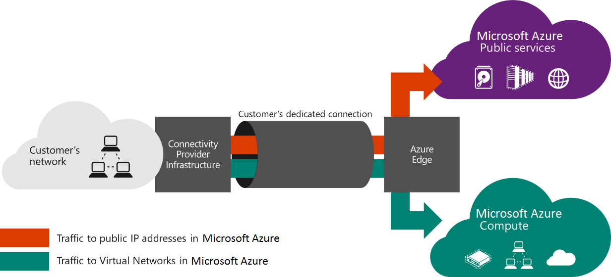

# ExpressRoute 线路和对等互连

ExpressRoute 线路通过连接提供商将本地基础结构连接到 Microsoft。 本文帮助你了解 ExpressRoute 线路和路由域/对等互连。 下图展示了 WAN 与 Microsoft 之间连接的逻辑表示。

## ExpressRoute 线路
ExpressRoute 线路表示通过连接提供商在本地基础结构与 Microsoft 云服务之间建立的逻辑连接。 可以订购多条 ExpressRoute 线路。 每条线路可以位于相同或不同的区域，且可以通过不同的连接提供商连接到各个场所。

ExpressRoute 线路不会映射到任何物理实体。 线路由称为服务密钥 (s-key) 的标准 GUID 进行唯一标识。 服务密钥是在 Microsoft、连接提供商与你之间唯一交换的一条信息。 s-key 不是用于保证安全的机密。 ExpressRoute 线路与 s-key 之间存在 1:1 映射。

新的 ExpressRoute 线路可以包含两种独立的对等互连：专用对等互连和 Microsoft 对等互连。 而现有的 ExpressRoute 线路可以包含三种对等互连：Azure 公用对等互连、Azure 专用对等互连和 Microsoft 对等互连。 每个对等互连是一对独立的 BGP 会话，每个会话采用冗余配置以实现高可用性。 ExpressRoute 线路与路由域之间存在 1:N (1 <= N <= 3) 映射。 每条 ExpressRoute 线路可以启用一个、两个或全部三个对等互连。

每条线路有固定的带宽（50 Mbps、100 Mbps、200 Mbps、500 Mbps、1 Gbps、10 Gbps），并映射到连接提供商和对等互连位置。 所选择的带宽在所有线路对等互连之间共享

### 配额、限制和局限性

默认配额和限制适用于每条 ExpressRoute 线路。 有关配额的最新信息，请参阅 [Azure 订阅和服务限制、配额与约束](../azure-subscription-service-limits.md)。

## ExpressRoute 对等互连

一条 ExpressRoute 线路有多个与之关联的路由域/对等互连：Azure 公共、Azure 专用和 Microsoft。 在一对路由器上（采用主动-主动或负载共享配置），每个对等互连采用相同的配置以实现高可用性。 Azure 服务分类为 Azure 公共  和 Azure 专用  以表示 IP 寻址方案。

### Azure 专用对等互连

可以通过专用对等域来连接虚拟网络内部署的 Azure 计算服务（即虚拟机 (IaaS) 和云服务 (PaaS)）。 专用对等域被视为进入 Microsoft Azure 的核心网络的受信任扩展。 可以在核心网络和 Azure 虚拟网络 (VNet) 之间设置双向连接。 利用此对等互连，可以使用专用 IP 地址直接连接到虚拟机和云服务。  

可以将多个虚拟网络连接到专用对等域。 有关限制和局限性的信息，请查看[常见问题解答页](expressroute-faqs.md)。 有关限制的最新信息，请访问 [Azure 订阅和服务限制、配额与约束](../azure-subscription-service-limits.md)。  有关路由配置的详细信息，请参阅[路由](expressroute-routing.md)页。

### Microsoft 对等互连

与 Microsoft 联机服务（Azure PaaS 服务）的连接通过 Microsoft 对等互连建立。 我们通过 Microsoft 对等路由域在你的 WAN 和 Microsoft 云服务之间启用双向连接。 只能通过由你或连接提供商拥有的公共 IP 地址连接到 Microsoft 云服务，并且你必须遵守我们规定的所有规则。 有关详细信息，请参阅 [ExpressRoute 先决条件](expressroute-prerequisites.md)页。

有关支持的服务、费用和配置的更多详细信息，请参阅[常见问题解答](expressroute-faqs.md)页。 有关提供 Microsoft 对等互连支持的连接提供商列表的信息，请参阅 [ExpressRoute Locations](expressroute-locations.md) （ExpressRoute 位置）页。

## 对等互连比较

下表对三种对等互连进行了比较：

[!INCLUDE [peering comparison](../../includes/expressroute-peering-comparison.md)]

可以启用一个或多个路由域作为 ExpressRoute 线路的一部分。 要将这些路由域合并成单个路由域，可以选择将所有路由域放置在同一个 VPN 中。 此外，还可以如图所示，将它们放置在不同的路由域中。 建议的配置是将专用对等链路直接连接到核心网络，并将公共和 Microsoft 对等链路连接到外围网络。

每个对等互连都需要单独的 BGP 会话（每个对等互连类型一对）。 BGP 会话对提供高度可用的链接。 若要通过第 2 层连接性提供程序进行连接，需要负责配置和管理路由。 可以通过查看设置 ExpressRoute 的[工作流](expressroute-workflows.md)了解更多详细信息。

## ExpressRoute 运行状况

可以使用[网络性能监视器](/networking/network-monitoring-overview) (NPM) 监视 ExpressRoute 线路的可用性、与 VNet 的连接性和带宽利用率。

NPM 监视 Azure 专用对等互连和 Microsoft 对等互连的运行状况。 有关详细信息，请查看我们的[帖子](https://azure.microsoft.com/blog/monitoring-of-azure-expressroute-in-preview/)。

## 后续步骤
* 查找服务提供商。 请参阅 [ExpressRoute 服务提供商和位置](expressroute-locations.md)。
* 确保符合所有先决条件。 请参阅 [ExpressRoute 先决条件](expressroute-prerequisites.md)。
* 配置 ExpressRoute 连接。
  * [创建和管理 ExpressRoute 线路](expressroute-howto-circuit-portal-resource-manager.md)
  * [配置 ExpressRoute 线路的路由（对等互连）](expressroute-howto-routing-portal-resource-manager.md)

