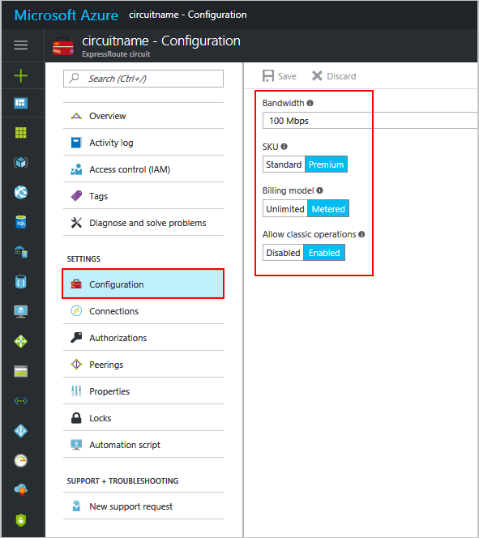

# <a name="create-and-modify-an-expressroute-circuit"></a>创建和修改 ExpressRoute 线路

> [!div class="op_single_selector"]
> * [Azure 门户](expressroute-howto-circuit-portal-resource-manager.md)
> * [PowerShell](expressroute-howto-circuit-arm.md)
> * [Azure CLI](howto-circuit-cli.md)
> * [PowerShell（经典）](expressroute-howto-circuit-classic.md)
>

本文介绍如何使用 Azure 门户和 Azure Resource Manager 部署模型创建 Azure ExpressRoute 线路。 以下步骤还说明如何查看线路状态，以及如何更新、删除和取消预配线路。


## <a name="before-you-begin"></a>开始之前

- 在开始配置之前，请查看[先决条件](./expressroute-prerequisites.md)和[工作流](./expressroute-workflows.md)。
- 确保有权访问 [Azure 门户](https://portal.azure.cn)。
- 确保有权创建新的网络资源。 如果没有适当的权限，请与帐户管理员联系。

## <a name="create-and-provision-an-expressroute-circuit"></a>创建和预配 ExpressRoute 线路

### <a name="1-sign-in-to-the-azure-portal"></a>1.登录到 Azure 门户

从浏览器导航到 [Azure 门户](http://portal.azure.cn)并使用 Azure 帐户登录。

### <a name="2-create-a-new-expressroute-circuit"></a>2.创建新的 ExpressRoute 线路

>[!IMPORTANT]
> 从发布服务密钥的那一刻起，便会对 ExpressRoute 线路进行计费。 确保连接服务提供商准备好预配线路后就执行此操作。
> 
> 

1. 可以通过选择创建新资源的选项来创建 ExpressRoute 线路。 单击“新建” > “网络” > “ExpressRoute”，如下图所示：

    

2. 单击“ExpressRoute”即可显示“创建 ExpressRoute 线路”边栏选项卡。 在此边栏选项卡中填充值时，请务必指定正确的 SKU 层和数据计量方式。

    - “层”决定是启用 ExpressRoute 标准版外接程序还是 ExpressRoute 高级版外接程序。 可以指定“Standard”以获取标准 SKU，或指定“Premium”以获取高级版外接程序。

    - “数据计量”决定计费类型。 可以指定“Metered”以获取数据流量套餐，指定“Unlimited”以获取无限制流量套餐。 注意：可以将计费类型从“Metered”更改为“Unlimited”，但不能将类型从“Unlimited”更改为“Metered”。

    

>[!IMPORTANT]
> 请注意，对等互连位置表示与 Microsoft 建立对等互连的[物理位置](./expressroute-locations.md)。 此位置与“Location”属性 **没有** 关系，后者指的是 Azure 网络资源提供商所在的地理位置。 尽管两者之间没有关系，但最好是选择地理上与线路对等互连位置靠近的网络资源提供商。 
> 
> 

### <a name="3-view-the-circuits-and-properties"></a>3.查看线路和属性

**查看所有线路**

在左侧菜单中选择“所有资源”即可查看创建的所有线路。


**查看属性**

```
You can view the properties of the circuit by selecting it. On this blade, note the service key for the circuit. You must copy the circuit key for your circuit and pass it down to the service provider to complete the provisioning process. The circuit key is specific to your circuit.
```


### <a name="4-send-the-service-key-to-your-connectivity-provider-for-provisioning"></a>4.将服务密钥发送给连接服务提供商进行预配

在此边栏选项卡中，“提供商状态”提供有关服务提供商端当前预配状态的信息。 “线路状态”提供 Microsoft 端的状态。 有关线路预配状态的详细信息，请参阅[工作流](./expressroute-workflows.md#expressroute-circuit-provisioning-states)一文。

创建新的 ExpressRoute 线路时，线路处于以下状态：

提供商状态：未预配<BR>
线路状态：已启用


当连接提供商正在为你启用线路时，线路将转为以下状态：

提供商状态：正在预配<BR>
线路状态：已启用

只有 ExpressRoute 线路处于以下状态时，才能使用它。

提供商状态：已预配<BR>
线路状态：已启用

### <a name="5-periodically-check-the-status-and-the-state-of-the-circuit-key"></a>5.定期检查线路密钥的状态

选中你感兴趣的线路即可查看其属性。 选中“提供商状态”，确保在继续之前其已转为“已预配”。


### <a name="6-create-your-routing-configuration"></a>6.创建路由配置

有关分步说明，请参阅 [ExpressRoute 线路路由配置](./expressroute-howto-routing-portal-resource-manager.md)一文，了解如何创建和修改线路对等互连。

>[!IMPORTANT]
> 这些说明只适用于由提供第 2 层连接服务的服务提供商创建的线路。 如果服务提供商提供第 3 层托管服务（通常是 IP VPN，如 MPLS），则连接服务提供商将配置和管理路由。
> 
> 

### <a name="7-link-a-virtual-network-to-an-expressroute-circuit"></a>7.将虚拟网络链接到 ExpressRoute 线路

接下来，将虚拟网络链接到 ExpressRoute 线路。 使用资源管理器部署模型时，请参阅[将虚拟网络链接到 ExpressRoute 线路](./expressroute-howto-linkvnet-arm.md)一文。

## <a name="getting-the-status-of-an-expressroute-circuit"></a>获取 ExpressRoute 线路的状态

选择线路即可查看其状态。 


## <a name="modifying-an-expressroute-circuit"></a>修改 ExpressRoute 线路
可以在不影响连接的情况下修改 ExpressRoute 线路的某些属性。

可以在不停机的情况下执行以下操作：

* 为 ExpressRoute 线路启用或禁用 ExpressRoute 高级版外接程序。
* 增加 ExpressRoute 线路的带宽，前提是端口上有可用容量。 请注意，不支持对线路的带宽进行降级。 
* 将计量套餐从数据流量套餐更改为无限制流量套餐。 请注意，不支持将计量套餐从无限制流量套餐更改为数据流量套餐。
* 可以启用和禁用允许经典操作。

有关限制和局限性的详细信息，请参阅 [ExpressRoute 常见问题解答](./expressroute-faqs.md)。

若要修改 ExpressRoute 线路，请单击“配置”，如下图所示。



可以在“配置”边栏选项卡内修改带宽、SKU、计费模型，以及允许经典操作。

> [!IMPORTANT]
> 如果现有端口上的容量不足，可能需要重新创建 ExpressRoute 线路。 如果该位置没有额外的可用容量，则不能升级线路。
>
> 但是，无法在不中断的情况下降低 ExpressRoute 线路的带宽。 带宽降级需要取消对 ExpressRoute 线路的预配，并重新预配新的 ExpressRoute 线路。
> 
> 如果使用的资源超出了标准线路所允许的范围，禁用高级版外接程序的操作可能会失败。
> 
> 

## <a name="deprovisioning-and-deleting-an-expressroute-circuit"></a>取消预配和删除 ExpressRoute 线路
可以通过选择“删除”图标来删除 ExpressRoute 线路。 注意以下事项：

- 必须取消所有虚拟网络与 ExpressRoute 线路的链接。 如果此操作失败，请检查是否有虚拟网络链接到了该线路。

- 如果 ExpressRoute 线路服务提供商预配状态为“正在预配”或“已预配”，则必须与服务提供商合作，在他们一端取消预配线路。 在服务提供商取消对线路的预配并通知我们之前，我们会继续保留资源并向你收费。

- 如果服务提供商已取消预配线路（服务提供商预配状态设置为“未预配”），则可以删除线路。 这样就会停止线路计费

## <a name="next-steps"></a>后续步骤

创建线路后，请确保执行以下操作：

- [创建和修改 ExpressRoute 线路的路由](./expressroute-howto-routing-portal-resource-manager.md)
- [将虚拟网络链接到 ExpressRoute 线路](./expressroute-howto-linkvnet-arm.md)
