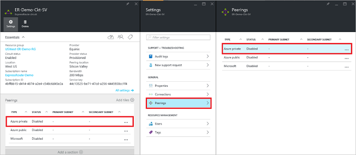
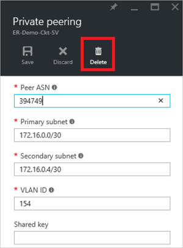
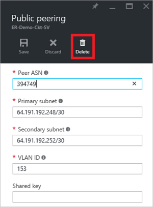

# 创建和修改 ExpressRoute 线路的对等互连

本文帮助你使用 Azure 门户在资源管理器部署模型中创建和管理 ExpressRoute 线路的路由配置。 还可以检查 ExpressRoute 线路的状态、更新、删除和取消预配其对等互连。 如果想使用不同的方法处理线路，请从以下列表中选择一篇文章进行参阅：

> [!div class="op_single_selector"]
> * [Azure 门户](expressroute-howto-routing-portal-resource-manager.md)
> * [PowerShell](expressroute-howto-routing-arm.md)
> * [Azure CLI](howto-routing-cli.md)
> * [PowerShell（经典）](expressroute-howto-routing-classic.md)
> 

可以为 ExpressRoute 线路配置一到三个对等互连（Azure 专用和 Azure 公共）。 可以按照所选的任意顺序配置对等互连。 但是，必须确保一次只完成一个对等互连的配置。 有关路由域和对等互连的详细信息，请参阅[关于线路和对等互连](expressroute-circuit-peerings.md)。

## 配置先决条件

- 在开始配置之前，请务必查看[先决条件](./expressroute-prerequisites.md)页、[路由要求](./expressroute-routing.md)页和[工作流](./expressroute-workflows.md)页。
* 必须有一个活动的 ExpressRoute 线路。 在继续下一步之前，请按说明 [创建 ExpressRoute 线路](expressroute-howto-circuit-portal-resource-manager.md) ，并通过连接提供商启用该线路。 ExpressRoute 线路必须处于已预配和已启用状态，才能运行以下各部分中的 cmdlet。
- 如果计划使用共享密钥/MD5 哈希，请确保在隧道两端都使用该哈希，并将最大字符数限制为 25。

这些说明只适用于由提供第 2 层连接服务的服务提供商创建的线路。 如果服务提供商提供第 3 层托管服务（通常是 IPVPN，如 MPLS），则连接服务提供商会配置和管理路由。 

> [!IMPORTANT]
> 我们目前无法通过服务管理门户播发服务提供商配置的对等互连。 我们正在努力不久就实现这一功能。 请在配置 BGP 对等互连之前与服务提供商协商。
> 
> 

## Microsoft 对等互连

本文介绍如何为 ExpressRoute 线路创建、获取、更新和删除 Microsoft 对等互连配置。

> [!IMPORTANT]
> 在 2017 年 8 月 1 日之前配置的 ExpressRoute 线路的 Microsoft 对等互连会通过 Microsoft 对等互连播发所有服务前缀，即使未定义路由筛选器。 在 2017 年 8 月 1 日或之后配置的 ExpressRoute 线路的 Microsoft 对等互连的任何前缀只有在路由筛选器附加到线路之后才会播发。 有关详细信息，请参阅[配置用于 Microsoft 对等互连的路由筛选器](how-to-routefilter-powershell.md)。
> 
> 

### 创建 Microsoft 对等互连

1. 配置 ExpressRoute 线路。 在进一步继续之前，请确保线路完全由连接提供商设置。 如果连接服务提供商提供第 3 层托管服务，可以请求连接服务提供商启用 Microsoft 对等互连。 在这种情况下，不需要遵循后续部分中所列的说明。 但是，如果连接服务提供商不为你管理路由，请在创建线路后按照后续步骤继续配置。

  
2. 配置线路的 Microsoft 对等互连。 在继续下一步之前，请确保已准备好以下信息。

  * 主链路的 /30 子网。 这必须是你拥有且已在 RIR/IRR 中注册的有效公共 IPv4 前缀。 在此子网中，Microsoft 将第二个可用的 IP 用于其路由器时，你将为你的路由器分配第一个可用的 IP 地址。
  * 辅助链路的 /30 子网。 这必须是你拥有且已在 RIR/IRR 中注册的有效公共 IPv4 前缀。 在此子网中，Microsoft 将第二个可用的 IP 用于其路由器时，你将为你的路由器分配第一个可用的 IP 地址。
  * 用于建立此对等互连的有效 VLAN ID。 请确保线路中没有其他对等互连使用同一个 VLAN ID。 主要链接和次要链接必须使用相同的 VLAN ID。
  * 对等互连的 AS 编号。 可以使用 2 字节和 4 字节 AS 编号。
  * 播发的前缀：必须提供要通过 BGP 会话播发的所有前缀列表。 只接受公共 IP 地址前缀。 如果打算发送一组前缀，可以发送逗号分隔列表。 这些前缀必须已在 RIR/IRR 中注册。
  * “可选”- 客户 ASN：如果要播发的前缀未注册到对等互连 AS 编号，可以指定它们要注册到的 AS 编号。
  * 路由注册表名称：可以指定 AS 编号和前缀要注册到的 RIR/IRR。
  * **可选** - MD5 哈希（如果选择使用）。
3. 可以选择想要配置的对等互连，如以下示例中所示。 选择 Microsoft 对等互连行。

  
4. 配置 Microsoft 对等互连。 下图显示了一个配置示例：

  
5. 指定所有参数后，请保存配置。

  如果线路到达需要验证的状态（如下图中所示），则必须打开支持票证以向我们的支持团队显示前缀所有权的证明。

  

  可以直接从门户中打开支持票证，如以下示例中所示：

  

1. 成功接受配置后，会看到类似于下图中的内容：

  

### 查看 Microsoft 对等互连详细信息

可以通过选择对等互连查看 Azure 公共对等互连的属性。

### 更新 Microsoft 对等互连配置

可以选择用于对等互连的行并修改对等互连属性。

### 删除 Microsoft 对等互连

可以通过选择“删除”图标来删除对等互连配置，如下图中所示：

## Azure 专用对等互连
本文介绍了如何为 ExpressRoute 线路创建、获取、更新和删除 Azure 专用对等互连配置。

### 创建 Azure 专用对等互连

1. 配置 ExpressRoute 线路。 在继续之前，请确保线路完全由连接提供商设置。 如果连接服务提供商提供第 3 层托管服务，可以请求连接服务提供商启用 Azure 专用对等互连。 在这种情况下，不需要遵循后续部分中所列的说明。 但是，如果连接服务提供商不为你管理路由，请在创建线路后按照后续步骤继续配置。

  
2. 配置线路的 Azure 专用对等互连。 在继续执行后续步骤之前，请确保已准备好以下各项：

  * 主链路的 /30 子网。 此子网不能是保留给虚拟网络使用的任何地址空间的一部分。 在此子网中，Microsoft 将第二个可用的 IP 用于其路由器时，你将为你的路由器分配第一个可用的 IP 地址。
  * 辅助链路的 /30 子网。 此子网不能是保留给虚拟网络使用的任何地址空间的一部分。 在此子网中，Microsoft 将第二个可用的 IP 用于其路由器时，你将为你的路由器分配第一个可用的 IP 地址。
  * 用于建立此对等互连的有效 VLAN ID。 请确保线路中没有其他对等互连使用同一个 VLAN ID。 主要链接和次要链接必须使用相同的 VLAN ID。
  * 对等互连的 AS 编号。 可以使用 2 字节和 4 字节 AS 编号。 可以将专用 AS 编号用于此对等互连。 请务必不要使用 65515。
  * **可选** - MD5 哈希（如果选择使用）。
3. 选择“Azure 专用”对等互连行，如下面的示例中所示：

  
4. 配置专用对等互连。 下图显示了一个配置示例：

  
5. 指定所有参数后，请保存配置。 成功接受配置后，会看到类似于以下示例的内容：

  

### 查看 Azure 专用对等互连详细信息

可以通过选择对等互连查看 Azure 专用对等互连的属性。

### 更新 Azure 专用对等互连配置

可以选择用于对等互连的行并修改对等互连属性。

### 删除 Azure 专用对等互连

可以通过选择“删除”图标来删除对等互连配置，如下图中所示：

## Azure 公共对等互连

本文介绍了如何为 ExpressRoute 线路创建、获取、更新和删除 Azure 公共对等互连配置。

### 创建 Azure 公共对等互连

1. 配置 ExpressRoute 线路。 在进一步继续之前，请确保线路完全由连接提供商设置。 如果连接服务提供商提供第 3 层托管服务，可以请求连接服务提供商启用 Azure 公共对等互连。 在这种情况下，不需要遵循后续部分中所列的说明。 但是，如果连接服务提供商不为你管理路由，请在创建线路后按照后续步骤继续配置。

  
2. 配置线路的 Azure 公共对等互连。 在继续执行后续步骤之前，请确保已准备好以下各项：

  * 主链路的 /30 子网。 这必须是有效的公共 IPv4 前缀。 在此子网中，Microsoft 将第二个可用的 IP 用于其路由器时，你将为你的路由器分配第一个可用的 IP 地址。 
  * 辅助链路的 /30 子网。 这必须是有效的公共 IPv4 前缀。 在此子网中，Microsoft 将第二个可用的 IP 用于其路由器时，你将为你的路由器分配第一个可用的 IP 地址。
  * 用于建立此对等互连的有效 VLAN ID。 请确保线路中没有其他对等互连使用同一个 VLAN ID。 主要链接和次要链接必须使用相同的 VLAN ID。
  * 对等互连的 AS 编号。 可以使用 2 字节和 4 字节 AS 编号。
  * **可选** - MD5 哈希（如果选择使用）。
3. 选择“Azure 公共”对等互连行，如下图中所示：

  
4. 配置公共对等互连。 下图显示了一个配置示例：

  
5. 指定所有参数后，请保存配置。 成功接受配置后，会看到类似于以下示例的内容：

  

### 查看 Azure 公共对等互连详细信息

可以通过选择对等互连查看 Azure 公共对等互连的属性。

### 更新 Azure 公共对等互连配置

可以选择用于对等互连的行并修改对等互连属性。

### 删除 Azure 公共对等互连

可以通过选择“删除”图标来删除对等互连配置，如以下示例中所示：

## 后续步骤

下一步，[将 VNet 链接到 ExpressRoute 线路](./expressroute-howto-linkvnet-portal-resource-manager.md)。

-  有关 ExpressRoute 工作流的详细信息，请参阅 [ExpressRoute 工作流](./expressroute-workflows.md)。

-  有关线路对等互连的详细信息，请参阅 [ExpressRoute 线路和路由域](./expressroute-circuit-peerings.md)。

-  有关使用虚拟网络的详细信息，请参阅 [虚拟网络概述](../virtual-network/virtual-networks-overview.md)。