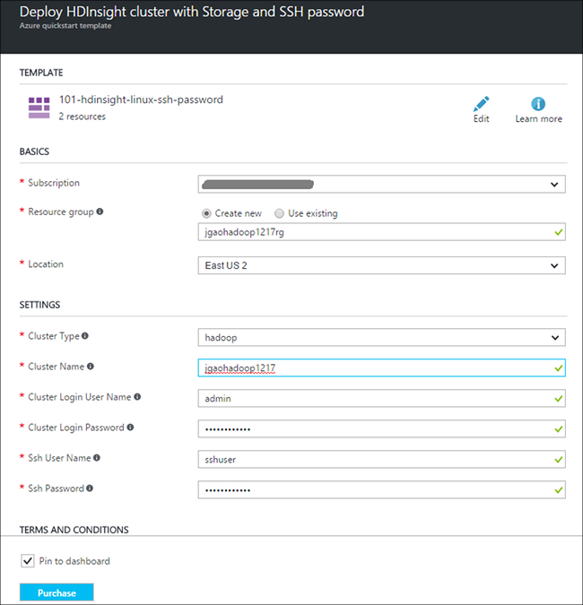
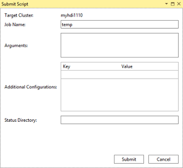
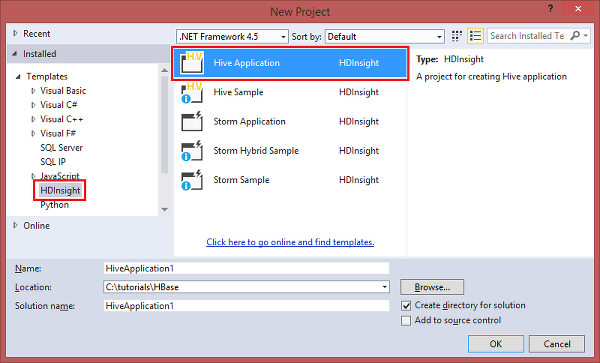

# <a name="quickstart-get-started-with-hadoop-and-hive-in-azure-hdinsight-using-resource-manager-template"></a>快速入门：使用资源管理器模板在 Azure HDInsight 中开始使用 Hadoop 和 Hive

本文介绍如何使用资源管理器模板在 HDInsight 中创建 [Hadoop](http://hadoop.apache.org/) 群集，以及之后如何在 HDInsight 中运行 Hive 作业。 大多数 Hadoop 作业都是批处理作业。 创建群集，运行一些作业，并删除群集。 在本文中，将会执行所有这三项任务。

在本快速入门教程中，可以使用资源管理器模板创建 HDInsight Hadoop 群集。 也可以使用 [Azure 门户](apache-hadoop-linux-create-cluster-get-started-portal.md)创建群集。

目前，HDInsight 附带[七个不同的群集类型](./apache-hadoop-introduction.md#cluster-types-in-hdinsight)。 每个群集类型都支持一组不同的组件。 所有群集类型都支持 Hive。 有关 HDInsight 中受支持组件的列表，请参阅 [HDInsight 提供的 Hadoop 群集版本中有哪些新功能？](../hdinsight-component-versioning.md)  

如果没有 Azure 订阅，请在开始前[创建一个试用帐户](https://www.azure.cn/pricing/1rmb-trial/)。

<a name="create-cluster"></a>
## <a name="create-a-hadoop-cluster"></a>创建 Hadoop 群集

本部分介绍如何使用 Azure 资源管理器模板在 HDInsight 中创建 Hadoop 群集。 学习本文不需要有资源管理器模板方面的经验。 

1. 单击下面的“部署到 Azure”按钮以登录到 Azure，并在 Azure 门户中打开资源管理器模板。 

    <a href="https://portal.azure.cn/#create/Microsoft.Template/uri/https%3A%2F%2Fraw.githubusercontent.com%2FAzure%2Fazure-quickstart-templates%2Fmaster%2F101-hdinsight-linux-ssh-password%2Fazuredeploy.json" target="_blank"></a>
2. 按以下屏幕截图所示输入或选择值：

    > [!NOTE]
    > 提供的值必须唯一，并应遵循命名指南。 模板不会执行验证检查。 如果提供的值已被使用，或不遵循指南，则提交模板后可能会出错。       
    > 
    >
    
    

    输入或选择下列值：
    
    |属性  |说明  |
    |---------|---------|
    |**订阅**     |  选择 Azure 订阅。 |
    |**资源组**     | 创建资源组，或选择现有资源组。  资源组是 Azure 组件的容器。  在本例中，资源组包含 HDInsight 群集和依赖的 Azure 存储帐户。 |
    |**位置**     | 选择要在其中创建群集的 Azure 位置。  选择的位置与你越靠近，性能就越好。 |
    |**群集类型**     | 选择“hadoop”。 |
    |**群集名称**     | 输入 Hadoop 群集的名称。 由于 HDInsight 中的所有群集共享同一 DNS 命名空间，因此该名称必须唯一。 该名称最多可以有 59 个字符，包括字母、数字和连字符。 名称的第一个和最后一个字符不能为连字符。 |
    |**群集登录名和密码**     | 默认登录名为“admin”。密码长度不得少于 10 个字符，且至少必须包含一个数字、一个大写字母和一个小写字母、一个非字母数字字符（' " ` \)字符除外）。 请确保不提供常见密码，如“Pass@word1”。|
    |**SSH 用户名和密码**     | 默认用户名为“sshuser”。  可以重命名 SSH 用户名。  SSH 用户密码的要求与群集登录密码的要求相同。|
       
    某些属性已在模板中硬编码。  可以通过模板配置这些值。 有关这些属性的详细说明，请参阅[在 HDInsight 中创建 Hadoop 群集](../hdinsight-hadoop-provision-linux-clusters.md)。

3. 依次选择“我同意上述条款和条件”、“固定到仪表板”，并选择“购买”。 门户仪表板上应会出现标题为“提交部署”的新磁贴。 创建群集大约需要 20 分钟时间。

    

4. 创建群集后，该磁贴的标题将更改为指定的资源组名称。 该磁贴还列出了在资源组中创建的 HDInsight 群集。 
   
    
    
5. 该磁贴还列出了与群集关联的默认存储。 每个群集都有一个 [Azure 存储帐户](../hdinsight-hadoop-use-blob-storage.md)依赖项。 该帐户称为默认存储帐户。 HDInsight 群集与其默认存储帐户必须一起放置在同一个 Azure 区域中。 删除群集不会删除存储帐户。
    

> [!NOTE]
> 如需其他群集创建方法或要了解本教程中使用的属性，请参阅 [Create HDInsight clusters](../hdinsight-hadoop-provision-linux-clusters.md)（创建 HDInsight 群集）。       
> 
>

## <a name="use-vscode-to-run-hive-queries"></a>使用 VSCode 运行 Hive 查询

如何获取 VSCode 中的 HDInsight 工具，请参阅[使用用于 Visual Studio Code 的 Azure HDInsight 工具](../hdinsight-for-vscode.md)。

### <a name="submit-interactive-hive-queries"></a>提交交互式 Hive 查询

通过用于 VSCode 的 HDInsight 工具，可以将交互式 Hive 查询提交到 HDInsight 交互式查询群集。

1. 创建一个新的工作文件夹和一个新的 Hive 脚本文件（如果还没有）。

2. 连接到 Azure 帐户，然后配置默认群集（如果尚未执行此操作）。

3. 将以下代码复制并粘贴到 Hive 文件中，然后保存该文件。

    ```hiveql
    SELECT * FROM hivesampletable;
    ```
4. 右键单击脚本编辑器，然后选择“HDInsight:Hive Interactive”以提交查询。 工具还允许使用上下文菜单提交代码块而非整个脚本文件。 很快，查询结果将显示在新选项卡中。

   

    - “结果”面板：可以将整个结果作为 CSV、JSON、Excel 保存到本地路径，也可以只选择多个行。

    - “消息”面板：选择**行**号会跳转到运行的脚本的第一行。

与[运行 Hive 批处理作业](#submit-hive-batch-scripts)相比，运行交互式查询花费的时间要少得多。

### <a name="submit-hive-batch-scripts"></a>提交 Hive 批处理脚本

1. 创建一个新的工作文件夹和一个新的 Hive 脚本文件（如果还没有）。

2. 连接到 Azure 帐户，然后配置默认群集（如果尚未执行此操作）。

3. 将以下代码复制并粘贴到 Hive 文件中，然后保存该文件。

    ```hiveql
    SELECT * FROM hivesampletable;
    ```
4. 右键单击脚本编辑器，然后选择“HDInsight:Hive 批处理”以提交 Hive 作业。 

5. 选择想要提交的群集。  

    提交 Hive 作业后，“输出”面板中将显示提交成功信息和作业 ID。 Hive 作业还会打开“WEB 浏览器”，其中显示了实时作业日志和状态。

   

[提交交互式 Hive 查询](#submit-interactive-hive-queries)所花费的时间比提交批处理作业要少得多。

## <a name="use-visualstudio-to-run-hive-queries"></a>使用 VisualStudio 运行 Hive 查询

如何获取 Visual Studio 中的 HDInsight 工具，请参阅[使用针对 Visual Studio 的 Data Lake 工具](./apache-hadoop-visual-studio-tools-get-started.md)。

### <a name="run-hive-queries"></a>运行 Hive 查询

可以使用两个选项来创建并运行 Hive 查询：

* 创建临时查询
* 创建 Hive 应用程序

若要创建和运行临时查询，请执行以下操作：

1. 在“服务器资源管理器”中，选择“Azure” > “HDInsight 群集”。

2. 右键单击要运行查询的群集，然后选择“编写 Hive 查询”。  

3. 输入 Hive 查询。 

    Hive 编辑器支持 IntelliSense。 用于 Visual Studio 的 Data Lake 工具支持在编辑 Hive 脚本时加载远程元数据。 例如，如果键入“SELECT * FROM”，IntelliSense 会列出所有建议的表名称。 在指定表名称后，IntelliSense 会列出列名称。 这些工具支持大多数 Hive DML 语句、子查询和内置 UDF。
   
    
   
    
   
   > [!NOTE]
   > IntelliSense 只建议 HDInsight 工具栏中所选群集的元数据。
   > 
   
4. 选择“提交”或“提交(高级)”。 
   
    

   如果选择高级提交选项，请为脚本配置“作业名称”、“参数”、“其他配置”和“状态目录”：

    

   运行交互式 Hive 查询

   * 单击下箭头选择“交互式”。 
   
   * 单击“执行” 。

   

若要创建并运行 Hive 解决方案，请执行以下操作：

1. 在“文件”菜单中，选择“新建”，然后选择“项目”。
2. 在左窗格中，选择“HDInsight”。 在中间窗格中，选择“Hive 应用程序”。 输入属性，然后选择“确定”。
   
    
3. 在“解决方案资源管理器”中，双击“Script.hql”将该脚本打开。
4. 输入 Hive 查询并提交。 （请参阅上面的步骤 3 和步骤 4）  


## <a name="run-hive-queries"></a>运行 Hive 查询
[Apache Hive](hdinsight-use-hive.md) 是 HDInsight 中最流行的组件。 可通过多种方法在 HDInsight 中运行 Hive 作业。 本教程使用门户中的 Ambari Hive 视图。 有关提交 Hive 作业的其他方法，请参阅 [Use Hive in HDInsight](hdinsight-use-hive.md)（在 HDInsight 中使用 Hive）。

1. 若要打开 Ambari，请从之前的屏幕截图中，选择“群集仪表板”。  也可以浏览到 **https://&lt;ClusterName>.azurehdinsight.cn**，其中 &lt;ClusterName> 是在上一部分中创建的群集。

    

2. 输入在创建群集时指定的 Hadoop 用户名和密码。 默认的用户名为 **admin**。

3. 打开“Hive 视图”，如以下屏幕截图中所示： 
   
    

4. 在“查询”选项卡中，将以下 HiveQL 语句粘贴到工作表中：
   
        SHOW TABLES;

    
   
   > [!NOTE]
   > Hive 要求使用分号。       
   > 
   > 

5. 选择“执行”。 “结果”选项卡将显示在“查询”选项卡下面，并显示有关作业的信息。 
   
    完成查询后，“查询”选项卡将显示操作结果。 应会看到一个名为 **hivesampletable** 的表。 所有 HDInsight 群集都随附了此示例 Hive 表。
   
    

6. 重复步骤 4 和 5，运行以下查询：

        SELECT * FROM hivesampletable;
   
7. 还可以保存查询的结果。 选择右侧的菜单按钮，并指定是要将结果下载为 CSV 文件，还是要将其存储到与群集关联的存储帐户。

    

完成 Hive 作业后，可以[将结果导出到 Azure SQL 数据库或 SQL Server 数据库](apache-hadoop-use-sqoop-mac-linux.md)，还可以[使用 Excel 将结果可视化](apache-hadoop-connect-excel-power-query.md)。 有关在 HDInsight 中使用 Hive 的详细信息，请参阅 [Use Hive and HiveQL with Hadoop in HDInsight to analyze a sample Apache log4j file](hdinsight-use-hive.md)（将 Hive 和 HiveQL 与 HDInsight 中的 Hadoop 配合使用以分析示例 Apache log4j 文件）。

## <a name="troubleshoot"></a>故障排除

如果在创建 HDInsight 群集时遇到问题，请参阅[访问控制要求](../hdinsight-administer-use-portal-linux.md#create-clusters)。

## <a name="clean-up-resources"></a>清理资源
完成本文后，可以删除群集。 有了 HDInsight，便可以将数据存储在 Azure 存储中，因此可以在群集不用时安全地删除群集。 此外，还需要为 HDInsight 群集付费，即使不用也是如此。 由于群集费用数倍于存储空间费用，因此在群集不用时删除群集可以节省费用。 

> [!NOTE]
> 如果立即进行下一教程，了解如何使用 Hadoop on HDInsight 运行 ETL 操作，建议保持群集运行。 这是因为该教程中必须再次创建 Hadoop 群集。 但是，如果不立即学习下一教程，则必须立即删除该群集。
> 
> 

**删除群集和/或默认存储帐户**

1. 返回到包含 Azure 门户的浏览器选项卡。 你应该在群集概览页上。 如果仅希望删除群集但保留默认的存储帐户，请选择“删除”。

    

2. 如果希望删除群集和默认存储帐户，请选择资源组名称（之前的屏幕截图中已突出显示），打开资源组页。

3. 选择“删除资源组”，删除资源组（包括群集和默认存储帐户）。 注意，删除资源组会删除存储帐户。 如果想要保留存储帐户，请选择仅删除群集。

## <a name="next-steps"></a>后续步骤
本教程已介绍如何使用资源管理器模板创建基于 Linux 的 HDInsight 群集，以及如何执行基本 Hive 查询。 下一篇文章将介绍如何使用 Hadoop on HDInsight 执行提取、转换和加载 (ETL) 操作。

> [!div class="nextstepaction"]
>[使用 Apache Hive on HDInsight 提取、转换和加载数据](../hdinsight-analyze-flight-delay-data-linux.md)

如果已准备好开始处理自己的数据，并需要进一步了解 HDInsight 存储数据的方式或如何将数据导入 HDInsight，请参阅以下文章：

* 有关 HDInsight 如何使用 Azure 存储的信息，请参阅[将 Azure 存储与 HDInsight 配合使用](../hdinsight-hadoop-use-blob-storage.md)。
* 若要了解如何将数据上传到 HDInsight，请参阅[将数据上传到 HDInsight](../hdinsight-upload-data.md)。

有关如何使用 HDInsight 分析数据的详细信息，请参阅以下文章：

* 若要详细了解如何将 Hive 与 HDInsight 配合使用（包括如何从 Visual Studio 中执行 Hive 查询），请参阅[将 Hive 与 HDInsight 配合使用](hdinsight-use-hive.md)。
* 若要了解 Pig（一种用于转换数据的语言），请参阅[将 Pig 与 HDInsight 配合使用](hdinsight-use-pig.md)。
* 若要了解 MapReduce（在 Hadoop 中处理数据的程序编写方式），请参阅[将 MapReduce 与 HDInsight 配合使用](hdinsight-use-mapreduce.md)。
* 若要了解如何使用用于 Visual Studio 的 HDInsight 工具来分析 HDInsight 数据，请参阅 [Get started using Visual Studio Hadoop tools for HDInsight](apache-hadoop-visual-studio-tools-get-started.md)（用于 HDInsight 的 Visual Studio Hadoop 工具入门）。
* 若要了解如何使用用于 VSCode 的 HDInsight 工具来分析 HDInsight 数据，请参阅[使用用于 Visual Studio Code 的 Azure HDInsight 工具](../hdinsight-for-vscode.md)。


若要详细了解如何创建或管理 HDInsight 群集，请参阅以下文章：


* 有关可用于创建 HDInsight 群集的选项的详细信息，请参阅 [Creating HDInsight on Linux using custom options](../hdinsight-hadoop-provision-linux-clusters.md)（使用自定义选项在 Linux 上创建 HDInsight）。


[1]: ../HDInsight/apache-hadoop-visual-studio-tools-get-started.md

[hdinsight-provision]: hdinsight-provision-linux-clusters.md
[hdinsight-upload-data]: hdinsight-upload-data.md
[hdinsight-use-hive]: hdinsight-use-hive.md
[hdinsight-use-pig]: hdinsight-use-pig.md
