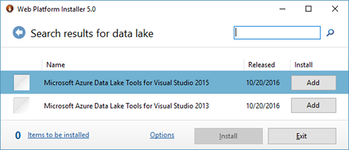
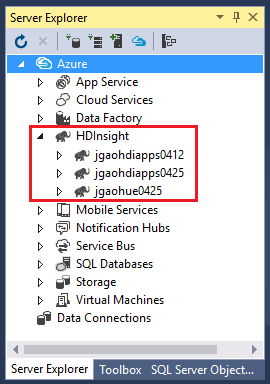
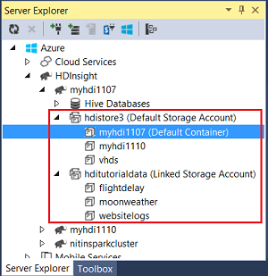
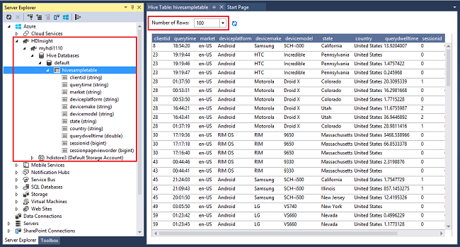
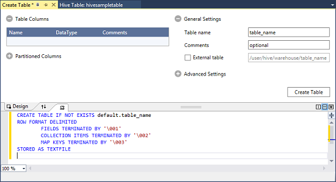
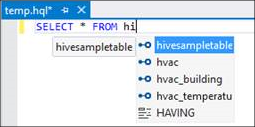
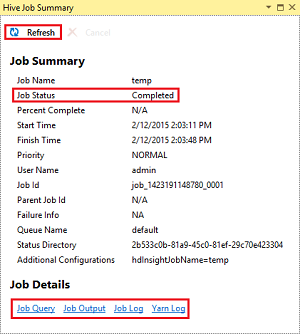
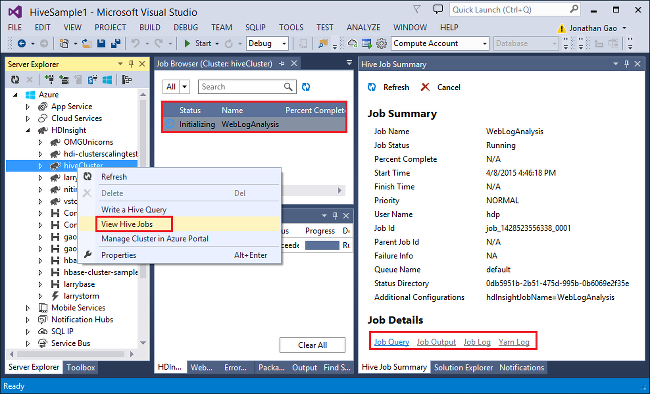

# 使用用于 Visual Studio 的 Data Lake 工具连接到 Azure HDInsight 并运行 Hive 查询

了解如何使用用于 Visual Studio 的 Data Lake 工具（也称 Azure Data Lake 和流分析工具）连接到 [Azure HDInsight](../hdinsight-hadoop-introduction.md) 中的 Hadoop 群集并提交 Hive 查询。 有关使用 HDInsight 的详细信息，请参阅 [HDInsight 简介](../hdinsight-hadoop-introduction.md)和 [HDInsight 入门](apache-hadoop-linux-tutorial-get-started.md)。 有关连接到 Storm 群集的详细信息，请参阅[使用 Visual Studio 在 HDInsight 上针对 Apache Storm 开发 C# 拓扑](../storm/apache-storm-develop-csharp-visual-studio-topology.md)。

用于 Visual Studio 的 Data Lake 工具可用于访问 Data Lake Analytics 和 HDInsight。  F

**先决条件**

若要完成本教程并使用 Visual Studio 中的 Data Lake 工具，需要准备以下项目：

* 一个 Azure HDInsight 群集：若要创建一个，请参阅[在 Azure HDInsight 中使用 Hadoop 入门](apache-hadoop-linux-tutorial-get-started.md)。 若要了解如何运行交互式 Hive 查询，需要使用 [HDInsight 交互式查询](../interactive-query/apache-interactive-query-get-started.md)群集。
* 安装有 Visual Studio 2013/2015/2017 的工作站。
    
    > [!NOTE]
    > 目前，用于 Visual Studio 的 Data Lake 工具仅有英文版本。
    > 
    > 

## 安装和升级用于 Visual Studio 的 Data Lake 工具

默认情况下，为 Visual Studio 2017 安装 Data Lake Tools。 如需更旧的 Visual Studio 版本，可以使用 [Web 平台安装程序](https://www.microsoft.com/web/downloads/)进行安装。 必须选择与 Visual Studio 版本匹配的版本。 如果尚未安装 Visual Studio，则可使用 [Web 平台安装程序](https://www.microsoft.com/web/downloads/)安装最新 Visual Studio Community 和 Azure SDK：

**更新工具的步骤**
1. 打开 Visual Studio。
2. 在“工具”菜单中，单击“扩展和更新”。
3. 展开“更新”，更新“Azure Data Lake 和流分析工具”（如果有）。

> [!NOTE]
>
> 仅 2.3.0.0 或更高版本支持连接到交互式查询群集以及运行交互式 Hive 查询。

## 连接到 Azure 订阅
用于 Visual Studio 的 HDInsight 工具允许用户连接到 HDInsight 群集，执行一些基本的管理操作，并运行 Hive 查询。

> [!NOTE]
> 有关连接到常规 Hadoop 群集的信息，请参阅 [Write and submit Hive queries using Visual Studio](http://blogs.msdn.com/b/xiaoyong/archive/2015/05/04/how-to-write-and-submit-hive-queries-using-visual-studio.aspx)（使用 Visual Studio 编写和提交 Hive 查询）。
> 
> 

**连接到 Azure 订阅**

1. 打开 Visual Studio。
2. 在“视图”菜单中，单击“服务器资源管理器”以打开“服务器资源管理器”窗口。
3. 依次展开“Azure”和“HDInsight”。
   
   > [!NOTE]
   > 请注意，“HDInsight 任务列表”窗口应当已打开。 如果未显示该窗口，请在“视图”菜单中单击“其他窗口”，然后单击“HDInsight 任务列表”窗口。  
   > 
   > 
   
   
4. 输入 Azure 订阅凭据，然后单击“登录”。 仅当尚未从此工作站上的 Visual Studio 连接到 Azure 订阅时，才需要身份验证。
5. 在“服务器资源管理器”中，可看到现有 HDInsight 群集的列表。 如果没有任何群集，可以使用 Azure 门户、Azure PowerShell 或 HDInsight SDK 创建一个群集。 有关详细信息，请参阅[创建 HDInsight 群集](../hdinsight-hadoop-provision-linux-clusters.md)。
   
   
6. 展开 HDInsight 群集。 此时会显示“Hive 数据库”、默认存储帐户、链接的存储帐户，以及“Hadoop 服务日志”。 可以进一步展开条目。

连接到 Azure 订阅后，可以执行以下任务：

**从 Visual Studio 连接到 Azure 门户**

* 在服务器资源管理器中，展开“Azure” > “HDInsight”，右键单击 HDInsight 群集，然后单击“在 Azure 门户中管理群集”。

**通过 Visual Studio 提出问题并提供反馈**

* 在“工具”菜单中单击“HDInsight”，然后单击“MSDN 论坛”来提出问题，或单击“提供反馈”。

## 在所链接的资源间导航
在“服务器资源管理器”中，可以看到默认存储帐户和任何链接的存储帐户。 如果展开默认存储帐户，则可以看到存储帐户中的容器。 默认存储帐户和默认容器将处于标记状态。 也可以右键单击任何容器以查看内容。

打开容器后，可使用以下按钮来上传、删除和下载 Blob：

## 运行交互式 Hive 查询
[Apache Hive](http://hive.apache.org) 是基于 Hadoop 构建的数据仓库基础结构，用于提供数据摘要、查询和分析。 用于 Visual Studio 的 Data Lake 工具支持从 Visual Studio 运行 Hive 查询。 有关 Hive 的详细信息，请参阅[将 Hive 与 HDInsight 配合使用](hdinsight-use-hive.md)。

[交互式查询](../interactive-query/apache-interactive-query-get-started.md)利用 Apache Hive 2.1 中的 [Hive on LLAP](https://cwiki.apache.org/confluence/display/Hive/LLAP)，为在存储的大型数据集上进行的复杂数据仓库样式查询带来了交互性。 相对于传统的 Hive 批处理作业，在交互式查询上运行 Hive 查询速度要快得多。  若要详细了解如何运行 Hive 批处理作业，请参阅[运行 Hive 批处理作业](#run-hive-batch-jobs)。

> [!note]
>
> 仅当连接到 [HDInsight 交互式查询](../interactive-query/apache-interactive-query-get-started.md)群集时，才支持运行交互式 Hive 查询。

此外，用于 Visual Studio 的 Data Lake 工具可让用户通过收集和显示某些 Hive 作业的 YARN 日志来查看 Hive 作业中的内容。

### 查看 **hivesampletable**
所有 HDInsight 群集都提供了一个名为 *hivesampletable*的示例 Hive 表。 此 Hive 表用于说明如何列出 Hive 表、如何查看表架构，以及如何列出 Hive 表中的行。

**列出 Hive 表和查看 Hive 表架构**

1. 在“服务器资源管理器”中，展开“Azure” > “HDInsight”> 所选的群集 >“Hive 数据库” > “默认值” > “hivesampletable”，查看表架构。
2. 右键单击“hivesampletable”，然后单击“查看前 100 行”列出行。 这相当于使用 Hive ODBC 驱动程序运行以下 Hive 查询：
   
     SELECT * FROM hivesampletable LIMIT 100
   
   可以自定义行计数。
   
   

### 创建 Hive 表
可以使用 GUI 创建 Hive 表或使用 Hive 查询。 有关使用 Hive 查询的信息，请参阅 [运行 Hive 查询](#run.queries)。

**创建 Hive 表**

1. 在“服务器资源管理器”中，展开“Azure” > “HDInsight 群集” > 某个 HDInsight 群集 >“Hive 数据库”，右键单击“默认值”，然后单击“创建表”。
2. 配置该表。
3. 单击“创建表”  来提交创建新 Hive 表的作业。
   
    

### 验证和运行 Hive 查询
可以使用两种方法创建和运行 Hive 查询：

* 创建即席查询
* 创建 Hive 应用程序

**创建、验证和运行即席查询**

1. 在“服务器资源管理器”中，展开“Azure”，然后展开“HDInsight 群集”。
2. 右键单击要运行查询的群集，然后单击“编写 Hive 查询”。
3. 输入 Hive 查询。 请注意，Hive 编辑器支持 IntelliSense。 用于 Visual Studio 的 Data Lake 工具支持在编辑 Hive 脚本时加载远程元数据。 例如，当键入“SELECT * FROM”时，IntelliSense 将列出所有建议的表名称。 在指定表名称后，IntelliSense 列出列名称。 该工具几乎支持所有 Hive DML 语句、子查询和内置 UDF。
   
    
   
    
   
   > [!NOTE]
   > 只建议 HDInsight 工具栏中所选群集元数据。
   > 
   > 
   
4. （可选）：单击“验证脚本”，检查脚本语法错误。
   
    
    
5. 单击“提交”或“提交(高级)”。 使用高级提交选项，可以针对脚本配置“作业名称”、“参数”、“其他配置”和“状态目录”：
   
    
   
    在提交作业后，将看到“Hive 作业摘要”窗口。
   
    
    
6. 使用“刷新”按钮更新状态，直到作业状态更改为“已完成”。
7. 单击底部的链接可查看：**作业查询**、**作业输出**、**作业日志**或 **Yarn 日志**。

**创建和运行 Hive 解决方案**

1. 在“文件”菜单中，单击“新建”，并单击“项目”。
2. 从左窗格中选择“HDInsight”，在中间窗格中选择“Hive 应用程序”，输入属性，然后单击“确定”。
   
    
    
3. 在“解决方案资源管理器”中，双击“Script.hql”将其打开。
4. 若要验证 Hive 脚本，可以单击“验证脚本”按钮，或在 Hive 编辑器中右键单击该脚本，然后在上下文菜单中单击“验证脚本”。

### 查看 Hive 作业
可以查看作业查询、作业输出、作业日志和 Hive 作业的 Yarn 日志。 有关详细信息，请参阅以前的屏幕截图。

使用最新版本的工具可以通过收集和显示 YARN 日志来查看 Hive 作业的内容。 YARN 日志可以帮助你调查性能问题。 有关 HDInsight 如何收集 YARN 日志的详细信息，请参阅[以编程方式访问 HDInsight 应用程序日志](../hdinsight-hadoop-access-yarn-app-logs.md)。

**查看 Hive 作业**

1. 在“服务器资源管理器”中，展开“Azure”，然后展开“HDInsight”。
2. 右键单击 HDInsight 群集，然后单击“**查看作业**”。 可看到群集上运行的 Hive 作业的列表。
3. 单击作业列表中的作业以将其选定，然后使用“Hive 作业摘要”窗口以打开“作业查询”、“作业输出”、“作业日志”或“Yarn 日志”。
   
    

### 通过 HiveServer2 的更快路径 Hive 执行
> [!NOTE]
> 此功能仅适用于 HDInsight 群集 3.2 和更高版本。
> 
> 

Data Lake 工具用于通过 [WebHCat](https://cwiki.apache.org/confluence/display/Hive/WebHCat)（也称为 Templeton）提交 Hive 作业。 返回作业详细信息和错误信息所需的时间很长。
为了解决此性能问题，Data Lake 工具通过 HiveServer2 直接在群集中运行 Hive 作业，以便绕过 RDP/SSH。
Tez 图形不仅可提升性能，还可用于查看 Hive 和任务详细信息。

使用 HDInsight 群集 3.2 或更高版本时，可以看到“通过 HiveServer2 执行”按钮  ：

此外，如果 Hive 查询在 Tez 中执行，则可以实时查看流送回的日志以及查看作业图形。

**通过 HiveServer2 执行查询与通过 WebHCat 提交查询之间的差别**

虽然通过 HiveServer2 执行查询可以带来许多性能方面的优点，但此方法仍有一些限制。 某些限制不适用于生产用途。 下表显示了两种方法的差异：

|  | 通过 HiveServer2 执行 | 通过 WebHCat 提交 |
| --- | --- | --- |
| 执行查询 |消除了 WebHCat 的开销（WebHCat 启动名为“TempletonControllerJob”的 MapReduce 作业）。 |只要通过 WebHCat 执行查询，WebHCat 就会启动一个 MapReduce 作业，从而加重延迟。 |
| 向后流式传输日志 |近实时。 |仅当作业完成时才提供作业执行日志。 |
| 查看作业历史记录 |如果查询是通过 HiveServer2 执行的，系统将不保留查询的作业历史记录（作业日志、作业输出）。 可以在 YARN UI 中查看应用程序的有限信息。 |如果通过 WebHCat 执行了查询，系统将保留查询的作业历史记录（作业日志、作业输出），可以使用 Visual Studio/HDInsight SDK/PowerShell 查看这些记录。 |
| 关闭窗口 |通过 HiveServer2 执行是一种“同步”方式，因此必须使窗口保持打开状态；如果窗口关闭，会取消执行查询。 |通过 WebHCat 提交是一种“异步”方式，因此可以通过 WebHCat 提交查询，然后关闭 Visual Studio。 随时可以返回查看结果。 |

### Tez Hive 作业性能图
Data Lake Visual Studio 工具支持显示 Tez 执行引擎运行的 Hive 作业的性能图。 有关启用 Tez 的信息，请参阅[在 HDInsight 中使用 Hive](hdinsight-use-hive.md)。 提交 Visual Studio 中的 Hive 作业后，Visual Studio 将在作业完成时显示图形。  可能需要单击“刷新”按钮来获取最新的作业状态。

> [!NOTE]
> 此功能仅适用于高于 3.2.4.593 版的 HDInsight 群集，并且只能用于已完成的作业（前提是已通过 WebHCat 提交作业；下图显示通过 HiveServer2 执行查询的时间）。 
> 
> 

为了帮助用户更好地了解 Hive 查询，该工具在此版中添加了“Hive 运算符”视图。 只需双击作业图的相应顶点，即可查看顶点中的所有运算符。 也可将鼠标悬停在特定运算符上方，以查看该运算符的更多详细信息。

### 适用于 Tez 上的 Hive 作业的任务执行视图
适用于 Tez 上的 Hive 作业的任务执行视图可用于获取结构化和可视化 Hive 作业的信息，以及获取更多作业详细信息。 出现性能问题时，可以使用此视图来获取更多详细信息。 例如，获取每个任务的运行方式和有关每个任务的详细信息（数据读取/写入、计划/开始时间/结束时间等），以便根据可视化信息优化作业配置或系统体系结构。

## 运行 Hive 批处理作业
[Apache Hive](http://hive.apache.org) 是基于 Hadoop 构建的数据仓库基础结构，用于提供数据摘要、查询和分析。 用于 Visual Studio 的 Data Lake 工具支持从 Visual Studio 运行 Hive 查询。 有关 Hive 的详细信息，请参阅[将 Hive 与 HDInsight 配合使用](hdinsight-use-hive.md)。

针对 HDInsight 群集测试 Hive 脚本很费时，交互式查询群集例外。 它可能需要几分钟或更长时间。 用于 Visual Studio 的 Data Lake 工具可以在本地验证 Hive 脚本，而无需连接到活动群集。 有关运行交互式查询的详细信息，请参阅[运行交互式 Hive 查询](#run-interactive-hive-queries)。

此外，用于 Visual Studio 的 Data Lake 工具可让用户通过收集和显示某些 Hive 作业的 YARN 日志来查看 Hive 作业中的内容。

若要详细了解如何运行 Hive 批处理作业，请参阅[运行交互式 Hive 查询](#run-interactive-hive-queries)部分。 该部分的信息适用于运行时间较长的 Hive 批处理作业。

## 运行 Pig 脚本
用于 Visual Studio 的 Data Lake 工具支持创建 Pig 脚本并将其提交到 HDInsight 群集。 用户可基于模板创建 Pig 项目，并将脚本提交到 HDInsight 群集。

## 反馈和已知问题
* 目前 HiveServer2 结果以纯文本形式显示，这不是很理想。 Microsoft 正在努力解决该问题。
* 如果结果以 NULL 值开头，则目前不会显示结果。 我们已解决此问题。如果受此问题困扰，请与支持团队联系。
* Visual Studio 创建的 HQL 脚本会根据用户的本地区域设置进行编码。 如果用户以二进制文件形式将脚本上传到群集，脚本可能无法正常执行。

## 后续步骤
在本文中，你已学习了如何使用 Data Lake (HDInsight) 工具包从 Visual Studio 连接到 HDInsight 群集，以及如何运行 Hive 查询。 有关详细信息，请参阅：

* [在 HDInsight 中使用 Hadoop Hive](hdinsight-use-hive.md)
* [开始在 HDInsight 中使用 Hadoop](apache-hadoop-linux-tutorial-get-started.md)
* [在 HDInsight 中提交 Hadoop 作业](submit-apache-hadoop-jobs-programmatically.md)

