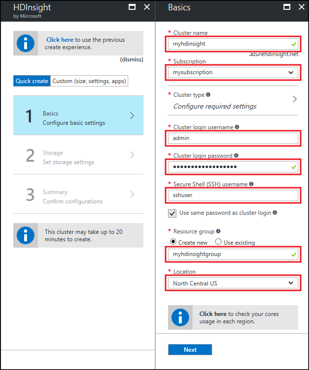
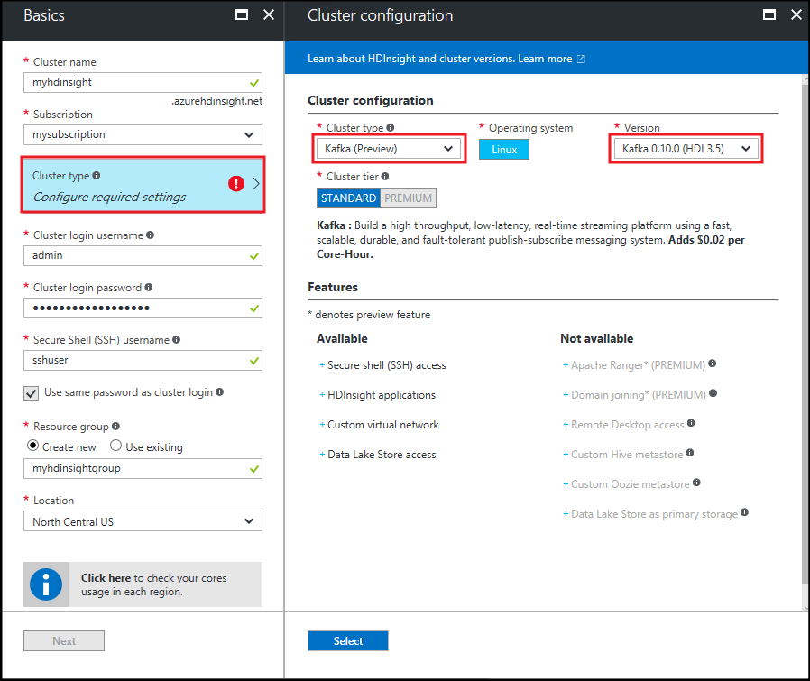
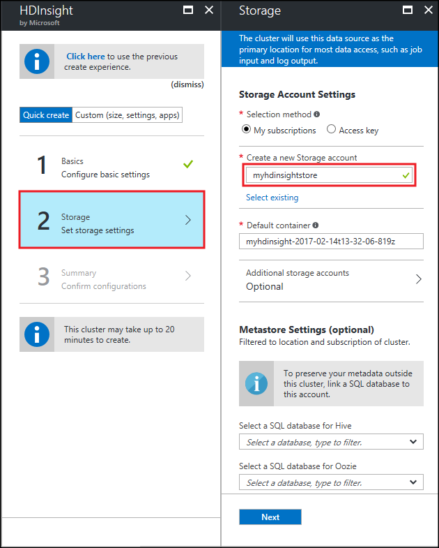
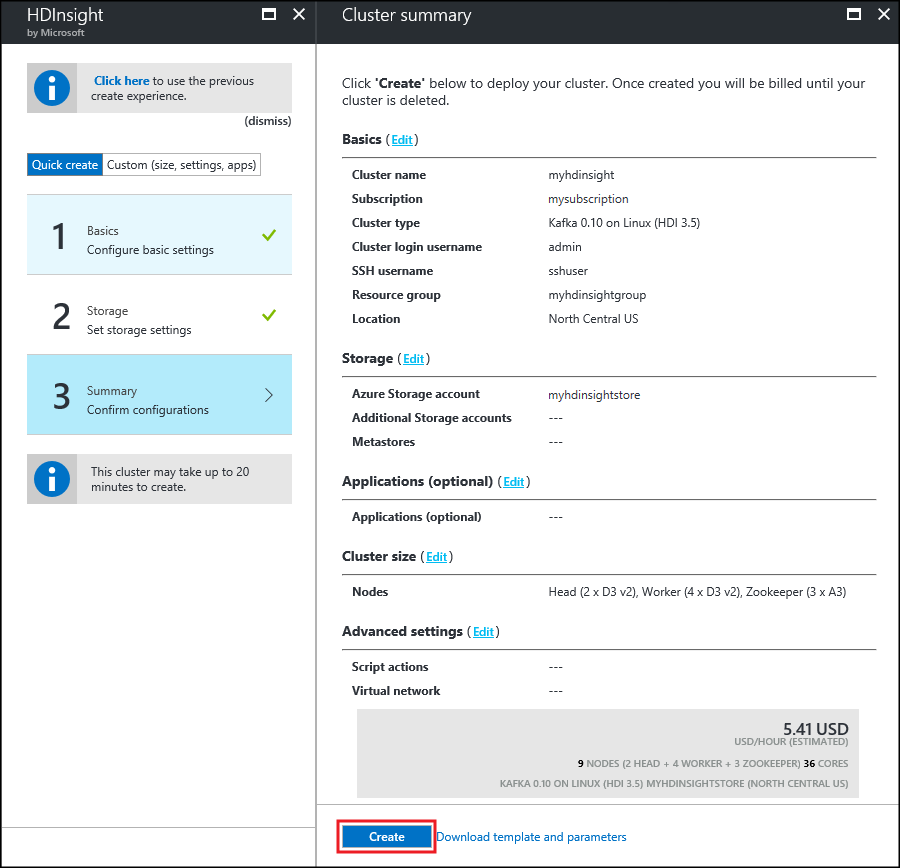

# <a name="get-started-with-apache-kafka-preview-on-hdinsight"></a>HDInsight 上的 Apache Kafka（预览版）入门

[Apache Kafka](https://kafka.apache.org) 是 HDInsight 随附的开源分布式流平台。 它提供类似于发布-订阅消息队列的功能，因此通常用作消息中转站。 本文档介绍如何创建 Kafka on HDInsight 群集，然后与 Java 应用程序相互发送和接收数据。

> [!NOTE]
> 目前，HDInsight 提供两个 Kafka 版本：0.9.0 (HDInsight 3.4) 和 0.10.0 (HDInsight 3.5)。 本文档中的步骤假设使用 HDInsight 3.5 上的 Kafka。

## <a name="prerequisite"></a>先决条件

[!INCLUDE [delete-cluster-warning](../../includes/hdinsight-delete-cluster-warning.md)]

必须具备以下条件才能成功完成本 Apache Kafka 教程：

* **一个 Azure 订阅**。 请参阅[获取 Azure 试用版](https://www.azure.cn/pricing/1rmb-trial/)。

* **熟悉 SSH 和 SCP**。 有关信息，请参阅[将 SSH 与 HDInsight 配合使用](hdinsight-hadoop-linux-use-ssh-unix.md)。

* [Java JDK 8](http://www.oracle.com/technetwork/java/javase/downloads/index.html) 或等效版本，如 OpenJDK。

* [Apache Maven](http://maven.apache.org/) 

## <a name="create-a-kafka-cluster"></a>创建 Kafka 群集

使用以下步骤可以创建 Kafka on HDInsight 群集：

1. 在 [Azure 门户预览](https://portal.azure.cn)中，依次选择“+ 新建”，、“智能 + 分析”、“HDInsight”。

    

2. 在“基本信息”  边栏选项卡中输入以下信息：

    * **群集名称**：HDInsight 群集的名称。
    * **订阅**：选择要使用的订阅。
    * **群集登录用户名**和**群集登录密码**：通过 HTTPS 访问群集时的登录凭据。 可以使用这些凭据访问 Ambari Web UI 或 REST API 等服务。
    * **安全外壳 (SSH) 用户名**：通过 SSH 访问群集时使用的登录名。 默认情况下，密码与群集登录密码相同。
    * **资源组**：要在其中创建群集的资源组。
    * **位置**：要在其中创建群集的 Azure 区域。

    

3. 选择“群集类型”，然后在“群集配置”边栏选项卡上设置以下值：

    * **群集类型**：Kafka

    * **版本**：Kafka 0.10.0 (HDI 3.5)

    * **群集层**：标准

    最后使用“选择”按钮保存设置。

    

    > [!NOTE]
    > 如果 Azure 订阅无权访问 Kafka 预览版，将显示有关如何获取预览版的访问权限的说明。 将显示类似于下图的说明：
    >
    > 

4. 选择群集类型后，请使用“选择”  按钮设置群集类型。 接下来，使用“下一步”  按钮完成基本配置。

5. 在“存储”  边栏选项卡中，选择或创建存储帐户。 对于本文档中介绍的步骤，将此边栏选项卡上的其他字段保留为默认值。 使用“下一步”  按钮保存存储配置。

    

6. 在“摘要”  边栏选项卡中，查看群集配置。 使用“编辑”链接更改不正确的设置。 最后，使用“创建”按钮创建群集。

    

    > [!NOTE]
    > 创建群集可能需要 20 分钟。

## <a name="connect-to-the-cluster"></a>连接至群集

在客户端中，使用 SSH 连接到群集。 如果使用的是 Linux、Unix、MacOS 或 Bash on Windows 10，请使用以下命令：

```ssh SSHUSER@CLUSTERNAME-ssh.azurehdinsight.cn```

将 **SSHUSER** 替换为创建群集期间提供的 SSH 用户名。 将 **CLUSTERNAME** 替换为群集的名称。

出现提示时，请输入 SSH 帐户使用的密码。

有关信息，请参阅[将 SSH 与 HDInsight 配合使用](hdinsight-hadoop-linux-use-ssh-unix.md)。

## <a id="getkafkainfo"></a>获取 Zookeeper 和中转站主机信息

使用 Kafka 时，必须知道两个主机值；*Zookeeper* 主机和*中转站*主机。 Kafka API 以及 Kafka 随附的许多实用工具都使用这些主机。

使用以下步骤创建包含主机信息的环境变量。 本文档中的步骤将使用这些环境变量。

1. 与群集建立 SSH 连接后，使用以下命令安装 `jq` 实用工具。 此实用工具用于分析 JSON 文档，在检索中转站主机信息时非常有用：

    ```bash
    sudo apt -y install jq
    ```

2. 使用以下命令设置环境变量，其中包含从 Ambari 检索到的信息。 将 __KAFKANAME__ 替换为 Kafka 群集的名称。 将 __PASSWORD__ 替换为创建群集时使用的登录（管理员）密码。

    ```bash
    export KAFKAZKHOSTS=`curl --silent -u admin:'PASSWORD' -G http://headnodehost:8080/api/v1/clusters/KAFKANAME/services/ZOOKEEPER/components/ZOOKEEPER_SERVER | jq -r '["\(.host_components[].HostRoles.host_name):2181"] | join(",")'`

    export KAFKABROKERS=`curl --silent -u admin:'PASSWORD' -G http://headnodehost:8080/api/v1/clusters/KAFKANAME/services/HDFS/components/DATANODE | jq -r '["\(.host_components[].HostRoles.host_name):9092"] | join(",")'`

    echo '$KAFKAZKHOSTS='$KAFKAZKHOSTS
    echo '$KAFKABROKERS='$KAFKABROKERS
    ```

    以下文本是 `$KAFKAZKHOSTS`的内容示例：

    `zk0-kafka.eahjefxxp1netdbyklgqj5y1ud.ex.internal.chinacloudapp.cn:2181,zk2-kafka.eahjefxxp1netdbyklgqj5y1ud.ex.internal.chinacloudapp.cn:2181,zk3-kafka.eahjefxxp1netdbyklgqj5y1ud.ex.internal.chinacloudapp.cn:2181`

    以下文本是 `$KAFKABROKERS`的内容示例：

    `wn1-kafka.eahjefxxp1netdbyklgqj5y1ud.cx.internal.chinacloudapp.cn:9092,wn0-kafka.eahjefxxp1netdbyklgqj5y1ud.cx.internal.chinacloudapp.cn:9092`

    > [!WARNING]
    > 请不要认为从此会话返回的信息总是准确的。 如果缩放群集，会相应地新增或删除中转站。 如果发生故障或更换了节点，节点的主机名可能会更改。 
    > 
    > 应在检索 Zookeeper 和中转站主机信息后尽快使用这些信息，确保信息有效。

## <a name="create-a-topic"></a>创建主题

Kafka 将数据流存储在名为 *主题*的类别中。 在与群集头节点建立 SSH 连接后，使用 Kafka 随附的脚本创建主题：

```bash
/usr/hdp/current/kafka-broker/bin/kafka-topics.sh --create --replication-factor 2 --partitions 8 --topic test --zookeeper $KAFKAZKHOSTS
```

此命令使用 `$KAFKAZKHOSTS`中存储的主机信息连接到 Zookeeper，然后创建名为 **test**的 Kafka 主题。 可以通过使用以下脚本列出主题，来验证是否已创建该 test 主题：

```bash
/usr/hdp/current/kafka-broker/bin/kafka-topics.sh --list --zookeeper $KAFKAZKHOSTS
```

此命令的输出将列出 Kafka 主题，其中包含 **test** 主题。

## <a name="produce-and-consume-records"></a>生成和使用记录

Kafka 将 *记录* 存储在主题中。 记录由*生成者*生成，由*使用者*使用。 生成者从 Kafka *中转站*检索记录。 HDInsight 群集中的每个辅助角色节点都是一个 Kafka 中转站。

使用以下步骤将记录存储到前面创建的 test 主题中，然后使用使用者读取这些记录：

1. 在 SSH 会话中，使用 Kafka 随附的脚本将记录写入主题：

    ```bash
    /usr/hdp/current/kafka-broker/bin/kafka-console-producer.sh --broker-list $KAFKABROKERS --topic test
    ```

    完成此命令后，不会返回到提示窗口。 而是键入一些文本消息，然后使用 **Ctrl + C** 停止发送到主题。 每行应作为单独的记录发送。

2. 使用 Kafka 随附的脚本从主题中读取记录：

    ```bash
    /usr/hdp/current/kafka-broker/bin/kafka-console-consumer.sh --zookeeper $KAFKAZKHOSTS --topic test --from-beginning
    ```

    这会从主题中检索并显示记录。 使用 `--from-beginning` 告知使用者要从流的开头开始读取，以便检索所有记录。

3. 使用 __Ctrl + C__ 停止使用者。

## <a name="producer-and-consumer-api"></a>生成者和使用者 API

可以使用 [Kafka API](http://kafka.apache.org/documentation#api)以编程方式生成和使用记录。 使用以下步骤下载并生成基于 Java 的生成者和使用者：

1. 从 [https://github.com/Azure-Samples/hdinsight-kafka-java-get-started](https://github.com/Azure-Samples/hdinsight-kafka-java-get-started)下载示例。 对于生成者/使用者示例，请使用 `Producer-Consumer` 目录中的项目。 本示例包含以下类：

    * **运行** - 启动使用者或生成者。

    * **Producer** - 将 1,000,000 条记录存储到主题。

    * **Consumer** - 从主题中读取记录。

2. 在开发环境中的命令行下，将目录切换到示例的 `Producer-Consumer` 目录所在位置，然后使用以下命令创建 jar 包：

    ```
    mvn clean package
    ```

    此命令创建名为 `target` 的目录，其中包含名为 `kafka-producer-consumer-1.0-SNAPSHOT.jar` 的文件。

3. 使用以下命令将 `kafka-producer-consumer-1.0-SNAPSHOT.jar` 文件复制到 HDInsight 群集：

    ```bash
    scp ./target/kafka-producer-consumer-1.0-SNAPSHOT.jar SSHUSER@CLUSTERNAME-ssh.azurehdinsight.cn:kafka-producer-consumer.jar
    ```

    将 **SSHUSER** 替换为群集的 SSH 用户，并将 **CLUSTERNAME** 替换为群集的名称。 出现提示时，请输入 SSH 用户的密码。

4. `scp` 命令完成文件复制后，请使用 SSH 连接到群集，然后使用以下命令将记录写入前面创建的 test 主题。

    ```bash
    ./kafka-producer-consumer.jar producer $KAFKABROKERS
    ```

    此命令将启动生成者并写入记录。 此时将显示一个计数器，方便你查看已写入了多少条记录。

    > [!NOTE]
    > 如果收到“权限被拒绝”错误，请使用以下命令将该文件设为可执行文件：```chmod +x kafka-producer-consumer.jar```

5. 完成该过程后，使用以下命令从主题中读取记录：

    ```bash
    ./kafka-producer-consumer.jar consumer $KAFKABROKERS
    ```

    将显示已读取的记录以及记录计数。 可以看到，记录的条目略超过 1,000,000 条，因为在前面的步骤中使用脚本向主题发送了数条记录。

6. 使用 __Ctrl + C__ 退出使用者。

### <a name="multiple-consumers"></a>多个使用者

Kafka 的一个重要概念是使用者在读取记录时使用使用者组（由组 ID 定义）。 对多个使用者使用相同的组会导致从主题进行负载均衡读取。 组中的每个使用者都会接收一部分记录。 若要在实际操作中了解此过程，请使用以下步骤：

1. 打开与群集的新 SSH 会话，以便建立两个会话。 在每个会话中运行以下命令，使用相同的使用者组 ID 启动使用者：

    ```bash
    ./kafka-producer-consumer.jar consumer $KAFKABROKERS mygroup
    ```

    > [!NOTE]
    > 由于这是一个新的 SSH 会话，因此必须使用[获取 Zookeeper 和中转站主机信息](#getkafkainfo)部分中的命令设置 `$KAFKABROKERS`。

2. 观察每个会话如何统计它从主题收到的记录。 两个会话的总数应与前面从一个使用者收到的数目相同。

同一个组中客户端的使用方式由主题的分区处理。 前面创建的 `test` 主题有 8 个分区。 如果打开 8 个 SSH 会话并在所有会话中启动使用者，每个使用者将从该主题的单个分区读取记录。

> [!IMPORTANT]
> 使用者组中的使用者实例数不能超过分区数。 在本示例中，一个使用者组最多可以包含 8 个使用者，因为这也是主题中的分区数。 或者，可以创建多个使用者组，但每个使用者组中的使用者不能超过 8 个。

Kafka 中存储的记录将按接收顺序存储在分区中。 若要 *在分区中*实现有序的记录传送，可以创建使用者实例数与分区数相匹配的使用者组。 若要 *在主题中*实现有序的记录传送，可以创建仅包含一个使用者实例的使用者组。

## <a name="streaming-api"></a>流式处理 API

流式处理 API 已添加到 Kafka 版本 0.10.0；早期版本依赖于 Apache Spark 或 Storm 进行流式处理。

1. 如果尚未执行此操作，请将 [https://github.com/Azure-Samples/hdinsight-kafka-java-get-started](https://github.com/Azure-Samples/hdinsight-kafka-java-get-started) 中的示例下载到开发环境。 对于流式处理示例，请使用 `streaming` 目录中的项目。

    此项目只包含一个类 (`Stream`)，该类从前面创建的 `test` 主题读取记录。 它将统计读取的单词数，并向名为 `wordcounts`的主题发出每个单词和计数。 本部分后面的步骤将创建 `wordcounts` 主题。

2. 在开发环境中的命令行下，将目录更换为 `Streaming` 目录所在的位置，然后使用以下命令创建 jar 包：

    ```
    mvn clean package
    ```

    此命令创建名为 `target` 的目录，其中包含名为 `kafka-streaming-1.0-SNAPSHOT.jar` 的文件。

3. 使用以下命令将 `kafka-streaming-1.0-SNAPSHOT.jar` 文件复制到 HDInsight 群集：

    ```bash
    scp ./target/kafka-streaming-1.0-SNAPSHOT.jar SSHUSER@CLUSTERNAME-ssh.azurehdinsight.cn:kafka-streaming.jar
    ```

    将 **SSHUSER** 替换为群集的 SSH 用户，并将 **CLUSTERNAME** 替换为群集的名称。 出现提示时，请输入 SSH 用户的密码。

4. `scp` 命令完成文件复制后，请使用 SSH 连接到群集，然后使用以下命令创建 `wordcounts` 主题：

    ```bash
    /usr/hdp/current/kafka-broker/bin/kafka-topics.sh --create --replication-factor 2 --partitions 8 --topic wordcounts --zookeeper $KAFKAZKHOSTS
    ```

5. 接下来，使用以下命令启动流式处理：

    ```bash
    ./kafka-streaming.jar $KAFKABROKERS $KAFKAZKHOSTS 2>/dev/null &
    ```

    此命令在后台启动流式处理。

6. 使用以下命令将消息发送到 `test` 主题。 流式处理示例将处理以下消息：

    ```bash
    ./kafka-producer-consumer.jar producer $KAFKABROKERS &>/dev/null &
    ```

7. 使用以下命令查看通过流式处理写入到 `wordcounts` 主题的输出：

    ```bash
    /usr/hdp/current/kafka-broker/bin/kafka-console-consumer.sh --zookeeper $KAFKAZKHOSTS --topic wordcounts --from-beginning --formatter kafka.tools.DefaultMessageFormatter --property print.key=true --property key.deserializer=org.apache.kafka.common.serialization.StringDeserializer --property value.deserializer=org.apache.kafka.common.serialization.LongDeserializer
    ```

    > [!NOTE]
    > 若要查看数据，必须告诉使用者要列显键以及用于键和值的反序列化程序。 键名称是文字，键值包含计数。

    输出类似于以下文本：

        dwarfs  13635
        ago     13664
        snow    13636
        dwarfs  13636
        ago     13665
        a       13803
        ago     13666
        a       13804
        ago     13667
        ago     13668
        jumped  13640
        jumped  13641
        a       13805
        snow    13637

    > [!NOTE]
    > 每遇到一个单词，此计数就会递增。

7. 使用 __Ctrl + C__ 让使用者退出，然后使用 `fg` 命令将流式处理后台任务恢复到前台。 另外，请使用 __Ctrl + C__ 退出操作。

## <a name="delete-the-cluster"></a>删除群集

[!INCLUDE [delete-cluster-warning](../../includes/hdinsight-delete-cluster-warning.md)]

## <a name="troubleshoot"></a>故障排除

如果在创建 HDInsight 群集时遇到问题，请参阅[访问控制要求](hdinsight-administer-use-portal-linux.md#create-clusters)。

## <a name="next-steps"></a>后续步骤

本文档已介绍有关使用 Apache Kafka on HDInsight 的基础知识。 请参阅以下资源了解有关使用 Kafka 的详细信息：

* [Apache Kafka 文档](http://kafka.apache.org/documentation.html) 。
* [使用 MirrorMaker 创建 Kafka on HDInsight 的副本](hdinsight-apache-kafka-mirroring.md)
* [将 Apache Storm 与 Kafka on HDInsight 结合使用](hdinsight-apache-storm-with-kafka.md)
* [将 Apache Spark 与 Kafka on HDInsight 结合使用](hdinsight-apache-spark-with-kafka.md)
* [通过 Azure 虚拟网络连接到 Kafka](hdinsight-apache-kafka-connect-vpn-gateway.md)

