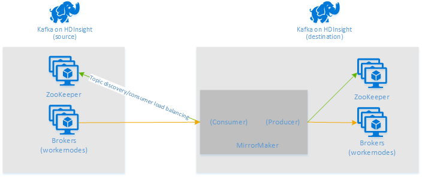
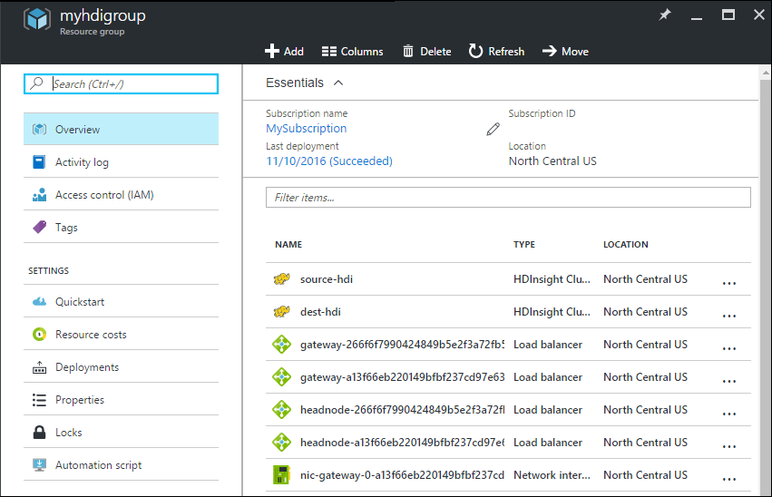

# <a name="use-mirrormaker-to-replicate-apache-kafka-topics-with-kafka-on-hdinsight-preview"></a>使用 MirrorMaker 通过 Kafka on HDInsight（预览）复制 Apache Kafka 主题

了解如何使用 Apache Kafka 镜像功能将主题复制到辅助群集。 镜像可以作为连续进程运行，也可间断式地用作将数据从一个群集迁移到另一个群集的方法。

在此示例中，镜像用于在两个 HDInsight 群集之间复制主题。 这两个群集位于同一区域的 Azure 虚拟网络中。

> [!WARNING]
> 不应将镜像视为实现容错的方法。 主题中项的偏移在源群集与目标群集之间有所不同，因此客户端不能换用这两种群集。
>
> 如果关心容错能力，应该为群集中的主题设置复制。 有关详细信息，请参阅 [Kafka on HDInsight 入门](hdinsight-apache-kafka-get-started.md)。

## <a name="how-kafka-mirroring-works"></a>Kafka 镜像的工作原理

镜像通过使用 MirrorMaker 工具（Apache Kafka 的一部分）来使用源群集上主题中的记录，然后在目标群集上创建本地副本。 MirrorMaker 使用一个或多个*使用者*从源群集读取记录，使用*生成者*将记录写入本地（目标）群集。

下图演示了镜像过程：



Apache Kafka on HDInsight 不提供通过公共 Internet 访问 Kafka 服务的权限。 Kafka 生成者或使用者必须与 Kafka 群集中的节点在同一 Azure 虚拟网络中。 对于此示例，Kafka 源和目标群集都位于 Azure 虚拟网络中。 下图显示了这两个群集之间的通信流：


源和目标集群在节点数和分区数上可能不同，并且主题内的偏移量也不同。 镜像维护用于分区的密钥值，因此会按密钥来保留记录顺序。

### <a name="mirroring-across-network-boundaries"></a>跨网络边界执行镜像操作

如果需要在不同网络中的 Kafka 群集之间执行镜像操作，还需要考虑以下注意事项：

* **网关**：网络必须能够在 TCPIP 级别通信。

* **名称解析**：每个网络中的 Kafka 群集必须能够使用主机名相互连接。 这可能需要在每个网络中设置一台域名系统 (DNS) 服务器，并将其配置为向其他网络转发请求。

    创建 Azure 虚拟网络时，请不要使用网络提供的自动 DNS，必须指定一台自定义 DNS 服务器以及该服务器的 IP 地址。 创建虚拟网络后，必须创建使用该 IP 地址的 Azure 虚拟机，并在该虚拟机上安装并配置 DNS 软件。

    > [!WARNING]
    > 在将 HDInsight 安装到虚拟网络之前，需先创建和配置自定义 DNS 服务器。 无需对 HDInsight 进行其他配置即可使用针对虚拟网络配置的 DNS 服务器。

有关连接两个 Azure 虚拟网络的详细信息，请参阅[配置 VNet 到 VNet 的连接](../vpn-gateway/vpn-gateway-vnet-vnet-rm-ps.md)。

## <a name="create-kafka-clusters"></a>创建 Kafka 群集

虽然可手动创建 Azure 虚拟网络和 Kafka 群集，但使用 Azure Resource Manager 模板会更简单。 使用以下步骤将 Azure 虚拟网络和两个 Kafka 群集部署到 Azure 订阅。

1. 使用以下按钮登录到 Azure，并在 Azure 门户中打开模板。

    <a href="https://portal.azure.cn/#create/Microsoft.Template/uri/https%3A%2F%2Fhditutorialdata.blob.core.windows.net%2Farmtemplates%2Fcreate-linux-based-kafka-mirror-cluster-in-vnet-v2.1.json" target="_blank"></a>

    Azure 资源管理器模板位于 https://hditutorialdata.blob.core.windows.net/armtemplates/create-linux-based-kafka-mirror-cluster-in-vnet-v2.1.json 中。

    > [!WARNING]
    > 若要确保 Kafka on HDInsight 的可用性，群集必须至少包含三个工作节点。 此模板创建的 Kafka 群集包含三个辅助角色节点。

2. 使用以下信息来填充“自定义部署”边栏选项卡上的项：

    

    * **资源组**：创建一个组或选择现有组。 此组包含 HDInsight 群集。

    * **位置**：选择在地理上邻近的位置。

    * **基群集名称**：此值将用作 Kafka 群集的基名称。 例如，输入 **hdi** 会创建名为 **source-hdi** 和 **dest-hdi** 的群集。

    * **群集登录用户名**：Kafka 源群集和目标群集的管理员用户名。

    * **群集登录密码**：Kafka 源群集和目标群集的管理员用户密码。

    * **SSH 用户名**：要为 Kafka 源群集和目标群集创建的 SSH 用户。

    * **SSH 密码**：源和目标 Kafka 群集的 SSH 用户的密码。

3. 阅读“条款和条件”，并选择“我同意上述条款和条件”。

4. 最后，选中“固定到仪表板”，并选择“购买”。 创建群集大约需要 20 分钟时间。

创建资源后，会重定向到包含群集和 Web 仪表板的资源组边栏选项卡。



> [!IMPORTANT]
> 请注意，HDInsight 群集的名称为 **source-BASENAME** 和 **dest-BASENAME**，其中 BASENAME 是为模板提供的名称。 在连接到群集的后续步骤中，会用到这些名称。

## <a name="create-topics"></a>创建主题

1. 使用 SSH 连接到 **源** 群集：

    ```bash
    ssh sshuser@source-BASENAME-ssh.azurehdinsight.cn
    ```

    用创建群集时使用的 SSH 用户名替换 **sshuser**。 将 **BASENAME** 替换为创建群集时使用的基名称。

    有关信息，请参阅[将 SSH 与 HDInsight 配合使用](hdinsight-hadoop-linux-use-ssh-unix.md)。

2. 使用以下命令查找源群集的 Zookeeper 主机：

    ```bash
    # Install jq if it is not installed
    sudo apt -y install jq
    # get the zookeeper hosts for the source cluster
    export SOURCE_ZKHOSTS=`curl -sS -u admin:$PASSWORD -G https://$CLUSTERNAME.azurehdinsight.cn/api/v1/clusters/$CLUSTERNAME/services/ZOOKEEPER/components/ZOOKEEPER_SERVER | jq -r '["\(.host_components[].HostRoles.host_name):2181"] | join(",")' | cut -d',' -f1,2`

    Replace `$PASSWORD` with the password for the cluster.

    Replace `$CLUSTERNAME` with the name of the source cluster.

3. To create a topic named `testtopic`, use the following command:

    ```bash
    /usr/hdp/current/kafka-broker/bin/kafka-topics.sh --create --replication-factor 2 --partitions 8 --topic testtopic --zookeeper $SOURCE_ZKHOSTS
    ```

3. 使用以下命令验证是否已创建主题：

    ```bash
    /usr/hdp/current/kafka-broker/bin/kafka-topics.sh --list --zookeeper $SOURCE_ZKHOSTS
    ```

    响应包含 `testtopic`。

4. 使用以下命令查看此（**源**）群集的 Zookeeper 主机信息：

    ```bash
    echo $SOURCE_ZKHOSTS
    ```

    这会返回类似于以下文本的信息：

    `zk0-source.aazwc2onlofevkbof0cuixrp5h.gx.internal.chinacloudapp.cn:2181,zk1-source.aazwc2onlofevkbof0cuixrp5h.gx.internal.chinacloudapp.cn:2181`

    请保存此信息。 下一部分会用到它。

## <a name="configure-mirroring"></a>配置镜像

1. 使用不同的 SSH 会话连接到 **目标** 群集：

    ```bash
    ssh sshuser@dest-BASENAME-ssh.azurehdinsight.cn
    ```

    用创建群集时使用的 SSH 用户名替换 **sshuser**。 将 **BASENAME** 替换为创建群集时使用的基名称。

    有关信息，请参阅[将 SSH 与 HDInsight 配合使用](hdinsight-hadoop-linux-use-ssh-unix.md)。

2. 使用以下命令创建一个 `consumer.properties` 文件，用于说明如何与 **源** 群集通信：

    ```bash
    nano consumer.properties
    ```

    使用以下文本作为 `consumer.properties` 文件的内容：

    ```yaml
    zookeeper.connect=SOURCE_ZKHOSTS
    group.id=mirrorgroup
    ```

    将 **SOURCE_ZKHOSTS** 替换为**源**群集中的 Zookeeper 主机信息。

    此文件说明从 Kafka 源群集读取记录时要使用的使用者信息。 有关使用者配置的详细信息，请参阅 kafka.apache.org 中的[使用者配置](https://kafka.apache.org/documentation#consumerconfigs)。

    若要保存文件，请使用 Ctrl+X、Y，然后按 Enter。

3. 配置与目标群集通信的创建器之前，必须找到**目标**群集的中转站主机。 使用以下命令检索此信息：

    ```bash
    sudo apt -y install jq
    DEST_BROKERHOSTS=`curl -sS -u admin:$PASSWORD -G https://$CLUSTERNAME.azurehdinsight.cn/api/v1/clusters/$CLUSTERNAME/services/KAFKA/components/KAFKA_BROKER | jq -r '["\(.host_components[].HostRoles.host_name):9092"] | join(",")' | cut -d',' -f1,2`
    echo $DEST_BROKERHOSTS
    ```

    将 `$PASSWORD` 替换为群集的登录帐户（管理员）密码。

    将 `$CLUSTERNAME` 替换为目标群集的名称。

    这些命令返回类似于下面的信息：

        wn0-dest.aazwc2onlofevkbof0cuixrp5h.gx.internal.chinacloudapp.cn:9092,wn1-dest.aazwc2onlofevkbof0cuixrp5h.gx.internal.chinacloudapp.cn:9092

4. 使用以下命令创建一个 `producer.properties` 文件，用于说明如何与 **目标** 群集通信：

    ```bash
    nano producer.properties
    ```

    使用以下文本作为 `producer.properties` 文件的内容：

    ```yaml
    bootstrap.servers=DEST_BROKERS
    compression.type=none
    ```

    将 **DEST_BROKERS** 替换为在上一步骤中获取的中转站信息。

    有关生成者配置的详细信息，请参阅 kafka.apache.org 上的 [Producer Configs](https://kafka.apache.org/documentation#producerconfigs) （生成者配置）。

## <a name="start-mirrormaker"></a>启动 MirrorMaker

1. 与 **目标** 群集建立 SSH 连接后，使用以下命令启动 MirrorMaker 进程：

    ```bash
    /usr/hdp/current/kafka-broker/bin/kafka-run-class.sh kafka.tools.MirrorMaker --consumer.config consumer.properties --producer.config producer.properties --whitelist testtopic --num.streams 4
    ```

    本示例中使用的参数为：

    * **--consumer.config**：指定包含使用者属性的文件。 这些属性用于创建可从 *源* Kafka 群集读取记录的使用者。

    * **--producer.config**：指定包含生成者属性的文件。 这些属性用于创建可向 *目标* Kafka 群集写入记录的生成者。

    * **--whitelist**：MirrorMaker 从源群集复制到目标的主题列表。

    * **--num.streams**：要创建的使用者线程数。

    启动时，MirrorMaker 返回类似于以下文本的信息：

    ```json
    {metadata.broker.list=wn1-source.aazwc2onlofevkbof0cuixrp5h.gx.internal.chinacloudapp.cn:9092,wn0-source.aazwc2onlofevkbof0cuixrp5h.gx.internal.chinacloudapp.cn:9092, request.timeout.ms=30000, client.id=mirror-group-3, security.protocol=PLAINTEXT}{metadata.broker.list=wn1-source.aazwc2onlofevkbof0cuixrp5h.gx.internal.chinacloudapp.cn:9092,wn0-source.aazwc2onlofevkbof0cuixrp5h.gx.internal.chinacloudapp.cn:9092, request.timeout.ms=30000, client.id=mirror-group-0, security.protocol=PLAINTEXT}
    metadata.broker.list=wn1-source.aazwc2onlofevkbof0cuixrp5h.gx.internal.chinacloudapp.cn:9092,wn0-kafka.aazwc2onlofevkbof0cuixrp5h.gx.internal.chinacloudapp.cn:9092, request.timeout.ms=30000, client.id=mirror-group-2, security.protocol=PLAINTEXT}
    metadata.broker.list=wn1-source.aazwc2onlofevkbof0cuixrp5h.gx.internal.chinacloudapp.cn:9092,wn0-source.aazwc2onlofevkbof0cuixrp5h.gx.internal.chinacloudapp.cn:9092, request.timeout.ms=30000, client.id=mirror-group-1, security.protocol=PLAINTEXT}
    ```

2. 与 **源** 群集建立 SSH 连接后，使用以下命令启动生成者，并向主题发送消息：

    ```bash
    SOURCE_BROKERHOSTS=`curl -sS -u admin:$PASSWORD -G https://$CLUSTERNAME.azurehdinsight.cn/api/v1/clusters/$CLUSTERNAME/services/KAFKA/components/KAFKA_BROKER | jq -r '["\(.host_components[].HostRoles.host_name):9092"] | join(",")' | cut -d',' -f1,2`
    /usr/hdp/current/kafka-broker/bin/kafka-console-producer.sh --broker-list $SOURCE_BROKERHOSTS --topic testtopic
    ```

    将 `$PASSWORD` 替换为源群集的登录（管理员）密码。

    将 `$CLUSTERNAME` 替换为源群集的名称。

     出现带有光标的空行时，请键入几条文本消息。 这些消息发送到 **源** 群集上的主题。 完成后，按 **Ctrl + C** 结束生成者进程。

3. 从**目标**群集的 SSH 连接开始，使用 **Ctrl + C** 结束 MirrorMaker 进程。 然后使用以下命令验证是否已创建 `testtopic` 主题，以及该主题中的数据是否已复制到此镜像：

    ```bash
    DEST_ZKHOSTS=`curl -sS -u admin:$PASSWORD -G https://$CLUSTERNAME.azurehdinsight.cn/api/v1/clusters/$CLUSTERNAME/services/ZOOKEEPER/components/ZOOKEEPER_SERVER | jq -r '["\(.host_components[].HostRoles.host_name):2181"] | join(",")' | cut -d',' -f1,2`
    /usr/hdp/current/kafka-broker/bin/kafka-topics.sh --list --zookeeper $DEST_ZKHOSTS
    /usr/hdp/current/kafka-broker/bin/kafka-console-consumer.sh --zookeeper $DEST_ZKHOSTS --topic testtopic --from-beginning
    ```

    将 `$PASSWORD` 替换为目标群集的登录（管理员）密码。

    将 `$CLUSTERNAME` 替换为目标群集的名称。

    主题列表现在包含 `testtopic`，该条目在 MirrorMaster 将主题从源群集镜像到目标时创建。 从主题检索到的消息与在源群集上输入的消息相同。

## <a name="delete-the-cluster"></a>删除群集

[!INCLUDE [delete-cluster-warning](../../includes/hdinsight-delete-cluster-warning.md)]

由于本文档中的步骤在相同的 Azure 资源组中创建两个群集，因此可在 Azure 门户中删除资源组。 删除资源组会删除按照本文档创建的所有资源（Azure 虚拟网络和群集使用的存储帐户）。

## <a name="next-steps"></a>后续步骤

本文档已介绍如何使用 MirrorMaker 创建 Kafka 群集的副本。 请使用以下链接探索 Kafka 的其他用法：

* [Apache Kafka MirrorMaker 文档](https://cwiki.apache.org/confluence/pages/viewpage.action?pageId=27846330) 。
* [Apache Kafka on HDInsight 入门](hdinsight-apache-kafka-get-started.md)
* [将 Apache Spark 与 Kafka on HDInsight 结合使用](hdinsight-apache-spark-with-kafka.md)
* [将 Apache Storm 与 Kafka on HDInsight 结合使用](hdinsight-apache-storm-with-kafka.md)
* [通过 Azure 虚拟网络连接到 Kafka](hdinsight-apache-kafka-connect-vpn-gateway.md)
