# <a name="apache-spark-streaming-process-data-from-azure-event-hubs-with-spark-cluster-on-hdinsight"></a>Apache Spark 流式处理：在 HDInsight 上使用 Spark 群集处理来自 Azure 事件中心的数据

本文将创建一个涉及以下步骤的 Apache Spark 流式处理示例：

1. 使用独立的应用程序将消息引入 Azure 事件中心。

2. 通过两种不同的方法，使用 Azure HDInsight 上的 Spark 群集中运行的应用程序从事件中心实时检索消息。

3. 生成流式处理分析管道，用于在不同的存储系统中持久保存数据，或者基于数据获得即时见解。

## <a name="prerequisites"></a>先决条件

* Azure 订阅。 请参阅[获取 Azure 试用版](https://www.azure.cn/pricing/1rmb-trial/)。

* HDInsight 上的 Apache Spark 群集。 有关说明，请参阅[在 Azure HDInsight 中创建 Apache Spark 群集](hdinsight-apache-spark-jupyter-spark-sql.md)。

## <a name="spark-streaming-concepts"></a>Spark 流式处理的概念

有关 Spark 流式处理的详细说明，请参阅 [Apache Spark 流式处理概述](http://spark.apache.org/docs/latest/streaming-programming-guide.html#overview)。 HDInsight 将相同的流式处理功能引入到 Azure 上的 Spark 群集。  

## <a name="what-does-this-solution-do"></a>此解决方案有哪些功能？

在本文中，若要创建 Spark 流式处理示例，请执行以下步骤：

1. 创建用于接收事件流的 Azure 事件中心。

2. 运行一个本地独立应用程序，以便生成事件并将其推送到 Azure 事件中心。 [https://github.com/hdinsight/spark-streaming-data-persistence-examples](https://github.com/hdinsight/spark-streaming-data-persistence-examples) 网页中发布了一个用于执行此操作的示例应用程序。

3. 在 Spark 群集上远程运行一个流式处理应用程序，用于从 Azure 事件中心读取流式处理事件以及执行各种数据处理/分析。

## <a name="create-an-azure-event-hub"></a>创建 Azure 事件中心

1. 登录到 [Azure 门户](https://portal.azure.cn)，然后单击屏幕左上角的“新建”。

2. 单击“物联网”，并单击“事件中心”。

    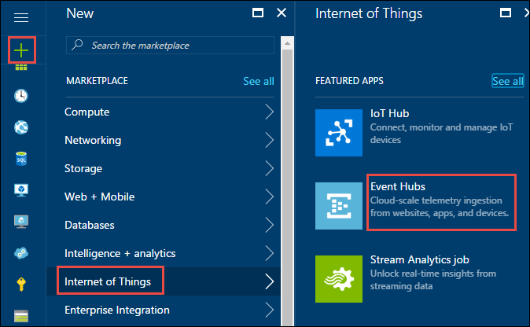

3. 在“创建命名空间”  边栏选项卡中，输入命名空间名称。 选择定价层（基本或标准）。 另外，请选择一个 Azure 订阅、资源组以及要创建该资源的位置。 单击“创建”  创建命名空间。

      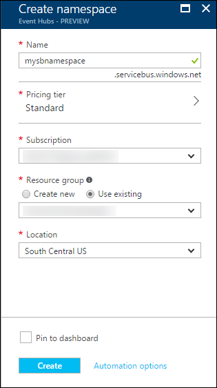

    > [!NOTE]
       > 应选择与 HDInsight 中 Apache Spark 群集相同的“位置”，以降低延迟和成本。
       >
       >

4. 在“事件中心”命名空间列表中，单击新创建的命名空间。      

5. 在命名空间边栏选项卡中，单击“事件中心”，并单击“+ 事件中心”创建新的事件中心。

    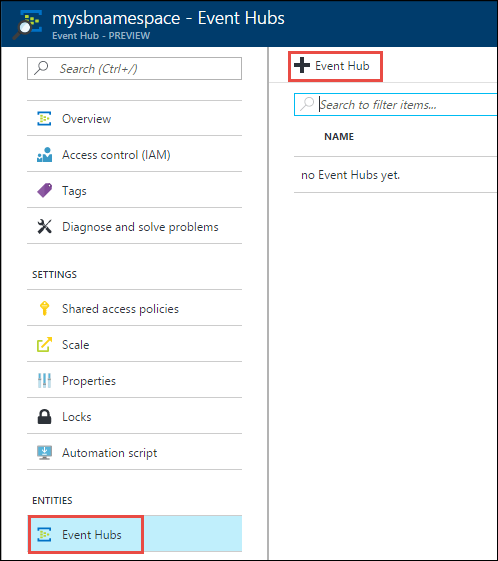

6. 键入事件中心的名称，将分区计数设置为 10，将消息保留期设置为 1。 我们不会存档此解决方案中的消息，因此可以将其余设置保留为默认值，并单击“创建”。

    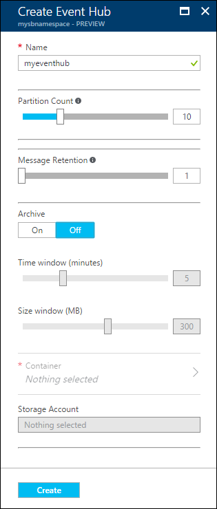

7. 新创建的事件中心的事件中心边栏选项卡中列出。

     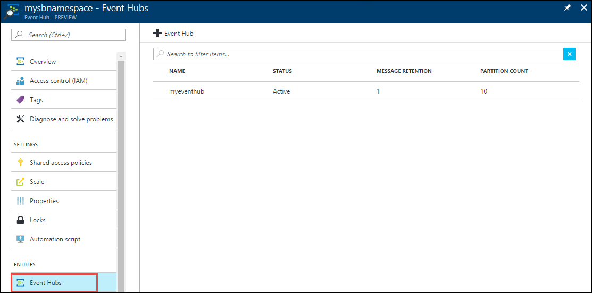

8. 返回命名空间边栏选项卡（不是特定的事件中心边栏选项卡），单击“共享访问策略”，并单击“RootManageSharedAccessKey”。

     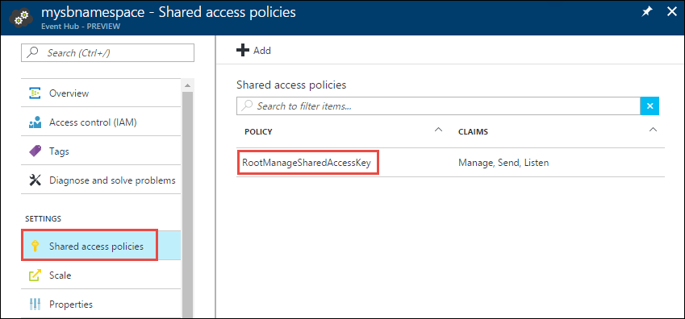

9. 单击复制按钮，将 **RootManageSharedAccessKey** 主密钥和连接字符串复制到剪贴板。 保存这些设置，以便在本教程稍后使用。

     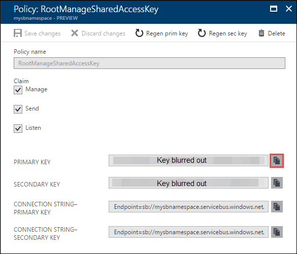

## <a name="send-messages-to-azure-event-hub-using-a-sample-scala-application"></a>使用 Scala 示例应用程序将消息发送到 Azure 事件中心

本部分使用独立的本地 Scala 应用程序生成事件流并将其发送到前面创建的 Azure 事件中心。 可从 GitHub 获取此应用程序，网址为：[https://github.com/hdinsight/eventhubs-sample-event-producer](https://github.com/hdinsight/eventhubs-sample-event-producer)。 以下步骤假设已复制此 GitHub 存储库。

1. 确保已在运行此应用程序的计算机上安装以下组件。

    * Oracle Java 开发工具包。 可以从 [此处](http://www.oracle.com/technetwork/java/javase/downloads/jdk8-downloads-2133151.html)安装它。
    * Apache Maven。 可以从[此处](https://maven.apache.org/download.cgi)下载它。 [此处](https://maven.apache.org/install.html)提供了有关安装 Maven 的说明。

2. 打开命令提示符并导航到将示例 Scala 应用程序的 GitHub 存储库克隆到的位置，然后运行以下命令生成应用程序。

        mvn package

3. **target** 目录下创建了应用程序的输出 jar **com-microsoft-azure-eventhubs-client-example-0.2.0.jar**。 稍后将在本文中使用此 JAR 来测试整个解决方案。

## <a name="create-application-to-receive-messages-from-event-hub-into-a-spark-cluster"></a>创建用于在 Spark 群集中从事件中心接收消息的应用程序 

我们提供了两种方法用于连接 Spark 流式处理和 Azure 事件中心：基于接收方的连接和基于 Direct-DStream 的连接。 基于 Direct-DStream 的连接在 2017 年 1 月发布的版本 2.0.3 中引入。 这种连接有望取代原始的基于接收方的连接，因为它的性能更高，并且能够更高效地利用资源。 [https://github.com/hdinsight/spark-eventhubs](https://github.com/hdinsight/spark-eventhubs) 中提供了更多详细信息。 Direct DStream 仅支持 Spark 2.0+。

### <a name="build-applications-with-the-dependency-to-spark-eventhubs-connector"></a>生成依赖于 spark-eventhubs 连接器的应用程序

我们还将在 GitHub 中发布 Spark-EventHubs 的过渡版本。 若要使用 Spark-EventHubs 的过渡版本，第一步是通过在 pom.xml 中添加以下条目，将 GitHub 指定为源存储库：

```xml
<repository>
      <id>spark-eventhubs</id>
      <url>https://raw.github.com/hdinsight/spark-eventhubs/maven-repo/</url>
      <snapshots>
        <enabled>true</enabled>
        <updatePolicy>always</updatePolicy>
      </snapshots>
</repository>
```

然后，可将以下依赖项添加到项目，以利用预发布的版本。

Maven 依赖项

```xml
<!-- https://mvnrepository.com/artifact/com.microsoft.azure/spark-streaming-eventhubs_2.11 -->
<dependency>
    <groupId>com.microsoft.azure</groupId>
    <artifactId>spark-streaming-eventhubs_2.11</artifactId>
    <version>2.0.4</version>
</dependency>
```

SBT 依赖项

```
// https://mvnrepository.com/artifact/com.microsoft.azure/spark-streaming-eventhubs_2.11
libraryDependencies += "com.microsoft.azure" % "spark-streaming-eventhubs_2.11" % "2.0.4"
```

### <a name="direct-dstream-connection"></a>Direct DStream 连接

可在 [http://central.maven.org/maven2/com/microsoft/azure/spark-streaming-eventhubs_2.11/2.0.4/spark-streaming-eventhubs_2.11-2.0.4.jar](http://central.maven.org/maven2/com/microsoft/azure/spark-streaming-eventhubs_2.11/2.0.4/spark-streaming-eventhubs_2.11-2.0.4.jar) 中下载一个预生成的 jar 文件，其中包含使用 Direct DStream 的示例。

该 jar 文件包含三个示例，[https://github.com/hdinsight/spark-eventhubs/tree/master/examples/src/main/scala/com/microsoft/spark/streaming/examples/directdstream](https://github.com/hdinsight/spark-eventhubs/tree/master/examples/src/main/scala/com/microsoft/spark/streaming/examples/directdstream) 中提供了这些示例的源代码。

以 [WindowingWordCount](https://github.com/hdinsight/spark-eventhubs/blob/master/examples/src/main/scala/com/microsoft/spark/streaming/examples/directdstream/WindowingWordCount.scala) 为例：

```scala
private def createStreamingContext(
  sparkCheckpointDir: String,
  batchDuration: Int,
  namespace: String,
  eventHunName: String,
  eventhubParams: Map[String, String],
  progressDir: String) = {
val ssc = new StreamingContext(new SparkContext(), Seconds(batchDuration))
ssc.checkpoint(sparkCheckpointDir)
val inputDirectStream = EventHubsUtils.createDirectStreams(
  ssc,
  namespace,
  progressDir,
  Map(eventHunName -> eventhubParams))

inputDirectStream.map(receivedRecord => (new String(receivedRecord.getBody), 1)).
  reduceByKeyAndWindow((v1, v2) => v1 + v2, (v1, v2) => v1 - v2, Seconds(batchDuration * 3),
    Seconds(batchDuration)).print()

ssc
}

def main(args: Array[String]): Unit = {

if (args.length != 8) {
  println("Usage: program progressDir PolicyName PolicyKey EventHubNamespace EventHubName" +
    " BatchDuration(seconds) Spark_Checkpoint_Directory maxRate")
  sys.exit(1)
}

val progressDir = args(0)
val policyName = args(1)
val policykey = args(2)
val namespace = args(3)
val name = args(4)
val batchDuration = args(5).toInt
val sparkCheckpointDir = args(6)
val maxRate = args(7)

val eventhubParameters = Map[String, String] (
  "eventhubs.policyname" -> policyName,
  "eventhubs.policykey" -> policykey,
  "eventhubs.namespace" -> namespace,
  "eventhubs.name" -> name,
  "eventhubs.partition.count" -> "32",
  "eventhubs.consumergroup" -> "$Default",
  "eventhubs.maxRate" -> s"$maxRate"
)

val ssc = StreamingContext.getOrCreate(sparkCheckpointDir,
  () => createStreamingContext(sparkCheckpointDir, batchDuration, namespace, name,
    eventhubParameters, progressDir))

ssc.start()
ssc.awaitTermination()
}
```

在上面的示例中，`eventhubParameters` 是特定于单个 EventHubs 实例的参数，必须将其传递给 `createDirectStreams` API，用于构造 Direct DStream 对象到事件中心命名空间的映射。 通过 Direct DStream 对象，可以调用 Spark 流式处理 API 框架提供的任何 DStream API。 此示例在最后 3 个宏批处理间隔内计算每个单词的出现频率。

### <a name="receiver-based-connection"></a>基于接收方的连接

[https://github.com/hdinsight/spark-streaming-data-persistence-examples](https://github.com/hdinsight/spark-streaming-data-persistence-examples) 中提供了用于接收事件并将其路由到不同目标的，以 Scala 编写的 Spark 流式处理示例应用程序。 请遵循以下步骤更新应用程序的事件中心配置并创建输出 jar。

1. 启动 IntelliJ IDEA，在启动屏幕中选择“从版本控制签出”，并单击“Git”。

    

2. 在“克隆存储库”对话框中，提供要从中克隆的 Git 存储库的 URL，指定要克隆到的目录，并单击“克隆”。

    
3. 按照提示操作，直到项目克隆完成。 按 **Alt+1** 打开“项目视图”。 其内容应如下所示。

    
4. 请确保使用 Java8 编译应用程序代码。 如果要确保这点，请单击“文件”、“项目结构”，并在“项目”选项卡上，确保将项目语言级别设置为“8 - Lambdas，类型批注等”。

    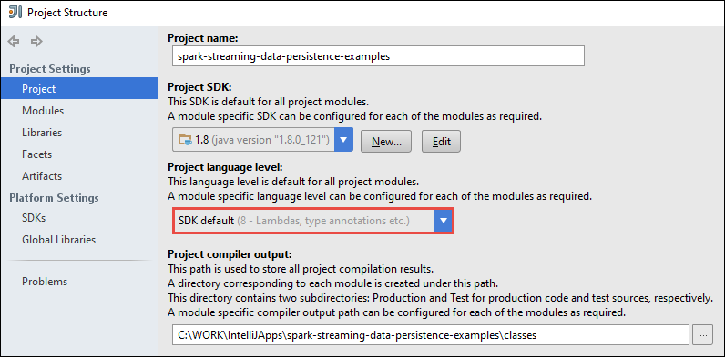
5. 打开 **pom.xml** 并确保 Spark 版本正确。 在 `<properties>` 节点下查找以下代码片段，并检查 Spark 版本。

        <scala.version>2.11.8</scala.version>
        <scala.compat.version>2.11.8</scala.compat.version>
        <scala.binary.version>2.11</scala.binary.version>
        <spark.version>2.0.0</spark.version>

6. 应用程序需要调用一个依赖项 jar **JDBC 驱动程序 jar**。 必须有此 jar，才能将事件中心发来的消息写入 Azure SQL 数据库。 可从[此处](https://msdn.microsoft.com/sqlserver/aa937724.aspx)下载此 jar 文件（v4.1 或更高版本）。 在项目库中添加对此 jar 的引用。 执行以下步骤：

     1. 在已打开应用程序的 IntelliJ IDEA 窗口中，依次单击“文件”、“项目结构”和“库”。 
     2. 单击添加图标（），单击“Java”，并导航到 JDBC 驱动程序 jar 所下载到的位置。 按照提示将 jar 文件添加到项目库。

         
     3. 单击“应用” 。

7. 创建输出 jar 文件。 执行以下步骤。

   1. 在“项目结构”对话框中，单击“项目”，并单击加号。 在弹出的对话框中，单击“JAR”，并单击“从包含依赖项的模块”。      

       
   2. 在“从模块创建 JAR”对话框中，单击“主类”旁边的省略号 ()。
   3. 在“选择主类”对话框中，选择任何可用的类，并单击“确定”。

       
   4. 在“从模块创建 JAR”对话框中，确保已选择“提取到目标 JAR”选项，并单击“确定”。 这会创建包含所有依赖项的单个 JAR。

       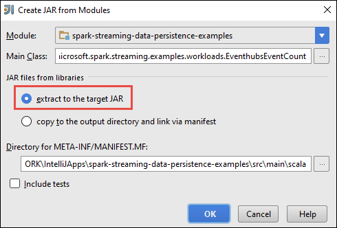
   5. “输出布局”选项卡列出了所有包含为 Maven 项目一部分的 jar。 可以选择并删除 Scala 应用程序不直接依赖的 jar。 对于此处创建的应用程序，可以删除最后一个（**spark-streaming-data-persistence-examples 编译输出**）以外的所有 jar。 选择要删除的 jar，并单击“删除”图标 ()。

       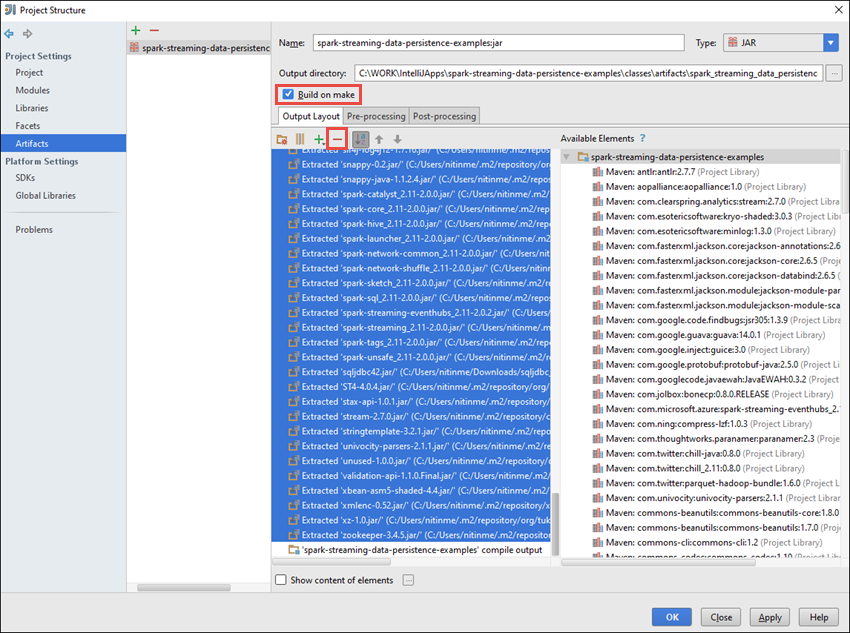

       请务必选中“在创建时生成”框，以确保每次生成或更新项目时都创建 jar。 单击“应用” 。
   6. 在“输出布局”选项卡中的“可用元素”框右下角，显示了前面添加到项目库中的 SQL JDBC jar。 必须将此 jar 添加到“输出布局”选项卡。右键单击该 jar 文件，并单击“提取到输出根目录中”。

       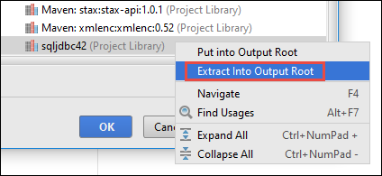  

       “输出布局”选项卡现在应如下所示。

       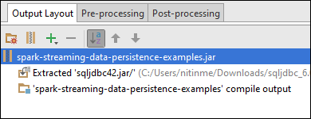        

       在“项目结构”对话框中，单击“应用”，并单击“确定”。    
   7. 在菜单栏中单击“生成”，并单击“创建项目”。 也可以单击“生成项目”以创建 jar。 输出 jar 在 **\classes\artifacts** 下创建。

       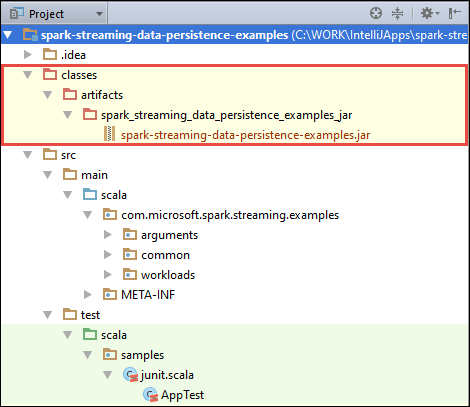

## <a name="run-the-application-remotely-on-a-spark-cluster-using-livy"></a>使用 Livy 在 Spark 群集上远程运行应用程序

本文使用 Livy 在 Spark 群集上远程运行 Apache Spark 流式处理应用程序。 有关如何在 HDInsight Spark 群集上使用 Livy 的详细介绍，请参阅[向 Azure HDInsight 上的 Apache Spark 群集远程提交作业](hdinsight-apache-spark-livy-rest-interface.md)。 在开始运行 Spark 流式处理应用程序之前，必须完成一些准备工作：

1. 启动本地独立应用程序，以生成事件并将其发送到事件中心。 使用以下命令来执行此操作：

        java -cp com-microsoft-azure-eventhubs-client-example-0.2.0.jar com.microsoft.eventhubs.client.example.EventhubsClientDriver --eventhubs-namespace "mysbnamespace" --eventhubs-name "myeventhub" --policy-name "mysendpolicy" --policy-key "<policy key>" --message-length 32 --thread-count 32 --message-count -1

2. 将流式 jar (**spark-streaming-data-persistence-examples.jar**) 复制到与群集关联的 Azure Blob 存储。 这样，jar 便可供 Livy 访问。 可以使用命令行实用工具 [**AzCopy**](../storage/common/storage-use-azcopy.md) 来执行此操作。 可以使用其他许多客户端来上传数据。 有关详细信息，请参阅[在 HDInsight 中上传 Hadoop 作业的数据](hdinsight-upload-data.md)。
3. 将 CURL 安装在要运行这些应用程序的计算机上。 我们将使用 CURL 来调用 Livy 终结点，以远程运行作业。

### <a name="run-the-spark-streaming-application-to-receive-the-events-into-an-azure-storage-blob-as-text"></a>运行 Spark 流式处理应用程序，将事件以文本形式接收到 Azure 存储 Blob 中

打开命令提示符，导航到安装 CURL 的目录，并运行以下命令（替换用户名/密码和群集名称）：

    curl -k --user "admin:mypassword1!" -v -H "Content-Type: application/json" -X POST --data @C:\Temp\inputBlob.txt "https://mysparkcluster.azurehdinsight.cn/livy/batches"

文件 **inputBlob.txt** 中的参数定义如下：

    { "file":"wasb:///example/jars/spark-streaming-data-persistence-examples.jar", "className":"com.microsoft.spark.streaming.examples.workloads.EventhubsEventCount", "args":["--eventhubs-namespace", "mysbnamespace", "--eventhubs-name", "myeventhub", "--policy-name", "myreceivepolicy", "--policy-key", "<put-your-key-here>", "--consumer-group", "$default", "--partition-count", 10, "--batch-interval-in-seconds", 20, "--checkpoint-directory", "/EventCheckpoint", "--event-count-folder", "/EventCount/EventCount10"], "numExecutors":20, "executorMemory":"1G", "executorCores":1, "driverMemory":"2G" }

让我们了解输入文件中包含哪些参数：

* **file** 是与群集关联的 Azure 存储帐户上的应用程序 jar 文件的路径。
* **className** 是 jar 中的类名。
* **args** 是类所需的参数列表
* **numExecutors** 是 Spark 用于运行流应用程序的核心数。 此数目始终至少应为事件中心分区数的两倍。
* **executorMemory**、**executorCores**、**driverMemory** 是用于将所需资源分配给流式应用程序的参数。

> [!NOTE]
> 不需要创建用作参数的输出文件夹（EventCheckpoint、EventCount/EventCount10）。 流应用程序为你进行创建。
>
>

运行命令时，应会看到类似于下面的输出：

    < HTTP/1.1 201 Created
    < Content-Type: application/json; charset=UTF-8
    < Location: /18
    < Server: Microsoft-IIS/8.5
    < X-Powered-By: ARR/2.5
    < X-Powered-By: ASP.NET
    < Date: Tue, 01 Dec 2015 05:39:10 GMT
    < Content-Length: 37
    <
    {"id":1,"state":"starting","log":[]}* Connection #0 to host mysparkcluster.azurehdinsight.cn left intact

请记下位于输出中最后一行的批 ID（在本示例中为“1”）。 若要验证应用程序是否已成功运行，可以查看与群集关联的 Azure 存储帐户，应会看到该处已创建 **/EventCount/EventCount10** 文件夹。 此文件夹应包含相关的 Blob，其中捕获了在为参数 **batch-interval-in-seconds**指定的时段内所处理的事件数。

Spark 流式处理应用程序将继续运行，直到被终止。 若要终止，请使用以下命令：

    curl -k --user "admin:mypassword1!" -v -X DELETE "https://mysparkcluster.azurehdinsight.cn/livy/batches/1"

### <a name="run-the-applications-to-receive-the-events-into-an-azure-storage-blob-as-json"></a>运行应用程序以将事件以 JSON 形式接收到 Azure 存储 Blob 中
打开命令提示符，导航到安装 CURL 的目录，并运行以下命令（替换用户名/密码和群集名称）：

    curl -k --user "admin:mypassword1!" -v -H "Content-Type: application/json" -X POST --data @C:\Temp\inputJSON.txt "https://mysparkcluster.azurehdinsight.cn/livy/batches"

文件 **inputJSON.txt** 中的参数定义如下：

    { "file":"wasb:///example/jars/spark-streaming-data-persistence-examples.jar", "className":"com.microsoft.spark.streaming.examples.workloads.EventhubsToAzureBlobAsJSON", "args":["--eventhubs-namespace", "mysbnamespace", "--eventhubs-name", "myeventhub", "--policy-name", "myreceivepolicy", "--policy-key", "<put-your-key-here>", "--consumer-group", "$default", "--partition-count", 10, "--batch-interval-in-seconds", 20, "--checkpoint-directory", "/EventCheckpoint", "--event-count-folder", "/EventCount/EventCount10", "--event-store-folder", "/EventStore10"], "numExecutors":20, "executorMemory":"1G", "executorCores":1, "driverMemory":"2G" }

这些参数类似于在前一步骤中为文本输出指定的参数。 同样，不需要创建用作参数的输出文件夹（EventCheckpoint、EventCount/EventCount10）。 流应用程序为你进行创建。

 在运行该命令之后，可以查看与群集关联的 Azure 存储帐户，可看到该处已创建 **/EventStore10** 文件夹。 打开前缀为 **part-** 的任一文件，可看到以 JSON 格式处理的事件。

### <a name="run-the-applications-to-receive-the-events-into-a-hive-table"></a>运行应用程序以将事件接收到 Hive 表中
若要运行将事件流式传输到 Hive 表中的 Spark 流式处理应用程序，需要其他一些组件。 其中包括：

* datanucleus-api-jdo-3.2.6.jar
* datanucleus-rdbms-3.2.9.jar
* datanucleus-core-3.2.10.jar
* hive-site.xml

这些 **.jar** 文件位于 HDInsight Spark 群集上：`/usr/hdp/current/spark-client/lib`。 **hive-site.xml** 位于 `/usr/hdp/current/spark-client/conf` 上。

可以使用 [WinScp](http://winscp.net/eng/download.php) 将这些文件从群集复制到本地计算机。 然后，可以使用工具将这些文件复制到与群集关联的存储帐户。 有关如何将文件上传到存储帐户的详细信息，请参阅[在 HDInsight 中上传 Hadoop 作业的数据](hdinsight-upload-data.md)。

将文件复制到 Azure 存储帐户之后，请打开命令提示符，导航到安装 CURL 的目录，并运行以下命令（替换用户名/密码和群集名称）：

    curl -k --user "admin:mypassword1!" -v -H "Content-Type: application/json" -X POST --data @C:\Temp\inputHive.txt "https://mysparkcluster.azurehdinsight.cn/livy/batches"

文件 **inputHive.txt** 中的参数定义如下：

    { "file":"wasb:///example/jars/spark-streaming-data-persistence-examples.jar", "className":"com.microsoft.spark.streaming.examples.workloads.EventhubsToHiveTable", "args":["--eventhubs-namespace", "mysbnamespace", "--eventhubs-name", "myeventhub", "--policy-name", "myreceivepolicy", "--policy-key", "<put-your-key-here>", "--consumer-group", "$default", "--partition-count", 10, "--batch-interval-in-seconds", 20, "--checkpoint-directory", "/EventCheckpoint", "--event-count-folder", "/EventCount/EventCount10", "--event-hive-table", "EventHiveTable10" ], "jars":["wasb:///example/jars/datanucleus-api-jdo-3.2.6.jar", "wasb:///example/jars/datanucleus-rdbms-3.2.9.jar", "wasb:///example/jars/datanucleus-core-3.2.10.jar"], "files":["wasb:///example/jars/hive-site.xml"], "numExecutors":20, "executorMemory":"1G", "executorCores":1, "driverMemory":"2G" }

这些参数类似于在前面步骤中为文本输出指定的参数。 同样，不需要创建用作参数的输出文件夹（EventCheckpoint、EventCount/EventCount10）或输出 Hive 表 (EventHiveTable10)。 流应用程序为你进行创建。 请注意，**jars** 和 **files** 选项包含已复制到存储帐户的 .jar 文件和 hive-site.xml 的路径。

如果要验证是否已成功创建 Hive 表，可通过 SSH 连接到群集，并运行 Hive 查询。 有关说明，请参阅[通过 SSH 在 HDInsight 中将 Hive 与 Hadoop 配合使用](hdinsight-hadoop-use-hive-ssh.md)。 当使用 SSH 建立连接后，可以运行以下命令，以验证是否已创建 Hive 表 **EventHiveTable10**。

    show tables;

应该会看到与下面类似的输出：

    OK
    eventhivetable10
    hivesampletable

还可以运行 SELECT 查询来查看表的内容。

    SELECT * FROM eventhivetable10 LIMIT 10;

应该看到如下输出：

    ZN90apUSQODDTx7n6Toh6jDbuPngqT4c
    sor2M7xsFwmaRW8W8NDwMneFNMrOVkW1
    o2HcsU735ejSi2bGEcbUSB4btCFmI1lW
    TLuibq4rbj0T9st9eEzIWJwNGtMWYoYS
    HKCpPlWFWAJILwR69MAq863nCWYzDEw6
    Mvx0GQOPYvPR7ezBEpIHYKTKiEhYammQ
    85dRppSBSbZgThLr1s0GMgKqynDUqudr
    5LAWkNqorLj3ZN9a2mfWr9rZqeXKN4pF
    ulf9wSFNjD7BZXCyunozecov9QpEIYmJ
    vWzM3nvOja8DhYcwn0n5eTfOItZ966pa
    Time taken: 4.434 seconds, Fetched: 10 row(s)

### <a name="run-the-applications-to-receive-the-events-into-an-azure-sql-database-table"></a>运行应用程序以将事件接收到 Azure SQL 数据库表中
在运行此步骤之前，请确保已创建 Azure SQL 数据库。 有关说明，请参阅[快速创建 SQL 数据库](../sql-database/sql-database-get-started.md)。 若要完成本部分，需要指定数据库名称、数据库服务器名称和数据库管理员凭据的值作为参数。 但是，不需要创建数据库表。 Spark 流式处理应用程序将创建该表。

打开命令提示符，导航到安装 CURL 的目录，并运行以下命令：

    curl -k --user "admin:mypassword1!" -v -H "Content-Type: application/json" -X POST --data @C:\Temp\inputSQL.txt "https://mysparkcluster.azurehdinsight.cn/livy/batches"

文件 **inputSQL.txt** 中的参数定义如下：

    { "file":"wasb:///example/jars/spark-streaming-data-persistence-examples.jar", "className":"com.microsoft.spark.streaming.examples.workloads.EventhubsToAzureSQLTable", "args":["--eventhubs-namespace", "mysbnamespace", "--eventhubs-name", "myeventhub", "--policy-name", "myreceivepolicy", "--policy-key", "<put-your-key-here>", "--consumer-group", "$default", "--partition-count", 10, "--batch-interval-in-seconds", 20, "--checkpoint-directory", "/EventCheckpoint", "--event-count-folder", "/EventCount/EventCount10", "--sql-server-fqdn", "<database-server-name>.database.chinacloudapi.cn", "--sql-database-name", "mysparkdatabase", "--database-username", "sparkdbadmin", "--database-password", "<put-password-here>", "--event-sql-table", "EventContent" ], "numExecutors":20, "executorMemory":"1G", "executorCores":1, "driverMemory":"2G" }

若要验证应用程序是否已成功运行，可以使用 SQL Server Management Studio 连接到 Azure SQL 数据库。 有关如何执行该操作的说明，请参阅[使用 SQL Server Management Studio 连接到 SQL 数据库](../sql-database/sql-database-connect-query-ssms.md)。 连接到数据库之后，可以导航到流应用程序所创建的 **EventContent** 表。 可以运行快速查询以获取该表中的数据。 运行以下查询：

    SELECT * FROM EventCount

应该会看到与下面类似的输出：

    00046b0f-2552-4980-9c3f-8bba5647c8ee
    000b7530-12f9-4081-8e19-90acd26f9c0c
    000bc521-9c1b-4a42-ab08-dc1893b83f3b
    00123a2a-e00d-496a-9104-108920955718
    0017c68f-7a4e-452d-97ad-5cb1fe5ba81b
    001KsmqL2gfu5ZcuQuTqTxQvVyGCqPp9
    001vIZgOStka4DXtud0e3tX7XbfMnZrN
    00220586-3e1a-4d2d-a89b-05c5892e541a
    0029e309-9e54-4e1b-84be-cd04e6fce5ec
    003333cf-874f-4045-9da3-9f98c2b4ea49
    0043c07e-8d73-420a-9af7-1fcb94575356
    004a11a9-0c2c-4bc0-a7d5-2e0ebd947ab9

## <a name="seealso"></a>另请参阅
* [概述：Azure HDInsight 上的 Apache Spark](hdinsight-apache-spark-overview.md)
* [基于接收方的连接和 Direct DStream 的设计](https://www.slideshare.net/NanZhu/seattle-sparkmeetup032317)

### <a name="scenarios"></a>方案
* [Spark 和 BI：使用 HDInsight 中的 Spark 和 BI 工具执行交互式数据分析](hdinsight-apache-spark-use-bi-tools.md)
* [Spark 和机器学习：使用 HDInsight 中的 Spark 对使用 HVAC 数据生成温度进行分析](hdinsight-apache-spark-ipython-notebook-machine-learning.md)
* [Spark 和机器学习：使用 HDInsight 中的 Spark 预测食品检查结果](hdinsight-apache-spark-machine-learning-mllib-ipython.md)
* [使用 HDInsight 中的 Spark 分析网站日志](hdinsight-apache-spark-custom-library-website-log-analysis.md)

### <a name="create-and-run-applications"></a>创建和运行应用程序
* [使用 Scala 创建独立的应用程序](hdinsight-apache-spark-create-standalone-application.md)
* [使用 Livy 在 Spark 群集中远程运行作业](hdinsight-apache-spark-livy-rest-interface.md)

### <a name="tools-and-extensions"></a>工具和扩展
* [使用用于 IntelliJ IDEA 的 HDInsight 工具插件创建和提交 Spark Scala 应用程序](hdinsight-apache-spark-intellij-tool-plugin.md)
* [使用用于 IntelliJ IDEA 的 HDInsight 工具插件远程调试 Spark 应用程序](hdinsight-apache-spark-intellij-tool-plugin-debug-jobs-remotely.md)
* [在 HDInsight 上的 Spark 群集中使用 Zeppelin 笔记本](hdinsight-apache-spark-zeppelin-notebook.md)
* [在 HDInsight 的 Spark 群集中可用于 Jupyter 笔记本的内核](hdinsight-apache-spark-jupyter-notebook-kernels.md)
* [Use external packages with Jupyter notebooks（将外部包与 Jupyter 笔记本配合使用）](hdinsight-apache-spark-jupyter-notebook-use-external-packages.md)
* [Install Jupyter on your computer and connect to an HDInsight Spark cluster（在计算机上安装 Jupyter 并连接到 HDInsight Spark 群集）](hdinsight-apache-spark-jupyter-notebook-install-locally.md)

### <a name="manage-resources"></a>管理资源
* [管理 Azure HDInsight 中 Apache Spark 群集的资源](hdinsight-apache-spark-resource-manager.md)
* [Track and debug jobs running on an Apache Spark cluster in HDInsight（跟踪和调试 HDInsight 中的 Apache Spark 群集上运行的作业）](hdinsight-apache-spark-job-debugging.md)

[hdinsight-versions]: hdinsight-component-versioning.md
[hdinsight-upload-data]: hdinsight-upload-data.md
[hdinsight-storage]: hdinsight-hadoop-use-blob-storage.md

[azure-purchase-options]: https://www.azure.cn/pricing/overview/
[azure-member-offers]: https://www.azure.cn/pricing/member-offers/
[azure-trial]: https://www.azure.cn/pricing/1rmb-trial/
[azure-create-storageaccount]: ../storage/storage-create-storage-account.md
<!--Update_Description: update storage link and change 'wasbs' into 'wasb'-->