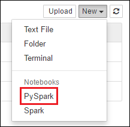

# 在 HDInsight 上的 Apache Spark 群集中使用建本操作安装适用于 Jupyter 笔记本的外部 Python 包
> [!div class="op_single_selector"]
>- [使用单元 magic](./hdinsight-apache-spark-jupyter-notebook-use-external-packages.md)
>- [使用脚本操作](./hdinsight-apache-spark-python-package-installation.md)

了解如何使用脚本操作在 HDInsight (Linux) 上配置 Apache Spark 群集，以使用未现成包含在群集中的、由社区贡献的 **python** 外部包。

> [!NOTE]
> 此外可以通过使用 `%%configure` magic 配置 Jupyter 笔记本以使用外部包。请参阅[在 HDInsight 上的 Apache Spark 群集中将外部包与 Jupyter 笔记本配合使用](./hdinsight-apache-spark-jupyter-notebook-use-external-packages.md)，了解相关说明。
> 
> 

可以在[包索引](https://pypi.python.org/pypi)中搜索可用包的完整列表。也可以从其他源获取可用包的列表。例如，可以安装通过 [Anaconda](https://docs.continuum.io/anaconda/pkg-docs) 或 [conda-forge](https://conda-forge.github.io/feedstocks.html) 提供的包。

本文将介绍如何使用脚本操作在群集上安装 [TensorFlow](https://www.tensorflow.org/) 包并通过 Jupyter 笔记本使用它。

## 先决条件
必须满足以下条件：

* Azure 订阅。请参阅[获取 Azure 试用版](https://www.azure.cn/pricing/1rmb-trial/)。
* HDInsight 上的 Apache Spark 群集。有关说明，请参阅[在 Azure HDInsight 中创建 Apache Spark 群集](./hdinsight-apache-spark-jupyter-spark-sql.md)。

    > [!NOTE]
    > 如果 HDInsight Linux 上还没有 Spark 群集，则可以在群集创建过程中运行脚本操作。访问有关[如何使用自定义脚本操作](./hdinsight-hadoop-customize-cluster-linux.md)的文档。
    > 
    > 

## 将外部包与 Jupyter 笔记本配合使用

1. 在 [Azure 门户](https://portal.azure.cn/)上的启动板中，单击 Spark 群集的磁贴（如果已将它固定到启动板）。也可以在“全部浏览”>“HDInsight 群集”下导航到你的群集。

2. 在 Spark 群集边栏选项卡中，单击“使用情况”下的“脚本操作”。运行用于在头节点和工作节点中安装 TensorFlow 的自定义操作。可以参考 https://hdiconfigactions.blob.core.windows.net/linuxtensorflow/tensorflowinstall.sh 中的 bash 脚本；访问有关[如何使用自定义脚本操作](./hdinsight-hadoop-customize-cluster-linux.md)的文档。

    > [!NOTE]
    > 群集中有两个 python 安装。Spark 将使用位于 `/usr/bin/anaconda/bin` 中的 Anaconda python 安装。通过 `/usr/bin/anaconda/bin/pip` 和 `/usr/bin/anaconda/bin/conda` 在自定义操作中引用该安装。
    > 
    > 

3. 打开 PySpark Jupyter 笔记本

      

4. 新笔记本随即已创建，并以 Untitled.pynb 名称打开。在顶部单击笔记本名称，然后输入一个友好名称。

      

5. 现在将`import tensorflow` 并运行 hello world 示例。

    要复制的代码：

    ```
    import tensorflow as tf
    hello = tf.constant('Hello, TensorFlow!')
    sess = tf.Session()
    print(sess.run(hello))
    ```

    结果将如下所示：

      

## <a name="seealso"></a>另请参阅
* [概述：Azure HDInsight 上的 Apache Spark](./hdinsight-apache-spark-overview.md)

### 方案
* [Spark 和 BI：使用 HDInsight 中的 Spark 和 BI 工具执行交互式数据分析](./hdinsight-apache-spark-use-bi-tools.md)
* [Spark 和机器学习：使用 HDInsight 中的 Spark 对使用 HVAC 数据生成温度进行分析](./hdinsight-apache-spark-ipython-notebook-machine-learning.md)
* [Spark 和机器学习：使用 HDInsight 中的 Spark 预测食品检查结果](./hdinsight-apache-spark-machine-learning-mllib-ipython.md)
* [Spark 流式处理：使用 HDInsight 中的 Spark 生成实时流式处理应用程序](./hdinsight-apache-spark-eventhub-streaming.md)
* [使用 HDInsight 中的 Spark 分析网站日志](./hdinsight-apache-spark-custom-library-website-log-analysis.md)

### 创建和运行应用程序
* [使用 Scala 创建独立的应用程序](./hdinsight-apache-spark-create-standalone-application.md)
* [使用 Livy 在 Spark 群集中远程运行作业](./hdinsight-apache-spark-livy-rest-interface.md)

### 工具和扩展
* [在 HDInsight 上的 Apache Spark 群集中将外部包与 Jupyter 笔记本配合使用](./hdinsight-apache-spark-jupyter-notebook-use-external-packages.md)
* [在 HDInsight 上的 Spark 群集中使用 Zeppelin 笔记本](./hdinsight-apache-spark-use-zeppelin-notebook.md)
* [在 HDInsight 的 Spark 群集中可用于 Jupyter 笔记本的内核](./hdinsight-apache-spark-jupyter-notebook-kernels.md)
* [Install Jupyter on your computer and connect to an HDInsight Spark cluster（在计算机上安装 Jupyter 并连接到 HDInsight Spark 群集）](./hdinsight-apache-spark-jupyter-notebook-install-locally.md)

### 管理资源
* [管理 Azure HDInsight 中 Apache Spark 群集的资源](./hdinsight-apache-spark-resource-manager.md)
* [跟踪和调试 HDInsight 中的 Apache Spark 群集上运行的作业](./hdinsight-apache-spark-job-debugging.md)

<!---HONumber=Mooncake_0320_2017-->
<!--Update_Description: add note about other magic, and add selector-->