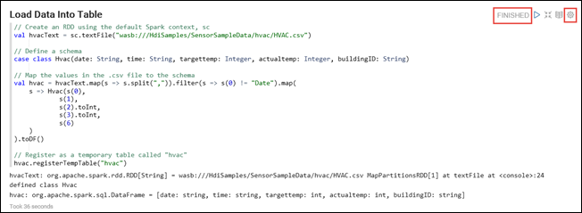
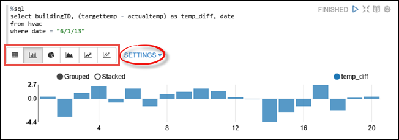
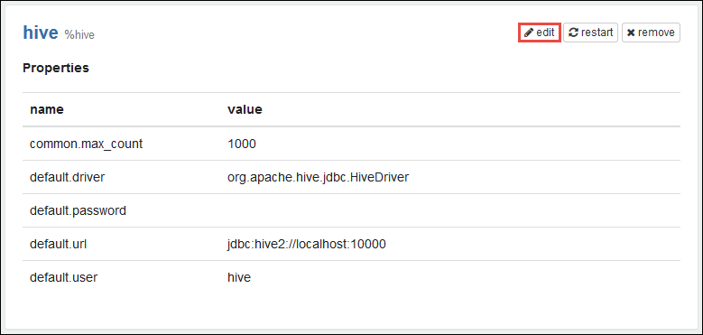
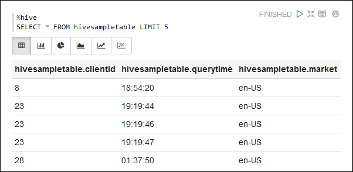

# 为 HDInsight 上的 Apache Spark 群集安装 Zeppelin 笔记本

了解如何在 Apache Spark 群集上安装 Zeppelin 笔记本，以及如何使用 Zeppelin 笔记本运行 Spark 作业。

[!INCLUDE [hdinsight-linux-acn-version.md](../../includes/hdinsight-linux-acn-version.md)]

> [!IMPORTANT]
> 如果已在 HDInsight 3.5 上预配 Spark 1.6 群集，默认情况下可以按照[在 HDInsight Linux 上将 Zeppelin 笔记本与 Apache Spark 群集配合使用](hdinsight-apache-spark-zeppelin-notebook.md)中的说明，访问 Zeppelin。 如果要使用 HDInsight 群集版本 3.3 或 3.4 上的 Zeppelin，则必须按照本文中的说明安装 Zeppelin。
>
> 不支持使用本文中的脚本在 Spark 2.0 群集上安装 Zeppelin。

## 先决条件

* 必须拥有 Azure 订阅。 请参阅[获取 Azure 试用版](https://www.azure.cn/pricing/1rmb-trial/)。
* HDInsight 上的 Apache Spark 群集。 有关说明，请参阅[在 Azure HDInsight 中创建 Apache Spark 群集](hdinsight-apache-spark-jupyter-spark-sql.md)。

## 在 Spark 群集上安装 Zeppelin
可以使用脚本操作在 Spark 群集上安装 Zeppelin。 脚本操作使用自定义脚本在群集上安装默认情况下未提供的组件。 可以使用自定义脚本，通过 Azure 门户、HDInsight .NET SDK 或 Azure PowerShell 安装 Zeppelin。 可以在创建群集过程中或者在群集已启动并运行之后使用脚本安装 Zeppelin。 以下部分中的链接提供了有关如何执行此操作的说明。

### 使用 Azure 门户
有关如何使用 Azure 门户运行脚本操作安装 Zeppelin 的说明，请参阅 [Customize HDInsight clusters using Script Action](hdinsight-hadoop-customize-cluster-linux.md#use-a-script-action-during-cluster-creation)（使用脚本操作自定义 HDInsight 群集）。 必须对该文章中的说明做出一些更改。

* 必须使用脚本来安装 Zeppelin。 用于在 HDInsight 中的 Spark 群集上安装 Zeppelin 的自定义脚本可从以下链接获取：

    * 对于 Spark 1.6.0 群集 - `https://hdiconfigactions.blob.core.windows.net/linuxincubatorzeppelinv01/install-zeppelin-spark160-v01.sh`
    * 对于 Spark 1.5.2 群集 - `https://hdiconfigactions.blob.core.windows.net/linuxincubatorzeppelinv01/install-zeppelin-spark151-v01.sh`
* 只能在头节点上运行脚本操作。
* 该脚本不需要任何参数。

### 使用 HDInsight .NET SDK
有关如何使用 HDInsight .NET SDK 运行脚本操作以安装 Zeppelin 的说明，请参阅[使用脚本操作自定义 HDInsight 群集](hdinsight-hadoop-customize-cluster-linux.md#use-a-script-action-during-cluster-creation)。 必须对该文章中的说明做出一些更改。

* 必须使用脚本来安装 Zeppelin。 用于在 HDInsight 中的 Spark 群集上安装 Zeppelin 的自定义脚本可从以下链接获取：

    * 对于 Spark 1.6.0 群集 - `https://hdiconfigactions.blob.core.windows.net/linuxincubatorzeppelinv01/install-zeppelin-spark160-v01.sh`
    * 对于 Spark 1.5.2 群集 - `https://hdiconfigactions.blob.core.windows.net/linuxincubatorzeppelinv01/install-zeppelin-spark151-v01.sh`
* 该脚本不需要任何参数。
* 将你要创建的群集类型设置为 Spark。

### 使用 Azure PowerShell
使用以下 PowerShell 代码段在已安装 Zeppelin 的 HDInsight Linux 上创建 Spark 群集。 根据所用的 Spark 群集版本，必须更新以下 PowerShell 代码段，以包含相应自定义脚本的链接。

* 对于 Spark 1.6.0 群集 - `https://hdiconfigactions.blob.core.windows.net/linuxincubatorzeppelinv01/install-zeppelin-spark160-v01.sh`
* 对于 Spark 1.5.2 群集 - `https://hdiconfigactions.blob.core.windows.net/linuxincubatorzeppelinv01/install-zeppelin-spark151-v01.sh`

[!INCLUDE [upgrade-powershell](../../includes/hdinsight-use-latest-powershell.md)]

    Login-AzureRMAccount

    # PROVIDE VALUES FOR THE VARIABLES
    $clusterAdminUsername="admin"
    $clusterAdminPassword="<<password>>"
    $clusterSshUsername="adminssh"
    $clusterSshPassword="<<password>>"
    $clusterName="<<clustername>>"
    $clusterContainerName=$clusterName
    $resourceGroupName="<<resourceGroupName>>"
    $location="<<region>>"
    $storage1Name="<<storagename>>"
    $storage1Key="<<storagekey>>"
    $subscriptionId="<<subscriptionId>>"

    Select-AzureRmSubscription -SubscriptionId $subscriptionId

    $passwordAsSecureString=ConvertTo-SecureString $clusterAdminPassword -AsPlainText -Force
    $clusterCredential=New-Object System.Management.Automation.PSCredential ($clusterAdminUsername, $passwordAsSecureString)
    $passwordAsSecureString=ConvertTo-SecureString $clusterSshPassword -AsPlainText -Force
    $clusterSshCredential=New-Object System.Management.Automation.PSCredential ($clusterSshUsername, $passwordAsSecureString)

    $azureHDInsightConfigs= New-AzureRmHDInsightClusterConfig -ClusterType Spark
    $azureHDInsightConfigs.DefaultStorageAccountKey = $storage1Key
    $azureHDInsightConfigs.DefaultStorageAccountName = "$storage1Name.blob.core.chinacloudapi.cn"

    Add-AzureRMHDInsightScriptAction -Config $azureHDInsightConfigs -Name "Install Zeppelin" -NodeType HeadNode -Parameters "void" -Uri "https://hdiconfigactions.blob.core.windows.net/linuxincubatorzeppelinv01/install-zeppelin-spark151-v01.sh"

    New-AzureRMHDInsightCluster -Config $azureHDInsightConfigs -OSType Linux -HeadNodeSize "Standard_D12" -WorkerNodeSize "Standard_D12" -ClusterSizeInNodes 2 -Location $location -ResourceGroupName $resourceGroupName -ClusterName $clusterName -HttpCredential $clusterCredential -DefaultStorageContainer $clusterContainerName -SshCredential $clusterSshCredential -Version "3.5"

## 访问 Zeppelin 笔记本

使用脚本操作成功安装 Zeppelin 后，可以按照以下步骤，在 Spark 群集上访问 Zeppelin 笔记本。 本部分介绍如何运行 %sql 和 %hive 语句。

1. 从 Web 浏览器打开以下终结点：

        https://CLUSTERNAME.azurehdinsight.cn/zeppelin

2. 创建新的笔记本。 在标题窗格中单击“笔记本”，然后单击“创建新笔记”。

    

    在同一页面上的“笔记本”标题下，你应会看到名称以**笔记 XXXXXXXXX** 开头的新笔记本。 单击该新笔记本。
3. 单击新笔记本网页的标题，并根据需要更改笔记本的名称。 按 ENTER 保存名称更改。 此外，请确保笔记本标题在右上角显示“已连接”状态  。

    

### 运行 SQL 语句
1. 将示例数据载入临时表。 在 HDInsight 中创建 Spark 群集时，系统会将示例数据文件 **hvac.csv** 复制到 **\HdiSamples\SensorSampleData\hvac** 下的关联存储帐户。

    将以下代码段粘贴到新笔记本中默认创建的空白段落处。

        // Create an RDD using the default Spark context, sc
        val hvacText = sc.textFile("wasbs:///HdiSamples/HdiSamples/SensorSampleData/hvac/HVAC.csv")

        // Define a schema
        case class Hvac(date: String, time: String, targettemp: Integer, actualtemp: Integer, buildingID: String)

        // Map the values in the .csv file to the schema
        val hvac = hvacText.map(s => s.split(",")).filter(s => s(0) != "Date").map(
            s => Hvac(s(0),
                    s(1),
                    s(2).toInt,
                    s(3).toInt,
                    s(6)
            )
        ).toDF()

        // Register as a temporary table called "hvac"
        hvac.registerTempTable("hvac")

    按 **Shift + Enter** 或单击“播放”按钮，使段落运行代码段。 段落右上角的状态应从“就绪”逐渐变成“挂起”、“正在运行”和“已完成”。 输出将显示在同一段落的底部。 屏幕截图如下所示：

    

    你也可以为每个段落提供标题。 在右下角单击“设置”图标，然后单击“显示标题”。
2. 现在可以针对 **hvac** 表运行 Spark SQL 语句。 将以下查询粘贴到新段落中。 该查询将检索建筑物 ID，以及每栋建筑物在指定日期的目标温度与实际温度之间的差异。 按 **Shift + Enter**。

        %sql
        select buildingID, (targettemp - actualtemp) as temp_diff, date
        from hvac
        where date = "6/1/13"

    开头的 **%sql** 语句告诉笔记本要使用Spark SQL 解释程序。 可从笔记本标题中的“解释程序”选项卡查看已定义的解释程序。

    以下屏幕快照显示了输出。

    

     单击显示选项（以矩形突出显示）以针对相同输出切换不同的表示形式。 单击“设置”以选择构成输出中的键和值的项。 以上屏幕截图使用 **buildingID** 作为键，使用 **temp_diff** 平均值作为值。
3. 你还可以在查询中使用变量来运行 Spark SQL 语句。 下一个代码段演示如何在查询中使用你可以用来查询的值定义 **Temp**变量。 当你首次运行查询时，下拉列表中会自动填充你指定的变量值。

        %sql
        select buildingID, date, targettemp, (targettemp - actualtemp) as temp_diff
        from hvac
        where targettemp > "${Temp = 65,65|75|85}"

    将此代码段粘贴到新段落，然后按 **SHIFT + ENTER**。 以下屏幕快照显示了输出。

    

    对于后续查询，可以从下拉列表中选择新的值，然后再次运行查询。 单击“设置”以选择构成输出中的键和值的项。 以上屏幕截图使用 **buildingID** 作为密钥，使用 **temp_diff** 平均值作为值，使用 **targettemp** 作为组。
4. 重新启动 Spark SQL 解释程序以退出应用程序。 单击顶部的“解释程序”选项卡，然后针对 Spark 解释程序单击“重新启动”。

    

### 运行 hive 语句
1. 在 Zeppelin 笔记本中，单击“解释程序”按钮。

    
2. 单击 **hive** 解释程序对应的“编辑”。

    

    更新以下属性。

    * 将 **default.password** 设置为创建 HDInsight Spark 群集时为管理员用户指定的密码。
    * 将 **default.url** 设置为 `jdbc:hive2://<spark_cluster_name>.azurehdinsight.cn:443/default;ssl=true?hive.server2.transport.mode=http;hive.server2.thrift.http.path=/hive2`。 将 **\<spark_cluster_name>** 替换为 Spark 群集的名称。
    * 将 **default.user** 设置为创建群集时指定的管理员用户名。 例如 *admin*。
3. 单击“保存”，当系统提示重新启动 hive 解释程序时，请单击“确定”。
4. 创建新笔记本并运行以下语句，列出群集上的所有 hive 表。

        %hive
        SHOW TABLES

    默认情况下，HDInsight 群集包含名为 **hivesampletable** 的示例表，因此应会出现以下输出。

    
5. 运行以下语句列出表中的记录。

        %hive
        SELECT * FROM hivesampletable LIMIT 5

    此时应出现如下所示的输出。

    

## 另请参阅
* [概述：Azure HDInsight 上的 Apache Spark](hdinsight-apache-spark-overview.md)

### 方案
* [Spark 和 BI：使用 HDInsight 中的 Spark 和 BI 工具执行交互式数据分析](hdinsight-apache-spark-use-bi-tools.md)
* [Spark 和机器学习：使用 HDInsight 中的 Spark 对使用 HVAC 数据生成温度进行分析](hdinsight-apache-spark-ipython-notebook-machine-learning.md)
* [Spark 和机器学习：使用 HDInsight 中的 Spark 预测食品检查结果](hdinsight-apache-spark-machine-learning-mllib-ipython.md)
* [Spark 流式处理：使用 HDInsight 中的 Spark 生成实时流式处理应用程序](hdinsight-apache-spark-eventhub-streaming.md)

### 创建和运行应用程序
* [使用 Scala 创建独立的应用程序](hdinsight-apache-spark-create-standalone-application.md)
* [使用 Livy 在 Spark 群集中远程运行作业](hdinsight-apache-spark-livy-rest-interface.md)

### 工具和扩展
* [在 HDInsight 的 Spark 群集中可用于 Jupyter 笔记本的内核](hdinsight-apache-spark-jupyter-notebook-kernels.md)
* [Use external packages with Jupyter notebooks（将外部包与 Jupyter 笔记本配合使用）](hdinsight-apache-spark-jupyter-notebook-use-external-packages.md)
* [Install Jupyter on your computer and connect to an HDInsight Spark cluster（在计算机上安装 Jupyter 并连接到 HDInsight Spark 群集）](hdinsight-apache-spark-jupyter-notebook-install-locally.md)

### 管理资源
* [管理 Azure HDInsight 中 Apache Spark 群集的资源](hdinsight-apache-spark-resource-manager.md)
* [Track and debug jobs running on an Apache Spark cluster in HDInsight（跟踪和调试 HDInsight 中的 Apache Spark 群集上运行的作业）](hdinsight-apache-spark-job-debugging.md)

[hdinsight-versions]: hdinsight-component-versioning.md
[hdinsight-upload-data]: hdinsight-upload-data.md
[hdinsight-storage]: hdinsight-hadoop-use-blob-storage.md

[azure-purchase-options]: https://www.azure.cn/pricing/overview/
[azure-member-offers]: https://www.azure.cn/pricing/member-offers/
[azure-trial]: https://www.azure.cn/pricing/1rmb-trial/
[azure-management-portal]: https://manage.windowsazure.cn/
[azure-create-storageaccount]: ../storage/storage-create-storage-account.md

