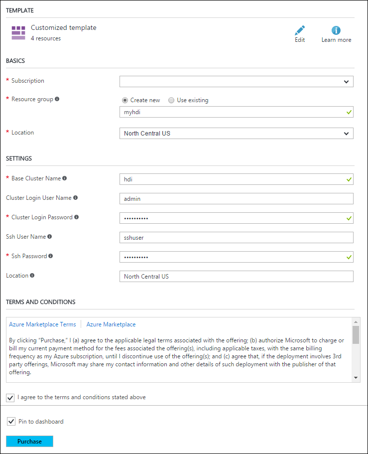
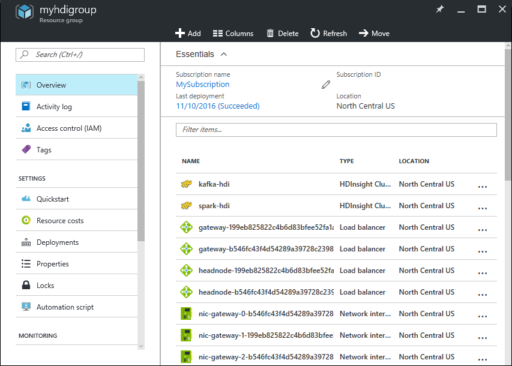

# Kafka on HDInsight（预览）的 Apache Spark 流式处理 (DStream) 示例

了解如何使用 Spark Apache Spark 通过 DStream 将数据流式传入或传出 Apache Kafka on HDInsight。 本示例使用在 Spark 群集上运行的 Jupyter 笔记本。
> [!NOTE]
> 本文档中的步骤创建了一个包含 Spark on HDInsight 和 Kafka on HDInsight 群集的 Azure 资源组。 这些群集都位于一个 Azure 虚拟网络中，这样 Spark 群集便可与 Kafka 群集直接通信。
>
> 完成本文档中的步骤后，请记得删除这些群集，避免支付额外费用。

## 创建群集

Apache Kafka on HDInsight 不提供通过公共 Internet 访问 Kafka 中转站的权限。 若要与 Kafka 通信，必须与 Kafka 群集中的节点在同一 Azure 虚拟网络中。 在此示例中，Kafka 群集和 Spark 群集都位于一个 Azure 虚拟网络中。 下图显示了这两个群集之间通信的流动方式：

> [!NOTE]
> 虽然 Kafka 本身的通信限于虚拟网络中，但可以通过 Internet 访问群集上的其他服务（如 SSH 和 Ambari）。 有关可用于 HDInsight 的公共端口的详细信息，请参阅 [HDInsight 使用的端口和 URI](hdinsight-hadoop-port-settings-for-services.md)。

虽然可以手动创建 Azure 虚拟网络、Kafka 和 Spark 群集，但是使用 Azure Resource Manager 模板会更容易。 使用以下步骤将 Azure 虚拟网络、Kafka 和 Spark 群集部署到 Azure 订阅。

1. 使用以下按钮登录到 Azure，并在 Azure 门户中打开模板。
    
    
    
    Azure 资源管理器模板位于 https://hditutorialdata.blob.core.windows.net/armtemplates/create-linux-based-kafka-spark-cluster-in-vnet-v2.1.json 中。

    > [!WARNING]
    > 若要确保 Kafka on HDInsight 的可用性，群集必须至少包含三个工作节点。 此模板创建的 Kafka 群集包含三个工作节点。

    此模板为 Kafka 和 Spark 创建 HDInsight 3.6 群集。

2. 使用以下信息填充“自定义部署”部分中的条目：
   
    
   
    * **资源组**：创建一个组或选择现有组。 此组包含 HDInsight 群集。

    * **位置**：选择在地理上邻近的位置。

    * **基群集名称**：此值用作 Spark 和 Kafka 群集的基名称。 例如，输入 **hdi** 创建名为 spark-hdi__ 的 Spark 群集和名为 **kafka-hdi** 的 Kafka 群集。

    * **群集登录用户名**：Spark 和 Kafka 群集的管理员用户名。

    * **群集登录密码**：Spark 和 Kafka 群集的管理员用户密码。

    * **SSH 用户名**：要为 Spark 和 Kafka 群集创建的 SSH 用户。

    * **SSH 密码**：Spark 和 Kafka 群集的 SSH 用户密码。

3. 阅读“条款和条件”，并选择“我同意上述条款和条件”。

4. 最后，选中“固定到仪表板”，并选择“购买”。 创建群集大约需要 20 分钟时间。

创建资源后，会显示摘要页面。

> [!IMPORTANT]
> 请注意，HDInsight 群集的名称为 spark-BASENAME 和 kafka-BASENAME，其中 BASENAME 是为模板提供的名称。 在连接到群集的后续步骤中，会用到这些名称。

## 使用笔记本

本文档中介绍的示例的代码位于 [https://github.com/Azure-Samples/hdinsight-spark-scala-kafka](https://github.com/Azure-Samples/hdinsight-spark-scala-kafka)中。

要完成本示例，请按照 `README.md` 中的步骤进行操作。

## 删除群集

[!INCLUDE [delete-cluster-warning](../../includes/hdinsight-delete-cluster-warning.md)]

由于本文档中的步骤在相同的 Azure 资源组中创建两个群集，因此可在 Azure 门户中删除资源组。 删除组时会删除按照本文档操作创建的所有资源（Azure 虚拟网络和群集使用的存储帐户）。

## 后续步骤

在本示例中，了解如何使用 Spark 对 Kafka 进行读取和写入。 使用以下链接来发现与 Kafka 配合使用的其他方式：

* [Apache Kafka on HDInsight 入门](hdinsight-apache-kafka-get-started.md)
* [使用 MirrorMaker 创建 Kafka on HDInsight 的副本](hdinsight-apache-kafka-mirroring.md)
* [将 Apache Storm 与 Kafka on HDInsight 结合使用](hdinsight-apache-storm-with-kafka.md)

