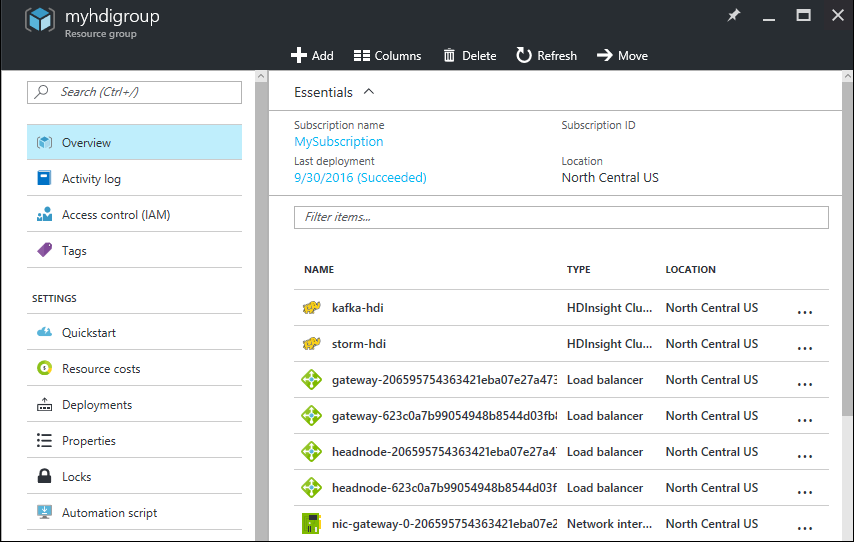
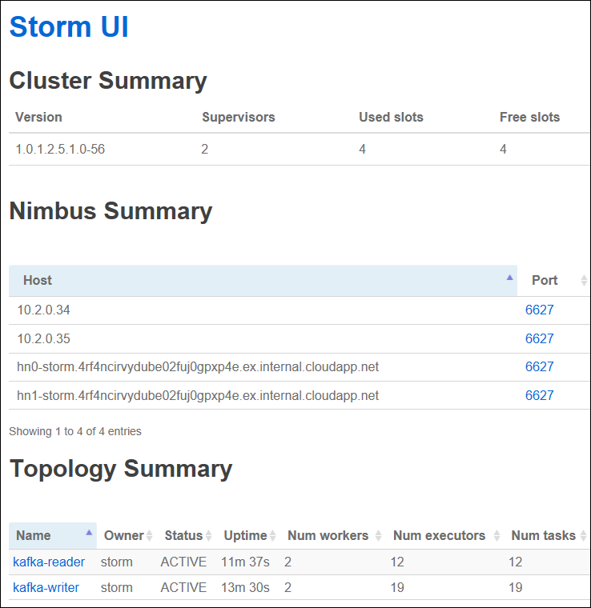
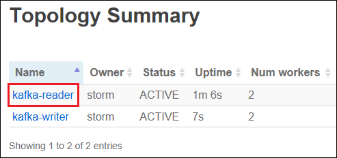
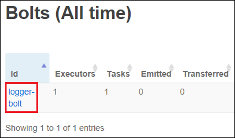
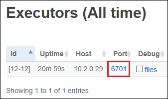

# <a name="use-apache-kafka-preview-with-storm-on-hdinsight"></a>将 Apache Kafka（预览版）与 Storm on HDInsight 配合使用

Apache Kafka 是 HDInsight 随附的一个发布-订阅消息传送解决方案。 Apache Storm 是可用于实时分析数据的分布式系统。 本文档演示如何使用 Storm on HDInsight 来读取和处理 Kafka on HDInsight 中的数据。 本文档中的示例使用基于 Java 的 Storm 拓扑，该拓扑依赖于 Apache Storm 提供的 Kafka Spout 和 Bolt 组件。

> [!NOTE]
> 本文档中的步骤将创建一个 Azure 资源组，其中包含一个 Storm on HDInsight 群集以及一个 Kafka on HDInsight 群集。 这两个群集位于同一个 Azure 虚拟网络中，因此，Storm 群集可以直接与 Kafka 群集通信。
> 
> 完成本文档中的步骤后，请记得删除这些群集，避免产生额外费用。

## <a name="prerequisites"></a>先决条件

* [Java JDK](http://www.oracle.com/technetwork/java/javase/downloads/index.html) 1.8 或更高版本。 或者等效的实用工具，如 [OpenJDK](http://openjdk.java.net/)。

    > [!NOTE]
    > 本文档中的步骤使用 HDInsight 3.5 群集，该群集使用 Java 8。

* [Maven 3.x](http://maven.apache.org/) - 适用于 Java 应用程序的生成管理包。

* 文本编辑器或 Java IDE

* SSH 客户端（需要 `ssh` 和 `scp` 命令）- 有关信息，请参阅[将 SSH 与 HDInsight 配合使用](hdinsight-hadoop-linux-use-ssh-unix.md)。

## <a name="create-the-clusters"></a>创建群集

Apache Kafka on HDInsight 不提供通过公共 Internet 访问 Kafka 中转站的权限。 与 Kafka 通信的所有组件必须与 Kafka 群集中的节点在同一个 Azure 虚拟网络中。 在本示例中，Kafka 群集和 Storm 群集位于同一个 Azure 虚拟网络中。 下图显示了这两个群集之间的通信流：


> [!NOTE]
> 尽管 Kafka 本身的通信限于虚拟网络中，但可以通过 Internet 访问群集上的其他服务（如 SSH 和 Ambari）。 有关可用于 HDInsight 的公共端口的详细信息，请参阅 [HDInsight 使用的端口和 URI](hdinsight-hadoop-port-settings-for-services.md)。

尽管可以手动创建 Azure 虚拟网络、Kafka 和 Storm 群集，但使用 Azure Resource Manager 模板会更容易。 使用以下步骤将 Azure 虚拟网络、Kafka 和 Storm 群集部署到 Azure 订阅。

1. 使用以下按钮登录到 Azure，然后在 Azure 门户预览中打开模板。

    <a href="https://portal.azure.cn/#create/Microsoft.Template/uri/https%3A%2F%2Fhditutorialdata.blob.core.windows.net%2Farmtemplates%2Fcreate-linux-based-kafka-storm-cluster-in-vnet.json" target="_blank"></a>

    Azure Resource Manager 模板位于 **https://hditutorialdata.blob.core.windows.net/armtemplates/create-linux-based-kafka-storm-cluster-in-vnet.json**。

2. 使用以下指南来填充“自定义部署”边栏选项卡上的条目：

    

    * **资源组**：创建一个组或选择现有组。 此组包含 HDInsight 群集。

    * **位置**：选择离你近的地理位置。 此位置必须匹配“设置”部分中的位置。

    * **基群集名称**：此值将用作 Storm 和 Kafka 群集的基名称。 例如，输入 **hdi** 创建名为 **storm-hdi** 的 Storm 群集和名为 **kafka-hdi** 的 Kafka 群集。

    * **群集登录用户名**：Storm 和 Kafka 群集的管理员用户名。

    * **群集登录密码**：Storm 和 Kafka 群集的管理员用户密码。

    * **SSH 用户名**：要为 Storm 和 Kafka 群集创建的 SSH 用户。

    * **SSH 密码**：Storm 和 Kafka 群集的 SSH 用户的密码。

    * **位置**：在其中创建群集的区域。

3. 阅读“条款和条件”，然后选择“我同意上述条款和条件”。

4. 最后，选中“固定到仪表板”，然后选择“购买”。 创建群集大约需要 20 分钟时间。

创建资源后，系统会将用户重定向到包含群集和 Web 仪表板的资源组的边栏选项卡。



> [!IMPORTANT]
> 请注意，HDInsight 群集的名称为 **storm-BASENAME** 和 **kafka-BASENAME**，其中 BASENAME 是为模板提供的名称。 在连接到群集的后续步骤中，会用到这些名称。

## <a name="get-the-code"></a>获取代码

本文档中所述的示例代码位于 [https://github.com/Azure-Samples/hdinsight-storm-java-kafka](https://github.com/Azure-Samples/hdinsight-storm-java-kafka)。

## <a name="understanding-the-code"></a>了解代码

此项目包含两种拓扑：

* **KafkaWriter**：由 **writer.yaml** 文件定义，此拓扑使用 Apache Storm 提供的 KafkaBolt 向 Kafka 写入随机的句子。

    此拓扑使用自定义 **SentenceSpout** 组件生成随机的句子。

* **KafkaReader**：由 **reader.yaml** 文件定义，此拓扑使用 Apache Storm 提供的 KafkaSpout 从 Kafka 读取数据，然后将数据记录到 stdout。

    此拓扑使用自定义 **PrinterBolt** 组件记录从 Kafka 读取的数据。

### <a name="flux"></a>Flux

拓扑是使用 [Flux](https://storm.apache.org/releases/1.0.1/flux.html)定义的。 Flux 在 Storm 0.10.x 中引入，可将拓扑配置与代码分离开来。 使用 Flux 框架的拓扑在 YAML 文件中定义。 可将 YAML 文件包含为拓扑的一部分，或者在将拓扑提交到 Storm 服务器时指定该文件。 Flux 还支持在运行时替换变量，本示例将使用此功能。

这两个拓扑应该使用以下环境变量：

* **KAFKATOPIC**：拓扑读取/写入的 Kafka 主题的名称。

* **KAFKABROKERS**：运行 Kafka 中转站的主机。 KafkaBolt 在写入 Kafka 时将使用中转站信息。

* **KAFKAZKHOSTS**：运行 Zookeeper 的主机。

本文档中的步骤将演示如何设置这些环境变量。

## <a name="create-a-kafka-topic"></a>创建 Kafka 主题

1. 使用 SSH 连接到 Kafka 群集。 将 `USERNAME` 替换为创建群集时使用的 SSH 用户名。 将 `BASENAME` 替换为创建群集时使用的基名称。

        ssh USERNAME@kafka-BASENAME-ssh.azurehdinsight.cn

    出现提示时，请输入在创建群集时使用的密码。

    有关信息，请参阅[将 SSH 与 HDInsight 配合使用](hdinsight-hadoop-linux-use-ssh-unix.md)。

2. 与 Kafka 群集建立 SSH 连接后，使用以下命令设置 HTTP 登录名和群集名称的变量。 本部分中的其他步骤会使用这些值。

    ```bash
    ADMIN='admin' #replace with the name of the admin account for the cluster
    PASSWORD='password' #replace with the password for the admin account
    ```

3. 通过以下命令安装 `jq` 实用工具、检索群集名称并设置 `KAFKAZKHOSTS` 变量：

    ```bash
    sudo apt -y install jq
    CLUSTERNAME=`curl -u $ADMIN:$PASSWORD -G "http://headnodehost:8080/api/v1/clusters" | jq -r '.items[].Clusters.cluster_name'`
    KAFKAZKHOSTS=`curl -u $ADMIN:$PASSWORD -G "http://headnodehost:8080/api/v1/clusters/$CLUSTERNAME/services/ZOOKEEPER/components/ZOOKEEPER_SERVER" | jq -r '["\(.host_components[].HostRoles.host_name):2181"] | join(",")'`
    ```

    使用以下命令检索群集名称：

    ```bash
    echo $CLUSTERNAME
    ```

    此命令的输出类似于以下示例：

    ```bash
    kafka-myhdi
    ```

    使用以下命令验证 `KAFKAZKHOSTS` 是否已正确设置：

    ```bash
    echo $KAFKAZKHOSTS
    ```

    此命令的输出类似于以下示例：

    ```bash
    zk0-kafka.eahjefxxp1netdbyklgqj5y1ud.ex.internal.chinacloudapp.cn:2181,zk2-kafka.eahjefxxp1netdbyklgqj5y1ud.ex.internal.chinacloudapp.cn:2181,zk3-kafka.eahjefxxp1netdbyklgqj5y1ud.ex.internal.chinacloudapp.cn:2181
    ```

    保存 Kafka 群集名称和 Zookeeper 主机信息，因为在 Storm 群集上启动拓扑时会使用这些值。

    > [!NOTE]
    > 上述命令使用 __http://headnodehost:8080/__，它直接连接到 Ambari。 如果需要通过 Internet 从群集外部检索此信息，则必须改为使用 __https://kafka-BASENAME.azurehdinsight.cn/__。

4. 使用以下命令在 Kafka 中创建一个主题：

    ```bash
    /usr/hdp/current/kafka-broker/bin/kafka-topics.sh --create --replication-factor 2 --partitions 8 --topic stormtest --zookeeper $KAFKAZKHOSTS
    ```

    此命令使用 `$KAFKAZKHOSTS`中存储的主机信息连接到 Zookeeper，然后创建名为 **stormtest**的 Kafka 主题。 可以通过使用以下脚本列出主题，来验证是否已创建该 stormtest 主题：

    ```bash
    /usr/hdp/current/kafka-broker/bin/kafka-topics.sh --list --zookeeper $KAFKAZKHOSTS
    ```

    此命令的输出将列出 Kafka 主题，其中应已包含 **stormtest** 主题。

与 Kafka 群集保持活动的 SSH 连接，因为可以使用该连接来验证 Storm 拓扑是否将消息写入主题。

## <a name="download-and-compile-the-project"></a>下载并编译项目

1. 在开发环境中，从 [https://github.com/Azure-Samples/hdinsight-storm-java-kafka](https://github.com/Azure-Samples/hdinsight-storm-java-kafka)下载项目，打开命令行并将目录切换为项目下载到的位置。

    花费片刻时间浏览代码，理解项目的工作原理。

2. 从 **hdinsight-storm-java-kafka** 目录，使用以下命令来编译该项目并创建用于部署的包：

    ```bash
    mvn clean package
    ```

    包过程将在 `target` 目录中创建名为 `KafkaTopology-1.0-SNAPSHOT.jar` 的文件。

3. 使用以下命令将包复制到 Storm on HDInsight 群集。 将 **USERNAME** 替换为群集的 SSH 用户名。 将 **BASENAME** 替换为创建群集时使用的基名称。

    ```bash
    scp ./target/KafkaTopology-1.0-SNAPSHOT.jar USERNAME@storm-BASENAME-ssh.azurehdinsight.cn:KafkaTopology-1.0-SNAPSHOT.jar
    ```

    出现提示时，请输入在创建群集时使用的密码。

4. 使用以下命令将项目的 `scripts` 目录中的 `set-env-variables.sh` 文件复制到 Storm 群集：

    ```bash
    scp ./scripts/set-env-variables.sh USERNAME@storm-BASENAME-ssh.azurehdinsight.cn:set-env-variables.sh
    ```

    此脚本用于设置 Storm 拓扑在与 Kafka 群集通信时使用的环境变量。

## <a name="start-the-writer"></a>启动写入器

1. 运行以下命令，使用 SSH 连接到 Storm 群集。 将 **USERNAME** 替换为创建群集时使用的 SSH 用户名。 将 **BASENAME** 替换为创建群集时使用的基名称。

    ```bash
    ssh USERNAME@storm-BASENAME-ssh.azurehdinsight.cn
    ```

    出现提示时，请输入在创建群集时使用的密码。

    有关信息，请参阅[将 SSH 与 HDInsight 配合使用](hdinsight-hadoop-linux-use-ssh-unix.md)。

2. 与 Storm 群集建立 SSH 连接后，使用以下命令运行 `set-env-variables.sh` 脚本：

    ```bash
    chmod +x set-env-variables.sh
    . ./set-env-variables.sh KAFKACLUSTERNAME PASSWORD
    ```

    将 __KAFKACLUSTERNAME__ 替换为 Kafka 群集的名称。 将 __PASSWORD__ 替换为 Kafka 群集的管理员登录密码。

    该脚本将连接到 Kafka 群集，并检索 Kafka 中转站和 Zookeeper 主机的列表。 然后，将信息存储在 Storm 拓扑使用的环境变量中。

    该脚本的输出类似于以下示例：

        Checking for jq: install ok installed
        Exporting variables:
        $KAFKATOPIC=stormtest
        $KAFKABROKERS=wn0-storm.4rf4ncirvydube02fuj0gpxp4e.ex.internal.chinacloudapp.cn:9092,wn1-storm.4rf4ncirvydube02fuj0gpxp4e.ex.internal.chinacloudapp.cn:9092
        $KAFKAZKHOSTS=zk1-storm.4rf4ncirvydube02fuj0gpxp4e.ex.internal.chinacloudapp.cn:2181,zk3-storm.4rf4ncirvydube02fuj0gpxp4e.ex.internal.chinacloudapp.cn:2181,zk5-storm.4rf4ncirvydube02fuj0gpxp4e.ex.internal.chinacloudapp.cn:2181

3. 与 Storm 群集建立 SSH 连接后，使用以下命令启动写入器拓扑：

        storm jar KafkaTopology-1.0-SNAPSHOT.jar org.apache.storm.flux.Flux --remote -R /writer.yaml -e

    此命令中使用的参数为：

    * `org.apache.storm.flux.Flux`：使用 Flux 配置并运行此拓扑。

    * `--remote`：将拓扑提交到 Nimbus。 拓扑分布在群集中的辅助角色节点。

    * `-R /writer.yaml`：使用 `writer.yaml` 文件配置拓扑。 `-R` 指示此资源包含在 jar 文件中。 该资源位于 jar 的根目录，因此， `/writer.yaml` 是它的路径。

    * `-e`：使用环境变量替换。 Flux 选取以前设置的 $KAFKABROKERS 和 $KAFKATOPIC 值，并将其用于 reader.yaml 文件中，用于替换 `${ENV-KAFKABROKER}` 和 `${ENV-KAFKATOPIC}` 条目。

5. 启动拓扑后，切换到 Kafka 群集的 SSH 连接，并使用以下命令来查看写入到 **stormtest** 主题的消息：

    ```bash
    /usr/hdp/current/kafka-broker/bin/kafka-console-consumer.sh --zookeeper $KAFKAZKHOSTS --from-beginning --topic stormtest
    ```

    此命令使用 Kafka 随附的脚本来监视主题。 片刻之后，应开始返回已写入主题的随机句子。 输出类似于以下示例：

        i am at two with nature             
        an apple a day keeps the doctor away
        snow white and the seven dwarfs     
        the cow jumped over the moon        
        an apple a day keeps the doctor away
        an apple a day keeps the doctor away
        the cow jumped over the moon        
        an apple a day keeps the doctor away
        an apple a day keeps the doctor away
        four score and seven years ago      
        snow white and the seven dwarfs     
        snow white and the seven dwarfs     
        i am at two with nature             
        an apple a day keeps the doctor away

    按 Ctrl+C 停止脚本。

## <a name="start-the-reader"></a>启动读取器

1. 与 Storm 群集建立 SSH 会话后，使用以下命令启动读取器拓扑：

    ```bash
    storm jar KafkaTopology-1.0-SNAPSHOT.jar org.apache.storm.flux.Flux --remote -R /reader.yaml -e
    ```

2. 拓扑启动后，打开 Storm UI。 此 Web UI 位于 https://storm-BASENAME.azurehdinsight.cn/stormui。 将 __BASENAME__ 替换为创建群集时使用的基名称。 

    出现提示时，使用创建群集时使用的管理员登录名（默认情况下为 `admin`）和密码。 此时会显示与下图类似的网页：

    

3. 从 Storm UI 中，选择“拓扑摘要”部分中的 __kafka-reader__ 链接，以显示有关 __kafka-reader__ 拓扑的信息。

    

4. 选择“Bolt（全部时间）”部分中的 __logger-bolt__ 链接，以显示有关 logger-bolt 组件的实例的信息。

    

5. 在“执行器”部分中，选择“端口”列中的链接，以显示有关此组件实例的日志记录信息。

    

    日志包含从 Kafka 主题读取的数据日志。 日志中的信息类似于以下文本：

        2016-11-04 17:47:14.907 c.m.e.LoggerBolt [INFO] Received data: four score and seven years ago
        2016-11-04 17:47:14.907 STDIO [INFO] the cow jumped over the moon
        2016-11-04 17:47:14.908 c.m.e.LoggerBolt [INFO] Received data: the cow jumped over the moon
        2016-11-04 17:47:14.911 STDIO [INFO] snow white and the seven dwarfs
        2016-11-04 17:47:14.911 c.m.e.LoggerBolt [INFO] Received data: snow white and the seven dwarfs
        2016-11-04 17:47:14.932 STDIO [INFO] snow white and the seven dwarfs
        2016-11-04 17:47:14.932 c.m.e.LoggerBolt [INFO] Received data: snow white and the seven dwarfs
        2016-11-04 17:47:14.969 STDIO [INFO] an apple a day keeps the doctor away
        2016-11-04 17:47:14.970 c.m.e.LoggerBolt [INFO] Received data: an apple a day keeps the doctor away

## <a name="stop-the-topologies"></a>停止拓扑

与 Storm 群集建立 SSH 会话后，使用以下命令停止 Storm 拓扑：

```bash
storm kill kafka-writer
storm kill kafka-reader
```

## <a name="delete-the-cluster"></a>删除群集

[!INCLUDE [delete-cluster-warning](../../includes/hdinsight-delete-cluster-warning.md)]

由于本文档中的步骤在同一 Azure 资源组中创建两个群集，因此可以在 Azure 门户预览中删除该资源组。 此操作会删除按照本文档创建的所有资源（Azure 虚拟网络和群集使用的存储帐户）。

## <a name="next-steps"></a>后续步骤

有关更多可用于 Storm on HDInsight 的示例拓扑，请参阅[示例 Storm 拓扑和组件](hdinsight-storm-example-topology.md)。

有关在基于 Linux 的 HDInsight 上部署和监视拓扑的详细信息，请参阅[在基于 Linux 的 HDInsight 上部署和管理 Apache Storm 拓扑](hdinsight-storm-deploy-monitor-topology-linux.md)

