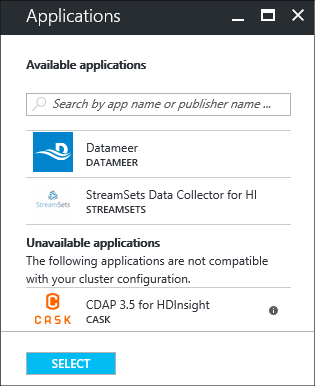

# 在 Azure HDInsight 上安装第三方 Hadoop 应用程序

本文介绍如何在 Azure HDInsight 上安装已发布的第三方 Hadoop 应用程序。 有关如何安装自己的应用程序的说明，请参阅[安装自定义 HDInsight 应用程序](hdinsight-apps-install-custom-applications.md)。

HDInsight 应用程序是用户可以在基于 Linux 的 HDInsight 群集上安装的应用程序。 这些应用程序可能是 Microsoft、独立软件供应商 (ISV) 或你自己开发的。  

目前有四个已发布的应用程序：

* **DATAIKU DDS on HDInsight**：Dataiku DSS (Data Science Studio) 是一个软件，数据专家（数据科学家、业务分析师、开发人员...）可以使用它对针对性很强的服务进行原型、生成和部署方面的操作，将原始数据转换成有影响力的业务预测。
* **Datameer**： [Datameer](http://www.datameer.com/documentation/display/DAS50/Home?ls=Partners&lsd=Microsoft&c=Partners&cd=Microsoft) 提供一种交互方式，让分析师发现、分析和可视化大数据的结果。 轻松拉进其他数据源，以发现新的关系并迅速获取所需的答案。
* **用于 HDnsight 的 Streamsets 数据收集器**提供了一个全功能的集成开发环境 (IDE)，它允许用户设计、测试、部署和管理汇合流和批处理数据的全面互通引入管道，并提供各种流中转换 - 所有这些都无需编写自定义代码。 

本文提供的说明使用 Azure 门户预览。 也可以从门户导出 Azure Resource Manager 模板或从供应商处获取 Resource Manage 模板的副本，然后使用 Azure PowerShell 和 Azure CLI 部署模板。  请参阅 [使用 Resource Manager 模板在 HDInsight 中创建基于 Linux 的 Hadoop 群集](hdinsight-hadoop-create-linux-clusters-arm-templates.md)。

## 先决条件
如果想要在现有的 HDInsight 群集上安装 HDInsight 应用程序，必须有一个 HDInsight 群集。 若要创建群集，请参阅 [创建群集](hdinsight-hadoop-linux-tutorial-get-started.md#create-cluster)。 也可以在创建 HDInsight 群集时安装 HDInsight 应用程序。

## 将应用程序安装到现有群集
下面的过程演示如何将 HDInsight 应用程序安装到现有的 HDInsight 群集。

**安装 HDInsight 应用程序**

1. 登录 [Azure 门户预览](https://portal.azure.cn)。
2. 在左侧菜单中单击“HDInsight 群集”  。  如果未看到，请单击“更多服务”，然后单击“HDInsight 群集”。
3. 单击某个 HDInsight 群集。  如果没有群集，必须先创建一个。  请参阅 [创建群集](hdinsight-hadoop-linux-tutorial-get-started.md#create-cluster)。
4. 单击“配置”类别下的“应用程序”。 可以看到已安装应用程序的列表（如果有）。 如果找不到“应用程序”，这意味着没有适用于此版本 HDInsight 群集的应用程序。

    
5. 单击边栏选项卡菜单中的“添加”  。 

    

    可以看到现有 HDInsight 应用程序的列表。

    
6. 单击其中一个应用程序、接受法律条款，然后单击“选择” 。

可以通过门户通知查看安装状态（单击门户顶部的铃铛图标）。 安装应用程序之后，应用程序会出现在“已安装的应用”边栏选项卡上。

## 在群集创建期间安装应用程序
你可以选择在创建群集时安装 HDInsight 应用程序。 在此过程中，HDInsight 应用程序会在群集创建并处于运行状态后安装。 下面的过程演示如何在创建群集时安装 HDInsight 应用程序。

**安装 HDInsight 应用程序**

1. 登录 [Azure 门户预览](https://portal.azure.cn)。
2. 依次单击“新建”、“数据 + 分析”、“HDInsight”。
3. 输入“群集名称” ：此名称必须全局唯一。
4. 单击“订阅”  ，选择将用于此群集的 Azure 订阅。
5. 单击“选择群集类型” ，然后选择：

    * **群集类型**：如果不知道要选择哪种群集，请选择“Hadoop”。 它是最受欢迎的群集类型。
    * **操作系统**：选择“Linux”。
    * **版本**：如果不知道要选择哪个版本，请使用默认版本。 有关详细信息，请参阅 [HDInsight 群集版本](hdinsight-component-versioning.md)。
6. 依次单击“应用程序”、其中一个已发布的应用程序、“选择”。
7. 单击“凭据”  ，然后输入管理员用户的密码。 此外，还必须输入“SSH 用户名”以及“密码”或“公钥”，这将用于验证 SSH 用户的身份。 建议使用公钥。 单击底部的“选择”  ，保存凭据配置。
8. 单击“数据源” 、选择现有存储帐户之一，或创建新的存储帐户，作为群集的默认存储帐户。
9. 单击“资源组”以选择现有的资源组，或单击“新建”以创建一个新的资源组
10. 在“新建 HDInsight 群集”边栏选项卡上，确保选中“固定到启动板”，然后单击“创建”。 

## 列出已安装的 HDInsight 应用和属性
门户会显示群集的已安装 HDInsight 应用程序列表，以及每个已安装应用程序的属性。

**列出 HDInsight 应用程序并显示属性**

1. 登录 [Azure 门户预览](https://portal.azure.cn)。
2. 在左侧菜单中单击“HDInsight 群集”  。  如果未看到，请单击“浏览”，然后单击“HDInsight 群集”。
3. 单击某个 HDInsight 群集。
4. 在“设置”边栏选项卡中，单击“常规”类别下的“应用程序”。 “已安装的应用”边栏选项卡将列出所有已安装的应用程序。 

    
5. 单击其中一个已安装的应用程序，以显示属性。 属性边栏选项卡会列出：

    * 应用名称：应用程序名称。
    * 状态：应用程序状态。 
    * 网页：已部署到边缘节点的 Web 应用程序的 URL（如果有）。 此凭据与你针对群集配置的 HTTP 用户凭据相同。
    * HTTP 终结点：此凭据与你针对群集配置的 HTTP 用户凭据相同。 
    * SSH 终结点：可以使用 SSH 连接到边缘节点。 SSH 凭据与你针对群集配置的 SSH 用户凭据相同。 有关信息，请参阅[将 SSH 与 HDInsight 配合使用](hdinsight-hadoop-linux-use-ssh-unix.md)。
6. 若要删除应用程序，请右键单击应用程序，然后单击上下文菜单中的“删除”  。

## 连接到边缘节点
你可以使用 HTTP 和 SSH 连接到边缘节点。 可在 [门户](#list-installed-hdinsight-apps-and-properties)中找到终结点信息。 有关信息，请参阅[将 SSH 与 HDInsight 配合使用](hdinsight-hadoop-linux-use-ssh-unix.md)。

HTTP 终结点凭据是你针对 HDInsight 群集配置的 HTTP 用户凭据；SSH 终结点凭据是你针对 HDInsight 群集配置的 SSH 凭据。

## 故障排除
请参阅 [故障排除安装问题](hdinsight-apps-install-custom-applications.md#troubleshoot-the-installation)。

## 后续步骤
* [安装自定义 HDInsight 应用程序](hdinsight-apps-install-custom-applications.md)：了解如何将未发布的 HDInsight 应用程序部署到 HDInsight。
* [MSDN：安装 HDInsight 应用程序](https://msdn.microsoft.com/library/mt706515.aspx)：了解如何定义 HDInsight 应用程序。
* [使用脚本操作自定义基于 Linux 的 HDInsight 群集](hdinsight-hadoop-customize-cluster-linux.md)：了解如何使用脚本操作安装其他应用程序。
* [使用 Resource Manager 模板在 HDInsight 中创建基于 Linux 的 Hadoop 群集](hdinsight-hadoop-create-linux-clusters-arm-templates.md)：了解如何调用 Resource Manager 模板创建 HDInsight 群集。
* [在 HDInsight 中使用空边缘节点](hdinsight-apps-use-edge-node.md)：了解如何使用空边缘节点访问 HDInsight 群集、测试 HDInsight 应用程序以及托管 HDInsight 应用程序。

