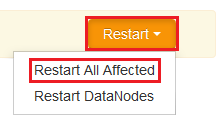

# 在基于 Linux 的 HDInsight 上为 Hadoop 服务启用堆转储

[!INCLUDE [heapdump-selector](../../includes/hdinsight-selector-heap-dump.md)]

堆转储包含应用程序的内存快照，其中包括创建转储时各变量的值。 因此，它们在诊断发生在运行时的问题时很有用。

> [!IMPORTANT]
> 本文档中的步骤仅适用于使用 Linux 的 HDInsight 群集。 Linux 是在 HDInsight 3.4 版或更高版本上使用的唯一操作系统。 有关详细信息，请参阅 [HDInsight 在 Windows 上即将弃用](hdinsight-component-versioning.md#hdi-version-33-nearing-deprecation-date)。

## 服务

你可以启用以下服务的堆转储：

* **hcatalog** - tempelton
* **hive** - hiveserver2、metastore、derbyserver
* **mapreduce** - jobhistoryserver
* **yarn** - resourcemanager、nodemanager、timelineserver
* **hdfs** - datanode、secondarynamenode、namenode

你还可以启用映射的堆转储，并减少由 HDInsight 运行的流程数。

## 了解堆转储配置

在某项服务启动时，可以通过将选项（有时称为 opts 或参数）传递到 JVM 来启用堆转储。 对于大多数 Hadoop 服务，可以修改用于启动该服务的 shell 脚本来传递这些选项。

在每个脚本中，有一个针对 **\*\_OPTS** 的导出，其中包含传递到 JVM 的选项。 例如，在 **hadoop-env.sh** 脚本中，以 `export HADOOP_NAMENODE_OPTS=` 开头的行包含用于 NameNode 服务的选项。

映射和化简进程稍有不同，因为这些操作是 MapReduce 服务的子进程。 每个映射或化简进程都在子容器中运行，并且有两个包含 JVM 选项的条目。 二者均包含在 **mapred-site.xml** 中：

* **mapreduce.admin.map.child.java.opts**
* **mapreduce.admin.reduce.child.java.opts**

> [!NOTE]
> 我们建议使用 Ambari 来修改脚本和 mapred-site.xml 设置，因为 Ambari 负责在群集中跨节点复制更改。 请参阅[使用 Ambari](#using-ambari) 部分以了解具体的步骤。

### 启用堆转储

发生 OutOfMemoryError 时，可以使用以下选项来启用堆转储：

    -XX:+HeapDumpOnOutOfMemoryError

**+** 指示是否启用了此选项。 默认为禁用。

> [!WARNING]
> 默认情况下，在 HDInsight 上不为 Hadoop 服务启用堆转储，因为转储文件可能很大。 如果你启用了堆转储来进行故障诊断，请记住在重现问题并收集转储文件后禁用堆转储。

### 转储位置

转储文件的默认位置是当前的工作目录。 你可以使用以下选项来控制文件的存储位置：

    -XX:HeapDumpPath=/path

例如，使用 `-XX:HeapDumpPath=/tmp` 可以将转储存储在 /tmp 目录中。

### 脚本

你还可以在发生 **OutOfMemoryError** 时触发一个脚本。 例如，可以触发一个通知，这样你就知道发生了错误。 使用以下选项在 __OutOfMemoryError__ 上触发某个脚本：

    -XX:OnOutOfMemoryError=/path/to/script

> [!NOTE]
> 由于 Hadoop 是分布式系统，任何使用的脚本都必须放置在服务运行时所在的群集的所有节点上。
> 
> 该脚本还必须位于可供帐户（服务以该帐户的身份运行）访问的位置，并且必须提供执行权限。 例如，你可能希望将脚本存储在 `/usr/local/bin` 中，并通过 `chmod go+rx /usr/local/bin/filename.sh` 来授予读取和执行权限。

## 使用 Ambari

若要修改服务配置，请使用以下步骤：

1. 打开群集的 Ambari Web UI。 URL 为 https://YOURCLUSTERNAME.azurehdinsight.cn。

    出现提示时，在该站点中使用群集的 HTTP 帐户名（默认为 admin）和密码进行身份验证。

   > [!NOTE]
   > Ambari 可能会再次提示你输入用户名和密码。 如果是这样，请重新输入相同的帐户名和密码

2. 使用左侧的列表，选择你想要修改的服务区。 例如， **HDFS**。 在中心区域，选择 **“配置”** 选项卡。

    

3. 使用“筛选...”条目，输入“opts”。 仅显示包含此文本的项。

    

4. 查找需为其启用堆转储的服务的 **\*\_OPTS** 条目，然后添加希望启用的选项。 在下图中，已将 `-XX:+HeapDumpOnOutOfMemoryError -XX:HeapDumpPath=/tmp/` 添加到 **HADOOP\_NAMENODE\_OPTS** 条目：

    

   > [!NOTE]
   > 为映射或化简子进程启用堆转储时，需查找名为 **mapreduce.admin.map.child.java.opts** 和 **mapreduce.admin.reduce.child.java.opts** 的字段。

    使用“保存”按钮保存所做的更改。 可以输入简短的说明，描述所做的更改。

5. 一旦应用了所做的更改，“需要重启”图标将显示在一个或多个服务旁边。

    

6. 选择需要重启的每个服务，然后使用“服务操作”按钮以“打开维护模式”。 维护模式可以防止重启服务时从该服务生成警报。

    

7. 一旦启用维护模式，使用服务的“重启”按钮即可“重启所有受影响的服务”

    

   > [!NOTE]
   > 其他服务的“重启”按钮条目可能会有所不同。

8. 一旦重启服务，可使用“服务操作”按钮“关闭维护模式”。 这样一来，Ambari 就可以继续监视服务的警报。