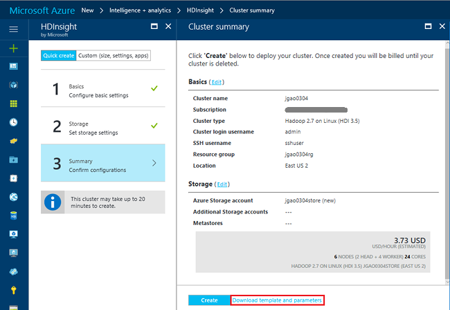
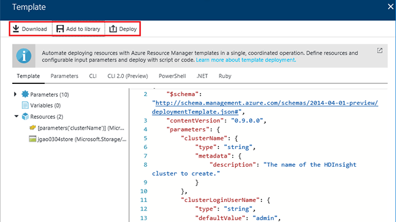

# 使用 Resource Manager 模板在 HDInsight 中创建 Hadoop 群集
[!INCLUDE [selector](../../includes/hdinsight-create-linux-cluster-selector.md)]

本文介绍几种使用 Azure Resource Manager 模板创建 Azure HDInsight 群集的方式。 有关详细信息，请参阅[使用 Azure Resource Manager 模板部署应用程序](../azure-resource-manager/resource-group-template-deploy.md)。 若要了解其他群集创建工具和功能，请在本页顶部单击选项卡选择器，或参阅[群集创建方法](hdinsight-hadoop-provision-linux-clusters.md#cluster-creation-methods)。

## 先决条件
[!INCLUDE [delete-cluster-warning](../../includes/hdinsight-delete-cluster-warning.md)]

若要按照本文的说明操作，需要：

* 一个 [Azure 订阅](https://www.azure.cn/pricing/1rmb-trial/)。
* Azure PowerShell 和/或 Azure CLI。

[!INCLUDE [use-latest-version](../../includes/hdinsight-use-latest-powershell-and-cli.md)]

### Resource Manager 模板
通过 Resource Manager 模板，可轻松地通过单个协调操作为应用程序创建以下内容：
* HDInsight 群集及其依赖资源（例如默认存储帐户）
* 其他资源（例如要使用 Apache Sqoop 的 Azure SQL 数据库）

在此模板中，定义应用程序所需的资源。 还可指定部署参数以输入不同环境的值。 模板中包含用于为部署构造值的 JSON 和表达式。

可在 [Azure 快速启动模板](https://github.com/azure/azure-quickstart-templates/)中找到 HDInsight 模板示例。 将跨平台 [Visual Studio Code](https://code.visualstudio.com/#alt-downloads) 与 [Resource Manager 扩展](https://marketplace.visualstudio.com/items?itemName=msazurermtools.azurerm-vscode-tools)或文本编辑器配合使用，将模板保存到工作站上的文件中。 了解如何使用不同方法调用模板。

有关 Resource Manager 模板的详细信息，请参阅以下文章：

* [创作 Azure Resource Manager 模板](../azure-resource-manager/resource-group-authoring-templates.md)
* [使用 Azure Resource Manager 模板部署应用程序](../azure-resource-manager/resource-group-template-deploy.md)

## 生成模板

使用 Azure 门户预览可以配置群集的所有属性并保存模板，然后再进行部署。 可重复使用模板。

**使用 Azure 门户预览生成模板**

1. 登录 [Azure 门户预览](https://portal.azure.cn)。
2. 在左侧菜单中单击“新建”，然后依次单击“智能+分析”和“HDInsight”。
3. 按照说明输入属性。 可使用“快速创建”或“自定义”选项。
4. 在“摘要”选项卡上，单击“下载模板和参数”：

    

    可看到包含模板文件、参数文件和用于部署模板的代码示例的列表：

    

    可从此处下载模板、将其保存到模板库中或部署该模板。

    若要访问库中的模板，请从左侧菜单中单击“更多服务”，然后在“其他”类别下单击“模板”。

    > [!Note]
    > 模板和参数文件必须一起使用。 否则，可能收到意外结果。 例如，无论在下载模板前指定了何值，默认 **clusterKind** 属性值始终为 **hadoop**。

## 使用 PowerShell 进行部署

此过程在 HDInsight 中创建一个 Hadoop 群集。

1. 将[附录](#appx-a-arm-template)中的 JSON 文件保存到工作站。 在 PowerShell 脚本中，文件名为 `C:\HDITutorials-ARM\hdinsight-arm-template.json`。
2. 根据需要设置参数和变量。
3. 使用以下 PowerShell 脚本运行模板：

        ####################################
        # Set these variables
        ####################################
        #region - used for creating Azure service names
        $nameToken = "<Enter an Alias>"
        $templateFile = "C:\HDITutorials-ARM\hdinsight-arm-template.json"
        #endregion

        ####################################
        # Service names and variables
        ####################################
        #region - service names
        $namePrefix = $nameToken.ToLower() + (Get-Date -Format "MMdd")

        $resourceGroupName = $namePrefix + "rg"
        $hdinsightClusterName = $namePrefix + "hdi"
        $defaultStorageAccountName = $namePrefix + "store"
        $defaultBlobContainerName = $hdinsightClusterName

        $location = "China East"

        $armDeploymentName = $namePrefix
        #endregion

        ####################################
        # Connect to Azure
        ####################################
        #region - Connect to Azure subscription
        Write-Host "`nConnecting to your Azure subscription ..." -ForegroundColor Green
        try{Get-AzureRmContext}
        catch{Login-AzureRmAccount -EnvironmentName AzureChinaCloud}
        #endregion

        # Create a resource group
        New-AzureRmResourceGroup -Name $resourceGroupName -Location $Location

        # Create cluster and the dependent storage account
        $parameters = @{clusterName="$hdinsightClusterName"}

        New-AzureRmResourceGroupDeployment `
            -Name $armDeploymentName `
            -ResourceGroupName $resourceGroupName `
            -TemplateFile $templateFile `
            -TemplateParameterObject $parameters

        # List cluster
        Get-AzureRmHDInsightCluster -ResourceGroupName $resourceGroupName -ClusterName $hdinsightClusterName

    PowerShell 脚本仅配置群集名称。 存储帐户名称在模板中进行硬编码。 系统提示输入群集用户密码。 （默认用户名为 **admin**。）系统还将提示输入 SSH 用户密码。 （默认 SSH 用户名为 **sshuser**。）  

有关详细信息，请参阅[使用 PowerShell 进行部署](../azure-resource-manager/resource-group-template-deploy.md#deploy-local-template)。

## 使用 CLI 进行部署
如下示例使用 Azure 命令行接口 (CLI)。 它通过调用 Resource Manager 模板创建一个群集及其依赖的存储帐户和容器：

    azure login -e AzureChinaCloud
    azure config mode arm
    azure group create -n hdi1229rg -l "China East"
    azure group deployment create --resource-group "hdi1229rg" --name "hdi1229" --template-file "C:\HDITutorials-ARM\hdinsight-arm-template.json"

系统会提示输入：
* 群集名称。
* 群集用户密码。 （默认用户名为 **admin**。）
* SSH 用户密码。 （默认 SSH 用户名为 **sshuser**。）

如下代码提供内联参数：

    azure group deployment create --resource-group "hdi1229rg" --name "hdi1229" --template-file "c:\Tutorials\HDInsightARM\create-linux-based-hadoop-cluster-in-hdinsight.json" --parameters '{\"clusterName\":{\"value\":\"hdi1229\"},\"clusterLoginPassword\":{\"value\":\"Pass@word1\"},\"sshPassword\":{\"value\":\"Pass@word1\"}}'

## 使用 REST API 进行部署
请参阅[使用 REST API 进行部署](../azure-resource-manager/resource-group-template-deploy-rest.md)。

## 使用 Visual Studio 进行部署
 使用 Visual Studio 创建一个资源组项目，并通过用户界面将其部署到 Azure。 选择要包含在项目中的资源类型。 这些资源会自动添加到 Resource Manager 模板。 该项目还提供了用于部署模板的 PowerShell 脚本。

有关将 Visual Studio 用于资源组的简介，请参阅[通过 Visual Studio 创建和部署 Azure 资源组](../azure-resource-manager/vs-azure-tools-resource-groups-deployment-projects-create-deploy.md)。

## 故障排除

如果在创建 HDInsight 群集时遇到问题，请参阅[访问控制要求](hdinsight-administer-use-portal-linux.md#create-clusters)。

## 后续步骤
在本文中，你已经学习了几种创建 HDInsight 群集的方法。 若要了解更多信息，请参阅下列文章：

* 有关通过 .NET 客户端库部署资源的示例，请参阅[使用 .NET 库和模板部署资源](../virtual-machines/windows/csharp-template.md?toc=%2fazure%2fvirtual-machines%2fwindows%2ftoc.json)。
* 有关部署应用程序的详细示例，请参阅[按可预见的方式在 Azure 中预配和部署微服务](../app-service-web/app-service-deploy-complex-application-predictably.md)。
* 有关将解决方案部署到不同环境的指南，请参阅 [Azure 中的开发和测试环境](../azure-resource-manager/solution-dev-test-environments.md)。
* 若要了解 Azure Resource Manager 模板的节，请参阅[创作模板](../azure-resource-manager/resource-group-authoring-templates.md)。
* 有关可在 Azure Resource Manager 模板中使用的函数列表，请参阅[模板函数](../azure-resource-manager/resource-group-template-functions.md)。

## 附录：Resource Manager 模板
以下 Azure Resource Manager 模板使用依赖的 Azure 存储帐户创建基于 Linux 的 Hadoop 群集。

> [!NOTE]
> 本示例包括 Hive 元存储和 Oozie 元存储的配置信息。 使用模板之前请删除节或配置节。
>
>

    {
    "$schema": "https://schema.management.azure.com/schemas/2015-01-01/deploymentTemplate.json#",
    "contentVersion": "1.0.0.0",
    "parameters": {
        "clusterName": {
        "type": "string",
        "metadata": {
            "description": "The name of the HDInsight cluster to create."
        }
        },
        "clusterLoginUserName": {
        "type": "string",
        "defaultValue": "admin",
        "metadata": {
            "description": "These credentials can be used to submit jobs to the cluster and to log into cluster dashboards."
        }
        },
        "clusterLoginPassword": {
        "type": "securestring",
        "metadata": {
            "description": "The password must be at least 10 characters in length and must contain at least one digit, one non-alphanumeric character, and one upper or lower case letter."
        }
        },
        "sshUserName": {
        "type": "string",
        "defaultValue": "sshuser",
        "metadata": {
            "description": "These credentials can be used to remotely access the cluster."
        }
        },
        "sshPassword": {
        "type": "securestring",
        "metadata": {
            "description": "The password must be at least 10 characters in length and must contain at least one digit, one non-alphanumeric character, and one upper or lower case letter."
        }
        },
        "location": {
        "type": "string",
        "defaultValue": "China East",
        "allowedValues": [
            "China North",
            "China East"
        ],
        "metadata": {
            "description": "The location where all azure resources will be deployed."
        }
        },
        "clusterType": {
        "type": "string",
        "defaultValue": "hadoop",
        "allowedValues": [
            "hadoop",
            "hbase",
            "storm",
            "spark"
        ],
        "metadata": {
            "description": "The type of the HDInsight cluster to create."
        }
        },
        "clusterWorkerNodeCount": {
        "type": "int",
        "defaultValue": 2,
        "metadata": {
            "description": "The number of nodes in the HDInsight cluster."
        }
        }
    },
    "variables": {
        "defaultApiVersion": "2015-05-01-preview",
        "clusterApiVersion": "2015-03-01-preview",
        "clusterStorageAccountName": "[concat(parameters('clusterName'),'store')]"
    },
    "resources": [
        {
        "name": "[variables('clusterStorageAccountName')]",
        "type": "Microsoft.Storage/storageAccounts",
        "location": "[parameters('location')]",
        "apiVersion": "[variables('defaultApiVersion')]",
        "dependsOn": [ ],
        "tags": { },
        "properties": {
            "accountType": "Standard_LRS"
        }
        },
        {
        "name": "[parameters('clusterName')]",
        "type": "Microsoft.HDInsight/clusters",
        "location": "[parameters('location')]",
        "apiVersion": "[variables('clusterApiVersion')]",
        "dependsOn": [ "[concat('Microsoft.Storage/storageAccounts/',variables('clusterStorageAccountName'))]" ],
        "tags": {

        },
        "properties": {
            "clusterVersion": "3.5",
            "osType": "Linux",
            "tier": "standard",
            "clusterDefinition": {
            "kind": "[parameters('clusterType')]",
            "configurations": {
                "gateway": {
                "restAuthCredential.isEnabled": true,
                "restAuthCredential.username": "[parameters('clusterLoginUserName')]",
                "restAuthCredential.password": "[parameters('clusterLoginPassword')]"
                },
                "hive-site": {
                    "javax.jdo.option.ConnectionDriverName": "com.microsoft.sqlserver.jdbc.SQLServerDriver",
                    "javax.jdo.option.ConnectionURL": "jdbc:sqlserver://myadla0901dbserver.database.chinacloudapi.cn;database=myhive20160901;encrypt=true;trustServerCertificate=true;create=false;loginTimeout=300",
                    "javax.jdo.option.ConnectionUserName": "johndole",
                    "javax.jdo.option.ConnectionPassword": "myPassword$"
                },
                "hive-env": {
                    "hive_database": "Existing MSSQL Server database with SQL authentication",
                    "hive_database_name": "myhive20160901",
                    "hive_database_type": "mssql",
                    "hive_existing_mssql_server_database": "myhive20160901",
                    "hive_existing_mssql_server_host": "myadla0901dbserver.database.chinacloudapi.cn",
                    "hive_hostname": "myadla0901dbserver.database.chinacloudapi.cn"
                },
                "oozie-site": {
                    "oozie.service.JPAService.jdbc.driver": "com.microsoft.sqlserver.jdbc.SQLServerDriver",
                    "oozie.service.JPAService.jdbc.url": "jdbc:sqlserver://myadla0901dbserver.database.chinacloudapi.cn;database=myhive20160901;encrypt=true;trustServerCertificate=true;create=false;loginTimeout=300",
                    "oozie.service.JPAService.jdbc.username": "johndole",
                    "oozie.service.JPAService.jdbc.password": "myPassword$",
                    "oozie.db.schema.name": "oozie"
                },
                "oozie-env": {
                    "oozie_database": "Existing MSSQL Server database with SQL authentication",
                    "oozie_database_name": "myhive20160901",
                    "oozie_database_type": "mssql",
                    "oozie_existing_mssql_server_database": "myhive20160901",
                    "oozie_existing_mssql_server_host": "myadla0901dbserver.database.chinacloudapi.cn",
                    "oozie_hostname": "myadla0901dbserver.database.chinacloudapi.cn"
                }            
            }
            },
            "storageProfile": {
            "storageaccounts": [
                {
                "name": "[concat(variables('clusterStorageAccountName'),'.blob.core.chinacloudapi.cn')]",
                "isDefault": true,
                "container": "[parameters('clusterName')]",
                "key": "[listKeys(resourceId('Microsoft.Storage/storageAccounts', variables('clusterStorageAccountName')), variables('defaultApiVersion')).key1]"
                }
            ]
            },
            "computeProfile": {
            "roles": [
                {
                "name": "headnode",
                "targetInstanceCount": "2",
                "hardwareProfile": {
                    "vmSize": "Standard_D3"
                },
                "osProfile": {
                    "linuxOperatingSystemProfile": {
                    "username": "[parameters('sshUserName')]",
                    "password": "[parameters('sshPassword')]"
                    }
                }
                },
                {
                "name": "workernode",
                "targetInstanceCount": "[parameters('clusterWorkerNodeCount')]",
                "hardwareProfile": {
                    "vmSize": "Standard_D3"
                },
                "osProfile": {
                    "linuxOperatingSystemProfile": {
                    "username": "[parameters('sshUserName')]",
                    "password": "[parameters('sshPassword')]"
                    }
                }
                }
            ]
            }
        }
        }
    ],
    "outputs": {
        "cluster": {
        "type": "object",
        "value": "[reference(resourceId('Microsoft.HDInsight/clusters',parameters('clusterName')))]"
        }
    }
    }

