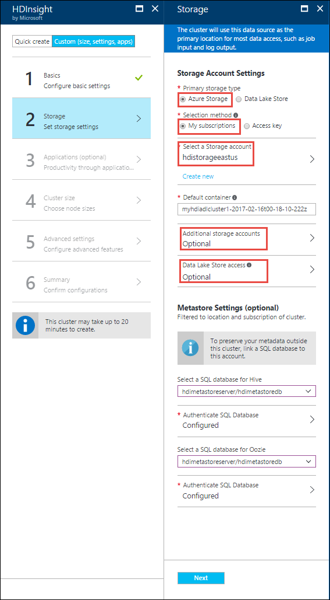

# 使用 Azure 门户在 HDInsight 中创建基于 Linux 的群集
[!INCLUDE [selector](../../includes/hdinsight-create-linux-cluster-selector.md)]

Azure 门户是一种基于 Web 的管理工具，用于管理 Azure 云中托管的服务和资源。 本文介绍如何使用门户创建基于 Linux 的 HDInsight 群集。

## 先决条件
[!INCLUDE [delete-cluster-warning](../../includes/hdinsight-delete-cluster-warning.md)]

* **一个 Azure 订阅**。 请参阅[获取 Azure 试用版](https://www.azure.cn/pricing/1rmb-trial/)。
* **一个现代 Web 浏览器**。 Azure 门户使用 HTML5 和 Javascript，可能无法在旧版 Web 浏览器中正确运行。

## 创建群集
Azure 门户会公开大部分的群集属性。 使用 Azure 资源管理器模板可以隐藏许多详细信息。 有关详细信息，请参阅[在 HDInsight 中使用 Azure Resource Manager 模板创建基于 Linux 的 Hadoop 群集](hdinsight-hadoop-create-linux-clusters-arm-templates.md)。

[!INCLUDE [secure-transfer-enabled-storage-account](../../includes/hdinsight-secure-transfer.md)]

1. 登录到 [Azure 门户](https://portal.azure.cn)。
2. 依次单击“+”、“智能 + 分析”、“HDInsight”。

    

3. 在“HDInsight”边栏选项卡中，单击“自定义(大小、设置、应用)”，单击“基本信息”，并输入以下信息。

    

    * 输入“群集名称” ：此名称必须全局唯一。

    * 从“订阅”下拉列表中选择要用于此群集的 Azure 订阅。

    * 单击“群集类型”，然后选择要创建的群集类型（Hadoop、Spark 等）。 对于“操作系统”，请单击“Linux”并选择版本。 如果不知道要选择哪个版本，请使用默认版本。 有关详细信息，请参阅 [HDInsight 群集版本](hdinsight-component-versioning.md)。

        对于 Hadoop、Spark 和 Interactive Query 群集类型，也可以选择安装“企业安全数据包”。 企业安全数据包启用安全功能，例如 Azure Active Directory 集成和适用于群集的 Apache Ranger。 有关详细信息，请参阅 [Azure HDInsight 中的企业安全数据包](./domain-joined/apache-domain-joined-introduction.md)。

        
     
        > [!IMPORTANT]
        > HDInsight 群集有各种类型，分别与针对其优化群集的工作负荷或技术相对应。 不支持在一个群集上创建合并了多个类型（如 Storm 和 HBase）的群集。 
        > 
        > 
        
    * 对于“群集登录用户名”和“群集登录密码”，请分别为管理员用户提供用户名和密码。

    * 输入“SSH 用户名”，如果要让 SSH 密码与在前面指定的管理员密码相同，则选中“使用与群集登录相同的密码”复选框。 如果不是，则提供“密码”或“公钥”，这会用于对 SSH 用户验证身份。 建议使用公钥。 单击底部的“选择”  ，保存凭据配置。

        有关信息，请参阅[将 SSH 与 HDInsight 配合使用](hdinsight-hadoop-linux-use-ssh-unix.md)。

    * 对于“资源组”，指定是要创建新的资源组还是使用现有资源组。

    * 指定要在其中创建群集的数据中心**位置**。

    * 单击“下一步”。

4. 对于“存储”，请指定是否要将 Azure 存储 (WASB) 作为默认存储。 有关详细信息，请查看下表。

    

    | 存储                                      | 说明 |
    |----------------------------------------------|-------------|
    | **将 Azure 存储 Blob 作为默认存储** | <ul><li>对于“主存储类型”，选择“Azure 存储”。 在此之后，如果要指定属于 Azure 订阅的存储帐户，则对于“选择方法”，可以选择“我的订阅”，并选择存储帐户。 否则，请单击“访问密钥”，并提供想要从 Azure 订阅外部选择的存储帐户的信息。</li><li>对于“默认容器”，可以选择使用门户建议的默认容器名称或自己指定。</li><li>如果使用 WASB 作为默认存储，则可以（可选）单击“其他存储帐户”以指定要与群集关联的其他存储帐户。 对于“Azure 存储密钥”，单击“添加存储密钥”，然后可从 Azure 订阅或其他订阅提供存储帐户（通过提供存储帐户访问密钥）。</li></ul> |
    | **外部元存储**                      | （可选）可以指定 SQL 数据库用于保存与群集关联的 Hive 和 Oozie 元数据。 对于“为 Hive 选择 SQL 数据库”，选择 SQL 数据库，并提供该数据库的用户名/密码。 为 Oozie 元数据重复以上这些步骤。  将 Azure SQL 数据库用于远存储时的一些注意事项。 <ul><li>用于元存储的 Azure SQL 数据库必须允许连接到其他 Azure 服务，包括 Azure HDInsight。 在 Azure SQL 数据库仪表板的右侧单击服务器名称。 这是运行 SQL 数据库实例的服务器。 进入服务器视图后，请单击“配置”，针对“Azure 服务”单击“是”，并单击“保存”。</li><li>创建元存储时，请勿使用包含短划线或连字符的数据库名称，因为这可能会导致群集创建过程失败。</li></ul>                                                                                                                                                                       |

    单击“下一步”。 

    > [!WARNING]
    > 不支持在 HDInsight 群集之外的其他位置使用别的存储帐户。

5. （可选）单击“应用程序”以安装适用于 HDInsight 群集的应用程序。 这些应用程序可能是 Microsoft、独立软件供应商 (ISV) 或自己开发的。 有关详细信息，请参阅[安装 HDInsight 应用程序](hdinsight-apps-install-applications.md#install-applications-during-cluster-creation)。

6. 单击“群集大小”以显示针对此群集使用的节点的相关信息。 设置群集所需的工作节点数。 此时还会显示该群集的预估运行成本。
   
    
   
   > [!IMPORTANT]
   > 如果计划使用 32 个以上的工作节点（在创建群集时或是在创建之后通过扩展群集进行），则必须选择至少具有 8 个核心和 14GB ram 的头节点大小。
   > 
   > 有关节点大小和相关费用的详细信息，请参阅 [HDInsight 定价](https://www.azure.cn/pricing/details/hdinsight/)。
   > 
   > 

   单击“下一步”以保存节点定价配置。

7. 单击“高级设置”以配置其他可选设置，如使用“脚本操作”自定义群集以安装自定义组件或加入“虚拟网络”。 有关详细信息，请查看下表。

    

    | 选项 | 说明 |
    |--------|-------------|
    | **脚本操作** | 如果想要在创建群集时使用自定义脚本自定义群集，请选择此选项。 有关脚本操作的详细信息，请参阅[使用脚本操作自定义 HDInsight 群集](hdinsight-hadoop-customize-cluster-linux.md)。 |
    | **虚拟网络** | 如果想要将群集放入虚拟网络，请选择 Azure 虚拟网络和子网。 有关将 HDInsight 与虚拟网络配合使用的信息（包括虚拟网络的特定配置要求），请参阅[使用 Azure 虚拟网络扩展 HDInsight 功能](hdinsight-extend-hadoop-virtual-network.md)。 |

    单击“下一步”。

8. 在“摘要”中，检查前面输入的信息，并单击“创建”。

    
    
    > [!NOTE]
    > 创建群集需要一些时间，通常约 15 分钟左右。 使用启动板上的磁贴或页面左侧的“通知”条目检查预配进程。
    > 
    > 
    
12. 创建过程完成后，在启动板中单击群集磁贴。 群集窗口提供以下信息。
    
    
    
    参考以下内容了解顶部的图标。
    
    *  边栏选项卡提供有关该群集的基本信息，如名称、所属的资源组、位置、操作系统、群集仪表板 URL 等。
    * 
            **仪表板** 可你将定向到与群集关联的 Ambari 门户。
    * **安全外壳**：使用 SSH 访问群集时所需的信息。
    * **缩放群集** 可增加与群集关联的辅助角色节点数。
    * **删除**：删除 HDInsight 群集。

## 自定义群集
* 请参阅[使用 Bootstrap 自定义 HDInsight 群集](hdinsight-hadoop-customize-cluster-bootstrap.md)。
* 请参阅[使用脚本操作自定义 HDInsight 群集](hdinsight-hadoop-customize-cluster-linux.md)。

## 删除群集
[!INCLUDE [delete-cluster-warning](../../includes/hdinsight-delete-cluster-warning.md)]

## 故障排除

如果在创建 HDInsight 群集时遇到问题，请参阅[访问控制要求](hdinsight-administer-use-portal-linux.md#create-clusters)。

## 后续步骤
成功创建 HDInsight 群集后，请参考以下主题来了解如何使用群集：

### Hadoop 群集
* [将 Hive 与 HDInsight 配合使用](hadoop/hdinsight-use-hive.md)
* [将 Pig 与 HDInsight 配合使用](hadoop/hdinsight-use-pig.md)
* [将 MapReduce 与 HDInsight 配合使用](hadoop/hdinsight-use-mapreduce.md)

### HBase 群集
* [HBase on HDInsight 入门](hbase/apache-hbase-tutorial-get-started-linux.md)
* [为 HBase on HDInsight 开发 Java 应用程序](hbase/apache-hbase-build-java-maven-linux.md)

### Storm 群集
* [为 Storm on HDInsight 开发 Java 拓扑](storm/apache-storm-develop-java-topology.md)
* [在 Storm on HDInsight 中使用 Python 组件](storm/apache-storm-develop-python-topology.md)
* [使用 Storm on HDInsight 部署和监视拓扑](storm/apache-storm-deploy-monitor-topology-linux.md)

### Spark 群集
* [使用 Scala 创建独立的应用程序](spark/apache-spark-create-standalone-application.md)
* [使用 Livy 在 Spark 群集中远程运行作业](spark/apache-spark-livy-rest-interface.md)
* [Spark 和 BI：使用 HDInsight 中的 Spark 和 BI 工具执行交互式数据分析](spark/apache-spark-use-bi-tools.md)
* [Spark 和机器学习：使用 HDInsight 中的 Spark 预测食品检查结果](spark/apache-spark-machine-learning-mllib-ipython.md)

