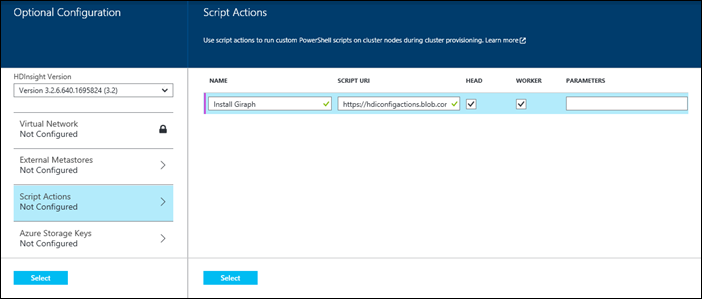

# <a name="install-and-use-giraph-on-windows-based-hdinsight-clusters"></a>在基于 Windows 的 HDInsight 群集上安装并使用 Giraph

了解如何使用 Giraph 通过脚本操作来自定义基于 Windows 的 HDInsight 群集，以及如何使用 Giraph 来处理大型关系图。 有关在基于 Linux 的群集中使用 Giraph 的信息，请参阅[在 HDInsight Hadoop 群集 (Linux) 上安装 Giraph](hdinsight-hadoop-giraph-install-linux.md)。

> [!IMPORTANT]
> 本文档中的步骤仅适用于基于 Windows 的 HDInsight 群集。 低于 HDInsight 3.4 的 HDInsight 版本仅在 Windows 上提供。 Linux 是 HDInsight 3.4 或更高版本上使用的唯一操作系统。 有关详细信息，请参阅 [HDInsight 在 Windows 上停用](hdinsight-component-versioning.md#hdinsight-windows-retirement)。 若要了解如何在基于 Linux 的 HDInsight 群集上安装 Giraph，请参阅[在 HDInsight Hadoop 群集 (Linux) 上安装 Giraph](hdinsight-hadoop-giraph-install-linux.md)。

可以使用脚本操作，在 Azure HDInsight 的任何一种群集（Hadoop、Storm、HBase、Spark）上安装 Giraph。 用于在 HDInsight 群集上安装 Giraph 的示例脚本可从只读 Azure 存储 Blob ([https://hdiconfigactions.blob.core.windows.net/giraphconfigactionv01/giraph-installer-v01.ps1](https://hdiconfigactions.blob.core.windows.net/giraphconfigactionv01/giraph-installer-v01.ps1)) 获得。 示例脚本仅适用于 HDInsight 群集版本 3.1。 有关 HDInsight 群集版本的详细信息，请参阅 [HDInsight 群集版本](hdinsight-component-versioning.md)。

**相关文章**

* [在 HDInsight Hadoop 群集 (Linux) 上安装 Giraph](hdinsight-hadoop-giraph-install-linux.md)
* [在 HDInsight 中创建 Hadoop 群集](hdinsight-provision-clusters.md)：有关如何创建 HDInsight 群集的一般信息。
* [使用脚本操作自定义 HDInsight 群集][hdinsight-cluster-customize]：有关使用脚本操作自定义 HDInsight 群集的一般信息。
* [为 HDInsight 开发脚本操作脚本](hdinsight-hadoop-script-actions.md)。

## <a name="what-is-giraph"></a>什么是 Giraph？
<a href="http://giraph.apache.org/" target="_blank">Apache Giraph</a> 允许使用 Hadoop 执行图形处理，并可以在 Azure HDInsight 上使用。 图形可为对象之间的关系建模，例如，为 Internet 之类的大型网络上的路由器之间的连接建模，或者为社交网络上的人物之间的关系建模（有时称为社交图形）。 通过图形处理，可以推理图形中对象之间的关系，例如：

* 根据当前的关系识别潜在的朋友。
* 识别网络中两台计算机之间的最短路由。
* 计算网页的排名。

## <a name="install-giraph-using-portal"></a>使用门户安装 Giraph
1. 按照[在 HDInsight 中创建 Hadoop 群集](hdinsight-provision-clusters.md)中的说明，使用“自定义创建”选项开始创建群集。
2. 在向导的“脚本操作”页上，单击“添加脚本操作”，提供有关脚本操作的详细信息，如下所示：

    

    <table border='1'>
        <tr><th>属性</th><th>值</th></tr>
        <tr><td>Name</td>
            <td>指定脚本操作的名称。 例如，Install Giraph<b></b>。</td></tr>
        <tr><td>脚本 URI</td>
            <td>指定调用其对应的脚本可自定义群集的统一资源标识符 (URI)。 例如 <i>https://hdiconfigactions.blob.core.windows.net/giraphconfigactionv01/giraph-installer-v01.ps1</i></td></tr>
        <tr><td>节点类型</td>
            <td>指定在其上运行自定义脚本的节点。 可以选择“所有节点”、“仅限头节点”或“仅限辅助角色节点”<b></b><b></b><b></b>。
        <tr><td>parameters</td>
            <td>根据脚本的需要，请指定参数。 用于安装 Giraph 的脚本不需要任何参数，因此可以将此字段留空。</td></tr>
    </table>

    可以添加多个脚本操作，以在群集上安装多个组件。 在添加了脚本后，单击复选标记以开始创建群集。

## <a name="use-giraph"></a>使用 Giraph
我们将使用 SimpleShortestPathsComputation 示例演示有关查找图形中对象之间最短路径的基本 <a href = "http://people.apache.org/~edwardyoon/documents/pregel.pdf">Pregel</a> 实现。 请执行以下步骤，以上传示例数据和示例 jar，使用 SimpleShortestPathsComputation 示例运行作业，然后查看结果。

1. 将示例数据文件上传到 Azure Blob 存储。 在本地工作站上，创建名为 tiny_graph.txt 的新文件。 该文件应该包含以下几行：

        [0,0,[[1,1],[3,3]]]
        [1,0,[[0,1],[2,2],[3,1]]]
        [2,0,[[1,2],[4,4]]]
        [3,0,[[0,3],[1,1],[4,4]]]
        [4,0,[[3,4],[2,4]]]

    将 tiny_graph.txt 文件上传到 HDInsight 群集的主存储。 有关如何上传数据的说明，请参阅[在 HDInsight 中上传 Hadoop 作业的数据](hdinsight-upload-data.md)。

    此数据使用 [source\_id, source\_value,[[dest\_id], [edge\_value],...]] 格式，描述有向图中对象之间的关系。每一行代表 source\_id 对象与一个或多个 dest\_id 对象之间的关系。 edge\_value（或权重）可被视为 source_id 和 dest\_id 之间的连接强度或距离。

    使用表示对象间距离的值（或权重）绘制图形后，上述数据可能与下面类似。

    
2. 运行 SimpleShortestPathsComputation 示例。 使用 tiny_graph.txt 文件作为输入，通过以下 Azure PowerShell cmdlet 来运行该示例。

    > [!IMPORTANT]
    > 使用 Azure Service Manager 管理 HDInsight 资源的 Azure PowerShell 支持**已弃用**，已在 2017 年 1 月 1 日删除。 本文档中的步骤使用的是与 Azure Resource Manager 兼容的新 HDInsight cmdlet。
    >
    > 请按照 [Install and configure Azure PowerShell](https://docs.microsoft.com/powershell/azureps-cmdlets-docs) （安装和配置 Azure PowerShell）中的步骤安装最新版本的 Azure PowerShell。 如果脚本需要修改才能使用与 Azure Resource Manager 兼容的新 cmdlet，请参阅[迁移到适用于 HDInsight 群集的基于 Azure Resource Manager 的开发工具](hdinsight-hadoop-development-using-azure-resource-manager.md)，了解详细信息。

    ```powershell
    $clusterName = "clustername"
    # Giraph examples jar
    $jarFile = "wasb:///example/jars/giraph-examples.jar"
    # Arguments for this job
    $jobArguments = "org.apache.giraph.examples.SimpleShortestPathsComputation",
                    "-ca", "mapred.job.tracker=headnodehost:9010",
                    "-vif", "org.apache.giraph.io.formats.JsonLongDoubleFloatDoubleVertexInputFormat",
                    "-vip", "wasb:///example/data/tiny_graph.txt",
                    "-vof", "org.apache.giraph.io.formats.IdWithValueTextOutputFormat",
                    "-op",  "wasb:///example/output/shortestpaths",
                    "-w", "2"
    # Create the definition
    $jobDefinition = New-AzureHDInsightMapReduceJobDefinition
        -JarFile $jarFile
        -ClassName "org.apache.giraph.GiraphRunner"
        -Arguments $jobArguments

    # Run the job, write output to the Azure PowerShell window
    $job = Start-AzureHDInsightJob -Cluster $clusterName -JobDefinition $jobDefinition
    Write-Host "Wait for the job to complete ..." -ForegroundColor Green
    Wait-AzureHDInsightJob -Job $job
    Write-Host "STDERR"
    Get-AzureHDInsightJobOutput -Cluster $clusterName -JobId $job.JobId -StandardError
    Write-Host "Display the standard output ..." -ForegroundColor Green
    Get-AzureHDInsightJobOutput -Cluster $clusterName -JobId $job.JobId -StandardOutput
    ```

    在上面的示例中，请将 **clustername** 替换为已装有 Giraph 的 HDInsight 群集的名称。
3. 查看结果。 完成该作业后，结果将存储在 **wasbs:///example/out/shotestpaths** 文件夹中的两个输出文件中。 这些文件名为 **part-m-00001** 和 **part-m-00002**。 执行以下步骤，下载和查看输出：

    ```powershell
    $subscriptionName = "<SubscriptionName>"       # Azure subscription name
    $storageAccountName = "<StorageAccountName>"   # Azure Storage account name
    $containerName = "<ContainerName>"             # Blob storage container name

    # Select the current subscription
    Select-AzureSubscription $subscriptionName

    # Create the Storage account context object
    $storageAccountKey = Get-AzureStorageKey $storageAccountName | %{ $_.Primary }
    $storageContext = New-AzureStorageContext -StorageAccountName $storageAccountName -StorageAccountKey $storageAccountKey

    # Download the job output to the workstation
    Get-AzureStorageBlobContent -Container $containerName -Blob example/output/shortestpaths/part-m-00001 -Context $storageContext -Force
    Get-AzureStorageBlobContent -Container $containerName -Blob example/output/shortestpaths/part-m-00002 -Context $storageContext -Force
    ```

    此时会在工作站上的当前目录中创建 **example/output/shortestpaths** 目录结构，并将两个输出文件下载到该位置。

    使用 **Cat** cmdlet 显示文件的内容：

        Cat example/output/shortestpaths/part*

    输出应如下所示：

        0    1.0
        4    5.0
        2    2.0
        1    0.0
        3    1.0

    SimpleShortestPathComputation 示例硬编码为从对象 ID 1 开始查找与其他对象间的最短路径。 因此，输出应显示为 `destination_id distance`，其中，distance 为对象 ID 1 与目标 ID 的边缘之间的行程值（或权重）。

    在可视化此数据的情况下，可以通过行经 ID 1 与所有其他对象之间的最短路径来验证结果。 请注意，ID 1 和 ID 4 之间的最短路径为 5。 这是从 <span style="color:orange">ID 1 到 ID 3</span>，再从 <span style="color:red">ID 3 到 ID 4</span> 的总距离。

    

## <a name="install-giraph-using-aure-powershell"></a>使用 Azure PowerShell 安装 Giraph
请参阅[使用脚本操作自定义 HDInsight 群集](hdinsight-hadoop-customize-cluster.md#call-scripts-using-azure-powershell)。  此示例演示如何使用 Azure PowerShell 安装 Spark。 需要自定义脚本以使用 [https://hdiconfigactions.blob.core.windows.net/giraphconfigactionv01/giraph-installer-v01.ps1](https://hdiconfigactions.blob.core.windows.net/giraphconfigactionv01/giraph-installer-v01.ps1)。

## <a name="install-giraph-using-net-sdk"></a>使用 .NET SDK 安装 Giraph
请参阅[使用脚本操作自定义 HDInsight 群集](hdinsight-hadoop-customize-cluster.md#call-scripts-using-azure-powershell)。 此示例演示如何使用 .NET SDK 安装 Spark。 需要自定义脚本以使用 [https://hdiconfigactions.blob.core.windows.net/giraphconfigactionv01/giraph-installer-v01.ps1](https://hdiconfigactions.blob.core.windows.net/giraphconfigactionv01/giraph-installer-v01.ps1)。

## <a name="see-also"></a>另请参阅
* [在 HDInsight Hadoop 群集 (Linux) 上安装 Giraph](hdinsight-hadoop-giraph-install-linux.md)
* [在 HDInsight 中创建 Hadoop 群集](hdinsight-provision-clusters.md)：有关如何创建 HDInsight 群集的一般信息。
* [使用脚本操作自定义 HDInsight 群集][hdinsight-cluster-customize]：有关使用脚本操作自定义 HDInsight 群集的一般信息。
* [为 HDInsight 开发脚本操作脚本](hdinsight-hadoop-script-actions.md)。
* [在 HDInsight 群集上安装并使用 Spark][hdinsight-install-spark]：有关安装 Spark 的脚本操作示例。
* [在 HDInsight 群集上安装 Solr](hdinsight-hadoop-solr-install.md)：有关安装 Solr 的脚本操作示例。

[tools]: https://github.com/Blackmist/hdinsight-tools
[aps]: /powershell-install-configure/

[powershell-install]: https://docs.microsoft.com/powershell/azureps-cmdlets-docs
[hdinsight-provision]: hdinsight-provision-clusters.md
[hdinsight-install-r]: hdinsight-hadoop-r-scripts.md
[hdinsight-install-spark]: hdinsight-hadoop-spark-install.md
[hdinsight-cluster-customize]: hdinsight-hadoop-customize-cluster.md
<!--Update_Description: change 'wasbs' into 'wasb'-->