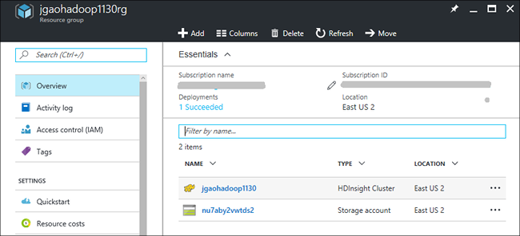
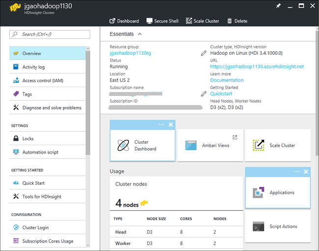

# Hadoop 教程：开始使用 HDInsight 中的 Hadoop

了解如何在 HDInsight 中创建 [Hadoop](http://hadoop.apache.org/) 群集，以及如何在 HDInsight 中运行 Hive 作业。 [Apache Hive](https://hive.apache.org/) 是 Hadoop 生态系统中最热门的组件。 目前，HDInsight 随附六种不同类型的群集：[Hadoop](hdinsight-hadoop-introduction.md)、[Spark](hdinsight-apache-spark-overview.md)、[HBase](hdinsight-hbase-overview.md)、[Storm](hdinsight-storm-overview.md) 和[交互式 Hive（预览版）](hdinsight-hadoop-use-interactive-hive.md)。  每个群集类型都支持一组不同的组件。 所有六种群集类型都支持 Hive。 有关 HDInsight 中受支持组件的列表，请参阅 [HDInsight 提供的 Hadoop 群集版本中有哪些新功能？](hdinsight-component-versioning.md)  

[!INCLUDE [delete-cluster-warning](../../includes/hdinsight-delete-cluster-warning.md)]

## 先决条件
在开始阅读本教程前，必须具备以下条件：

* **Azure 订阅**：若要创建免费试用一个月的帐户，请浏览到 [https://www.azure.cn/pricing/1rmb-trial/](https://www.azure.cn/pricing/1rmb-trial/)。

## 创建群集

大部分 Hadoop 作业都是批处理作业。 你可以创建群集、运行某些作业，然后删除该群集。 本部分介绍如何使用 [Azure Resource Manager 模板](../azure-resource-manager/resource-group-template-deploy.md)在 HDInsight 中创建 Hadoop 群集。 对于遵循本教程，Resource Manager 模板体验不是必需的。 如需其他群集创建方法或需了解本教程中使用的属性，请参阅[创建 HDInsight 群集](hdinsight-hadoop-provision-linux-clusters.md)。 使用页面顶部的选择器来选择群集创建选项。

本教程中所用的 Resource Manager 模板位于 [GitHub](https://github.com/Azure/azure-quickstart-templates/tree/master/101-hdinsight-linux-ssh-password/)中。 

1. 单击以下映像以登录到 Azure，然后在 Azure 门户预览中打开 Resource Manager 模板。 

    
2. 输入或选择下列值：

    * **订阅**：选择你的 Azure 订阅。
    * **资源组**：创建资源组或选择现有资源组。  资源组是 Azure 组件的容器。  在此示例中，资源组包含 HDInsight 群集和依赖的 Azure 存储帐户。 
    * **位置**：选择要创建群集的 Azure 位置。  为获得更佳性能，请选择离你较近的位置。 
    * **群集类型**：对于本教程，请选择“Hadoop”。
    * **群集名称**：输入 Hadoop 群集的名称。
    * **群集登录名和密码**：默认登录名是 **admin**。
    * **SSH 用户名和密码**：默认用户名是 **sshuser**。  可以重命名它。 

    某些属性已在模板中硬编码。  可以在模板中配置这些值。

    * **位置**：群集和依赖的存储帐户所用的位置与资源组所用的相同。
    * **群集版本**：3.5
    * **OS 类型**：Linux
    * **工作节点数**：2

     每个群集都有一个 Azure 存储帐户依赖项。 该帐户称为默认存储帐户。 HDInsight 群集与默认存储帐户必须均位于同一 Azure 区域。 删除群集不会删除存储帐户。 

     有关这些属性的详细说明，请参阅 [在 HDInsight 中创建 Hadoop 群集](hdinsight-hadoop-provision-linux-clusters.md)。

3. 单击“法律条款”，然后单击“创建”。 确认已选中“固定到仪表板”复选框，然后单击“创建”。 你会在门户仪表板上看到一个标题为“对模板部署进行部署”  的新磁贴。 创建群集大约需要 20 分钟时间。 创建群集后，磁贴的标题被更改为指定的资源组名称。 门户将自动在新的边栏选项卡中打开资源组。 可以看到列出了群集和默认存储。

    。

4. 单击群集名称可在新的边栏选项卡中打开该群集。

   

## 运行 Hive 查询
[Apache Hive](hdinsight-use-hive.md) 是 HDInsight 中最流行的组件。 有多种方法可以在 HDInsight 中运行 Hive 作业。 本教程中将从门户中使用 Ambari Hive 视图运行某些 Hive 作业。 有关提交 Hive 作业的其他方法，请参阅[在 HDInsight 中使用 Hive](hdinsight-use-hive.md)。

1. 根据上面的屏幕截图所示单击“群集仪表板”，然后单击“HDInsight 群集仪表板”。  也可以在浏览到 **https://&lt;ClusterName>.azurehdinsight.cn** 后打开 Ambari，其中 &lt;ClusterName> 是在上一部分创建的群集。
2. 输入上一节中指定的 Hadoop 用户名和密码。 默认的用户名为 **admin**。
3. 打开 **Hive 视图** ，如以下屏幕截图中所示：

    。
4. 在此页面的“查询编辑器”  中，将以下 HiveQL 语句粘贴到工作表中：

        SHOW TABLES;

    > [!NOTE]
    > 对于 Hive，需使用分号。       
    > 
    > 
5. 单击“执行” 。 “查询进程结果”  部分应出现在“查询编辑器”下方，并显示有关作业的信息。 

    查询完成后，“查询进程结果”  部分将显示该操作的结果。 此时会看到一个名为 **hivesampletable** 的表。 所有 HDInsight 群集都随附了此示例 Hive 表。

    。
6. 重复执行步骤 4 和步骤 5，以运行以下查询：

        SELECT * FROM hivesampletable;

    > [!TIP]
    > 请注意“查询过程结果”部分右上角的“保存结果”下拉列表；可以使用此下拉列表下载结果，或者将结果以 CSV 文件形式保存到 HDInsight 存储。
    > 
    > 
7. 单击“历史记录”  来获取作业列表。

完成 Hive 作业后，可以[将结果导出到 Azure SQL 数据库或 SQL Server 数据库](hdinsight-use-sqoop-mac-linux.md)，还可以[使用 Excel 将结果可视化](hdinsight-connect-excel-power-query.md)。 有关在 HDInsight 中使用 Hive 的详细信息，请参阅[将 Hive 和 HiveQL 与 HDInsight 中的 Hadoop 配合使用以分析示例 Apache log4j 文件](hdinsight-use-hive.md)。

## 结束本教程
完成教程之后，可能想要删除该群集。 有了 HDInsight，你就可以将数据存储在 Azure 存储中，因此可以在群集不用时安全地删除群集。 此外，还需要支付 HDInsight 群集费用，即使未使用。 由于群集费用高于存储空间费用数倍，因此在不使用群集时将其删除可以节省费用。 

**删除群集和/或默认存储帐户**

1. 登录 [Azure 门户预览](https://portal.azure.cn)。
2. 从门户仪表板中，单击创建群集时使用的资源组名称的磁贴。
3. 在资源边栏选项卡中单击“删除”，删除包含群集和默认存储帐户的资源组；或者，在“资源”磁贴中单击群集名称，然后在群集边栏选项卡中单击“删除”。 注意，删除资源组会删除存储帐户。 如果想要保留存储帐户，请选择仅删除群集。

## 故障排除

如果在创建 HDInsight 群集时遇到问题，请参阅[访问控制要求](hdinsight-administer-use-portal-linux.md#create-clusters)。

## 后续步骤
在本教程中，你已学习如何使用 Resource Manager 模板创建基于 Linux 的 HDInsight 群集，以及如何执行基本 Hive 查询。

有关如何使用 HDInsight 分析数据的详细信息，请参阅以下文章：

* 若要了解有关将 Hive 与 HDInsight 配合使用（包括如何从 Visual Studio 中执行 Hive 查询）的详细信息，请参阅 [将 Hive 与 HDInsight 配合使用][hdinsight-use-hive]。
* 若要了解 Pig（一种用于转换数据的语言），请参阅 [将 Pig 与 HDInsight 配合使用][hdinsight-use-pig]。
* 若要了解 MapReduce（在 Hadoop 中处理数据的程序编写方式），请参阅 [将 MapReduce 与 HDInsight 配合使用][hdinsight-use-mapreduce]。
* 若要了解使用适用于 Visual Studio 的 HDInsight 工具在 HDInsight 上进行数据分析的内容，请参阅[用于 HDInsight 的 Visual Studio Hadoop 工具入门](hdinsight-hadoop-visual-studio-tools-get-started.md)。

如果已准备好开始使用自己的数据，并希望详细了解 HDInsight 如何存储数据或如何将数据导入 HDInsight，请参阅以下文档：

* 有关 HDInsight 如何使用 Azure 存储的信息，请参阅[将 Azure 存储与 HDInsight 配合使用](hdinsight-hadoop-use-blob-storage.md)。
* 有关如何将数据上传到 HDInsight 的信息，请参阅 [将数据上传到 HDInsight][hdinsight-upload-data]。

如果想要了解有关创建或管理 HDInsight 群集的详细信息，请参阅以下文档：

* 若要了解如何管理基于 Linux 的 HDInsight 群集，请参阅[使用 Ambari 管理 HDInsight 群集](hdinsight-hadoop-manage-ambari.md)。
* 若要详细了解在创建 HDInsight 群集时可以选择哪些选项，请参阅[使用自定义选项在 Linux 上创建 HDInsight](hdinsight-hadoop-provision-linux-clusters.md)。
* 如果熟悉 Linux 和 Hadoop，但想要了解有关 HDInsight 上 Hadoop 的具体信息，请参阅[使用 Linux 上的 HDInsight](hdinsight-hadoop-linux-information.md)。 此文提供了如下所述信息：

    * 群集上托管的服务（例如 Ambari 和 WebHCat）的 URL
    * Hadoop 文件和示例在本地文件系统上的位置
    * 使用 Azure 存储 (WASB) 而不是 HDFS 作为默认数据存储

[1]: ../HDInsight/hdinsight-hadoop-visual-studio-tools-get-started.md

[hdinsight-provision]: hdinsight-provision-linux-clusters.md
[hdinsight-upload-data]: hdinsight-upload-data.md
[hdinsight-use-mapreduce]: hdinsight-use-mapreduce.md
[hdinsight-use-hive]: hdinsight-use-hive.md
[hdinsight-use-pig]: hdinsight-use-pig.md

