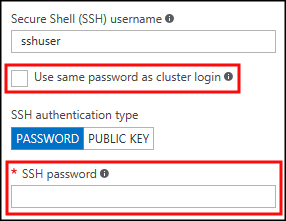

# 使用 SSH 连接到 HDInsight (Hadoop)

了解如何使用[安全外壳 (SSH)](https://en.wikipedia.org/wiki/Secure_Shell) 安全连接到 HDInsight。 HDInsight 可以使用 Linux (Ubuntu) 作为群集中节点的操作系统。 可以使用 SSH 连接到基于 Linux 的群集的头节点和边缘节点，并直接在这些节点上运行命令。

下表包含使用 SSH 连接到 HDInsight 时所需的地址和端口信息：

| 地址 | 端口 | 连接到... |
| ----- | ----- | ----- |
| `<clustername>-ed-ssh.azurehdinsight.cn` | 22 | 边缘节点（HDInsight 上的 R Server） |
| `<edgenodename>.<clustername>-ssh.azurehdinsight.cn` | 22 | 边缘节点（如果存在边缘节点，则可以是任何其他群集类型） |
| `<clustername>-ssh.azurehdinsight.cn` | 22 | 主头节点 |
| `<clustername>-ssh.azurehdinsight.cn` | 23 | 辅助头节点 |

> [!NOTE]
> 将 `<edgenodename>` 替换为边缘节点的名称。
>
> 将 `<clustername>` 替换为 HDInsight 群集的名称。
>
> 我们建议__始终连接到边缘节点__（如果有）。 头节点托管的服务对于群集运行状况而言至关重要。 边缘节点只会运行其上放置的软件。
>
> 有关使用边缘节点的详细信息，请参阅 [Use edge nodes in HDInsight](hdinsight-apps-use-edge-node.md#access-an-edge-node)（在 HDInsight 中使用边缘节点）。

## SSH 客户端

大多数操作系统提供 `ssh` 客户端。 默认情况下，Microsoft Windows 不提供 SSH 客户端。 以下每个包中提供了适用于 Windows 的 SSH 客户端：

* [Windows 10 上的 Bash on Ubuntu](https://msdn.microsoft.com/commandline/wsl/about)：通过 Windows 命令行中的 Bash 提供 `ssh` 命令。

* [Git (https://git-scm.com/)](https://git-scm.com/)：通过 GitBash 命令行提供 `ssh` 命令。

* [GitHub Desktop (https://desktop.github.com/)](https://desktop.github.com/)：通过 Git Shell 命令行提供 `ssh` 命令。 可将 GitHub Desktop 配置为使用 Bash、Windows 命令提示符或 PowerShell 作为 Git Shell 的命令行。

* [OpenSSH (https://github.com/PowerShell/Win32-OpenSSH/wiki/Install-Win32-OpenSSH)](https://github.com/PowerShell/Win32-OpenSSH/wiki/Install-Win32-OpenSSH)：PowerShell 团队正在将 OpenSSH 移植到 Windows，到时将提供测试版。

    > [!WARNING]
    > OpenSSH 包中包含 SSH 服务器组件 `sshd`。 此组件可在系统上启动 SSH 服务器，使其他人能够连接到该服务器。 除非想要在系统上托管 SSH 服务器，否则请不要配置此组件，也不要打开端口 22。 与 HDInsight 通信并不需要使用此组件。

此外，还可以使用多个图形 SSH 客户端，例如 [PuTTY (http://www.chiark.greenend.org.uk/~sgtatham/putty/)](http://www.chiark.greenend.org.uk/~sgtatham/putty/) 和 [MobaXterm (http://mobaxterm.mobatek.net/)](http://mobaxterm.mobatek.net/)。 尽管可以使用这些客户端连接到 HDInsight，但连接到服务器的过程与使用 `ssh` 实用工具时不同。 有关详细信息，请参阅所用图形客户端的文档。

## 身份验证：SSH 密钥

SSH 密钥使用[公钥加密](https://en.wikipedia.org/wiki/Public-key_cryptography)来保护群集。 SSH 密钥比密码更安全，使用它可以轻松保护 HDInsight 群集。

如果使用密钥保护 SSH 帐户，客户端必须在你连接时提供匹配的私钥：

* 可将大多数客户端配置为使用__默认密钥__。 例如，在 Linux 和 Unix 环境中，`ssh` 客户端将在 `~/.ssh/id_rsa` 位置查找私钥。

* 可以指定__私钥的路径__。 在 `ssh` 客户端中，可使用 `-i` 参数指定私钥的路径。 例如，`ssh -i ~/.ssh/hdinsight sshuser@myedge.mycluster-ssh.azurehdinsight.cn`。

* 如果对不同的服务器使用__多个私钥__，可以使用 [ssh-agent (https://en.wikipedia.org/wiki/Ssh-agent)](https://en.wikipedia.org/wiki/Ssh-agent) 等实用工具自动选择要使用的密钥。

> [!IMPORTANT]
>
> 如果使用密码保护私钥，使用该密钥时必须输入密码。 为提供方便，`ssh-agent` 等实用工具可以缓存密码。

### 创建 SSH 密钥对

使用 `ssh-keygen` 命令创建公钥和私钥文件。 以下命令生成可在 HDInsight 中使用的 2048 位 RSA 密钥对：

    ssh-keygen -t rsa -b 2048

在创建密钥的过程中，系统会提示你输入信息。 例如，密钥的存储位置，或者是否要使用密码。 完成该过程后，将创建两个文件：一个公钥文件和一个私钥文件。

* __公钥__用于创建 HDInsight 群集。 公钥的扩展名为 `.pub`。

* __私钥__用于在 HDInsight 群集中对客户端进行身份验证。

> [!IMPORTANT]
> 可以使用密码保护密钥。 该密码其实是私钥中的一个密码。 即使有人获取了你的私钥，但他们必须知道该密码才能使用该私钥。

### 使用公钥创建 HDInsight

| 创建方法 | 如何使用公钥 |
| ------- | ------- |
| **Azure 门户预览** | 取消选中“使用与群集登录相同的密码”，然后选择“公钥”作为 SSH 身份验证类型。 最后，在“SSH 公钥”字段中选择公钥文件，或粘贴该文件的文本内容。  |
| **Azure PowerShell** | 使用 `New-AzureRmHdinsightCluster` cmdlet 的 `-SshPublicKey` 参数，并以字符串的形式传递公钥内容。|
| **Azure CLI 1.0** | 使用 `azure hdinsight cluster create` 命令的 `--sshPublicKey` 参数，并以字符串的形式传递公钥内容。 |
| **Resource Manager 模板** | 有关在模板中使用 SSH 密钥的示例，请参阅 [Deploy HDInsight on Linux with SSH key](https://github.com/Azure/azure-quickstart-templates/blob/master/101-hdinsight-linux-ssh-publickey/)（使用 SSH 密钥在 Linux 上部署 HDInsight）。 [azuredeploy.json](https://github.com/Azure/azure-quickstart-templates/blob/master/101-hdinsight-linux-ssh-publickey/azuredeploy.json) 文件中的 `publicKeys` 元素用于在创建群集时向 Azure 传递密钥。 |

## 身份验证：密码

可以使用密码保护 SSH 帐户。 使用 SSH 连接到 HDInsight 时，系统会提示你输入密码。

> [!WARNING]
> 不建议将密码身份验证用于 SSH。 密码可能被猜出，容易受到暴力破解攻击。 我们建议[使用 SSH 密钥进行身份验证](#sshkey)。

### 使用密码创建 HDInsight

| 创建方法 | 如何指定密码 |
| --------------- | ---------------- |
| **Azure 门户预览** | 默认情况下，SSH 用户帐户的密码与群集登录帐户的密码相同。 若要使用不同的密码，请取消选中“使用与群集登录相同的密码”，然后在“SSH 密码”字段中输入密码。 |
| **Azure PowerShell** | 使用 `New-AzureRmHdinsightCluster` cmdlet 的 `--SshCredential` 参数，并传递包含 SSH 用户帐户名和密码的 `PSCredential` 对象。 |
| **Azure CLI 1.0** | 使用 `azure hdinsight cluster create` 命令的 `--sshPassword` 参数，并提供密码值。 |
| **Resource Manager 模板** | 有关在模板中使用密码的示例，请参阅 [Deploy HDInsight on Linux with SSH password](https://github.com/Azure/azure-quickstart-templates/blob/master/101-hdinsight-linux-ssh-password/)（使用 SSH 密码在 Linux 上部署 HDInsight）。 [azuredeploy.json](https://github.com/Azure/azure-quickstart-templates/blob/master/101-hdinsight-linux-ssh-password/azuredeploy.json) 文件中的 `linuxOperatingSystemProfile` 元素用于在创建群集时向 Azure 传递 SSH 帐户名和密码。|

### 更改 SSH 密码

有关更改 SSH 用户帐户密码的信息，请参阅 [Manage HDInsight](hdinsight-administer-use-portal-linux.md#change-passwords)（管理 HDInsight）文档的 __Change passwords__（更改密码）部分。

## 连接到工作节点和 Zookeeper 节点

无法直接从 Internet 访问工作节点和 Zookeeper 节点，但可以从群集头节点或边缘节点访问。 以下是连接到其他节点的一般步骤：

1. 使用 SSH 连接到头节点或边缘节点：

        ssh sshuser@myedge.mycluster-ssh.azurehdinsight.cn

2. 通过 SSH 连接到头节点或边缘节点后，使用 `ssh` 命令连接到群集中的工作节点：

        ssh sshuser@wn0-myhdi

    若要检索群集中节点的域名列表，请参阅 [Manage HDInsight by using the Ambari REST API](hdinsight-hadoop-manage-ambari-rest-api.md#example-get-the-fqdn-of-cluster-nodes)（使用 Ambari REST API 管理 HDInsight）文档中的示例。

如果使用__密码__保护 SSH 帐户，系统会要求输入该密码并建立连接。

如果使用 __SSH 密钥__保护 SSH 帐户，必须确保为本地环境配置 SSH 代理转发。

> [!NOTE]
> 直接访问群集中所有节点的另一种方法是在 Azure 虚拟网络中安装 HDInsight。 然后，可将远程计算机加入相同的虚拟网络，这样就可以直接访问群集中的所有节点。
>
> 有关详细信息，请参阅将 [Use a virtual network with HDInsight](hdinsight-extend-hadoop-virtual-network.md)（对 HDInsight 使用虚拟网络）。

### 配置 SSH 代理转发

> [!IMPORTANT]
> 以下步骤假设在基于 Linux/UNIX 的系统上操作，并且能够使用 Bash on Windows 10。 如果这些步骤不适用于你的系统，你可能需要查阅 SSH 客户端的文档。

1. 使用文本编辑器打开 `~/.ssh/config`。 如果此文件不存在，可以在命令行中输入 `touch ~/.ssh/config` 来创建。

2. 将以下文本添加到 `config` 文件。

        Host <edgenodename>.<clustername>-ssh.azurehdinsight.cn
          ForwardAgent yes

    将 __Host__ 信息替换为使用 SSH 连接到的节点的地址。 上面的示例使用边缘节点。 此条目为指定的节点配置 SSH 代理转发。

3. 在终端中通过使用以下命令测试 SSH 代理转发：

        echo "$SSH_AUTH_SOCK"

    此命令返回类似于以下文本的信息：

        /tmp/ssh-rfSUL1ldCldQ/agent.1792

    如未返回任何信息，则 `ssh-agent` 未运行。 请参阅 [Using ssh-agent with ssh (http://mah.everybody.org/docs/ssh)](http://mah.everybody.org/docs/ssh)（将 ssh-agent 与 ssh 配合使用）中的代理启动脚本信息，或者查阅 SSH 客户端文档，了解安装和配置 `ssh-agent` 的具体步骤。

4. 验证了 **ssh-agent** 处于运行状态后，请使用以下方式将你的 SSH 私钥添加到代理：

        ssh-add ~/.ssh/id_rsa

    如果你的私钥存储在不同文件中，请将 `~/.ssh/id_rsa` 替换为该文件的路径。

5. 使用 SSH 连接到群集边缘节点或头节点。 然后使用 SSH 命令连接到工作节点或 zookeeper 节点。 使用转发的密钥建立连接。

## 后续步骤

* [对 HDInsight 使用 SSH 隧道](hdinsight-linux-ambari-ssh-tunnel.md)
* [对 HDInsight 使用虚拟网络](hdinsight-extend-hadoop-virtual-network.md)
* [在 HDInsight 中使用边缘节点](hdinsight-apps-use-edge-node.md#access-an-edge-node)

