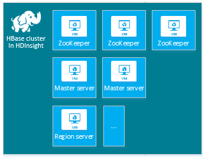

# 使用 Apache Hadoop、Apache Spark、Apache Kafka 及其他组件在 HDInsight 中设置群集

[!INCLUDE [selector](../../includes/hdinsight-create-linux-cluster-selector.md)]

了解如何在 HDInsight 中设置和配置 Apache Hadoop、Apache Spark、Apache Kafka、交互式查询、Apache HBase、机器学习服务或 Apache Storm。 另外，了解如何自定义群集，并将它们加入域以提高安全性。

Hadoop 群集由用于对任务进行分布式处理的多个虚拟机（节点）组成。 Azure HDInsight 对各个节点的安装和配置的实现细节进行处理，因此你只需提供常规配置信息。 

> [!IMPORTANT]
>HDInsight 群集计费在创建群集之后便会开始，删除群集后才会停止。 HDInsight 群集按分钟收费，因此不再需要使用群集时，应将其删除。 了解如何[删除群集](hdinsight-delete-cluster.md)。
>

## 群集设置方法
下表显示了可用于设置 HDInsight 群集的不同方法。

| 群集创建方法 | Web 浏览器 | 命令行 | REST API | SDK | 
| --- |:---:|:---:|:---:|:---:|
| [Azure 门户](hdinsight-hadoop-create-linux-clusters-portal.md) |✔ |&nbsp; |&nbsp; |&nbsp; |
| [Azure 数据工厂](hdinsight-hadoop-create-linux-clusters-adf.md) |✔ |✔ |✔ |✔ |
| [Azure CLI](hdinsight-hadoop-create-linux-clusters-azure-cli.md) |&nbsp; |✔ |&nbsp; |&nbsp; |
| [Azure PowerShell](hdinsight-hadoop-create-linux-clusters-azure-powershell.md) |&nbsp; |✔ |&nbsp; |&nbsp; |
| [cURL](hdinsight-hadoop-create-linux-clusters-curl-rest.md) |&nbsp; |✔ |✔ |&nbsp; |
| [Azure Resource Manager 模板](hdinsight-hadoop-create-linux-clusters-arm-templates.md) |&nbsp; |✔ |&nbsp; |&nbsp; |

本文将指导你完成 [Azure 门户](https://portal.azure.cn)中的设置，你可以在其中使用默认视图或“经典”  创建 HDInsight 群集。

## 基础知识

### 项目详细信息

可以借助 [Azure Resource Manager](../azure-resource-manager/management/overview.md) 以组（称为 Azure [资源组](../azure-resource-manager/management/overview.md#resource-groups)）的形式处理应用程序中的资源。 可以通过单个协调的操作来部署、更新、监视或删除应用程序的所有资源。

### 群集详细信息

#### 群集名称

HDInsight 群集名称具有以下限制：

* 允许的字符：a-z、0-9、A-Z
* 最大长度：59
* 保留的名称：apps
* 群集命名作用域适用于所有订阅中的所有 Azure。 因此该名称必须全球唯一。
* 前六个字符在虚拟网络中必须唯一

#### 区域

不需要显式指定群集位置：群集与默认存储在相同的位置。 若要获取受支持区域的列表，请选择 [HDInsight 定价](https://www.azure.cn/pricing/details/hdinsight/)中的“区域”下拉列表。 

#### 群集类型

Azure HDInsight 目前提供以下群集类型，每种类型都具有一组用于提供特定功能的组件。

> [!IMPORTANT]
> HDInsight 群集以多种类型提供，每种类型适用于单个工作负荷或技术。 不支持在一个群集上创建合并了多个类型（如 Storm 和 HBase）的群集。 如果解决方案需要分布在多种 HDInsight 群集类型上的技术，可以使用 [Azure 虚拟网络 ](/virtual-network)连接所需的群集类型。 
>
>

| 群集类型 | 功能 |
| --- | --- |
| [Hadoop](hadoop/apache-hadoop-introduction.md) |Batch 查询和存储数据的分析 |
| [HBase](hbase/apache-hbase-overview.md) |大量无架构 NoSQL 数据的处理 |
| [交互式查询](./interactive-query/apache-interactive-query-get-started.md) |更快的交互式 Hive 查询的内存中缓存 |
| [Kafka](kafka/apache-kafka-introduction.md) | 分布式流式处理平台，可用于构建实时流数据管道和应用程序 |
| [Spark](spark/apache-spark-overview.md) |内存中处理、交互式查询、微批流处理 |
| [Storm](storm/apache-storm-overview.md) |实时事件处理 |

#### 版本

选择此群集的 HDInsight 版本。 有关详细信息，请参阅[支持的 HDInsight 版本](hdinsight-component-versioning.md#supported-hdinsight-versions)。

### 群集凭据

使用 HDInsight 群集时，可以在群集创建期间配置两个用户帐户：

* 群集登录用户名：默认的用户名为 *admin*。它使用 Azure 门户上的基本配置。 有时称为“群集用户”或“HTTP 用户”。
* 安全外壳 (SSH) 用户名：用来通过 SSH 连接到群集。 有关详细信息，请参阅 [将 SSH 与 HDInsight 配合使用](hdinsight-hadoop-linux-use-ssh-unix.md)。

HTTP 用户名具有以下限制：

* 允许的特殊字符：`_` 和 `@`
* 不允许的字符：#;."',\/:`!*?$(){}[]<>|&--=+%~^空格
* 最大长度：20 个

SSH 用户名具有以下限制：

* 允许的特殊字符：`_` 和 `@`
* 不允许的字符：#;."',\/:`!*?$(){}[]<>|&--=+%~^空格
* 最大长度：64
* 保留的名称：hadoop、users、oozie、hive、mapred、ambari-qa、zookeeper、tez、hdfs、sqoop、yarn、hcat、ams、hbase、storm、administrator、admin、user、user1、test、user2、test1、user3、admin1、1、123、a、actuser、adm、admin2、aspnet、backup、console、david、guest、john、owner、root、server、sql、support、support_388945a0、sys、test2、test3、user4、user5、spark

## 存储

Hadoop 的本地安装对群集上的存储使用 Hadoop 分布式文件系统 (HDFS)，而在云中，需使用已连接到群集的存储终结点。 使用云存储空间意味着可以安全删除用于计算的 HDInsight 群集，同时仍可保留数据。

HDInsight 群集可以使用以下存储选项：

* Azure Data Lake Storage Gen2
* Azure 存储常规用途 v2
* Azure 存储常规用途 v1
* Azure 存储块 Blob（**仅支持作为辅助存储器**）
> [!WARNING]
> 不支持在 HDInsight 群集之外的其他位置使用其他存储帐户。

在配置期间，对于默认存储终结点，需要指定 Azure 存储帐户的 Blob 容器或 Data Lake Storage。 默认存储包含应用程序日志和系统日志。 可以选择指定群集可访问的其他链接的 Azure 存储帐户和 Data Lake Storage 帐户。 HDInsight 群集和相关的存储帐户必须在同一个 Azure 位置。

[!INCLUDE [secure-transfer-enabled-storage-account](../../includes/hdinsight-secure-transfer.md)]

### 元存储设置

你可以创建可选的 Hive 或 Apache Oozie 元存储。 但是，并非所有群集类型都支持元存储，并且 Azure SQL 数据仓库与元存储不兼容。

有关详细信息，请参阅[在 Azure HDInsight 中使用外部元数据存储](./hdinsight-use-external-metadata-stores.md)。

> [!IMPORTANT]
> 创建自定义元存储时，请不要在数据库名称中使用破折号、连字符或空格。 否则可能导致群集创建过程失败。

#### 适用于 Hive 的 SQL 数据库

如果希望在删除 HDInsight 群集后保留 Hive 表，请使用自定义元存储。 这样，便可以将该元存储附加到另一个 HDInsight 群集。

为一个 HDInsight 群集版本创建的 HDInsight 元存储不能在不同的 HDInsight 群集版本之间共享。 有关 HDInsight 版本的列表，请参阅[支持的 HDInsight 版本](hdinsight-component-versioning.md#supported-hdinsight-versions)。

#### 适用于 Oozie 的 SQL 数据库

在使用 Oozie 时若要提高性能，请使用自定义元存储。 删除群集后，元存储也可提供对 Oozie 作业数据的访问权限。 

#### 适用于 Ambari 的 SQL 数据库

Ambari 用于监视 HDInsight 群集，进行配置更改，以及存储群集管理信息和作业历史记录。 使用自定义 Ambari DB 功能，可以在由你管理的外部数据库中部署新群集和设置 Ambari。 有关详细信息，请参阅[自定义 Ambari DB](./hdinsight-custom-ambari-db.md)。

> [!IMPORTANT]  
> 无法重用自定义 Oozie 元存储。 若要使用自定义 Oozie 元存储，必须在创建 HDInsight 群集时提供一个空的 Azure SQL 数据库。

## 安全性 + 网络

### TLS

有关详细信息，请参阅[传输层安全性](./hdinsight-plan-virtual-network-deployment.md#transport-layer-security)

### 虚拟网络

如果解决方案需要分布在多种 HDInsight 群集类型上的技术，可以使用 [Azure 虚拟网络 ](/virtual-network)连接所需的群集类型。 此配置允许群集以及部署到群集的任何代码直接相互通信。

有关在 HDInsight 中使用 Azure 虚拟网络的详细信息，请参阅[规划 HDInsight 的虚拟网络](hdinsight-plan-virtual-network-deployment.md)。

有关在一个 Azure 虚拟网络中使用两种群集类型的示例，请参阅[将 Apache Spark 结构化流式处理与 Apache Kafka 配合使用](hdinsight-apache-kafka-spark-structured-streaming.md)。 有关在 HDInsight 中使用虚拟网络的详细信息（包括虚拟网络的特定配置要求），请参阅[规划 HDInsight 的虚拟网络](hdinsight-plan-virtual-network-deployment.md)。

### 磁盘加密设置

有关详细信息，请参阅[客户管理的密钥磁盘加密](./disk-encryption.md)。

### Kafka REST 代理

此设置仅适用于群集类型 Kafka。 有关详细信息，请参阅[使用 REST 代理](./kafka/rest-proxy.md)。

### 标识

有关详细信息，请参阅 [Azure HDInsight 中的托管标识](./hdinsight-managed-identities.md)。

## 配置 + 定价

只要群集存在，就会产生节点使用费。 创建群集后便开始计费，删除群集后停止计费。 无法取消分配群集或暂停群集。

### 节点配置

每个群集类型有自身的节点数目、节点术语和默认的 VM 大小。 下表中的括号内列出了每个节点类型的节点数目。

| 类型 | Nodes | 图示 |
| --- | --- | --- |
| Hadoop |头节点 (2)、工作器节点 (1+) | |
| HBase |头服务器 (2)，区域服务器 (1+)，主控/ZooKeeper 节点 (3) | |
| Storm |Nimbus 节点 (2)，监督程序服务器 (1+)，ZooKeeper 节点 (3) | |
| Spark |头节点 (2)，工作器节点 (1+)，ZooKeeper 节点 (3)（对于 A1 ZooKeeper VM 大小免费） | |

有关详细信息，请参阅“HDInsight 中的 Hadoop 组件和版本是什么？”中的[群集的默认节点配置和虚拟机大小](hdinsight-component-versioning.md#default-node-configuration-and-virtual-machine-sizes-for-clusters)

HDInsight 群集的成本取决于节点数和节点的虚拟机大小。 

不同群集类型具有不同的节点类型、节点数和节点大小：
* Hadoop 群集类型的默认配置： 
    * 两个头节点   
    * 四个工作器节点 
* Storm 群集类型的默认配置： 
    * 两个 Nimbus 节点 
    * 三个 ZooKeeper 节点 
    * 四个监督器节点  

如果你只是想要试用 HDInsight，我们建议你使用一个工作器节点。 有关 HDInsight 定价的详细信息，请参阅 [HDInsight 定价](https://www.azure.cn/pricing/details/hdinsight/)。

> [!NOTE]
> 群集大小限制因 Azure 订阅而异。 可联系 [Azure 支持部门](https://www.azure.cn/support/contact/)以提高限制。
>

使用 Azure 门户配置群集时，可通过“配置 + 定价”  边栏选项卡查看节点大小。在门户中，还可以查看不同节点大小的相关费用。

### 虚拟机大小

部署群集时，请根据要部署的解决方案选择计算资源。 以下 VM 用于 HDInsight 群集：
* A 系列和 D1-4 系列 VM：[常规用途 Linux VM 大小](/virtual-machines/linux/sizes-general)
* D11-14 系列 VM：[内存优化 Linux VM 大小](/virtual-machines/linux/sizes-memory)

使用不同的 SDK 或使用 Azure PowerShell 创建群集时，若要确定应该使用哪个值来指定 VM 大小，请参阅[用于 HDInsight 群集的 VM 大小](../cloud-services/cloud-services-sizes-specs.md#size-tables)。 请使用此链接本章的“大小”列中的值。 

> [!IMPORTANT]
> 如果需要在群集中使用 32 个以上的辅助角色节点，则必须选择至少具有 8 个核心和 14 GB RAM 的头节点大小。

有关详细信息，请参阅[虚拟机的大小](../virtual-machines/windows/sizes.md)。 有关不同大小的定价信息，请参阅 [HDInsight 定价](https://www.azure.cn/pricing/details/hdinsight)。

### 添加应用程序

HDInsight 应用程序是用户可以在基于 Linux 的 HDInsight 群集上安装的应用程序。 可以使用 Microsoft、第三方提供的或你自己开发的应用程序。 有关详细信息，请参阅[在 Azure HDInsight 上安装第三方 Apache Hadoop 应用程序](hdinsight-apps-install-applications.md)。

大多数 HDInsight 应用程序安装在空边缘节点上。  空边缘节点是安装并配置了与头节点中相同的客户端工具的 Linux 虚拟机。 可以使用该边缘节点来访问群集、测试客户端应用程序和托管客户端应用程序。 有关详细信息，请参阅[在 HDInsight 中使用空边缘节点](hdinsight-apps-use-edge-node.md)。

### 脚本操作

可以在创建期间通过使用脚本安装其他组件或自定义群集配置。 此类脚本可通过 **脚本操作**调用，脚本操作是一种配置选项，可通过 Azure 门户、HDInsight Windows PowerShell cmdlet 或 HDInsight .NET SDK 使用。 有关详细信息，请参阅[使用脚本操作自定义 HDInsight 群集](hdinsight-hadoop-customize-cluster-linux.md)。

某些本机 Java 组件（例如 Apache Mahout 和 Cascading）可以在群集上作为 Java 存档 (JAR) 文件运行。 可以使用 Hadoop 作业提交机制将这些 JAR 文件分发到 Azure 存储，然后提交到 HDInsight 群集。 有关详细信息，请参阅[以编程方式提交 Apache Hadoop 作业](hadoop/submit-apache-hadoop-jobs-programmatically.md)。

> [!NOTE]
> 如果在将 JAR 文件部署到 HDInsight 群集或调用 HDInsight 群集上的 JAR 文件时遇到问题，请联系 [Azure 支持](https://www.azure.cn/support/contact/)。
>
> HDInsight 不支持级联，因此不符合 Azure 技术支持的条件。 有关支持的组件的列表，请参阅 [HDInsight 提供的群集版本有哪些新功能？](hdinsight-component-versioning.md)。
>
>

在创建过程中，有时需要配置以下配置文件：

* clusterIdentity.xml
* core-site.xml
* gateway.xml
* hbase-env.xml
* hbase-site.xml
* hdfs-site.xml
* hive-env.xml
* hive-site.xml
* mapred-site
* oozie-site.xml
* oozie-env.xml
* storm-site.xml
* tez-site.xml
* webhcat-site.xml
* yarn-site.xml

有关详细信息，请参阅 [使用 Bootstrap 自定义 HDInsight 群集 ](hdinsight-hadoop-customize-cluster-bootstrap.md)。

## 后续步骤

- [使用 Azure HDInsight 排除群集创建故障](./hadoop/hdinsight-troubleshoot-cluster-creation-fails.md)
- [什么是 HDInsight、Apache Hadoop 生态系统和 Hadoop 群集？](hadoop/apache-hadoop-introduction.md)
- [开始在 HDInsight 中使用 Apache Hadoop](hadoop/apache-hadoop-linux-tutorial-get-started.md)
- [使用 Windows 电脑在 HDInsight 上的 Apache Hadoop 中工作](hdinsight-hadoop-windows-tools.md)
