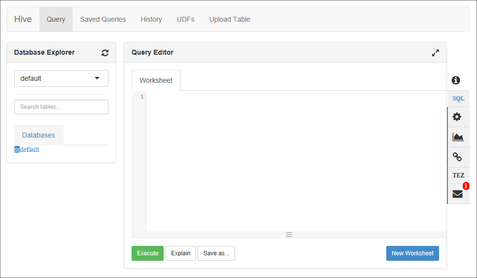

# <a name="use-the-hive-view-with-hadoop-in-hdinsight"></a>将 Hive 视图与 HDInsight 中的 Hadoop 配合使用

[!INCLUDE [hive-selector](../../includes/hdinsight-selector-use-hive.md)]

了解如何使用 Ambari Hive 视图运行 Hive 查询。 Ambari 是一个管理和监控实用程序，随基于 Linux 的 HDInsight 群集一起提供。 通过 Ambari 提供的功能之一是可用于运行 Hive 查询的 Web UI。

> [!NOTE]
> Ambari 还有许多本文档中未讨论的功能。 有关详细信息，请参阅[使用 Ambari Web UI 管理 HDInsight 群集](hdinsight-hadoop-manage-ambari.md)。

## <a name="prerequisites"></a>先决条件

* 基于 Linux 的 HDInsight 群集。 有关创建群集的信息，请参阅[开始使用基于 Linux 的 HDInsight](hdinsight-hadoop-linux-tutorial-get-started.md)。

> [!IMPORTANT]
> 本文档中的步骤需要使用 Linux 的 HDInsight 群集。 Linux 是在 HDInsight 3.4 版或更高版本上使用的唯一操作系统。 有关详细信息，请参阅 [HDInsight Deprecation on Windows](hdinsight-component-versioning.md#hdi-version-33-nearing-deprecation-date)（HDInsight 在 Windows 上即将弃用）。

## <a name="open-the-hive-view"></a>打开 Hive 视图

可从 Azure 门户中获取 Ambari 视图；选择 HDInsight 群集，然后从“快速链接”部分选择“Ambari 视图”。


也可通过在 Web 浏览器中转到 https://CLUSTERNAME.azurehdinsight.cn 直接导航至 Ambari。 将 **CLUSTERNAME** 替换为 HDInsight 群集的名称。 若要列出可用视图，请从菜单中选择方块集。 若要打开视图，请选择“Hive 视图”条目。

。

> [!NOTE]
> 访问 Ambari 时，系统将提示向该站点进行身份验证。 输入在创建群集时使用的管理员（默认 `admin`）帐户名和密码。

应看到类似于下图的页面：



## <a name="view-tables"></a>查看表

在页面的“数据库资源管理器”部分的“数据库”选项卡上选择“默认”条目。 这将显示默认数据库中的表的列表。 HDInsight 包括一个名为 **hivesampletable** 的表。


由于表是通过执行本文档中的步骤添加的，因此可使用数据库资源管理器右上角的刷新图标来刷新该列表。

## <a name="hivequery"></a>查询编辑器

若要运行 hive 查询，请使用 Hive 视图中的以下步骤。

1. 在此页面的“查询编辑器”  中，将以下 HiveQL 语句粘贴到工作表中：

    ```hiveql
    DROP TABLE log4jLogs;
    CREATE EXTERNAL TABLE log4jLogs(t1 string, t2 string, t3 string, t4 string, t5 string, t6 string, t7 string)
    ROW FORMAT DELIMITED FIELDS TERMINATED BY ' '
    STORED AS TEXTFILE LOCATION '/example/data/';
    SELECT t4 AS sev, COUNT(*) AS cnt FROM log4jLogs WHERE t4 = '[ERROR]' GROUP BY t4;
    ```

    这些语句将执行以下操作：

    * `DROP TABLE` - 删除表和数据文件（如果该表已存在）。

    * `CREATE EXTERNAL TABLE` - 在 Hive 中创建一个新的“外部”表。
    外部表仅在 Hive 中存储表定义。 数据将保留在原始位置。

    * `ROW FORMAT` - 如何设置数据的格式。 在此情况下，每个日志中的字段以空格分隔。

    * `STORED AS TEXTFILE LOCATION` - 数据的存储位置，并且数据已存储为文本。

    * `SELECT` - 选择 t4 列包含值 [ERROR] 的所有行的计数。

    > [!NOTE]
    > 如果希望通过外部源更新基础数据，应使用外部表。 例如，自动执行的数据上传过程，或其他 MapReduce 操作。 删除外部表 *不会* 删除数据，只会删除表定义。

2. 若要启动查询，请单击查询编辑器底部的“执行”  按钮。 该按钮将变为橙色并且文本将更改为“停止执行” 。 “查询进程结果”  部分应出现在“查询编辑器”下方，并显示有关作业的信息。

    > [!IMPORTANT]
    > 某些浏览器可能无法正确刷新日志或结果信息。 如果运行一个作业，而它看上去似乎会永久运行下去而不更新日志或返回结果，请尝试改为使用 Mozilla FireFox 或 Google Chrome。

3. 查询完成后，“查询进程结果”  部分将显示该操作的结果。 当查询完成时，“停止执行”按钮也会变回绿色的“执行”按钮。 “结果”  选项卡应包含以下信息：

        sev       cnt
        [ERROR]   3

    “日志”  选项卡可用于查看作业创建的日志记录信息。

    > [!TIP]
    > 通过位于“查询处理结果”部分左上角的“保存结果”下拉对话框，可下载或保存结果。

4. 选择此查询的前四行，然后选择“执行” 。 请注意，作业完成时没有结果。 在选择了查询的一部分时使用“执行”  按钮只会运行所选语句。 在这种情况下，所选内容不包括会从表中检索行的最后一条语句。 如果只选择该行并使用“执行” ，应该会看到预期的结果。

5. 若要添加工作表，请使用“查询编辑器”底部的“新建工作表”按钮。 在新工作表中，输入以下 HiveQL 语句：

    ```hiveql
    CREATE TABLE IF NOT EXISTS errorLogs (t1 string, t2 string, t3 string, t4 string, t5 string, t6 string, t7 string) STORED AS ORC;
    INSERT OVERWRITE TABLE errorLogs SELECT t1, t2, t3, t4, t5, t6, t7 FROM log4jLogs WHERE t4 = '[ERROR]';
    ```

    这些语句将执行以下操作：

    * **CREATE TABLE IF NOT EXISTS** - 创建表（如果该表不存在）。 由于未使用 **EXTERNAL** 关键字，因此将创建一个内部表。 内部表存储在 Hive 数据仓库中，并完全由 Hive 管理。 与外部表不同，删除内部表会同时删除基础数据。

    * **STORED AS ORC** - 以优化行纵栏表 (ORC) 格式存储数据。 ORC 是高度优化且有效的 Hive 数据存储格式。

    * **INSERT OVERWRITE ...SELECT** - 从包含 `[ERROR]` 的 **log4jLogs** 表中选择行，然后将数据插入到 **errorLogs** 表中。

    使用“执行”按钮运行此查询。 如果查询返回零行，则“结果”选项卡不包含任何信息。 一旦查询完成，状态应显示为“成功”。

### <a name="hive-settings"></a>Hive 设置

选择编辑器右侧的“设置”  图标。


可以使用“设置”来更改各种 Hive 设置。 例如，将 Hive 的执行引擎从 Tez（默认值）更改为 MapReduce。

### <a name="visualization"></a>可视化

选择编辑器右侧的“可视化效果”  图标。


可在“可视化效果”界面中创建从查询返回的数据的可视化效果。 下图是使用 HDInsight 中包含的 `hivesampletable` 中的数据的可视化效果示例：


### <a name="visual-explain"></a>Visual explain

选择编辑器右侧的“Visual Explain”  图标。


查询的“可视化说明”视图可帮助理解复杂查询的流。 可以使用“查询编辑器”中的“说明”  按钮查看此视图的文本等效内容。


### <a name="tez"></a>Tez

选择编辑器右侧的“Tez”  图标。


如果使用 Tez 来解析查询，将显示有向无环图 (DAG)。 若要查看之前运行的查询的 DAG，或调试 Tez 进程，请改用 [Tez 视图](hdinsight-debug-ambari-tez-view.md)。

### <a name="notifications"></a>通知

选择编辑器右侧的“通知”  图标。


通知是运行查询时生成的消息。 例如，当提交查询或发生错误时，会收到通知。

## <a name="saved-queries"></a>已保存的查询

1. 在“查询编辑器”中，创建一个工作表，并输入以下查询：

    ```hiveql
    SELECT * from errorLogs;
    ```

    执行查询以验证其是否正常工作。 结果类似于以下示例：

        errorlogs.t1     errorlogs.t2     errorlogs.t3     errorlogs.t4     errorlogs.t5     errorlogs.t6     errorlogs.t7
        2012-02-03     18:35:34     SampleClass0     [ERROR]     incorrect     id     
        2012-02-03     18:55:54     SampleClass1     [ERROR]     incorrect     id     
        2012-02-03     19:25:27     SampleClass4     [ERROR]     incorrect     id

2. 使用编辑器底部的“另存为”按钮。 将该查询命名为 **Errorlogs**，然后选择“确定”。 工作表的名称将更改为 **Errorlogs**。

3. 选择 Hive 视图页顶部的“已保存的查询”选项卡。 现在，**Errorlogs** 已列出为已保存的查询。 它会一直保留在此列表中，直至将其删除。 选择该名称将在查询编辑器中打开查询。

## <a name="query-history"></a>查询历史记录

使用 Hive 视图顶部的“历史记录”按钮可查看以前运行的查询。 立即使用它并选择之前运行过的一个查询。 选定一个查询后，它会在“查询编辑器”中打开。

## <a name="user-defined-functions-udf"></a>用户定义的函数 (UDF)

还可以通过**用户定义函数 (UDF)** 扩展 Hive。 UDF 允许你实现 HiveQL 中不容易建模的功能或逻辑。

通过 Hive 视图顶部的 UDF 选项卡，可声明并保存一组 UDF。 可以在**查询编辑器**中使用这些 UDF。

将 UDF 添加到 Hive 视图后，“插入 UDF”按钮将出现在**查询编辑器**底部。 选择此项将显示 Hive 视图中定义的 UDF 的下拉列表。 选择一个 UDF 可向查询添加 HiveQL 语句以启用 UDF。

例如，如果定义了一个具有以下属性的 UDF：

* 资源名称：myudfs

* 资源路径：/myudfs.jar

* UDF 名称：myawesomeudf

* UDF 类名称：com.myudfs.Awesome

使用“插入 UDF”按钮将显示名为 **myudfs** 的条目，以及为该资源定义的每个 UDF 的另一下拉列表。 在本例中，为 **myawesomeudf**。 选择此条目将在查询的开头添加以下内容：

```hiveql
add jar /myudfs.jar;
create temporary function myawesomeudf as 'com.myudfs.Awesome';
```

然后便可在查询中使用 UDF。 例如，`SELECT myawesomeudf(name) FROM people;`。

有关如何在 HDInsight 上将 UDF 与 Hive 配合使用的详细信息，请参阅以下文档：

* [在 HDInsight 中将 Python 与 Hive 和 Pig 配合使用](hdinsight-python.md)
* [如何将自定义 Hive UDF 添加到 HDInsight](http://blogs.msdn.com/b/bigdatasupport/archive/2014/01/14/how-to-add-custom-hive-udfs-to-hdinsight.aspx)

## <a id="nextsteps"></a>后续步骤

有关 HDInsight 中的 Hive 的一般信息：

* [将 Hive 与 Hadoop on HDInsight 配合使用](hdinsight-use-hive.md)

有关 HDInsight 上 Hadoop 的其他使用方法的信息：

* [将 Pig 与 Hadoop on HDInsight 配合使用](hdinsight-use-pig.md)
* [将 MapReduce 与 HDInsight 上的 Hadoop 配合使用](hdinsight-use-mapreduce.md)

