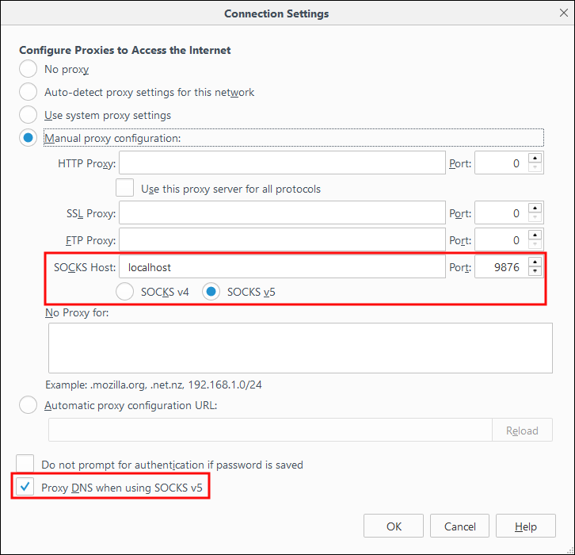
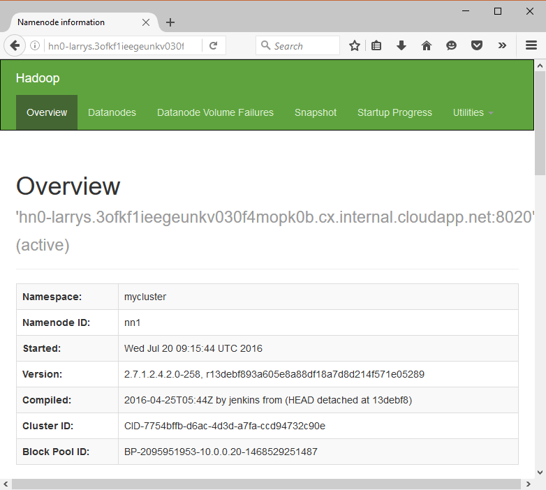

# <a name="use-ssh-tunneling-to-access-ambari-web-ui-jobhistory-namenode-oozie-and-other-web-uis"></a>使用 SSH 隧道访问 Ambari Web UI、JobHistory、NameNode、Oozie 和其他 Web UI

使用基于 Linux 的 HDInsight 群集可以通过 Internet 访问 Ambari Web UI，但无法访问 UI 的某些功能。 例如，无法访问通过 Ambari 呈现的其他服务的 Web UI。 若要获得 Ambari Web UI 的完整功能，必须与群集头建立 SSH 隧道。

## <a name="why-use-an-ssh-tunnel"></a>为何使用 SSH 隧道？

Ambari 中的多个菜单在没有 SSH 隧道的情况下无法完全填充，因为这些菜单依赖于群集上运行的其他 Hadoop 服务所公开的网站和服务。 通常，这些网站未受保护，因此直接在 Internet 上公开并不安全。 有时，服务在另一个群集节点（例如 Zookeeper 节点）上运行网站。

在未建立 SSH 隧道的情况下，无法访问 Ambari Web UI 使用的以下服务：

* JobHistory
* NameNode
* 线程堆栈
* Oozie Web UI
* HBase Master 和日志 UI

如果使用脚本操作来自定义群集，则安装的任何服务或实用工具都需要 SSH 隧道才能公开 Web UI。 例如，如果使用脚本操作安装 Hue，则必须使用 SSH 隧道来访问 Hue Web UI。

## <a name="what-is-an-ssh-tunnel"></a>什么是 SSH 隧道

[Secure Shell (SSH) tunneling](https://en.wikipedia.org/wiki/Tunneling_protocol#Secure_Shell_tunneling)（安全外壳 (SSH) 隧道）通过与 HDInsight 群集头节点建立的 SSH 连接将已发送的流量路由到本地工作站的端口，在头节点中，请求将得到解析，就如同它是在头节点上生成的一样。 然后，通过与工作站建立的隧道将响应路由回去。

## <a name="prerequisites"></a>先决条件

为 Web 流量使用 SSH 隧道时，必须满足以下条件：

* SSH 客户端。 对于 Linux 和 Unix 分发版、Macintosh OS X 以及 Windows 10 上的 Bash，操作系统已随附 `ssh` 命令。 对于不包括 `ssh` 命令的 Windows 版本，建议使用 [PuTTY](http://www.chiark.greenend.org.uk/~sgtatham/putty/download.html)

    > [!NOTE]
    > 如果想要使用 `ssh` 或 PuTTY 以外的 SSH 客户端，请参阅客户端的文档，以了解如何建立 SSH 隧道。

* 可配置为使用 SOCKS5 代理的 Web 浏览器。

    > [!WARNING]
    > 内置于 Windows 的 SOCKS 代理不支持 SOCKS5，并且不适用于本文档中的步骤。 以下浏览器依赖于 Windows 代理设置，当前不适用于此文档中的步骤：
    > * Microsoft Edge
    > * Microsoft Internet Explorer
    > <p>
    > Google Chrome 也依赖于 Windows 代理设置。 但是，可以安装支持 SOCKS5 的扩展。 我们建议使用 FoxyProxy Standard。

## <a name="usessh"></a>使用 SSH 命令创建隧道

使用以下 `ssh` 命令创建 SSH 隧道。 将 **USERNAME** 替换为 HDInsight 群集的 SSH 用户，并将 **CLUSTERNAME** 替换为 HDInsight 群集的名称

```
ssh -C2qTnNf -D 9876 USERNAME@CLUSTERNAME-ssh.azurehdinsight.cn
```

这会创建一个通过 SSH 将流量路由到群集本地端口 9876 的连接。 选项包括：

* **D 9876** - 通过隧道路由流量的本地端口。
* **C** - 压缩所有数据，因为 Web 流量大多为文本。
* **2** - 强制 SSH 仅尝试协议版本 2。
* **q** - 静默模式。
* **T** - 禁用 pseudo-tty 分配，因为我们只要转发端口。
* **n** - 防止读取 STDIN，因为我们将仅转发端口。
* **N** - 不执行远程命令，因为我们只要转发端口。
* **f** - 在后台运行。

如果使用 SSH 密钥配置了群集，则可能需要使用 `-i` 参数，并指定 SSH 私钥的路径。

在命令完成后，发送到本地计算机上的端口 9876 的流量将通过安全套接字层 (SSL) 路由到群集头节点，并显示为源于该节点。

## <a name="useputty"></a>使用 PuTTY 创建隧道

执行以下步骤使用 PuTTY 创建 SSH 隧道。

1. 打开 PuTTY 并输入你的连接信息。 如果不熟悉 PuTTY，请参阅 [PuTTY 文档 (http://www.chiark.greenend.org.uk/~sgtatham/putty/docs.html)](http://www.chiark.greenend.org.uk/~sgtatham/putty/docs.html)。

2. 在对话框左侧的“类别”部分中，依次展开“连接”和“SSH”，然后选择“隧道”。

3. 提供以下有关“用于控制 SSH 端口转发的选项”窗体的信息：

    * **源端口** - 客户端上要转发的端口。 例如 **9876**。

    * **目标** - 基于 Linux 的 HDInsight 群集的 SSH 地址。 例如 **mycluster-ssh.azurehdinsight.cn**。

    * **动态** - 启用动态 SOCKS 代理路由。

        

4. 单击“添加”以添加设置，然后单击“打开”以打开 SSH 连接。

5. 出现提示时，登录到服务器。 这会建立 SSH 会话并启用隧道。

## <a name="use-the-tunnel-from-your-browser"></a>从浏览器使用隧道

> [!IMPORTANT]
> 本部分中的步骤使用 Mozilla FireFox 浏览器，因为它在所有平台中提供相同的代理设置。 对于其他新式浏览器（如 Google Chrome），可能需要 FoxyProxy 等扩展才能使用隧道。

1. 将浏览器配置为使用 **localhost**，并将创建隧道时使用的端口配置为 **SOCKS v5** 代理。 Firefox 中的设置如下所示。 如果使用的端口不是 9876，请将端口更改为所用的端口：

    

    > [!NOTE]
    > 通过选择“远程 DNS”，可使用 HDInsight 群集解析域名系统 (DNS) 请求。 如果未将其选中，则将在本地解析 DNS。

2. 在 Firefox 中启用和禁用代理设置的情况下访问某个站点（例如 [http://www.whatismyip.com/](http://www.whatismyip.com/) ），以验证是否能够通过隧道路由流量。 启用这些设置时，返回的 IP 地址将来自 Azure 数据中心内的某台计算机。

## <a name="verify-with-ambari-web-ui"></a>Ambari Web UI 访问验证

建立群集后，请通过以下步骤验证是否可以从 Ambari Web 访问服务 Web UI：

1. 在浏览器中，转到 http://headnodehost:8080 。 `headnodehost` 地址通过隧道发送到群集，并解析为运行 Ambari 的头节点。 出现提示时，请输入群集的管理员用户名 (admin) 和密码。 Ambari Web UI 可能会再次出现提示。 如果出现，请重新输入信息。

    > [!NOTE]
    > 使用 http://headnodehost:8080 地址连接到群集时，将使用 HTTP 通过隧道直接连接到运行 Ambari 的头节点，并使用 SSH 隧道来保护通信安全。 如果在不使用隧道的情况下通过 Internet 进行连接，则使用 HTTPS 来保护通信安全。 若要使用 HTTPS 通过 Internet 进行连接，请使用 https://CLUSTERNAME.azurehdinsight.cn ，其中 **CLUSTERNAME** 是群集的名称。

2. 在 Ambari Web UI 中，请选择页面左侧列表中的“HDFS”。

    
3. 显示 HDFS 服务信息时，请选择“快速链接”。 将显示群集头节点列表。 选择其中一个头节点，然后选择“NameNode UI”。

    

    > [!NOTE]
    > 如果 Internet 连接速度较慢或者头节点非常繁忙，则选择“快速链接”时，可能会看到等待指针而不是菜单。 如果是这样，请等待一两分钟，让系统从服务器接收数据，然后再次尝试列出节点列表。
    > <p> 如果显示器分辨率较低或者浏览器窗口没有最大化，则“快速链接”菜单中的某些项可能在屏幕右侧截断。 如果是这样，请使用鼠标展开菜单，然后使用向右箭头键向右滚动屏幕，查看菜单的余下内容。
4. 应会显示如下所示的页面：

    

    > [!NOTE]
    > 请注意此页的 URL，它应类似于 **http://hn1-CLUSTERNAME.randomcharacters.cx.internal.chinacloudapp.cn:8088/cluster** 。 此 URL 使用了节点的内部完全限定域名 (FQDN)，在不使用 SSH 隧道的情况下无法访问它。
    > 
    > 

## <a name="next-steps"></a>后续步骤

学会如何创建和使用 SSH 隧道后，请参阅以下链接，了解如何通过 Ambari 监视和管理群集：

* [使用 Ambari 管理 HDInsight 群集](hdinsight-hadoop-manage-ambari.md)

有关将 SSH 与 HDInsight 配合使用的详细信息，请参阅[将 SSH 与 HDInsight 配合使用](hdinsight-hadoop-linux-use-ssh-unix.md)。

