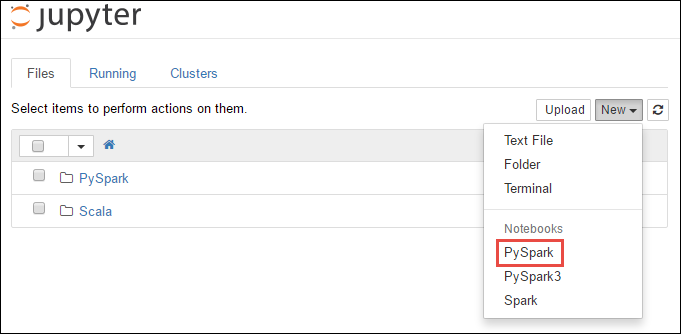

# <a name="quickstart-create-apache-spark-cluster-in-azure-hdinsight-using-resource-manager-template"></a>快速入门：使用资源管理器模板在 Azure HDInsight 中创建 Apache Spark 群集

在本快速入门中，你将使用 Azure 资源管理器模板在 Azure HDInsight 中创建一个 Apache Spark 群集。 然后你将创建一个 Jupyter 笔记本，并使用它来针对 Apache Hive 表运行 Spark SQL 查询。 Azure HDInsight 是适用于企业的分析服务，具有托管、全面且开源的特点。 用于 HDInsight 的 Apache Spark 框架使用内存中处理功能实现快速数据分析和群集计算。 使用 Jupyter 笔记本，可以与数据进行交互，将代码和 markdown 文本结合使用，以及执行简单的可视化效果。

[概述：Azure HDInsight 上的 Apache Spark](apache-spark-overview.md) | [Apache Spark](https://spark.apache.org/) | [Apache Hive](https://hive.apache.org/) | [Jupyter Notebook](https://jupyter.org/) | [Azure 快速入门模板](https://azure.microsoft.com/resources/templates/?resourceType=Microsoft.Hdinsight&pageNumber=1&sort=Popular)

## <a name="prerequisites"></a>必备条件

- 具有活动订阅的 Azure 帐户。 [创建试用帐户](https://www.azure.cn/pricing/1rmb-trial)。

## <a name="create-an-apache-spark-cluster"></a>创建 Apache Spark 群集

使用 Azure 资源管理器模板在 HDInsight 中创建 Apache Spark 群集。 可以在 [GitHub](https://azure.microsoft.com/resources/templates/101-hdinsight-spark-linux/) 中找到该模板。 有关群集的 JSON 语法和属性，请参阅 [Microsoft.HDInsight/clusters](/azure/templates/microsoft.hdinsight/clusters)。

群集将 Azure 存储 Blob 用作群集存储。 有关使用 Data Lake Storage Gen2 的详细信息，请参阅[快速入门：在 HDInsight 中设置群集](../../storage/data-lake-storage/quickstart-create-connect-hdi-cluster.md)。

> [!IMPORTANT]
> HDInsight 群集是基于分钟按比例收费，而不管用户是否正在使用它们。 请务必在使用完之后删除群集。 有关详细信息，请参阅本文的[清理资源](#clean-up-resources)部分。

1. 选择以下链接在新的浏览器选项卡中打开 Azure 门户中的模板：

    <a href="https://portal.azure.cn/#create/Microsoft.Template/uri/https%3A%2F%2Fraw.githubusercontent.com%2FAzure%2Fazure-quickstart-templates%2Fmaster%2F101-hdinsight-spark-linux%2Fazuredeploy.json" target="_blank">部署到 Azure</a>

2. 输入以下值：

    | 属性 | Value |
    |---|---|
    |**订阅**|选择用于创建此群集的 Azure 订阅。 用于此快速入门的订阅是 &lt;Azure subscription name>  。 |
    | **资源组**|创建一个资源组或选择一个现有的资源组。 使用资源组管理项目的 Azure 资源。 用于此快速入门的新资源组名称为“myspark20180403rg”  。|
    | **位置**|选择资源组的位置。 模板将此位置用于创建群集，以及用于默认群集存储。 用于此快速入门的位置为“美国东部 2”  。|
    | **ClusterName**|为要创建的 HDInsight 群集输入名称。 用于此快速入门的新群集名称为“myspark20180403”  。|
    | **群集登录名和密码**|默认登录名是“admin”。选择用于群集登录的密码。 用于此快速入门的登录名为“admin”  。|
    | **SSH 用户名和密码**|选择用于 SSH 用户的密码。 用于此快速入门的 SSH 用户名为“sshuser”  。|

    

3. 选择“我同意上述条款和条件”，选择“固定到仪表板”，并选择“购买”    。  此时会出现标题为“正在部署模板”的新磁贴。 创建群集大约需要 20 分钟时间。 必须先创建群集，才能继续下一会话。

如果在创建 HDInsight 群集时遇到问题，可能是因为没有这样做的适当权限。 有关详细信息，请参阅[访问控制要求](../hdinsight-hadoop-create-linux-clusters-portal.md)。

## <a name="install-intellijeclipse-for-spark-application"></a>为 Spark 应用程序安装 IntelliJ/Eclipse
使用用于 IntelliJ/Eclipse 的 Azure 工具包插件开发以 [Scala](https://www.scala-lang.org/) 编写的 Spark 应用程序，并直接从 IntelliJ/Eclipse 集成开发环境 (IDE) 将其提交到 Azure HDInsight Spark 群集。 有关详细信息，请参阅[使用 IntelliJ 创作/提交 Spark 应用程序](./apache-spark-intellij-tool-plugin.md)和[使用 Eclipse 创作/提交 Spark 应用程序](./apache-spark-eclipse-tool-plugin.md)。

## <a name="install-vscode-for-pysparkhive-applications"></a>为 PySpark/hive 应用程序安装 VSCode
了解如何使用用于 Visual Studio Code (VSCode) 的 Azure HDInsight 工具来创建和提交 Hive 批处理作业、交互式 Hive 查询、PySpark 批处理和 PySpark 交互式脚本。 可以在 VSCode 支持的平台上安装 Azure HDInsight 工具。 这些平台包括 Windows、Linux 和 macOS。 有关详细信息，请参阅[使用 VSCode 创作/提交 PySpark 应用程序](../hdinsight-for-vscode.md)。

## <a name="create-a-jupyter-notebook"></a>创建 Jupyter 笔记本

[Jupyter Notebook](https://jupyter.org/) 是支持各种编程语言的交互式笔记本环境。 通过此笔记本可以与数据进行交互、结合代码和 markdown 文本以及执行简单的可视化效果。

1. 打开 [Azure 门户](https://portal.azure.cn)。
2. 选择“HDInsight 群集”，然后选择所创建的群集  。

    

3. 在门户的“群集仪表板”部分中，单击“Jupyter Notebook”。   出现提示时，请输入群集的群集登录凭据。

   

4. 选择“新建” > “PySpark”，创建笔记本   。 

   

   新 Notebook 随即会创建，并以 Untitled(Untitled.pynb) 名称打开。


## <a name="run-spark-sql-statements"></a>运行 Spark SQL 语句

SQL（结构化查询语言）是用于查询和转换数据的最常见、最广泛使用的语言。 Spark SQL 作为 Apache Spark 的扩展使用，可使用熟悉的 SQL 语法处理结构化数据。

1. 验证 kernel 已就绪。 如果在 Notebook 中的内核名称旁边看到空心圆，则内核已准备就绪。 实心圆表示内核正忙。

    

    首次启动 Notebook 时，内核在后台执行一些任务。 等待内核准备就绪。 
2. 将以下代码粘贴到一个空单元格中，然后按 **SHIFT + ENTER** 来运行这些代码。 此命令列出群集上的 Hive 表：

    ```sql
    %%sql
    SHOW TABLES
    ```
    将 Jupyter Notebook 与 HDInsight Spark 群集配合使用时，会获得一个预设 `spark` 会话，可以使用它通过 Spark SQL 来运行 Hive 查询。 `%%sql` 指示 Jupyter Notebook 使用预设 `spark` 会话运行 Hive 查询。 该查询从默认情况下所有 HDInsight 群集都带有的 Hive 表 (hivesampletable  ) 检索前 10 行。 第一次提交查询时，Jupyter 将为 Notebook 创建 Spark 应用程序。 该操作需要大约 30 秒才能完成。 Spark 应用程序准备就绪后，查询将在大约一秒钟内执行并生成结果。 输出如下所示： 

    

    每次在 Jupyter 中运行查询时，Web 浏览器窗口标题中都会显示“(繁忙)”  状态和 Notebook 标题。 右上角“PySpark”  文本的旁边还会出现一个实心圆。
    
2. 运行另一个查询，请查看 `hivesampletable` 中的数据。

    ```sql
    %%sql
    SELECT * FROM hivesampletable LIMIT 10
    ```
    
    屏幕在刷新后会显示查询输出。

    

2. 请在 Notebook 的“文件”菜单中选择“关闭并停止”   。 关闭 Notebook 会释放群集资源，包括 Spark 应用程序。

## <a name="clean-up-resources"></a>清理资源
HDInsight 会将数据和 Jupyter Notebook 保存在 Azure 存储或 Azure Data Lake Store 中，以便在群集不用时安全地删除群集。 此外，还需要支付 HDInsight 群集费用，即使未使用。 由于群集费用高于存储空间费用数倍，因此在不使用群集时将其删除可以节省费用。 如果要立即开始[后续步骤](#next-steps)中所列的教程，可能需要保留群集。

切换回 Azure 门户，并选择“删除”  。


还可以选择资源组名称来打开“资源组”页，然后选择“删除资源组”  。 通过删除资源组，可以删除 HDInsight Spark 群集和默认存储帐户。

## <a name="next-steps"></a>后续步骤 

本快速入门介绍了如何创建 HDInsight Spark 群集并运行基本的 Spark SQL 查询。 转到下一教程，了解如何使用 HDInsight Spark 群集针对示例数据运行交互式查询。

> [!div class="nextstepaction"]
>[在 Apache Spark 上运行交互式查询](./apache-spark-load-data-run-query.md)


