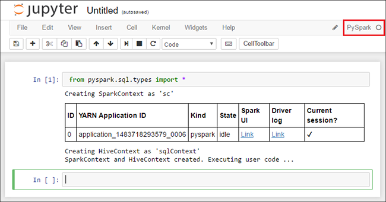

# <a name="tutorial-load-data-and-run-queries-on-an-apache-spark-cluster-in-azure-hdinsight"></a>教程：在 Azure HDInsight 中的 Apache Spark 群集上加载数据并运行查询

本教程介绍如何从 csv 文件创建数据帧，以及如何针对 Azure HDInsight 中的 [Apache Spark](https://spark.apache.org/) 群集运行交互式 Spark SQL 查询。 在 Spark 中，数据帧是已组织成命名列的分布式数据集合。 数据帧在概念上相当于关系型数据库中的表，或 R/Python 中的数据帧。
 
本教程介绍如何执行下列操作：
> [!div class="checklist"]
> * 从 csv 文件创建数据帧
> * 对数据帧运行查询

如果没有 Azure 订阅，可以在开始前[创建一个免费帐户](https://www.azure.cn/pricing/1rmb-trial/)。

## <a name="prerequisites"></a>先决条件

* 完成[在 Azure HDInsight 中创建 Apache Spark 群集](apache-spark-jupyter-spark-sql.md)。

## <a name="create-a-dataframe-from-a-csv-file"></a>从 csv 文件创建数据帧

应用程序可以直接从远程存储（例如 Azure 存储）上的文件或文件夹创建数据帧；从 Hive 表或从 Spark 支持的其他数据源（例如 Cosmos DB、Azure SQL DB、DW 等）创建数据帧。以下屏幕截图显示本教程中所用 HVAC.csv 文件的快照。 所有 HDInsight Spark 群集都随附了该 csv 文件。 该数据捕获了一些建筑物的温度变化。
    


1. 打开在先决条件部分中创建的 Jupyter 笔记本。
2. 在 Notebook 的空单元格中粘贴以下代码，然后按 **SHIFT + ENTER** 运行这些代码。 该代码导入此方案所需的类型：

    ```python
    from pyspark.sql import *
    from pyspark.sql.types import *
    ```

    在 Jupyter 中运行交互式查询时，Web 浏览器窗口或选项卡标题中会显示“(繁忙)”状态和 Notebook 标题。 右上角“PySpark”文本的旁边还会出现一个实心圆。 作业完成后，实心圆将变成空心圆。

    

3. 运行以下代码，创建数据帧和临时表 (hvac)。 

    ```python
    # Create a dataframe and table from sample data
    csvFile = spark.read.csv('/HdiSamples/HdiSamples/SensorSampleData/hvac/HVAC.csv', header=True, inferSchema=True)
    csvFile.write.saveAsTable("hvac")
    ```

    > [!NOTE]
    > 如果使用 PySpark 内核创建 Notebook，在运行第一个代码单元格时，系统会自动创建 `spark` 会话。 不需要显式创建会话。


## <a name="run-queries-on-the-dataframe"></a>对数据帧运行查询

创建表后，可以针对数据运行交互式查询。

1. 在 Notebook 的空单元格中运行以下代码：

    ```sql
    %%sql
    SELECT buildingID, (targettemp - actualtemp) AS temp_diff, date FROM hvac WHERE date = \"6/1/13\"
    ```

   以下表格输出随即显示。

     

9. 也可以在其他视觉效果中查看结果。 若要查看相同输出的面积图，请选择“面积”，然后设置其他值，如下所示。

    

10. 在笔记本的“文件”菜单中，选择“保存和检查点”。 

11. 如果现在开始[下一教程](apache-spark-use-bi-tools.md)，请使笔记本保持打开状态。 否则，关闭笔记本，释放群集资源：在笔记本的“文件”菜单中，选择“关闭并停止”。

## <a name="clean-up-resources"></a>清理资源

有了 HDInsight，便可以将数据和 Jupyter Notebook 存储在 Azure 存储或 Azure Data Lake Store 中，以便在群集不用时安全地删除群集。 此外，还需要支付 HDInsight 群集费用，即使未使用。 由于群集费用高于存储空间费用数倍，因此在不使用群集时将其删除可以节省费用。 如果打算立即开始学习下一教程，可能需要保留该群集。

在 Azure 门户中打开群集，然后选择“删除”。


还可以选择资源组名称来打开“资源组”页，然后选择“删除资源组”。 通过删除资源组，可以删除 HDInsight Spark 群集和默认存储帐户。

## <a name="next-steps"></a>后续步骤

在本教程中，你已学习了如何执行以下操作：

* 创建 Apache Spark dataframe。
* 针对数据帧运行 Spark SQL。

请转到下一篇文章，了解如何将在 Apache Spark 中注册的数据拉取到 Power BI 等 BI 分析工具中。 
> [!div class="nextstepaction"]
> [使用 BI 工具分析数据](apache-spark-use-bi-tools.md)


