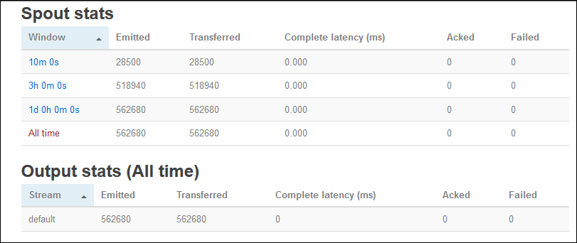

# 通过 storm-starter 示例开始使用 Apache Storm on HDInsight

了解如何通过 storm-starter 示例在 HDInsight 中使用 [Apache Storm](http://storm.apache.org/)。

Apache Storm 是一个可扩展的、具有容错能力的分布式实时计算系统，用于处理数据流。 使用 Azure HDInsight 上的 Storm，可以创建一个基于云的、用于实时执行大数据分析的 Storm 群集。

> [!IMPORTANT]
> Linux 是 HDInsight 3.4 或更高版本上使用的唯一操作系统。 有关详细信息，请参阅 [HDInsight 在 Windows 上停用](../hdinsight-component-versioning.md#hdinsight-windows-retirement)。

## 先决条件

[!INCLUDE [delete-cluster-warning](../../../includes/hdinsight-delete-cluster-warning.md)]

* **一个 Azure 订阅**。 请参阅[获取 Azure 试用版](https://www.azure.cn/pricing/1rmb-trial/)。

* **熟悉 SSH 和 SCP**。 有关信息，请参阅[将 SSH 与 HDInsight 配合使用](../hdinsight-hadoop-linux-use-ssh-unix.md)。

## 创建 Apache Storm 群集

使用以下步骤创建 Storm on HDInsight 群集：

1. 登录到 [Azure 门户](https://portal.azure.cn)。

1. 导航到“+ 创建资源” > “数据 + 分析” > “HDInsight”。

    

2. 在“基本信息”部分输入以下信息：

    * **群集名称**：HDInsight 群集的名称。
    * **订阅**：选择要使用的订阅。
    * **群集登录用户名**和**群集登录密码**：通过 HTTPS 访问群集时使用的登录名。 可以使用这些凭据访问 Ambari Web UI 或 REST API 等服务。
    * **安全外壳 (SSH) 用户名**：通过 SSH 访问群集时使用的登录名。 默认情况下，密码与群集登录密码相同。
    * **资源组**：要在其中创建群集的资源组。
    * **位置**：要在其中创建群集的 Azure 区域。

   

3. 选择“群集类型”，并在“群集配置”部分设置以下值：

    * **群集类型**：Storm

    * **操作系统**：Linux

    * **版本**：Storm 1.1.0 (HDI 3.6)

   最后使用“选择”按钮保存设置。

    

4. 选择群集类型后，使用“选择”按钮设置群集类型。 接下来，使用“下一步”  按钮完成基本配置。

5. 在“存储”部分，选择或创建存储帐户。 对于本文档中的步骤，请让此部分的其他字段保留默认值。 使用“下一步”  按钮保存存储配置。 有关使用 Data Lake Storage Gen2 的详细信息，请参阅[快速入门：在 HDInsight 中设置群集](../../storage/data-lake-storage/quickstart-create-connect-hdi-cluster.md)。

    

6. 在“摘要”部分，查看群集的配置。 使用“编辑”链接更改不正确的设置。 最后，使用“创建”按钮创建群集。

    

    > [!NOTE]
    > 创建群集可能需要 20 分钟。

## 在 HDInsight 上运行 storm-starter 示例

1. 使用 SSH 连接到 HDInsight 群集：

        ssh USERNAME@CLUSTERNAME-ssh.azurehdinsight.cn

    > [!TIP]
    > SSH 客户端可能会指出无法进行主机验证。 如果是这样，则输入 `yes` 继续。

    > [!NOTE]
    > 如果使用了密码来保护 SSH 用户帐户，系统会提示输入密码。 如果使用了公钥，则可能需要使用 `-i` 参数来指定匹配的私钥。 例如，`ssh -i ~/.ssh/id_rsa USERNAME@CLUSTERNAME-ssh.azurehdinsight.cn`。

    有关信息，请参阅[将 SSH 与 HDInsight 配合使用](../hdinsight-hadoop-linux-use-ssh-unix.md)。

2. 使用以下命令启动示例拓扑：

        storm jar /usr/hdp/current/storm-client/contrib/storm-starter/storm-starter-topologies-*.jar org.apache.storm.starter.WordCountTopology wordcount

    此命令启动群集上的示例 WordCount 拓扑。 此拓扑生成随机句子，并计算单词的出现次数。 拓扑的友好名称为 `wordcount`。

    > [!NOTE]
    > 将自己的拓扑提交到群集时，必须先复制包含群集的 jar 文件，此后再使用 `storm` 命令。 使用 `scp` 命令来复制该文件。 例如， `scp FILENAME.jar USERNAME@CLUSTERNAME-ssh.azurehdinsight.cn:FILENAME.jar`
    >
    > WordCount 示例和其他 storm-starter 示例已经包含在群集中，其位置为 `/usr/hdp/current/storm-client/contrib/storm-starter/`。

如果想要查看 storm-starter 示例的源代码，可在 [https://github.com/apache/storm/tree/1.1.x-branch/examples/storm-starter](https://github.com/apache/storm/tree/1.1.x-branch/examples/storm-starter) 上找到代码。 此链接针对与 HDInsight 3.6 一起提供的 Storm 1.1.x。 对于其他版本的 Storm，可使用页面顶部的“分支”按钮选择不同的 Storm 版本。

## 监视拓扑

Storm UI 提供一个 Web 界面用于处理正在运行的拓扑，HDInsight 群集随附了此界面。

执行以下步骤以使用 Storm UI 来监视拓扑。

1. 若要显示 Storm UI，请打开 Web 浏览器，访问 https://CLUSTERNAME.azurehdinsight.cn/stormui。 将 **CLUSTERNAME** 替换为群集名称。

    > [!NOTE]
    > 如果系统要求提供用户名和密码，请输入创建群集时使用的群集管理员用户名 (admin) 和密码。

2. 在“拓扑摘要”下，选择“名称”列中的“Wordcount”条目。 将显示有关拓扑的信息。

    

    此页提供以下信息：

   * **拓扑统计信息** - 有关拓扑性能的基本信息，已组织到时间窗口中。

       > [!NOTE]
       > 选择特定的时间窗口会更改页面其他部分中显示的信息的时间窗口。

   * **Spout** - 有关 spout 的基本信息，包括每个 spout 返回的最后一个错误。

   * **Bolt** - 有关 bolt 的基本信息。

   * **拓扑配置** - 有关拓扑配置的详细信息。

     此页还提供可对拓扑执行的操作：

   * **激活** - 继续处理已停用的拓扑。

   * **停用** - 暂停正在运行的拓扑。

   * **重新平衡** - 调整拓扑的并行度。 更改群集中的节点数目之后，应该重新平衡正在运行的拓扑。 重新平衡可调整并行度，以弥补群集中增加/减少的节点数目。 有关详细信息，请参阅[了解 Apache Storm 拓扑的并行度](https://storm.apache.org/documentation/Understanding-the-parallelism-of-a-Storm-topology.html)。

   * **终止** - 在经过指定的超时之后终止 Storm 拓扑。

3. 在此页中，从“Spout”或“Bolt”部分中选择一个条目。 将显示有关选定组件的信息。

    

    此页显示以下信息：

    * **Spout/Bolt 统计信息** - 有关组件性能的基本信息，已组织到时间窗口中。

        > [!NOTE]
        > 选择特定的时间窗口会更改页面其他部分中显示的信息的时间窗口。

    * **输入统计信息** （仅限 Bolt）- 有关生成 Bolt 所用数据的组件的信息。

    * **输出统计信息** - 对此 Bolt 发出的数据的信息。

    * **执行器** - 有关此组件实例的信息。

    * **错误** - 此组件生成的错误。

4. 在查看 spout 或 bolt 的详细信息时，从“执行器”部分中的“端口”列中选择一个条目可以查看组件特定实例的详细信息。

        2015-01-27 14:18:02 b.s.d.task [INFO] Emitting: split default ["with"]
        2015-01-27 14:18:02 b.s.d.task [INFO] Emitting: split default ["nature"]
        2015-01-27 14:18:02 b.s.d.executor [INFO] Processing received message source: split:21, stream: default, id: {}, [snow]
        2015-01-27 14:18:02 b.s.d.task [INFO] Emitting: count default [snow, 747293]
        2015-01-27 14:18:02 b.s.d.executor [INFO] Processing received message source: split:21, stream: default, id: {}, [white]
        2015-01-27 14:18:02 b.s.d.task [INFO] Emitting: count default [white, 747293]
        2015-01-27 14:18:02 b.s.d.executor [INFO] Processing received message source: split:21, stream: default, id: {}, [seven]
        2015-01-27 14:18:02 b.s.d.task [INFO] Emitting: count default [seven, 1493957]

    在此示例中，**seven** 一词出现了 1493957 次。 此计数是自启动此拓扑以来已遇到该单词的次数。

## 停止拓扑

返回到单词计数拓扑的“拓扑摘要”页，并从“拓扑操作”部分中选择“终止”按钮。 出现提示时，输入停止拓扑之前要等待的秒数，即 10。 在超时期限之后访问仪表板的“Storm UI”部分，不会再显示该拓扑。

## 删除群集

[!INCLUDE [delete-cluster-warning](../../../includes/hdinsight-delete-cluster-warning.md)]

如果在创建 HDInsight 群集时遇到问题，请参阅[访问控制要求](../hdinsight-hadoop-create-linux-clusters-portal.md)。

## 后续步骤

在此 Apache Storm 教程中，学习了使用 Storm on HDInsight 的基础知识。 接下来，了解如何[使用 Apache Maven 开发基于 Java 的拓扑](apache-storm-develop-java-topology.md)。

如果已熟悉怎样开发基于 Java 的拓扑，请参阅[在 HDInsight 上部署和管理 Apache Storm 拓扑](apache-storm-deploy-monitor-topology-linux.md)文档。

如果用户是 .NET 开发人员，则可使用 Visual Studio 创建 C# 拓扑或混合性的 C#/Java 拓扑。 有关详细信息，请参阅[使用用于 Visual Studio 的 Apache Hadoop 工具开发 Apache Storm on HDInsight 的 C# 拓扑](apache-storm-develop-csharp-visual-studio-topology.md)。

如需可与 Storm on HDInsight 配合使用的示例拓扑，请参阅以下示例：

* [Apache Storm on HDInsight 的示例拓扑](apache-storm-example-topology.md)

[apachestorm]: https://storm.incubator.apache.org
[stormdocs]: https://storm.incubator.apache.org/documentation/Documentation.html
[stormstarter]: https://github.com/apache/storm/tree/master/examples/storm-starter
[stormjavadocs]: https://storm.incubator.apache.org/apidocs/
[hdinsight-provision]: hdinsight-hadoop-provision-linux-clusters.md
[preview-portal]: https://portal.azure.cn/
<!--Update_Description: update the version of hdinsight-->