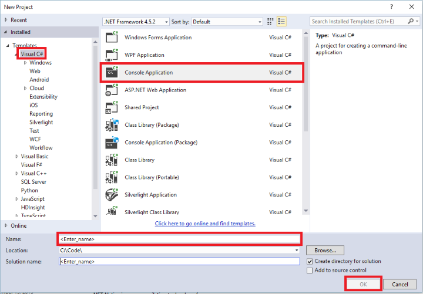
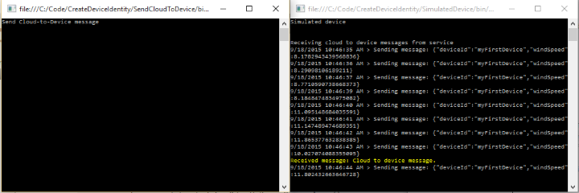

# <a name="send-messages-from-the-cloud-to-your-device-with-iot-hub-net"></a>使用 IoT 中心 (.NET) 将消息从云发送到设备
[!INCLUDE [iot-hub-selector-c2d](../../includes/iot-hub-selector-c2d.md)]

## <a name="introduction"></a>简介

Azure IoT 中心是一项完全托管的服务，有助于在数百万台设备和单个解决方案后端之间实现安全可靠的双向通信。 [从设备将遥测数据发送到 IoT 中心...](quickstart-send-telemetry-dotnet.md) 介绍了如何创建 IoT 中心、在其中预配设备标识，以及编写设备应用来发送设备到云的消息。

[!INCLUDE [iot-hub-basic](../../includes/iot-hub-basic-whole.md)]

本教程基于快速入门[从设备将遥测数据发送到 IoT 中心...](quickstart-send-telemetry-dotnet.md) 构建。它展示了如何执行以下步骤：

* 通过 IoT 中心，将云到设备的消息从解决方案后端发送到单个设备。
* 在设备上接收云到设备的消息。
* 通过解决方案后端，请求确认收到从 IoT 中心发送到设备的消息（反馈）。

可以在 [IoT 中心的 D2C 和 C2D 消息传送](iot-hub-devguide-messaging.md)中找到有关“云到设备”消息的详细信息。

在本教程结束时，会运行 2 个 .NET 控制台应用：

* **SimulatedDevice**（[从设备将遥测数据发送到 IoT 中心...](quickstart-send-telemetry-dotnet.md) 中创建的应用的修改版本），它连接到 IoT 中心并接收云到设备的消息。

* **SendCloudToDevice**，它通过 IoT 中心将云到设备消息发送到设备应用，然后接收其传送确认。

> [!NOTE]
> IoT 中心通过 [Azure IoT 设备 SDK](iot-hub-devguide-sdks.md) 对许多设备平台和语言（包括 C、Java 和 Javascript）提供 SDK 支持。 有关如何将设备连接到本教程的代码以及通常如何连接到 Azure IoT 中心的分步说明，请参阅 [IoT 中心开发人员指南](iot-hub-devguide.md)。
> 
> 

要完成本教程，需要以下各项：

* Visual Studio 2017

+ 有效的 Azure 帐户。 如果没有帐户，可以创建一个[试用帐户][lnk-free-trial]，只需几分钟即可完成。

## <a name="receive-messages-in-the-device-app"></a>在设备应用中接收消息

在本部分中，会修改在[从设备将遥测数据发送到 IoT 中心...](quickstart-send-telemetry-dotnet.md) 中创建的设备应用，以接收来自 IoT 中心的云到设备消息。

1. 在 Visual Studio 的 **SimulatedDevice** 项目中，将以下方法添加到 **Program** 类。

   ```csharp   
    private static async void ReceiveC2dAsync()
    {
        Console.WriteLine("\nReceiving cloud to device messages from service");
        while (true)
        {
            Message receivedMessage = await deviceClient.ReceiveAsync();
            if (receivedMessage == null) continue;

            Console.ForegroundColor = ConsoleColor.Yellow;
            Console.WriteLine("Received message: {0}", 
            Encoding.ASCII.GetString(receivedMessage.GetBytes()));
            Console.ResetColor();

            await deviceClient.CompleteAsync(receivedMessage);
        }
    }
    ```

    在设备收到消息时，`ReceiveAsync` 方法以异步方式返回收到的消息。 它在可指定的超时期限过后返回 *null*（在本例中，使用的是默认值一分钟）。 当应用收到 *null* 时，它应继续等待新消息。 此要求是使用 `if (receivedMessage == null) continue` 行的原因。

    对 `CompleteAsync()` 的调用通知 IoT 中心，指出已成功处理消息。 可以安全地从设备队列中删除该消息。 如果因故导致设备应用无法完成消息处理操作，IoT 中心将重新传送该消息。 因此设备应用中的消息处理逻辑必须是幂等的，以便多次接收同一消息会生成相同的结果。 
    
    应用程序也可以暂时放弃消息，让 IoT 中心将消息保留在队列中以供将来使用。 或者，应用程序可以拒绝消息，以永久性从队列中删除该消息。 有关云到设备消息生命周期的详细信息，请参阅 [IoT 中心的 D2C 和 C2D 消息传送](iot-hub-devguide-messaging.md)。
   
   > [!NOTE]
   > 使用 HTTPS 而不使用 MQTT 或 AMQP 作为传输时，`ReceiveAsync` 方法将立即返回。 使用 HTTPS 的云到设备消息，其支持模式是间歇连接到设备，且不常检查消息（时间间隔小于 25 分钟）。 发出更多 HTTPS 接收会导致 IoT 中心限制请求。 有关 MQTT、AMQP 和 HTTPS 支持之间的差异，以及 IoT 中心限制的详细信息，请参阅 [IoT 中心的 D2C 和 C2D 消息传送](iot-hub-devguide-messaging.md)。
   > 
   > 
2. 在 **Main** 方法中的 `Console.ReadLine()` 行前面添加以下方法：
   
   ``` csharp   
   ReceiveC2dAsync();
   ```

## <a name="send-a-cloud-to-device-message"></a>发送云到设备的消息
在本部分中，会编写 .NET 控制台应用，以向设备应用发送云到设备消息。

1. 在当前的 Visual Studio 解决方案中，使用“控制台应用程序”项目模板创建一个 Visual C# 桌面应用项目。 将项目命名为 **SendCloudToDevice**。
   
   

2. 在“解决方案资源管理器”中，右键单击该解决方案，并单击“为解决方案管理 NuGet 包...” 。 

    此操作会打开“管理 NuGet 包”  窗口。
3. 搜索“Microsoft.Azure.Devices”，并单击“安装”并接受使用条款。 
   
    这会下载、安装 [Azure IoT 服务 SDK NuGet 包](https://www.nuget.org/packages/Microsoft.Azure.Devices/)并添加对它的引用。

4. 在 **Program.cs** 文件顶部添加以下 `using` 语句：

   ``` csharp   
   using Microsoft.Azure.Devices;
   ```

5. 将以下字段添加到 **Program** 类。 将占位符值替换为[从设备将遥测数据发送到 IoT 中心...](quickstart-send-telemetry-dotnet.md) 中的 IoT 中心连接字符串：

   ``` csharp
   static ServiceClient serviceClient;
   static string connectionString = "{iot hub connection string}";
   ```

6. 将以下方法添加到 **Program** 类：
   
   ``` csharp
   private async static Task SendCloudToDeviceMessageAsync()
   {
        var commandMessage = new 
         Message(Encoding.ASCII.GetBytes("Cloud to device message."));
        await serviceClient.SendAsync("myFirstDevice", commandMessage);
   }
   ```

   此方法会将新的云到设备消息发送到 ID 为 `myFirstDevice` 的设备。 仅当修改了[从设备将遥测数据发送到 IoT 中心...](quickstart-send-telemetry-dotnet.md) 中使用的参数，才更改此参数。

7. 最后，在 **Main** 方法中添加以下行：

   ``` csharp
   Console.WriteLine("Send Cloud-to-Device message\n");
   serviceClient = ServiceClient.CreateFromConnectionString(connectionString);
   
   Console.WriteLine("Press any key to send a C2D message.");
   Console.ReadLine();
   SendCloudToDeviceMessageAsync().Wait();
   Console.ReadLine();
   ```

8. 在 Visual Studio 中，右键单击解决方案并选择“**设置启动项目...**”。选择“多个启动项目”，并同时针对 **ReadDeviceToCloudMessages**、**SimulatedDevice** 和 **SendCloudToDevice** 选择“启动”操作。
9. 按 **F5**。 这三个应用程序应该都会启动。 选择“**SendCloudToDevice**”窗口并按 **Enter**。 应会看到设备应用正在接收的消息。
   
   

## <a name="receive-delivery-feedback"></a>接收送达反馈

可以从 IoT 中心请求每个云到设备消息的送达（或过期）确认。 借助此选项，解决方案后端能够轻松地通知重试或补偿逻辑。 有关云到设备反馈的详细信息，请参阅 [IoT 中心的 D2C 和 C2D 消息传送](iot-hub-devguide-messaging.md)。

在本部分中，修改 **SendCloudToDevice** 应用以请求反馈，并接收来自 IoT 中心的反馈。

1. 在 Visual Studio 中的 **SendCloudToDevice** 项目内，将以下方法添加到 **Program** 类。

   ```csharp
   private async static void ReceiveFeedbackAsync()
   {
        var feedbackReceiver = serviceClient.GetFeedbackReceiver();

        Console.WriteLine("\nReceiving c2d feedback from service");
        while (true)
        {
            var feedbackBatch = await feedbackReceiver.ReceiveAsync();
            if (feedbackBatch == null) continue;

            Console.ForegroundColor = ConsoleColor.Yellow;
            Console.WriteLine("Received feedback: {0}", 
              string.Join(", ", feedbackBatch.Records.Select(f => f.StatusCode)));
            Console.ResetColor();

            await feedbackReceiver.CompleteAsync(feedbackBatch);
        }
    }
    ```

    请注意，此接收模式与用于从设备应用接收云到设备消息的模式相同。
2. 将以下方法添加到 **Main** 方法中紧接在 `serviceClient = ServiceClient.CreateFromConnectionString(connectionString)` 行的后面：
   
   ``` csharp
   ReceiveFeedbackAsync();
   ```

3. 若要请求针对传递云到设备消息的反馈，必须在 **SendCloudToDeviceMessageAsync** 方法中指定一个属性。 紧接在 `var commandMessage = new Message(...);` 行的后面添加以下行：
   
   ``` csharp
   commandMessage.Ack = DeliveryAcknowledgement.Full;
   ```

4. 按 **F5**运行应用。 应会看到三个应用程序都会启动。 选择“**SendCloudToDevice**”窗口并按 **Enter**。 应会看到设备应用正在接收的消息，几秒钟后，**SendCloudToDevice** 应用程序将收到反馈消息。
   
   

> [!NOTE]
> 为简单起见，本教程不实现任何重试策略。 在生产代码中，应该按文章 [Transient Fault Handling]（暂时性故障处理）中所述实施重试策略（例如指数退避）。
> 
> 

## <a name="next-steps"></a>后续步骤

本操作说明已介绍了如何发送和接收云到设备的消息。 

若要查看使用 IoT 中心完成端到端解决方案的示例，请参阅 [Azure IoT 远程监视解决方案加速器]。

若要了解有关使用 IoT 中心开发解决方案的详细信息，请参阅 [IoT 中心开发人员指南](iot-hub-devguide.md)。

<!-- Images -->
[20]: ./media/iot-hub-csharp-csharp-c2d/create-identity-csharp1.png
[21]: ./media/iot-hub-csharp-csharp-c2d/sendc2d1.png
[22]: ./media/iot-hub-csharp-csharp-c2d/sendc2d2.png

<!-- Links -->

[Azure IoT - Service SDK NuGet package]: https://www.nuget.org/packages/Microsoft.Azure.Devices/
[Transient Fault Handling]: https://msdn.microsoft.com/zh-cn/library/hh680901(v=pandp.50).aspx

[IoT Hub Developer Guide - C2D]: ./iot-hub-devguide-messaging.md

[IoT Hub Developer Guide]: ./iot-hub-devguide.md
[Get started with IoT Hub]: quickstart-send-telemetry-dotnet.md
[lnk-free-trial]: https://www.azure.cn/pricing/1rmb-trial/
[Azure IoT 远程监视解决方案加速器]: /iot-accelerators/
[Azure IoT device SDKs]: ./iot-hub-devguide-sdks.md

<!--Update_Description: update wording and some links-->