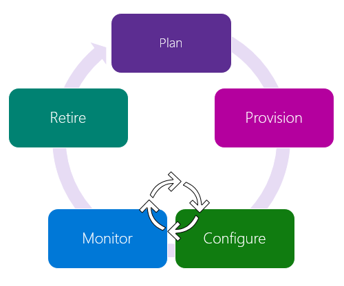
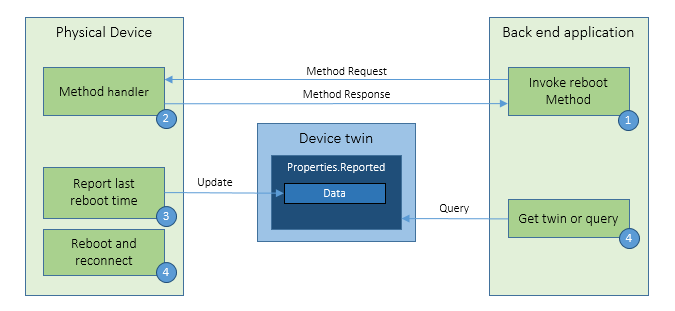
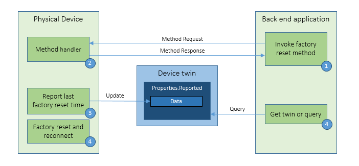
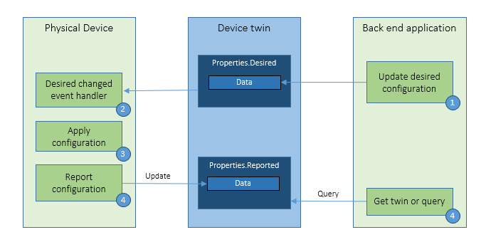
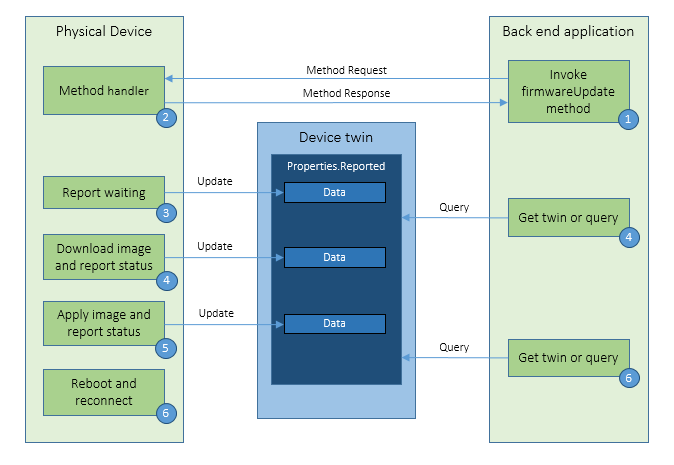
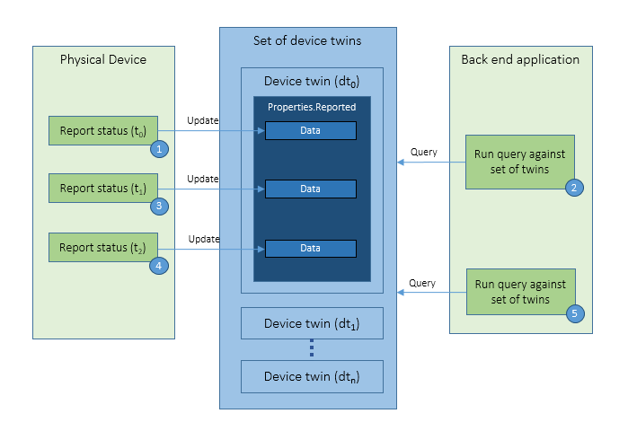

# 使用 IoT 中心进行设备管理的概述

Azure IoT 中心提供功能和可扩展性模型，使设备和后端开发人员可以构建功能强大的设备管理解决方案。 设备范围扩大，从受约束的传感器和单一用途微控制器变为功能强大的可路由设备组通信的网关。  此外，在不同行业中，IoT 操作员的用例和要求也显著不同。  尽管有此不同，但使用 IoT 中心进行设备管理提供了功能、模式和代码库，以满足不同设备和最终用户的需要。

[!INCLUDE [iot-hub-basic](../../includes/iot-hub-basic-partial.md)]

创建成功的企业 IoT 解决方案的一个重要部分，是提供操作员如何处理其设备集合的日常管理的策略。 IoT 操作员需要简单且可靠的工具和应用程序，使他们能够重点处理其工作的更具战略意义方面。 本文提供：

- Azure IoT 中心设备管理方法的简要概述。
- 常见设备管理原则的说明。
- 设备生命周期的说明。
- 常见设备管理模式的概述。

## 设备管理原则
IoT 带来了一系列独特的设备管理难题，每个企业级解决方案必须满足以下原则：

- **规模和自动化**：IoT 解决方案需要可以自动执行日常任务的简单工具，使相对数量少的操作人员可以管理数百万台设备。 每天，操作员希望远程批量处理设备操作，并且仅在出现需要直接干预的问题时才收到通知。

- **开放性和兼容性**：此设备生态系统的多样性超乎寻常。 管理工具必须进行定制以适应多种设备类、平台和协议。 操作员必须能够支持许多类型的设备，从最受限制的嵌入式单进程芯片到功能强大且全功能的计算机。
- **上下文感知**：IoT 环境是动态的，不断变化。 服务可靠性极为重要。 设备管理操作必须考虑以下因素，确保进行维护性的停机时，不会影响关键业务运营，也不会产生危险的情况：
    * SLA 设备维护时段
    * 网络和电源状态
    * 使用条件
    * 设备地理位置
- **为许多角色提供服务**：必须为 IoT 操作角色的独特工作流和进程提供支持。 操作人员必须与给定约束的内部 IT 部门协调工作。  他们还必须找到可持续方法将实时设备操作信息传递给主管和其他业务管理角色。

## 设备生命周期
有一组所有企业 IoT 项目通用的常规设备管理阶段。 在 Azure IoT 中，设备生命周期有五个阶段：

在上述五个阶段的每个阶段中，都有几项应满足以提供完整解决方案的设备操作员要求：

* **计划**：使操作员能够创建可让他们轻松且精确地进行查询的设备元数据方案，并针对一组设备进行批量管理操作。 可以使用设备孪生以标记和属性的形式存储此设备元数据。
  
    *延伸阅读*： 
    * [设备孪生入门](iot-hub-node-node-twin-getstarted.md)
    * [了解设备孪生](iot-hub-devguide-device-twins.md)
    * [如何使用设备孪生属性](tutorial-device-twins.md)
    * [IoT 解决方案中设备配置的最佳做法](iot-hub-configuration-best-practices.md)

* **预配**：安全地为 IoT 中心预配新设备，使操作员能够立即发现设备功能。  使用 IoT 中心标识注册表创建灵活的设备标识和凭据，并使用作业成批执行此操作。 通过设备孪生中的设备属性构建设备来报告其功能和情况。
  
    *延伸阅读*： 
    * [管理设备标识](iot-hub-devguide-identity-registry.md)
    * [批量管理设备标识](iot-hub-bulk-identity-mgmt.md)
    * [如何使用设备孪生属性](tutorial-device-twins.md)
    * [IoT 解决方案中设备配置的最佳做法](iot-hub-configuration-best-practices.md)
    * [Azure IoT 中心设备预配服务](/iot-dps)

* **配置**：在确保正常运行和安全的同时，便于对设备进行批量配置更改和固件更新。 使用所需属性或通过直接方法和广播作业成批执行这些设备管理操作。
  
    *延伸阅读*：
    * [如何使用设备孪生属性](tutorial-device-twins.md)
    * [大规模配置和监视 IoT 设备](iot-hub-auto-device-config.md)
    * [IoT 解决方案中设备配置的最佳做法](iot-hub-configuration-best-practices.md)

* **监视**：监视总体设备集合运行状况和正在进行的操作的状态，并针对可能需要操作员注意的问题向操作员发出警报。  应用设备孪生以允许设备报告实时操作情况和更新操作的状态。 使用设备孪生查询生成显示最直接问题的功能强大的仪表板报告。
  
    *延伸阅读*： 
    * [如何使用设备孪生属性](tutorial-device-twins.md)
    * [用于设备孪生、作业和消息路由的 IoT 中心查询语言](iot-hub-devguide-query-language.md)
    * [大规模配置和监视 IoT 设备](iot-hub-auto-device-config.md)
    * [IoT 解决方案中设备配置的最佳做法](iot-hub-configuration-best-practices.md)

* **停用**：在发生故障或完成升级周期后（或在服务生存期结束时）更换或停用设备。  使用设备孪生来维护设备信息（如果正在更换物理设备），或者将设备信息存档（如果正在停用设备）。 使用 IoT 中心标识注册表来安全地撤销设备标识和凭据。
  
    *延伸阅读*： 
    * [如何使用设备孪生属性](tutorial-device-twins.md)
    * [管理设备标识](iot-hub-devguide-identity-registry.md)

## 设备管理模式

IoT 中心启用以下设备管理模式集。 [设备管理教程](iot-hub-node-node-device-management-get-started.md)更详细地介绍如何扩展这些模式以适合具体方案，以及如何基于这些核心模板设计新模式。

* **重启**：后端应用通过直接方法通知设备它已开始重启。  设备使用报告属性来更新设备的重新启动状态。
  
    

* **恢复出厂设置**：后端应用通过直接方法通知设备它已开始恢复出厂设置。 设备使用报告属性来更新设备的恢复出厂设置状态。
  
    

* **配置**：后端应用使用所需属性来配置设备上运行的软件。 设备使用报告属性来更新设备的配置状态。
  
    

* **固件更新**：后端应用根据自动设备管理配置来选择接收更新的设备、指示设备在哪里查找更新，以及监视更新过程。 设备启动多步骤过程，用于下载、验证和应用固件映像，然后在重新连接到 IoT 中心服务前重启设备。 在整个多步骤过程中，设备使用报告属性来更新设备的进度和状态。
  
    

* **报告进度和状态**：解决方案后端在一组设备上运行设备孪生查询，报告设备上运行的操作的状态和进度。
  
    

## 后续步骤
可以使用 IoT 中心设备管理提供的功能、模式和代码库，在每个设备生命周期阶段创建满足企业 IoT 操作员需求的 IoT 应用程序。

若要继续了解 IoT 中心设备管理功能，请参阅[设备管理入门](iot-hub-node-node-device-management-get-started.md)教程。