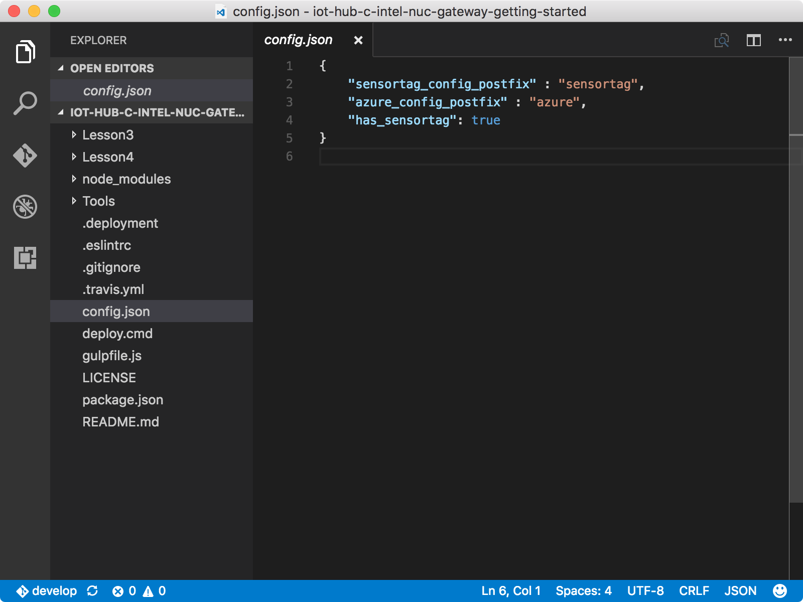
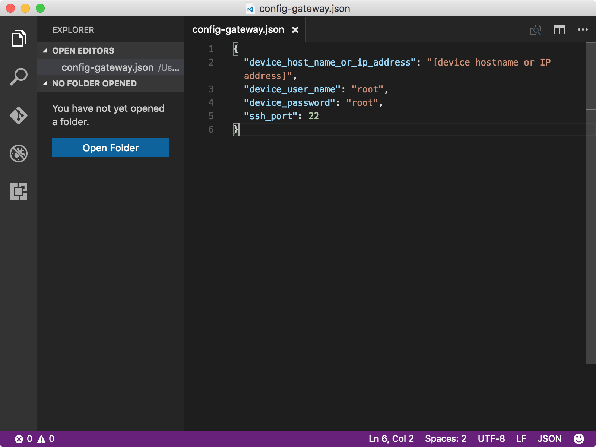
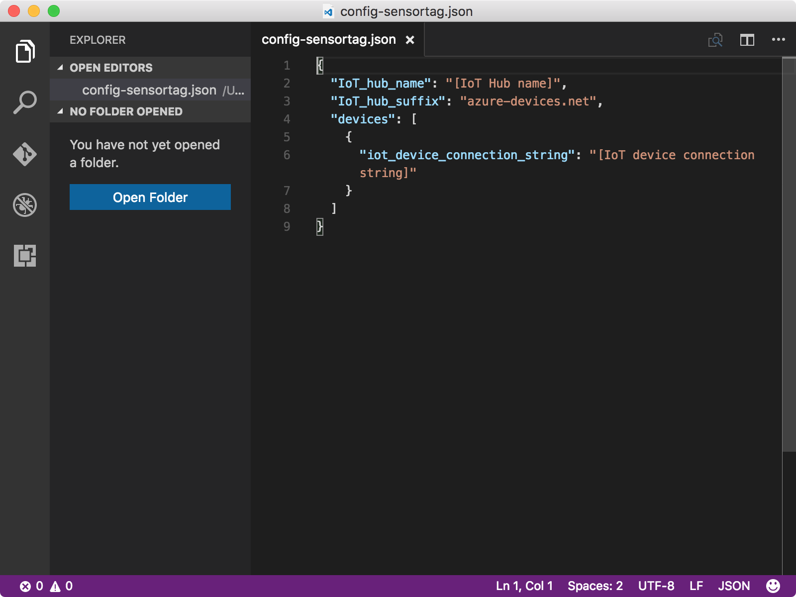
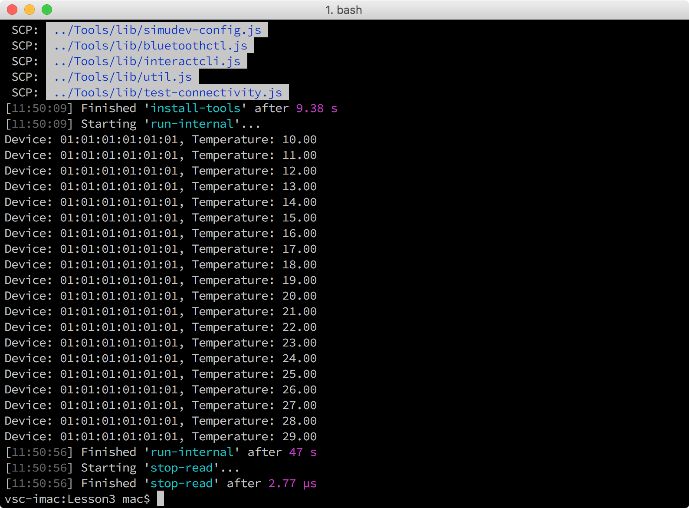

# <a name="configure-and-run-a-simulated-device-sample-app"></a>配置和运行模拟设备示例应用

## <a name="what-you-will-do"></a>执行的操作

- 克隆示例存储库。
- 使用 Azure CLI 获取模拟设备示例应用程序的 IoT 中心和逻辑设备信息。 配置和运行模拟设备示例应用程序。

如果有任何问题，请在[故障排除页面](./iot-hub-gateway-kit-c-sim-troubleshooting.md)上查找解决方案。

## <a name="what-you-will-learn"></a>你要学习的知识

本文介绍：

- 如何配置和运行模拟设备示例应用程序。

## <a name="what-you-need"></a>需要什么

必须已成功完成

- [创建 IoT 中心并注册设备](./iot-hub-gateway-kit-c-sim-lesson2-register-device.md)

## <a name="clone-the-sample-repository-to-the-host-computer"></a>将示例存储库克隆到主计算机

若要克隆示例存储库，请在主计算机上执行以下步骤：

1. 在 Windows 中打开命令提示符，或在 macOS 或 Ubuntu 中打开终端。
2. 运行以下命令：

   ```bash
   git clone https://github.com/Azure-samples/iot-hub-c-intel-nuc-gateway-getting-started
   cd iot-hub-c-intel-nuc-gateway-getting-started
   ```

## <a name="configure-the-simulated-device-and-your-nuc"></a>配置模拟设备和 NUC

1. 通过运行以下命令在 Visual Studio Code 中打开配置文件 `config.json`：

   ```bash
   code config.json
   ```

2. 将 `"has_sensortag": true` 替换为 `"has_sensortag": false`

   

3. 运行以下命令初始化配置文件：

   ```bash
   cd Lesson3
   npm install
   gulp init
   ```

4. 运行以下命令，在 Visual Studio Code 中打开 `config-gateway.json` ：

   ```bash
   # For Windows command prompt
   code %USERPROFILE%\.iot-hub-getting-started\config-gateway.json
   # For macOS or Ubuntu
   code ~/.iot-hub-getting-started/config-gateway.json
   ```

5. 找到以下代码行，将 `[device hostname or IP address]` 替换为 Intel NUC 的 IP 地址或主机名。
   

## <a name="get-the-connection-string-of-your-iot-hub-logical-device"></a>获取 IoT 中心逻辑设备的连接字符串

若要获取逻辑设备的 Azure IoT 中心连接字符串，请在主计算机上运行以下命令：

```bash
az iot device show-connection-string --hub-name {IoT hub name} --device-id mydevice --resource-group iot-gateway
```

`{IoT hub name}` 是所使用的 IoT 中心名称。 使用 iot-gateway 作为 `{resource group name}` 的值，使用 mydevice 作为 `{device id}` 的值（如果未在第 2 课中更改该值）。

## <a name="configure-the-simulated-device-cloud-upload-sample-application"></a>配置模拟设备云上传示例应用程序

若要配置和运行模拟设备云上传示例应用程序，请在主计算机上执行以下步骤：

1. 运行以下命令，在 Visual Studio Code 中打开 `config-sensortag.json` ：

   ```bash
   # For Windows command prompt
   code %USERPROFILE%\.iot-hub-getting-started\config-sensortag.json
   # For macOS or Ubuntu
   code ~/.iot-hub-getting-started/config-sensortag.json
   ```

   

2. 在代码中进行以下替换：
   - 将 `[IoT hub name]` 替换为 IoT 中心名称。
   - 将 `[IoT device connection string]` 替换为 IoT 中心逻辑设备的连接字符串。

3. 运行应用程序。

   运行以下命令，部署并运行应用程序：

   ```bash
   gulp run
   ```

## <a name="verify-the-sample-application-works"></a>确认示例应用程序可以正常运行

现在应看到如下所示的输出：



应用程序会将温度数据发送到 IoT 中心，该操作持续 40 秒。

## <a name="summary"></a>摘要

已成功配置并运行模拟设备云上传示例应用程序，该应用程序使用模拟设备将数据发送到 IoT 中心。

## <a name="next-steps"></a>后续步骤
[从 IoT 中心读取消息](./iot-hub-gateway-kit-c-sim-lesson3-read-messages-from-hub.md)