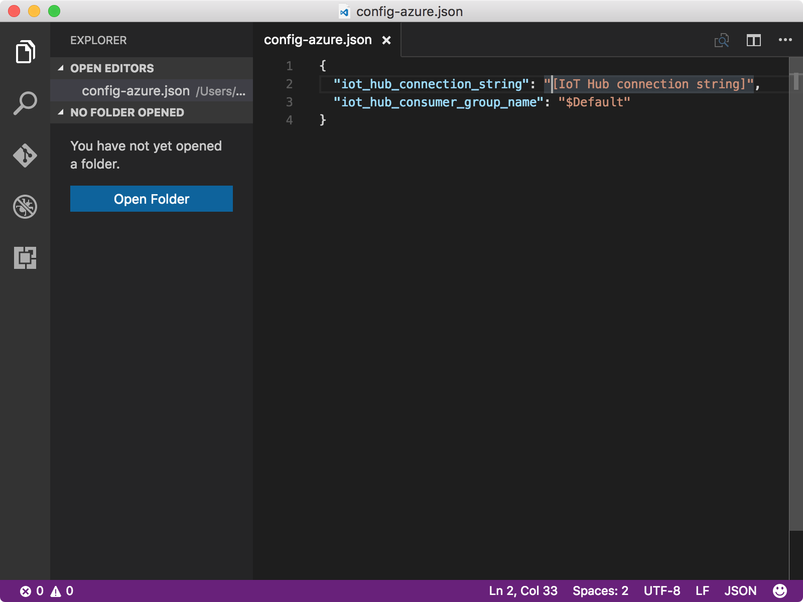
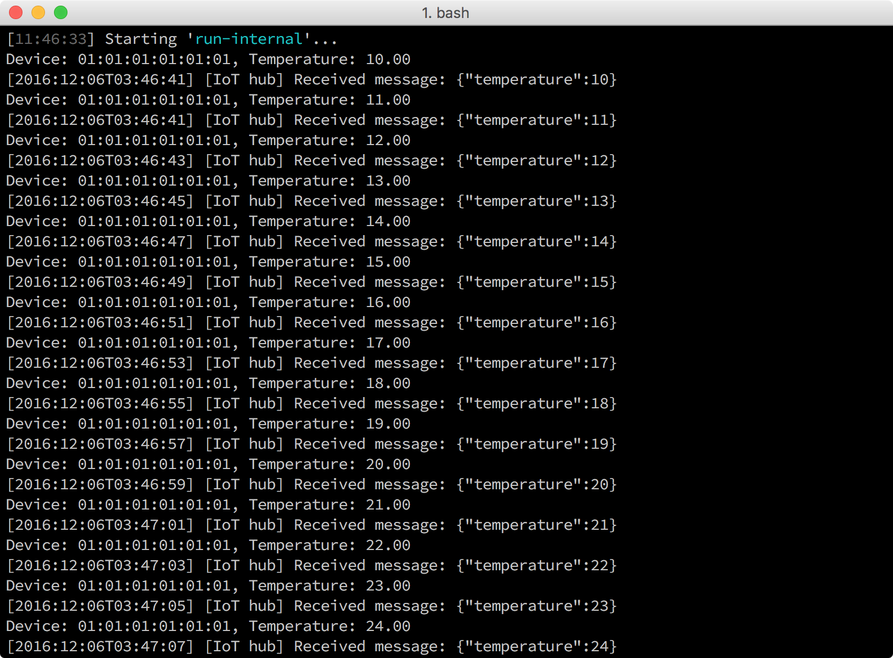

# 从 IoT 中心读取消息

## 执行的操作

- 在主计算机上运行示例代码，从 IoT 中心读取消息。

如果有问题，可在[故障排除页](./iot-hub-gateway-kit-c-sim-troubleshooting.md)上查找解决方案。

## 你要学习的知识

如何使用 gulp 工具从 IoT 中心读取消息。

## 需要什么

- [配置和运行模拟设备云上传示例应用程序](./iot-hub-gateway-kit-c-sim-lesson3-configure-simulated-device-app.md)中的模拟设备示例。

## 获取 IoT 中心和设备连接字符串

模拟设备用于连接到 IoT 中心的设备连接字符串。IoT 中心连接字符串用于连接到 IoT 中心中的标识注册表，以便管理允许连接到 IoT 中心的设备。

- 运行以下命令，列出资源组中的所有 IoT 中心：

    ```
    az iot hub list -g iot-gateway --query [].name
    ```

    使用 `iot-gateway` 作为 `{resource group name}` 的值（如果尚未更改）。

- 运行以下命令，获取 IoT 中心连接字符串：

    ```
    az iot hub show-connection-string --name {my hub name} -g iot-gateway
    ```

    `{my hub name}` 是在第 2 课中指定的名称。

## 配置示例代码的设备连接

执行以下步骤，更新 `config-azure.json` 中的 IoT 中心和设备连接配置：

1. 在控制台窗口中运行以下命令，在 Visual Studio Code 中打开 `config-azure.json`：

    ```
       # For Windows command prompt
       code %USERPROFILE%\.iot-hub-getting-started\config-azure.json
       # For MacOS or Ubuntu
       code ~/.iot-hub-getting-started/config-azure.json
    ```

2. 在 `config-azure.json` 文件中进行以下替换：

      

    将 `[IoT hub connection string]` 替换为 IoT 中心连接字符串。

## 从 IoT 中心读取消息

通过以下命令运行模拟设备示例应用程序及读取 IoT 中心消息：

```
gulp run --iot-hub
```

该命令运行每隔 2 秒将消息发送到 IoT 中心的应用程序。它还生成用于接收消息的子进程。

发送和接收的消息全都在主计算机的同一控制台窗口中即时显示。该应用程序会在 40 秒后退出。

  

## 摘要

已成功运行示例应用程序，使用模拟设备将数据发送到 IoT 中心。还读取了已发送到 IoT 中心的消息。

## 后续步骤
[创建 Azure 函数应用和 Azure 存储帐户](./iot-hub-gateway-kit-c-sim-lesson4-deploy-resource-manager-template.md)

<!---HONumber=Mooncake_0116_2017-->