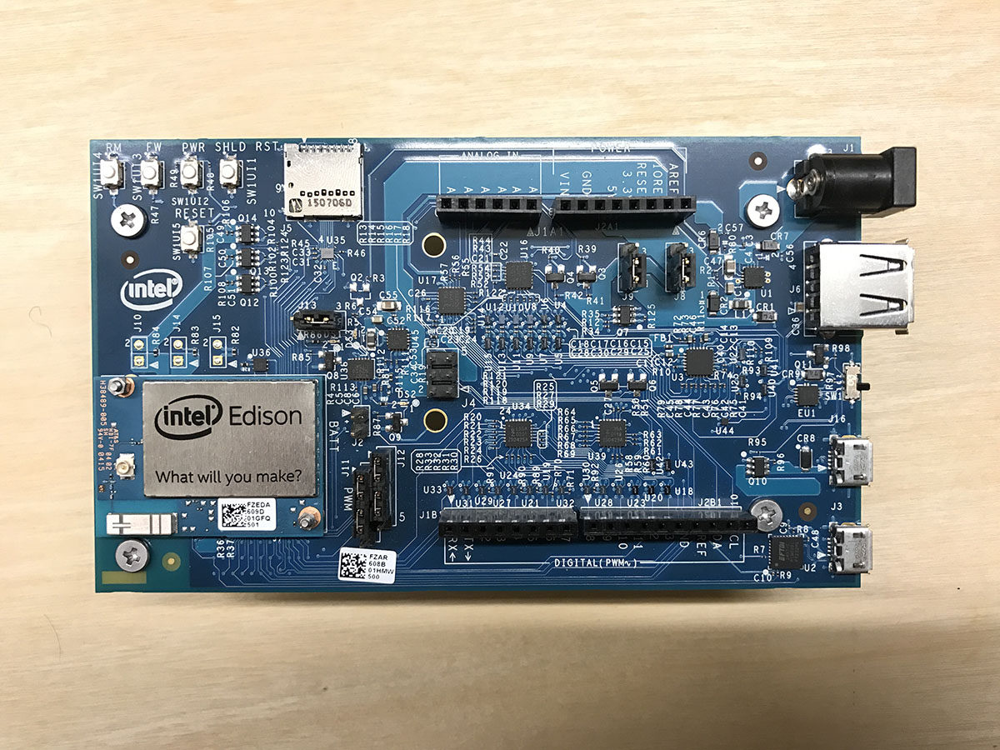
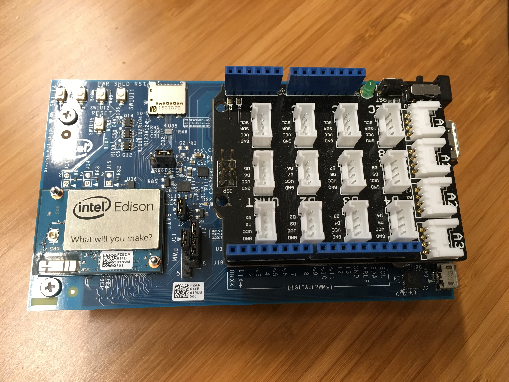
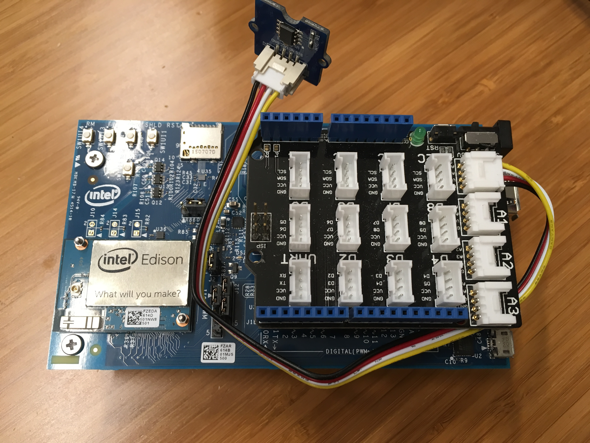
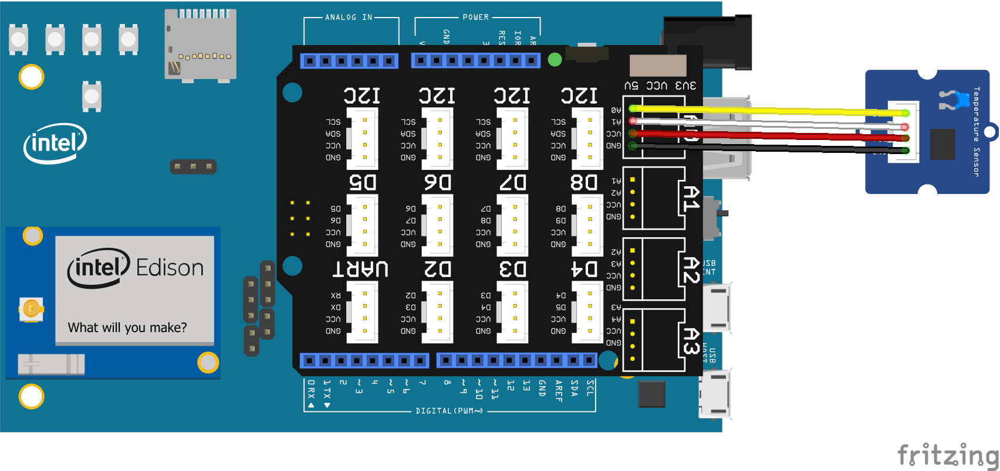

# 使用 Node.js 将 Intel Edison 设备连接到 IoT 中心
>[!div class="op_single_selector"]
>- [Node.JS](./iot-hub-intel-edison-kit-node-get-started.md)
>- [C](./iot-hub-intel-edison-kit-c-get-started.md)

在本教程中，从学习如何使用 Intel Edison 的基础知识开始。 然后将学习如何使用 [Azure IoT 中心](./iot-hub-what-is-iot-hub.md)将设备无缝连接到云。

还没有工具包？ 从 [此处](https://www.azure.cn/develop/iot/iot-starter-kits)

## 准备工作

* 安装 Intel Edison 和 Grove 模块。
* 创建 IoT 中心。
* 在 IoT 中心内为 Edison 注册设备。
* 在 Edison 上运行示例应用程序，以将传感器数据发送到 IoT 中心。

将 Intel Edison 连接到创建的 IoT 中心。 然后，在 Edison 上运行示例应用程序，从 Grove 温度传感器收集温度和湿度数据。 最后，将传感器数据发送到 IoT 中心。

## 学习内容

* 如何创建 Azure IoT 中心以及如何获取新的设备连接字符串。
* 如何将 Edison 与 Grove 温度传感器连接起来。
* 如何通过在 Edison 上运行示例应用程序收集传感器数据。
* 如何将传感器数据发送到 IoT 中心。

## 需要什么

* Intel Edison 开发板
* Arduino 扩展板
* 一个有效的 Azure 订阅。 如果没有 Azure 帐户，只需花费几分钟就能[创建一个 Azure 试用帐户](https://www.azure.cn/pricing/1rmb-trial/)。
* 运行 Windows 或 Linux 的 Mac 或电脑。
* Internet 连接。
* Micro B - Type A USB 线缆
* 直流 (DC) 电源。 电源应符合以下条件：
  - 7-15V DC
  - 至少 1500mA
  - 中心/内部插头应为电源的正极

以下项可选：

* Grove Base Shield V2
* Grove - 温度传感器
* Grove 电缆
* 垫条或螺钉（随附在工具包内），其中包括两颗螺钉（用于将模块固定到扩展板上）以及四组螺钉和塑料垫片。

> [!NOTE] 
上述项为可选项，因为代码示例支持模拟的传感器数据。

[!INCLUDE [iot-hub-get-started-create-hub-and-device](../../includes/iot-hub-get-started-create-hub-and-device.md)]

## 安装 Intel Edison

### 组装开发板

本部分包括将 Intel® Edison 模块连接到扩展板的步骤。

1. 将 Intel® Edison 模块放在扩展板的白色区域内，将模块上的孔对准扩展板上的螺钉。

2. 将手指放在 `What will you make?` 文字上方，按压模板，直至感觉模块已就位。

   

3. 用两颗六角螺母（随附在工具包内）将模块固定到扩展板上。

   

4. 将一颗螺钉插入扩展板上的一个角孔（共四个）。 在螺钉上放置白色塑料垫片，转动并拧紧。

   

5. 重复上述步骤安装其他三个角垫。

   

现在，开发板就已组装完毕。

   

### 连接 Grove Base Shield 和温度传感器

1. 将 Grove Base Shield 放在板上。 确保所有引脚都紧紧插入板中。
   
   

2. 通过 Grove 线缆将 Grove 温度传感器连接到 Grove Base Shield A0 端口。

   

   

传感器现准备就绪。

### 为 Edison 接通电源

1. 插入电源。

   

在本课中，会为 Intel Edison 配置操作系统、设置开发环境，以及将应用程序部署到 Edison。

### 配置设备
首次配置 Intel Edison 进行使用的操作步骤如下：组装开发板，接通电源，在台式机操作系统中安装配置工具以刷写 Edison 固件、设置密码并将其连接到 Wi-Fi。  

*完成的估计时间：30 分钟*

转到 [配置设备][configure-your-device]。

### 获取工具
下载相关工具和软件，为 Intel Edison 生成和部署第一个应用程序。

*估计完成时间：20 分钟*

转到 [获取工具][get-the-tools]。

### 创建和部署 blink 应用程序
克隆 GitHub 提供的示例 blink 应用程序，并使用 gulp 将此应用程序部署到 Intel Edison 板。 此示例应用程序每隔两秒让连接到板的 LED 闪烁一次。

*估计完成时间：5 分钟*

转到 [创建和部署 blink 应用程序][create-and-deploy-the-blink-application]。

## 第 2 课：创建 IoT 中心

在本课中，用户需创建免费的 Azure 帐户、预配 Azure IoT 中心，以及在 IoT 中心创建第一个设备。

开始本课之前，请完成第 1 课。

### 获取 Azure 工具
安装 Azure 命令行界面 (Azure CLI)。

*估计完成时间：10 分钟*

转到 [获取 Azure 工具][get-azure-tools]。

### 创建 IoT 中心并注册 Intel Edison
使用 Azure CLI 创建资源组、预配第一个 Azure IoT 中心，并将第一个设备添加到 IoT 中心。

*估计完成时间：10 分钟*

转到[创建 IoT 中心并注册 Intel Edison](./iot-hub-intel-edison-kit-node-lesson2-prepare-azure-iot-hub.md)。

## 第 3 课：发送从设备到云的消息

在本课中，会将消息从 Edison 发送到 IoT 中心。 此外还需创建一个 Azure 函数应用，以便获取 IoT 中心发出的传入消息并将其写入到 Azure 表存储。

开始本课之前，请完成第 1 课和第 2 课。

### 创建 Azure 函数应用和 Azure 存储帐户
使用 Azure Resource Manager 模板创建 Azure 函数应用和 Azure 存储帐户。

*估计完成时间：10 分钟*

转到 [创建 Azure Function App 和 Azure 存储帐户][create-an-azure-function-app-and-azure-storage-account]。

### 运行示例应用程序，以便发送从设备到云的消息
在 Intel Edison 设备上部署并运行示例应用程序，将消息发送到 IoT 中心。

*估计完成时间：10 分钟*

转到 [运行示例应用程序，以便发送从设备到云的消息][send-device-to-cloud-messages]。

### 读取保存在 Azure 存储中的消息
在将从设备到云的消息写入 Azure 存储时，对其进行监视。

*估计完成时间：5 分钟*

转到 [读取保存在 Azure 存储中的消息][read-messages-persisted-in-azure-storage]。

## 第 4 课：发送从云到设备的消息

本课说明如何将消息从 Azure IoT 中心发送到 Intel Edison。 这些消息控制连接到 Edison 的 LED 的开关行为。 示例应用程序已准备就绪，你可以执行此任务了。

开始本课之前，请完成第 1 课、第 2 课和第 3 课。

### 运行示例应用程序，接收从云到设备的消息
第 4 课中的示例应用程序在 Edison 上运行，并监视来自 IoT 中心的传入消息。 新的 gulp 任务会将消息从 IoT 中心发送到 Edison，使 LED 闪烁。

*估计完成时间：10 分钟*

转到 [运行示例应用程序，接收从云到设备的消息][receive-cloud-to-device-messages]。

### 可选部分：更改 LED 的开关行为
自定义这些消息，以便更改 LED 的开关行为。

*估计完成时间：10 分钟*

转到 [可选部分：更改 LED 的开关行为][change-the-on-and-off-behavior-of-the-led]。

## 故障排除
如果在课程中遇到任何问题，可在 [故障排除][troubleshooting] 一文中查找解决方案。
<!-- Images and links -->

[configure-your-device]: ./iot-hub-intel-edison-kit-node-lesson1-configure-your-device.md
[get-the-tools]: ./iot-hub-intel-edison-kit-node-lesson1-get-the-tools-win32.md
[create-and-deploy-the-blink-application]: ./iot-hub-intel-edison-kit-node-lesson1-deploy-blink-app.md
[get-azure-tools]: ./iot-hub-intel-edison-kit-node-lesson2-get-azure-tools-win32.md
[create-an-azure-function-app-and-azure-storage-account]: ./iot-hub-intel-edison-kit-node-lesson3-deploy-resource-manager-template.md
[send-device-to-cloud-messages]: ./iot-hub-intel-edison-kit-node-lesson3-run-azure-blink.md
[read-messages-persisted-in-azure-storage]: ./iot-hub-intel-edison-kit-node-lesson3-read-table-storage.md
[receive-cloud-to-device-messages]: ./iot-hub-intel-edison-kit-node-lesson4-send-cloud-to-device-messages.md
[change-the-on-and-off-behavior-of-the-led]: ./iot-hub-intel-edison-kit-node-lesson4-change-led-behavior.md
[troubleshooting]: ./iot-hub-intel-edison-kit-node-troubleshooting.md
